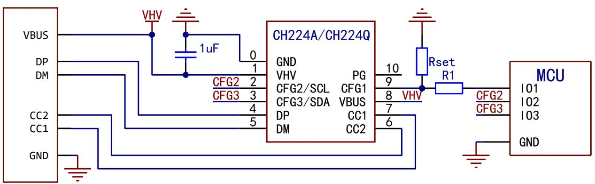
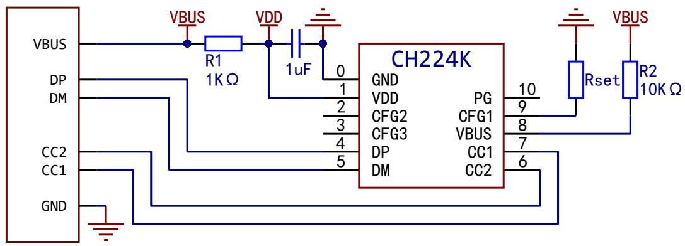
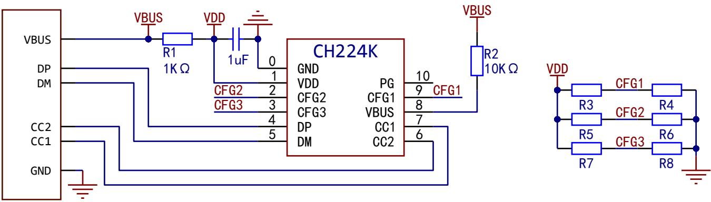

# USB PD 多快充协议受电芯片 CH224

手册1 版本：2.1 https://wch.cn

# 1、概述

CH224Q/CH224A 为支持 USB PD3.2 的 USB PD 快充协议受电芯片，最高支持 PD3.2 EPR 140W 功率，并支持单电阻配置、I/O 电平配置及 I2C 配置。通过 I2C 接口可以读取协议握手状态和读取当前 PD 档位额定电流。芯片内置高压 LDO，静态功耗低，集成度高，外围精简。芯片集成输出电压检测及过压保护功能，可广泛应用于各类电子设备拓展高功率输入如无线充电器、小家电、锂电池电动工具等各类场合。

CH224K/CH224D/CH221K 为支持 USB PD3.0 的 USB PD 快充协议受电芯片，最高支持 100W 功率，支持单电阻配置和 I/O 电平配置。

# 2、特点

- 支持 4V 至 30V 输入电压- 支持 PD3.2 EPR、AVS、PPS、SPR 协议及 BC1.2 等升压快充协议- 支持 eMarker 模拟，自动检测 VCONN- 支持多种方式动态调整请求电压- 支持 400KHz 速率 I2C 通信- 芯片内置高压 LDO，静态功耗低- 单芯片集成度高，外围精简，成本低- 内置过压保护模块 OVP

# 3、引脚排列

表3-1封装说明  

<table><tr><td>封装形式</td><td>塑体尺寸</td><td colspan="2">引脚节距</td><td>封装说明</td><td>订货型号</td></tr><tr><td>DFN10</td><td>2*2mm</td><td>0.4mm</td><td>15.7m i l</td><td>双边无引线 10 脚</td><td>CH224Q</td></tr><tr><td>ESSOP10</td><td>3. 9mm</td><td>1. 00mm</td><td>39. 4m i l</td><td>带底板的窄距 10 脚贴片</td><td>CH224A</td></tr><tr><td>ESSOP10</td><td>3. 9mm</td><td>1. 00mm</td><td>39. 4m i l</td><td>带底板的窄距 10 脚贴片</td><td>CH224K</td></tr><tr><td>QFN20</td><td>3*3mm</td><td>0. 40mm</td><td>15. 7m i l</td><td>四边无引线 20 脚</td><td>CH224D</td></tr><tr><td>SOT23-6</td><td>1. 6mm</td><td>0. 95mm</td><td>37m i l</td><td>小型 6 脚贴片</td><td>CH221K</td></tr></table>

注：1.0#引脚是指ESSOP10、DFN10、QFN20封装的底板。2.新项目建议使用小体积且多功能的CH224Q，CH224A侧重于PCB兼容CH224K。

# 4、引脚定义

表4-1CH224Q、CH224A引脚定义  

<table><tr><td colspan="2">引脚号</td><td rowspan="2">引脚名称</td><td rowspan="2">引脚类型(1)</td><td rowspan="2">功能描述</td></tr><tr><td>CH224Q</td><td>CH224A</td></tr><tr><td>0</td><td>0</td><td>GND</td><td>P</td><td>公共接地端，散热底板。</td></tr><tr><td>1</td><td>1</td><td>VHV</td><td>P</td><td>工作电源输入，外接1uF对地电容（注意耐压）。</td></tr><tr><td>4</td><td>4</td><td>DP</td><td rowspan="2">I/0</td><td rowspan="2">USB总线。</td></tr><tr><td>5</td><td>5</td><td>DM</td></tr><tr><td>7</td><td>7</td><td>CC1</td><td rowspan="2">I/0</td><td rowspan="2">Type-C CC信号线。</td></tr><tr><td>6</td><td>6</td><td>CC2</td></tr><tr><td>9</td><td>9</td><td>CFG1</td><td>I</td><td>电源档位配置输入引脚1。</td></tr><tr><td>2</td><td>2</td><td>CFG2/SCL</td><td>I,PU</td><td>电源档位配置输入引脚2或12C时钟输入引脚。</td></tr><tr><td>3</td><td>3</td><td>CFG3/SDA</td><td>I/0,PU</td><td>电源档位配置输入引脚3或12C数据双向引脚。</td></tr><tr><td>8</td><td>8</td><td>VBUS</td><td>I</td><td>电压检测输入，需要短接至VHV。</td></tr><tr><td>10</td><td>10</td><td>PG</td><td>OD</td><td>默认Power Good指示，低电平有效，可定制功能。</td></tr></table>

表4-2CH224K引脚定义  

<table><tr><td>引脚号</td><td rowspan="2">引脚名称</td><td rowspan="2">引脚类型(1)</td><td rowspan="2">功能描述</td></tr><tr><td>CH224K</td></tr><tr><td>0</td><td>GND</td><td>P</td><td>公共接地端，散热底板。</td></tr><tr><td>1</td><td>VDD</td><td>P</td><td>工作电源输入，外接1uF对地电容，串联电阻至VBUS。</td></tr><tr><td>4</td><td>DP</td><td rowspan="2">I/0</td><td rowspan="2">USB总线。</td></tr><tr><td>5</td><td>DM</td></tr><tr><td>7</td><td>CC1</td><td rowspan="2">I/0</td><td rowspan="2">Type-C CC信号线。</td></tr><tr><td>6</td><td>CC2</td></tr><tr><td>9</td><td>CFG1</td><td>I</td><td rowspan="3">电源档位配置输入引脚。</td></tr><tr><td>2</td><td>CFG2</td><td>I</td></tr><tr><td>3</td><td>CFG3</td><td>I</td></tr><tr><td>8</td><td>VBUS</td><td>I</td><td>电压检测输入，需要串联电阻至外部输入VBUS。</td></tr><tr><td>10</td><td>PG</td><td>OD</td><td>默认Power Good指示，低电平有效，可定制功能。</td></tr></table>

表4-3CH224D引脚定义  

<table><tr><td>引脚号</td><td rowspan="2">引脚名称</td><td rowspan="2">引脚类型(1)</td><td rowspan="2">功能描述</td></tr><tr><td>CH224D</td></tr><tr><td>0</td><td>GND</td><td>P</td><td>公共接地端，散热底板。</td></tr><tr><td>2</td><td>VBUS</td><td>P</td><td>工作电源输入，建议外接0.1uF或1uF对地电容。</td></tr><tr><td>7</td><td>VDD</td><td>P</td><td>内部稳压器输出端，外接1uF对地电容。</td></tr><tr><td>8</td><td>DP</td><td rowspan="2">I/0</td><td rowspan="2">USB总线。</td></tr><tr><td>9</td><td>DM</td></tr><tr><td>11</td><td>CC1</td><td rowspan="2">I/0</td><td rowspan="2">Type-C CC信号线。</td></tr><tr><td>10</td><td>CC2</td></tr><tr><td>19</td><td>CFG1</td><td>I</td><td rowspan="3">电源档位配置输入引脚。</td></tr><tr><td>13</td><td>CFG2</td><td>I</td></tr><tr><td>12</td><td>CFG3</td><td>I</td></tr><tr><td>1</td><td>DRV</td><td>0</td><td>弱驱动输出，用于驱动配置电阻。</td></tr><tr><td>14</td><td>ISP</td><td rowspan="2">I</td><td rowspan="2">差分输入，用于检测工作电流，定制功能。</td></tr><tr><td>15</td><td>ISM</td></tr></table>

<table><tr><td>5</td><td>GATE</td><td>O, HV</td><td>用于驱动高侧电源通路 NMOS，定制功能。</td></tr><tr><td>6</td><td>NMOS#</td><td>I</td><td>驱动 NMOS 使能，低电平有效，应该短接 GND。</td></tr></table>

表4-4CH221K引脚定义  

<table><tr><td>引脚号</td><td rowspan="2">引脚名称</td><td rowspan="2">引脚类型(1)</td><td rowspan="2">功能描述</td></tr><tr><td>CH221K</td></tr><tr><td>1</td><td>VDD</td><td>P</td><td>工作电源输入，外接 1uF 对地电容，串联电阻至 VBUS。</td></tr><tr><td>2</td><td>GND</td><td>P</td><td>公共接地端。</td></tr><tr><td>4</td><td>CC1</td><td rowspan="2">I/O</td><td rowspan="2">Type-C CC 信号线。</td></tr><tr><td>5</td><td>CC2</td></tr><tr><td>3</td><td>PG</td><td>I, OD</td><td>默认 Power Good 指示，低电平有效，可定制功能。</td></tr><tr><td>6</td><td>CFG</td><td>OD</td><td>电源档位配置输入引脚。</td></tr></table>

注1：引脚类型缩写解释：

$I =$  信号输入； $0 =$  信号输出； $P =$  电源或地； $OD =$  开漏输出； $HV =$  高压引脚； $PD =$  内置下拉电阻； $PU =$  内置上拉电阻。

# 5、功能说明

# 5.1概述

CH224Q/CH224A是一款支持PD3.2EPR、AVS、PPS、SPR协议握手、BC1.2等升压快充协议输入的协议电源受电端芯片，支持  $5\sim 30V$  范围内电压的请求，可通过单电阻配置、1/0电平配置及12C配置，来动态配置请求的电压档位。其中，CH224Q体积较小，适用于对集成度要求更高的场景。

CH224A兼容CH224K引脚，多数情况下可在不更改PCB的情况下通过更换外围器件进行替换，具体请参考第七章。

# 5.2CH224Q/CH224A电压档位配置

# 5.2.1单电阻配置

适用于同一PCB通过修改电阻阻值实现不同请求电压的应用场合。

CFG1对GND连接电阻，不同阻值对应不同的电压请求档位。使用单电阻配置方式时，CFG2和CFG3引脚可悬空。电阻与请求电压对照表如下：

表5-1电阻与请求电压对照说明  

<table><tr><td>配置电阻阻值</td><td>请求电压</td></tr><tr><td>6.8KΩ</td><td>9V</td></tr><tr><td>24KΩ</td><td>12V</td></tr><tr><td>56KΩ</td><td>15V</td></tr><tr><td>120KΩ</td><td>20V</td></tr><tr><td>210KΩ</td><td>28V</td></tr></table>

# 5.2.21/0电平配置

适用于MCU动态调整请求电压或PCB线路固定请求电压的应用场合。

表5-21/0电平与请求电压对照说明  

<table><tr><td>CFG1</td><td>CFG2</td><td>CFG3</td><td>请求电压</td></tr><tr><td>0</td><td>0</td><td>0</td><td>9V</td></tr><tr><td>0</td><td>0</td><td>1</td><td>12V</td></tr><tr><td>0</td><td>1</td><td>1</td><td>20V</td></tr><tr><td>0</td><td>1</td><td>0</td><td>28V</td></tr><tr><td>1</td><td>X</td><td>X</td><td>5V</td></tr></table>

表中“X”表示不关心。

表中“0”表示低电平，外部应短接到GND。

表中“1”表示高电平，CFG2和CFG3内置上拉电阻，支持3.3V或5V电平输入，外部可使用推挽或开漏输出驱动。CFG1若需设置为高电平，根据应用场景不同，有以下三种方法：

（1）通过100KQ电阻上拉至VHV引脚（无需对CH224进行控制时）；（2）串接2KQ电阻至MCU的GP10，并使用推挽模式输出高电平（使用5V电平控制CH224时）；（3）直接连接至MCU的GP10，并使用推挽模式输出高电平（使用3.3V电平控制CH224时）。

# 5.2.312C配置

芯片为单电阻配置时自动启用12C配置功能，此时可通过12C通信来控制电压请求或者读取相关信息。

CH224Q/CH224A七位12C地址为  $0\times 22$  或  $0\times 23$  （不包含读写位）。

表5-3芯片功能寄存器表  

<table><tr><td>地址</td><td>名称</td><td>功能</td></tr><tr><td>0x09</td><td>I2C状态寄存器</td><td>获取当前协议状态</td></tr><tr><td>0x0A</td><td>电压控制寄存器</td><td>切换请求电压</td></tr><tr><td>0x50</td><td>电流数据寄存器</td><td>获取当前档位最大可用电流</td></tr><tr><td>0x51</td><td>AVS电压配置寄存器(高八位)</td><td>配置AVS请求电压高八位</td></tr><tr><td>0x52</td><td>AVS电压配置寄存器(低八位)</td><td>配置AVS请求电压低八位</td></tr><tr><td>0x53</td><td>PPS电压配置寄存器</td><td>配置PPS请求电压</td></tr><tr><td>0x60~0x8F</td><td>PD电源数据寄存器</td><td>获取适配器完整电源信息</td></tr></table>

$0\times 09$  ：12C状态寄存器  

<table><tr><td>位</td><td>7</td><td>6</td><td>5</td><td>4</td><td>3</td><td>2</td><td>1</td><td>0</td></tr><tr><td>名称</td><td>保留</td><td>保留</td><td>保留</td><td>EPR激活</td><td>PD激活</td><td>QC3激活</td><td>QC2激活</td><td>BC激活</td></tr><tr><td>默认值</td><td>0</td><td>0</td><td>0</td><td>0</td><td>0</td><td>0</td><td>0</td><td>0</td></tr><tr><td>读写</td><td colspan="8">只读</td></tr></table>

当BIT0、1、2、3、4为1时表示对应协议握手成功。

$0\times 0A$  ：电压控制寄存器  

<table><tr><td>位</td><td>7</td><td>6</td><td>5</td><td>4</td><td>3</td><td>2</td><td>1</td><td>0</td></tr><tr><td>名称</td><td colspan="8">请求电压值，参考详解</td></tr><tr><td>默认值</td><td colspan="8">0x00</td></tr><tr><td>读写</td><td colspan="8">只写</td></tr></table>

请求电压详解：

0:5V 1:9V 2:12V 3:15V 4:20V 5:28V 6:PPS模式 7：AVS模式

$0\times 50$  ：电流数据寄存器  

<table><tr><td>位</td><td>7</td><td>6</td><td>5</td><td>4</td><td>3</td><td>2</td><td>1</td><td>0</td></tr><tr><td>名称</td><td colspan="8">最大电流参考值(单位:50mA)</td></tr><tr><td>默认值</td><td colspan="8">0xxX</td></tr><tr><td>读写</td><td colspan="8">只读</td></tr></table>

表示当前PD档位下，可用最大电流值，该寄存器仅在握手PD协议时有效。

$0\times 51$  ，  $0\times 52$  ：AVS电压配置寄存器高八位、AVS电压配置寄存器低八位  

<table><tr><td>位</td><td>15</td><td>14</td><td>13</td><td>12</td><td>11</td><td>10</td><td>9</td><td>8</td><td>7</td><td>6</td><td>5</td><td>4</td><td>3</td><td>2</td><td>1</td><td>0</td></tr><tr><td>名称</td><td>使能</td><td colspan="14">AVS请求电压值(单位:100mV)</td><td></td></tr><tr><td>默认值</td><td colspan="16">0x0000</td></tr><tr><td>读写</td><td colspan="16">只写</td></tr></table>

电压配置寄存器  $0^{\sim}7$  为请求电压低8位，  $8^{\sim}14$  位为请求电压高7位，最高位为使能位。配置时先写入低八位，后将高7位和使能位（置1）一并写入，首次申请AVS时先配置电压，后将电压控制寄存器配置为AVS模式，后续调压直接修改AVS电压配置寄存器即可。

$0\times 53$  ：PPS电压配置寄存器  

<table><tr><td>位</td><td>7</td><td>6</td><td>5</td><td>4</td><td>3</td><td>2</td><td>1</td><td>0</td></tr><tr><td>名称</td><td colspan="8">PPS设置电压(单位:100mV)</td></tr><tr><td>默认值</td><td colspan="8">0x00</td></tr><tr><td>读写</td><td colspan="8">只写</td></tr></table>

首次申请PPS时先配置电压，然后将电压控制寄存器配置为PPS模式，后续调压直接修改PPS电

压配置寄存器即可。

$0\times 60^{\sim}0\times 8F$  ：PD电源数据寄存器  

<table><tr><td>默认值</td><td>0×00</td></tr><tr><td>读写</td><td>只读</td></tr></table>

当适配器供电能力小于100W时，读取该区域可获取完整的电源SRCAP数据。当芯片处于EPR模式（28V）时，读取该区域可获取完整的EPR_SRCAP数据。

# 5.3 模拟 eMarker 功能

如果要使用模拟 eMarker 功能，请求大于 20V 或大于 60W 输出，则必须使用 Type- C 公头，并在 CC2 引脚对 GND 连接 1KΩ 电阻（请联系我司技术支持）。

# 6、参考原理图

# 6.1 CH224Q/CH224A参考原理图

6.1.1单电阻配置和12C配置参考原理图（Rset阻值对应请求电压参考表5- 1）

单电阻配置通过CFG1引脚对GND接特定阻值的配置电阻实现，此时CFG2和CFG3可用于12C配置。若不使用12C配置，CFG2、CFG3悬空即可。

6.1.21/0电平配置参考原理图（1/0电平对应请求电压参考表5- 2）

当用电系统无需和CH224进行交互或控制时，CFG1可通过串接100KΩ至VHV引脚的方法提供高电平（下图为1/0电平配置20V）。

当用电系统存在3.3或5V电源，且需对CH224进行控制时，CFG1可连接系统中MCU的GPIO（如下图）。若系统高电平为3.3V，R1应取0Ω；若系统高电平为5V，R1应取2KΩ。

# 6.1.3 使用 Type-C 公口 eMarker 模拟功能

# 6.2 CH224K 参考原理图（图中为 I/O 电平配置 20V）

注：建议升级为 CH224A 芯片，参考 7.2 节。

# 6.3 CH224D 参考原理图（图中为单电阻配置 9V）

<table><tr><td>CFG1</td><td>CFG2</td><td>CFG3</td><td>请求电压</td></tr><tr><td>1</td><td>X</td><td>X</td><td>5V</td></tr><tr><td>0</td><td>0</td><td>0</td><td>9V</td></tr><tr><td>0</td><td>0</td><td>1</td><td>12V</td></tr><tr><td>0</td><td>1</td><td>1</td><td>15V</td></tr><tr><td>0</td><td>1</td><td>0</td><td>20V</td></tr></table>

<table><tr><td>Rset阻值</td><td>请求电压</td></tr><tr><td>6.8KΩ</td><td>9V</td></tr><tr><td>24KΩ</td><td>12V</td></tr><tr><td>56KΩ</td><td>15V</td></tr><tr><td>NC</td><td>20V</td></tr></table>

# 6.4 CH221K 参考原理图（图中为单电阻配置 20V）

<table><tr><td>Rset阻值</td><td>请求电压</td></tr><tr><td>10KΩ</td><td>5V</td></tr><tr><td>20KΩ</td><td>9V</td></tr><tr><td>47KΩ</td><td>12V</td></tr><tr><td>100KΩ</td><td>15V</td></tr><tr><td>200KΩ</td><td>20V</td></tr></table>

# 7、CH224A替换CH224K指南

7、CH224A替换CH224K指南CH224A兼容CH224K引脚，多数情况下可在不更改PCB的情况下通过更换外围器件进行替换，以下为芯片不同点及常见替换示例。

# 7.1CH224A和CH224K不同点

7.1 CH224A和CH224K不同点- CH224A的1脚为VWV，耐压32V，CH224K的1脚为VDD，耐压3.0V- CH224A的CFG2和CFG3内部自带上拉电阻，CH224K的CFG2和CFG3内部无上拉电阻- CH224A的CFG1耐压3.8V，CH224K的CFG1耐压8V- CH224A的VBUS耐压32V，CH224K的VBUS耐压13.5V

# 7.2常见替换示例

7.2常见替换示例7.2.1原CH224K为单电阻配置模式（预留Rset电阻，且CFG2、CFG3位悬空或短接GND）

  
图7-1原CH224K单电阻配置原理图

需做以下更改：

1. 将R1短接或更换为0Ω；2.将R2短接或更换为0Ω；3.将Rset更改为CH224A的配置电阻。

7.2.2原CH224K为I/0电平配置模式（CFG1、CFG2、CFG3预留配置焊盘或电阻）

  
图7-2原CH224的I/0电平配置原理图

注：上图中R3/R4、R5/R6、R7/R8为预留的电阻或焊盘。

需做以下更改：

1. 将R1短接或更换为0Ω；2.将R2短接或更换为0Ω；

3. 原 R3 更换为 100KΩ，R5、R7 不焊接（CH224A 的 CFG2 和 CFG3 内部自带上拉）；4. 根据 CH224A 的 I/O 电平配置模式选择短接 R4、R6、R8。

# 7.3 其余注意事项

- CH224A与CH224K的单电阻配置和I/0电平配置使用的电阻阻值或I/0电平对应电压不完全相同

# 8、参数

# 8.1绝对最大值

8.1.1CH224Q/A绝对最大值（临界或者超过绝对最大值将可能导致芯片工作不正常甚至损坏）  

<table><tr><td>名称</td><td>参数说明</td><td>最小值</td><td>最大值</td><td>单位</td></tr><tr><td>TA</td><td>工作时的环境温度</td><td>-40</td><td>105</td><td>℃</td></tr><tr><td>TS</td><td>储存时的环境温度</td><td>-55</td><td>125</td><td>℃</td></tr><tr><td>VHV</td><td>工作电源电压</td><td>-0.5</td><td>32.0</td><td>V</td></tr><tr><td>VI0HV</td><td>支持高压的引脚（PG、VBUS）上的电压</td><td>-0.5</td><td>32.0</td><td>V</td></tr><tr><td>VI0CC</td><td>CC1、CC2引脚上的电压</td><td>-0.5</td><td>32.0</td><td>V</td></tr><tr><td>VI0UX</td><td>DP、DM、CFG1引脚上的电压</td><td>-0.5</td><td>3.8</td><td>V</td></tr><tr><td>VI0FT</td><td>CFG2、CFG3引脚上的电压</td><td>-0.5</td><td>6.5</td><td>V</td></tr><tr><td>PD</td><td>整个芯片的最大功耗（VHV电压*电流）</td><td></td><td>300</td><td>mW</td></tr></table>

8.1.2CH221K绝对最大值（临界或者超过绝对最大值将可能导致芯片工作不正常甚至损坏）  

<table><tr><td>名称</td><td>参数说明</td><td>最小值</td><td>最大值</td><td>单位</td></tr><tr><td>TA</td><td>工作时的环境温度</td><td>-40</td><td>105</td><td>℃</td></tr><tr><td>TS</td><td>储存时的环境温度</td><td>-55</td><td>125</td><td>℃</td></tr><tr><td>VDD</td><td>工作电源电压（VDD引脚接电源，GND引脚接地）</td><td>-0.5</td><td>5.8</td><td>V</td></tr><tr><td>VODHV</td><td>高压开漏输出引脚PG上的电压</td><td>-0.5</td><td>13.5</td><td>V</td></tr><tr><td>VI0CC</td><td>CC1、CC2引脚上的电压</td><td>-0.5</td><td>8</td><td>V</td></tr><tr><td>VI0UX</td><td>CFG引脚上的电压</td><td>-0.5</td><td>VDD+0.5</td><td>V</td></tr><tr><td>PD</td><td>整个芯片的最大功耗（VDD电压*电流）</td><td></td><td>250</td><td>mW</td></tr></table>

8.1.3CH224K绝对最大值（临界或者超过绝对最大值将可能导致芯片工作不正常甚至损坏）  

<table><tr><td>名称</td><td>参数说明</td><td>最小值</td><td>最大值</td><td>单位</td></tr><tr><td>TA</td><td>工作时的环境温度</td><td>-40</td><td>90</td><td>℃</td></tr><tr><td>TS</td><td>储存时的环境温度</td><td>-55</td><td>125</td><td>℃</td></tr><tr><td>VDD</td><td>工作电源电压（VDD引脚接电源，GND引脚接地）</td><td>3.0</td><td>3.6</td><td>V</td></tr><tr><td>VODHV</td><td>VBUS引脚上的电压</td><td>-0.5</td><td>13.5</td><td>V</td></tr><tr><td>VI0CC</td><td>CC1、CC2、CFG1引脚上的电压</td><td>-0.5</td><td>8</td><td>V</td></tr><tr><td>VI0UX</td><td>DP、DM、CFG2、CFG3引脚上的电压</td><td>-0.5</td><td>VDD+0.5</td><td>V</td></tr><tr><td>PD</td><td>整个芯片的最大功耗（VDD电压*电流）</td><td></td><td>400</td><td>mW</td></tr></table>

8.1.4CH224D绝对最大值（临界或者超过绝对最大值将可能导致芯片工作不正常甚至损坏）  

<table><tr><td>名称</td><td>参数说明</td><td>最小值</td><td>最大值</td><td>单位</td></tr><tr><td>TA</td><td>工作时的环境温度</td><td>-40</td><td>100</td><td>℃</td></tr><tr><td>TS</td><td>储存时的环境温度</td><td>-55</td><td>125</td><td>℃</td></tr><tr><td>VDD</td><td>工作电源电压（VDD引脚接电源，GND引脚接地）</td><td>-0.5</td><td>6</td><td>V</td></tr><tr><td>VODHV</td><td>VBUS引脚上的电压</td><td>-0.5</td><td>24</td><td>V</td></tr><tr><td>VI0CC</td><td>CC1、CC2引脚上的电压</td><td>-0.5</td><td>20</td><td>V</td></tr><tr><td>VI0UX</td><td>DP、DM、CFG1、CFG2、CFG3、DRV、NMOS#、ISP、ISN引脚上的电压</td><td>-0.5</td><td>VDD+0.5</td><td>V</td></tr><tr><td>VI0HX</td><td>GATE引脚上的电压</td><td>-0.5</td><td>VI0HV+6.5</td><td>V</td></tr><tr><td>PD</td><td>整个芯片的最大功耗（VDD电压*电流）</td><td></td><td>300</td><td>mW</td></tr></table>

# 8.2 电气参数

8.2.1CH224Q/A电气参数（测试条件：  $\mathsf{TA} = 25^{\circ}\mathsf{C}$  

<table><tr><td>名称</td><td>参数说明</td><td>最小值</td><td>典型值</td><td>最大值</td><td>单位</td></tr><tr><td>VHV</td><td>高压电源电压VHV</td><td>3.3</td><td>5.0</td><td>30</td><td>V</td></tr><tr><td>ICC</td><td>工作时电源电流</td><td></td><td>1.8</td><td>12</td><td>mA</td></tr><tr><td>VIL12C</td><td>I2C低电平有效电压</td><td>0</td><td></td><td>0.8</td><td>V</td></tr><tr><td>VIHI2C</td><td>I2C高电平有效电压</td><td>1.5</td><td></td><td>3.3</td><td>V</td></tr><tr><td>RPUFB</td><td>CFG2、CFG3引脚的上拉电阻</td><td>7</td><td>10</td><td>15</td><td>KΩ</td></tr><tr><td>VVHVX</td><td>VHV电源过压复位OVR保护电压</td><td>32</td><td>33</td><td>34</td><td>V</td></tr><tr><td>VR</td><td>电源上电复位的电压门限</td><td>2.2</td><td>2.4</td><td>2.65</td><td>V</td></tr></table>

8.2.2CH221K电气参数（测试条件：  $\mathsf{TA} = 25^{\circ}\mathsf{C}$  

<table><tr><td>名称</td><td>参数说明</td><td>最小值</td><td>典型值</td><td>最大值</td><td>单位</td></tr><tr><td>VLDOK</td><td>内部电源调节器VDD并联稳压</td><td>3.0</td><td>3.3</td><td>3.6</td><td>V</td></tr><tr><td>ILDO</td><td>内部电源调节器VDD并联吸收电流能力</td><td>0</td><td></td><td>30</td><td>mA</td></tr><tr><td>VR</td><td>电源上电复位的电压门限</td><td>2.2</td><td>2.4</td><td>2.6</td><td>V</td></tr></table>

8.2.3CH224K电气参数（测试条件：  $\mathsf{TA} = 25^{\circ}\mathsf{C}$  

<table><tr><td>名称</td><td>参数说明</td><td>最小值</td><td>典型值</td><td>最大值</td><td>单位</td></tr><tr><td>VLDOK</td><td>内部电源调节器VDD并联稳压</td><td>3.24</td><td>3.3</td><td>3.36</td><td>V</td></tr><tr><td>ILDO</td><td>内部电源调节器VDD并联吸收电流能力</td><td>0</td><td></td><td>30</td><td>mA</td></tr><tr><td>TOTA</td><td>超温保护模块OTA的参考阈值温度</td><td>90</td><td>105</td><td>120</td><td>℃</td></tr><tr><td>VR</td><td>电源上电复位的电压门限</td><td>2.2</td><td>2.4</td><td>2.6</td><td>V</td></tr></table>

8.2.4CH224D电气参数（测试条件：  $\mathsf{TA} = 25^{\circ}\mathsf{C}$  

<table><tr><td>名称</td><td>参数说明</td><td>最小值</td><td>典型值</td><td>最大值</td><td>单位</td></tr><tr><td>VLDOK</td><td>内部电源调节器VDD输出电压</td><td>4.6</td><td>4.7</td><td>4.8</td><td>V</td></tr><tr><td>ILDO</td><td>内部电源调节器VDD对外负载能力</td><td></td><td></td><td>10</td><td>mA</td></tr><tr><td>VR</td><td>电源上电复位的电压门限</td><td>2.2</td><td>2.4</td><td>2.6</td><td>V</td></tr></table>

# 9、封装信息

说明：尺寸标注的单位是  $\mathsf{mm}$  （毫米）。引脚中心间距是标称值，没有误差，除此之外的尺寸误差不大于  $\pm 0.2\mathsf{mm}$ 。

9.1ESSOP10

9.2DFN10

9.3 QFN20

9.4 S0T23- 6

