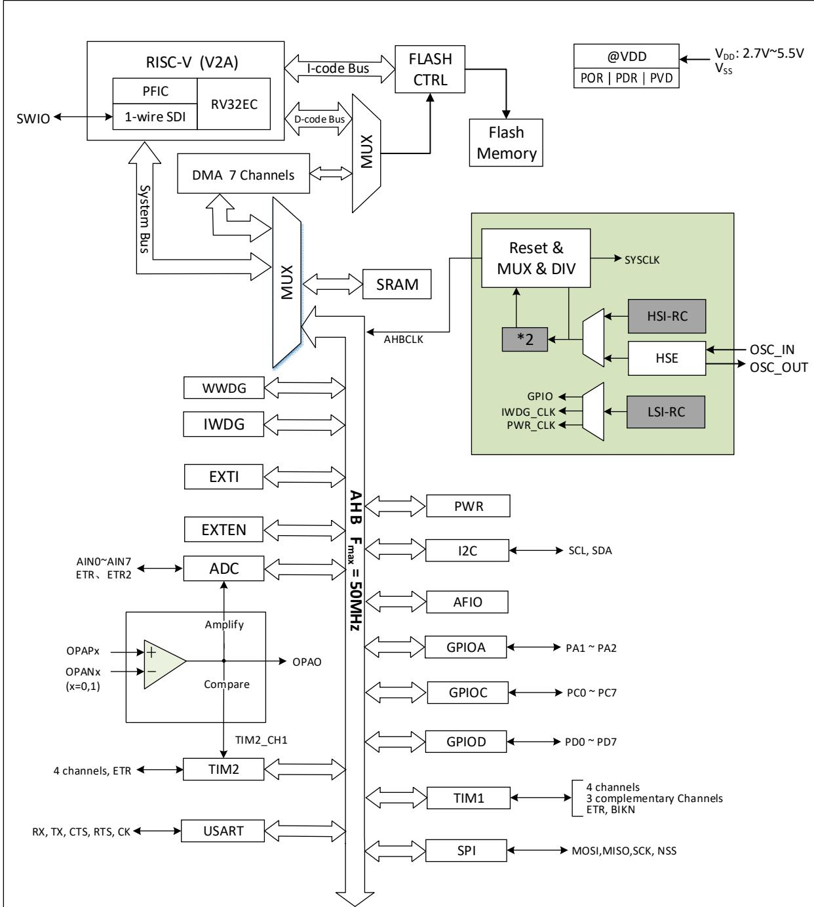

# 概述

CH32V003 系列是基于青稞RISC-V2A 内核设计的工业级通用微控制器，在产品功能上支持 48MHz系统主频。该系列具有宽压、单线调试、低功耗、超小封装等特点。提供常用的外设功能，内置 1 组 DMA控制器、1组10位模数转换ADC、1组运放比较器、多组定时器、标准通讯接口如 USART、I2C、SPI 等。产品额定工作电压为 3.3V 或 5V，工作温度范围为 $- 4 0 ^ { \circ } \mathsf { C } \sim 8 5 ^ { \circ } \mathsf { C }$ 工业级。

# 产品特性

$\bullet$ 内核 Core青稞 32 位 RISC-V 内核，RV32EC 指令集快速可编程中断控制器 $+ \cdot$ 硬件中断堆栈支持2级中断嵌套支持系统主频 48MHz

# $\bullet$ 存储器

- 2KB 易失数据存储区 SRAM  
- 16KB 程序存储区 CodeFlash  
- 1920B 系统引导程序存储区 BootLoader  
- 64B系统非易失配置信息存储区  
- 64B用户自定义信息存储区

$\bullet$ 电源管理和低功耗系统供电 $\mathsf { V } _ { \mathsf { D } \mathsf { D } }$ 额定：3.3V 或 5V低功耗模式：睡眠、待机

# $\bullet$ 系统时钟、复位

- 内嵌出厂调校的24MHz的RC振荡器- 内嵌 $1 2 8 \mathsf { K H z }$ 的RC振荡器- 外部支持 $4 ^ { \sim } 2 5 M H z$ 高速振荡器上/下电复位、可编程电压监测器$\bullet$ 1组1路通用DMA控制器7个通道，支持环形缓冲区管理支持 TIMx/ADC/USART/I2C/SPI

# 1组运放、比较器：连接ADC和 TIM2

# $\bullet$ 1 组 10 位模数转换 ADC

- 模拟输入范围： $0 \sim \mathsf { V } _ { \mathsf { D D } }$   
- 8 路外部信号 $^ { + 2 }$ 路内部信号通道  
支持外部延迟触发

# $\bullet$ 多组定时器

- 1 个16位高级定时器，增加死区控制和紧急刹车，提供用于电机控制的 PWM互补输出- 1个 16位通用定时器，提供输入捕获/输出比较/PWM/脉冲计数及增量编码器输入- 2 个看门狗定时器（独立和窗口型）- 系统时基定时器：32位计数器

# $\bullet$ 标准通讯接口

- 1 个 USART 接口 - 1 个 I2C 接口 - 1 个 SPI 接口

$\bullet$ GPIO 端口- 3 组 GPIO 端口，18 个 I/O 口映像 1 个外部中断

$\bullet$ 安全特性：64位芯片唯一ID$\bullet$ 调试模式：串行单线调试接口$\bullet$ 封装形式：SOP、TSSOP、QFN

<table><tr><td></td><td></td><td>SRAM</td><td>3|Ap#</td><td>1/0</td><td></td><td>i</td><td>i73</td><td>F Af$+iR</td><td>ADC</td><td>SPI</td><td>12C</td><td>USART</td><td>#* Hit</td></tr><tr><td>CH32V003F4P6</td><td>16K</td><td>2K</td><td>20</td><td>18</td><td>1</td><td>1</td><td>2</td><td>3</td><td>8</td><td>1</td><td>1</td><td>1</td><td>TSSOP20</td></tr><tr><td>CH32V003F4U6</td><td>16K</td><td>2K</td><td>16</td><td>14</td><td>1</td><td>1</td><td>2</td><td>3</td><td>6</td><td></td><td>1</td><td>1</td><td>QFN20 S0P16</td></tr><tr><td>CH32V003A4M6</td><td></td><td>2K</td><td>8</td><td>6</td><td>1</td><td>1</td><td>2</td><td>3</td><td>6</td><td>-</td><td>1</td><td>1</td><td></td></tr><tr><td>CH32V003J4M6</td><td>16K</td><td></td><td></td><td></td><td></td><td></td><td></td><td></td><td></td><td></td><td></td><td></td><td>SOP8</td></tr></table>

# 第1章 规格信息

# 1.1 系统架构

微控制器基于RISC-V指令集的青稞V2A 设计，其架构中将内核、仲裁单元、DMA模块、SRAM存储等部分通过多组总线实现交互。设计中集成通用 DMA控制器以减轻 CPU负担、提高访问效率，同时兼有数据保护机制，时钟自动切换保护等措施增加了系统稳定性。下图是系列产品内部总体架构框图。

  
图1-1 系统框图

# 1.2 存储器映射表

  
图1-2 存储器地址映射

# 1.3 时钟树

系统中引入 3组时钟源：内部高频RC振荡器（HSI）、内部低频RC振荡器(LSI)、外接高频振荡器(HSE)。其中，低频时钟源为独立看门狗提供了时钟基准。高频时钟源直接或者间接通过 2 倍频后输出为系统总线时钟（SYSCLK），系统时钟再由各预分频器提供了 AHB域外设控制时钟及采样或接口输出时钟，部分模块工作需要由PLL时钟直接提供。

  
图 1-3 时钟树框图

# 1.4 功能概述

1.4.1 RISC-V2A 处理器

RISC-V2A 支持 RISC-V 指令集 EC 子集。处理器内部以模块化管理，包含快速可编程中断控制器（PFIC）、扩展指令支持等单元。总线与外部单元模块相连，实现外部功能模块和内核的交互。RV32EC指令集，小端数据模式。

处理器以其极简指令集、多种工作模式、模块化定制扩展等特点可以灵活应用不同场景微控制器设计，例如小面积低功耗嵌入式场景。

$\bullet$ 支持机器模式  
$\bullet$ 快速可编程中断控制器（PFIC）  
$\bullet$ 2级硬件中断堆栈  
$\bullet$ 串行单线调试接口  
$\bullet$ 自定义扩展指令

1.4.2 片上存储器

内置 2K字节SRAM区，用于存放数据，掉电后数据丢失。  
内置 16K字节程序闪存存储区（Code FLASH），用于用户的应用程序和常量数据存储。  
内置 1920 字节系统存储区（System FLASH），用于系统引导程序存储（厂家固化自举加载程序）。  
64字节用于系统非易失配置信息存储区，64字节用于用户选择字存储区。  
支持 Boot 和用户代码互相跳转。

# 1.4.3 供电方案

$\mathsf { V } _ { \mathsf { D } 0 } = 2 . 7 { \sim } 5 . 5 \mathsf { V }$ ：为I/O引脚和内部调压器供电(使用 ADC时， $\mathsf { V } _ { \mathsf { D } \mathsf { D } }$ 如小于 2.9V则性能逐渐变差)。

# 1.4.4 供电监控器

本产品内部集成了上电复位(POR)/掉电复位(PDR)电路，该电路始终处于工作状态，保证系统在供电超过2.7V时工作；当 $\mathsf { V } _ { \mathsf { D } \mathsf { D } }$ 低于设定的阀值 $( \mathsf { V } _ { \mathsf { P 0 R / P D R } } )$ 时，置器件于复位状态，而不必使用外部复位电路。

另外系统设有一个可编程的电压监测器（PVD），需要通过软件开启，用于比较 $\mathsf { V } _ { \mathsf { D } \mathsf { D } }$ 供电与设定的阀值 $V _ { \mathsf { P V D } }$ 的电压大小。打开 PVD 相应边沿中断，可在 $\mathsf { V } _ { \mathsf { D } \mathsf { D } }$ 下降到 PVD 阈值或上升到 PVD 阈值时，收到中断通知。关于 $V _ { P O R / P D R }$ 和 $V _ { \mathsf { P V D } }$ 的值参考第3章。

# 1.4.5 电压调节器

复位后，调节器自动开启，根据应用方式有两个操作模式

$\bullet$ 开启模式：正常的运行操作，提供稳定的内核电源$\bullet$ 低功耗模式：CPU停止，系统自动进入待机模式

# 1.4.6 低功耗模式

系统支持两种低功耗模式，可以针对低功耗、短启动时间和多种唤醒事件等条件下选择达到最佳的平衡。

$\bullet$ 睡眠模式

在睡眠模式下，只有 CPU 时钟停止，但所有外设时钟供电正常，外设处于工作状态。此模式是最浅低功耗模式，但可以达到最快唤醒。

退出条件：任意中断或唤醒事件。

$\bullet$ 待机模式

置位 PDDS、SLEEPDEEP位，执行WFI/WFE指令进入。内核部分的供电被关闭，HSI的RC 振荡器和HSE晶体振荡器也被关闭，此模式下可以达到最低的电能消耗。

退出条件：任意外部中断/事件（EXTI信号）、NRST上的外部复位信号、IWDG复位，其中 EXTI 信号包括18个外部I/O口之一、PVD的输出、AWU自动唤醒。

# 1.4.7 快速可编程中断控制器（PFIC）

产品内置快速可编程中断控制器（PFIC），最多支持255 个中断向量，以最小的中断延迟提供了灵活的中断管理功能。当前产品管理了 4 个内核私有中断和 23 个外设中断管理，其他中断源保留。PFIC的寄存器均可以在机器特权模式下访问。

$\bullet$ 2个可单独屏蔽中断  
$\bullet$ 提供一个不可屏蔽中断NMI  
$\bullet$ 支持硬件中断堆栈(HPE)，无需指令开销  
$\bullet$ 提供2路免表中断(VTF)  
$\bullet$ 向量表支持地址或指令模式  
$\bullet$ 支持2级中断嵌套  
$\bullet$ 支持中断尾部链接功能

# 1.4.8 外部中断/事件控制器（EXTI）

外部中断/事件控制器总共包含 8 个边沿检测器，用于产生中断/事件请求。每个中断线都可以独立地配置其触发事件（上升沿或下降沿或双边沿），并能够单独地被屏蔽；挂起寄存器维持所有中断请求状态。EXTI可以检测到脉冲宽度小于内部 AHB的时钟周期。18个通用I/O口都可选择连接到同一个个外部中断源。

# 1.4.9 通用 DMA 控制器

系统内置了 1 组通用 DMA 控制器，管理 7 个通道，灵活处理存储器到存储器、外设到存储器和存储器到外设间的高速数据传输，支持环形缓冲区方式。每个通道都有专门的硬件 DMA 请求逻辑，支持一个或多个外设对存储器的访问请求，可配置访问优先权、传输长度、传输的源地址和目标地址等。

DMA 用于主要的外设包括：通用/高级定时器 TIMx、ADC、USART、I2C、SPI。i: DMA F CPU 2Zi1#1#\$ZXJ33 SRAM j#1iji].

# 1.4.10 时钟和启动

系统时钟源 HSI 默认开启，在没有配置时钟或者复位后，内部 24MH 的 RC 振荡器作为默认的 CPU时钟，随后可以另外选择外部 $4 ^ { \sim } 2 5 M H z$ 时钟或PLL时钟。当打开时钟安全模式后，如果 HSE用作系统时钟（直接或间接），此时检测到外部时钟失效，系统时钟将自动切换到内部RC 振荡器，同时HSE和PLL自动关闭；对于关闭时钟的低功耗模式，唤醒后系统也将自动地切换到内部的 RC振荡器。如果使能了时钟中断，软件可以接收到相应的中断。

# 1.4.11 ADC（模拟/数字转换器）

产品内嵌1个10位的模拟/数字转换器(ADC)，共用多达 8个外部通道和 2 个内部通道采样，可编程的通道采样时间，可以实现单次、连续、扫描或间断转换。提供模拟看门狗功能允许非常精准地监视一路或多路选中的通道，用于监视通道信号电压。支持外部事件触发转换，触发源包括片上定时器的内部信号和外部引脚。支持使用DMA操作。支持外部触发延迟功能，使能该功能后，当外部触发沿产生时，控制器根据配置的延迟时间将触发信号进行延迟，延迟时间到即刻触发 ADC转换。

# 1.4.12 定时器及看门狗

系统中的定时器包括1个高级定时器、1个通用定时器、2 个看门狗定时器以及系统时基定时器。

高级控制定时器高级控制定时器是一个16位的自动装载递加/递减计数器，具有16 位可编程的预分频器。除了完整的通用定时器功能外，可以被看成是分配到 6个通道的三相 PWM发生器，具有带死区插入的互补 PWM输出功能，允许在指定数目的计数器周期之后更新定时器进行重复计数周期，刹车功能等。高级控制定时器的很多功能都与通用定时器相同，内部结构也相同，因此高级控制定时器可以通过定时器链接功能与其他TIM定时器协同操作，提供同步或事件链接功能。

# $\bullet$ 通用定时器

通用定时器是一个 16 位的自动装载递加/递减计数器，具有一个可编程的 16 位预分频器以及 4个独立的通道，每个通道都支持输入捕获、输出比较、PWM 生成和单脉冲模式输出。还能通过定时器链接功能与高级控制定时器共同工作，提供同步或事件链接功能。在调试模式下，计数器可以被冻结，同时 PWM 输出被禁止，从而切断由这些输出所控制的开关。任意通用定时器都能用于产生 PWM 输出。每个定时器都有独立的DMA请求机制。这些定时器还能够处理增量编码器的信号，也能处理 1 至3个霍尔传感器的数字输出。

$\bullet$ 独立看门狗

独立看门狗是一个自由运行的 12 位递减计数器，支持 7 种分频系数。由一个内部独立的 128KHz的RC振荡器（LSI）提供时钟；LSI独立于主时钟，可运行于待机模式。IWDG在主程序之外，可以完全独立工作，因此，用于在发生问题时复位整个系统，或作为一个自由定时器为应用程序提供超时管理。通过选项字节可以配置成是软件或硬件启动看门狗。在调试模式下，计数器可以被冻结。

窗口看门狗

窗口看门狗是一个7位的递减计数器，并可以设置成自由运行。可以被用于在发生问题时复位整个系统。其由主时钟驱动，具有早期预警中断功能；在调试模式下，计数器可以被冻结。

$\bullet$ 系统时基定时器（SysTick）

青稞微处理器内核自带一个32位递增的计数器，用于产生SYSTICK异常（异常号：15），可专用于实时操作系统，为系统提供“心跳”节律，也可当成一个标准的 32 位计数器。具有自动重加载功能及可编程的时钟源。

# 1.4.13 通讯接口

1.4.13.1 通用同步/异步收发器（USART）

产品提供了1组通用同步/异步收发器（USART）。支持全双工异步通信、同步单向通信以及半双工单线通信，也支持 LIN(局部互连网)，兼容 ISO7816 的智能卡协议和 IrDA SIR ENDEC 传输编解码规范，以及调制解调器(CTS/RTS 硬件流控)操作，还允许多处理器通信。其采用分数波特率发生器系统，并支持 DMA操作连续通讯。

# 1.4.13.2 串行外设接口（SPI）

1 个串行外设 SPI 接口，提供主或从操作，动态切换。支持多主模式，全双工或半双工同步传输，支持基本的 SD 卡和 MMC 模式。可编程的时钟极性和相位，数据位宽提供 8 或 16 位选择，可靠通信的硬件 CRC产生/校验，支持DMA操作连续通讯。

# 1.4.13.3 I2C 总线

1 个 I2C 总线接口，能够工作于多主机模式或从模式，完成所有 I2C 总线特定的时序、协议、仲裁等，支持标准和快速两种通讯速度。

I2C接口提供7位或10位寻址，并且在 7位从模式时支持双从地址寻址。内置了硬件 CRC发生器/校验器。

# 1.4.14 通用输入输出接口（GPIO）

系统提供了 3 组 GPIO 端口，共 18 个 GPIO 引脚。每个引脚都可以由软件配置成输出(推挽或开漏)、输入(带或不带上拉或下拉)或复用的外设功能端口。多数GPIO引脚都与数字或模拟的复用外设共用。除了具有模拟输入功能的端口，所有的GPIO 引脚都有大电流通过能力。提供锁定机制冻结 IO配置，以避免意外的写入 I/O 寄存器。

系统中 IO 引脚电源由 $\mathsf { V } _ { \mathsf { D } \mathsf { D } }$ 提供，通过改变 $\mathsf { V } _ { \mathsf { D } \mathsf { D } }$ 供电将改变 IO 引脚输出电平高值来适配外部通讯接口电平。具体引脚请参考引脚描述。

# 1.4.15 运放/比较器（OPA）

产品内置 1 组运放/比较器，内部选择关联到 ADC 和 TIM2（CH1）外设，其输入和输出均可通过更改配置对多个通道进行选择。支持将外部模拟小信号被放大送入 ADC 以实现小信号 ADC 转换，也可以完成信号比较器功能，比较结果由GPIO输出或者直接接入 TIMx 的输入通道。

1.4.16 串行单线调试接口（1-wire SDI Serial Debug Interface）

内核自带一个串行单线调试的接口，SWIO 引脚（Single Wire Input Output）。系统上电或复位后默认调试接口引脚功能开启。

# 第2章 引脚信息

# 2.1 引脚排列

# CH32V003F4P6

# CH32V003A4M6

# CH32V003J4M6

3示例：A:ADC_,A7(ADC_IN7)T:TIME_,T2CH4(TIM2_CH4)U:USART,URX(USART_RX)OP:OPA_,OPO(OPA_OUT)、OPP1(OPA_P1)OSCI(OSCIN)OSCO(OSCOUT)SDA(I2C_SDA)SCL(I2C_SCL)SCK(SPI_SCK)NSS(SPI_NSS)MOSI(SPI_MOSI)MISO(SPI_MISO)AETR(ADC_ETR)

# 2.2 引脚描述

表 2-1 引脚定义

T+3lA#\$ TTii #itR\*iiA.

<table><tr><td colspan="3">31 AD m 5</td><td rowspan="2">8d0S</td><td rowspan="2"></td><td rowspan="2"></td><td rowspan="2">TAE ( 6)</td><td rowspan="2">miM Ib AE</td><td rowspan="2">ARIAE</td></tr><tr><td>90d0S</td><td>TSSSSP0</td><td></td></tr><tr><td>-</td><td>-</td><td>0</td><td></td><td>vss</td><td>P</td><td>vss</td><td>-</td><td>-</td></tr><tr><td>8</td><td>1</td><td>18</td><td>8</td><td>PD4</td><td>I/0/A</td><td>PD4</td><td>UCK/T2CH1ETR(/A7/OPO</td><td>TIETR_2/T1CH4_3</td></tr><tr><td>9</td><td>2</td><td>19</td><td>8</td><td>PD5</td><td>1/0/A</td><td>PD5</td><td>UTX/A5</td><td>T2CH4_3/URX_2</td></tr><tr><td>10</td><td>3</td><td>20</td><td>1</td><td>PD6</td><td>1/0/A</td><td>PD6</td><td>URX/A6</td><td>T2CH3_3/UTX_2</td></tr><tr><td>11</td><td>4</td><td>1</td><td></td><td>PD7</td><td>1/0/A</td><td>PD7</td><td>NRST/T2CH4/0PP1</td><td>UCK_1/UCK_2/T2CH4_2</td></tr><tr><td>12</td><td>5</td><td>2</td><td>1</td><td>PA1</td><td>I/0/A</td><td>PA1</td><td>T1CH2/A1/OPNO</td><td>OSCI/T1CH2_2</td></tr><tr><td>13</td><td>6</td><td>3</td><td>3</td><td>PA2</td><td>1/0/A</td><td>PA2</td><td>T ICH2N/AO/OPPO</td><td>OSCO/AETR2_1/T1CH2N_2</td></tr><tr><td>14</td><td>7</td><td>4</td><td>2</td><td>vss</td><td>P</td><td>vss</td><td>-</td><td>-</td></tr><tr><td>-</td><td>8</td><td>5</td><td></td><td>PDO</td><td>1/0/A</td><td>PDO</td><td>T ICH1N/OPN1</td><td>SDA_1/UTX_1/TICH1N_2</td></tr><tr><td>15</td><td>9</td><td>6</td><td>4</td><td>VDD</td><td>P</td><td>VDD</td><td>-</td><td>- NSS_1/UTX_3/T2CH3_2</td></tr><tr><td>16 1</td><td>10 11</td><td>7 8</td><td>5</td><td>PCO PC1</td><td>1/0 I/0/FT</td><td>PCO PC1</td><td>T2CH3 SDA/NSS</td><td>/T1CH3_1 T1BK1N_1/T2CH4_1 T2CH1ETR(_2/URX_3</td></tr><tr><td>2</td><td>12</td><td>9</td><td>6</td><td>PC2</td><td>1/0/FT</td><td>PC2</td><td>SCL/URTS/T1BKIN</td><td>/T2CH1ETR_3/T1BKIN_3 AETR_1/T2CH2_1 /T1ETR_3/URTS_1</td></tr><tr><td>3</td><td>13</td><td>10</td><td></td><td>PC3</td><td>1/0</td><td>PC3</td><td>T1CH3</td><td>/T1BKIN_2 T1CH1N_1/UCTS_1 /T1CH3_2/T1CH1N_3</td></tr><tr><td>4</td><td>14</td><td>11</td><td>7</td><td>PC4</td><td>1/0/A</td><td>PC4</td><td>T1CH4/MCO/A2</td><td>T1CH2N_1/T1CH4_2 /T1CH1_3</td></tr><tr><td></td><td>15</td><td>12</td><td>1</td><td>PC5</td><td>1/0/FT</td><td>PC5</td><td>SCK/T1ETR</td><td>T2CH1ETR()_1/SCL_2 /SCL_3/UCK_3/T1ETR_1 /T1CH3_3/SCK_1</td></tr><tr><td>5</td><td>16</td><td>13</td><td></td><td>PC6</td><td>1/0/FT</td><td>PC6</td><td>MOSI</td><td>T1CH1_1/UCTS_2/SDA_2 /SDA_3/UCTS_3/T1CH3N_3 /MOS1_1</td></tr><tr><td>6</td><td>17</td><td>14</td><td></td><td>PC7</td><td>1/0</td><td>PC7</td><td>MISO</td><td>T1CH2_1/URTS_2 /T2CH2_3/URTS_3</td></tr><tr><td>7</td><td>18</td><td>15</td><td>8</td><td>PD1</td><td>I/0/A</td><td>PD1</td><td>SWIO/T1CH3N/AETR2</td><td>/T1CH2_3/M1S0_1 SCL_1/URX_1/T1CH3N_1 /T1CH3N_2</td></tr><tr><td></td><td>19</td><td>16</td><td></td><td>PD2</td><td>I/0/A</td><td>PD2</td><td>T1CH1/A3</td><td>T2CH3_1/T1CH2N_3 /T1CH1_2</td></tr></table>

<table><tr><td>-</td><td>20</td><td>17</td><td>-</td><td>PD3</td><td>1/0/A</td><td>PD3</td><td>A4/T2CH2/AETR/UCTS</td><td>T2CH2_2/T1CH4_1</td></tr></table>

i: 1. TIM2_CH1 TIM2_ETR; 2.AITtJ#\* AF10 1+12 1J T1CH4_3 AF1O \$ 11b;

3.   
$I \ = \ T T L / C M O S$ $0 \ : = \ : c m o s$   
$P =$ i   
$F T =$ 5V;   
$A \ =$

# 2.3 引脚复用功能

表 2-2 引脚复用和重映射功能

<table><tr><td></td><td>ADC</td><td>TIM1</td><td>T Im2</td><td>USART</td><td>SYS 12C</td><td>SPI</td><td>SWIO</td><td>OPA</td></tr><tr><td>PA1</td><td>A1</td><td>T1CH2/T1CH2_2</td><td></td><td></td><td>OSCI</td><td></td><td></td><td>OPNO</td></tr><tr><td>PA2</td><td>AO/AETR2_1</td><td>T1CH2N/T1CH2N_2</td><td></td><td></td><td>OSCO</td><td></td><td></td><td>OPPO</td></tr><tr><td>PCO</td><td></td><td>T1CH3_1</td><td>T2CH3/T2CH3_2</td><td>UTX_3</td><td></td><td>NSS_1</td><td></td><td></td></tr><tr><td>PC1</td><td></td><td>T1BKIN_1/T1BKIN_3 T1BK1N/T1ETR_3</td><td>T2CH4 1/2CH1ETR&quot;_2</td><td>URX_3</td><td>SDA</td><td>NSS</td><td></td><td></td></tr><tr><td>PC2</td><td>AETR_1</td><td>/T1BKIN_2 T11H3/1GH1N13</td><td>T2CH2_1</td><td>URTS/URTS_1</td><td>SCL</td><td></td><td></td><td></td></tr><tr><td>PC3 PC4</td><td>A2</td><td>T1CH4/T1CH2N_1</td><td></td><td>UCTS_1</td><td>MCO</td><td></td><td></td><td></td></tr><tr><td>PC5</td><td></td><td>/T1CH4_2/T1CH1_3 T1ETR/T1CH3_3</td><td>T2CH1ETR()_1</td><td>UCK_3</td><td>SCL_2/SCL_3</td><td>SCK/SCK_1</td><td></td><td></td></tr><tr><td></td><td></td><td>/T1ETR_1</td><td></td><td>UCTS_2/UCTS_3</td><td></td><td></td><td></td><td></td></tr><tr><td>PC6 PC7</td><td></td><td>T1CH1_1/T1CH3N_3 T1CH2_1/T1CH2_3</td><td>T2CH2_3</td><td>URTS_2/URTS_3</td><td>SDA_2/SDA_3</td><td>MOSI/MOS1_1 M1SO/MISO_1</td><td></td><td></td></tr><tr><td>PDO</td><td></td><td>T1CH1N/T1CH1N_2</td><td></td><td>UTX_1</td><td>SDA_1</td><td></td><td></td><td>OPN1</td></tr><tr><td>PD1</td><td>AETR2</td><td>T1CH3N~T1CH3N_1</td><td></td><td>URX_1</td><td>SCL_1</td><td></td><td>SWIO</td><td></td></tr><tr><td>PD2</td><td></td><td>T1CH1/T1CH2N_3</td><td>T2CH3_1</td><td></td><td></td><td></td><td></td><td></td></tr><tr><td>PD3</td><td>A3</td><td>/T1CH1_2</td><td>T2CH2/T2CH2_2</td><td>UCTS</td><td></td><td></td><td></td><td></td></tr><tr><td>PD4</td><td>A4/AETR</td><td>T1CH4_1 T1ETR_2/T1CH4_3</td><td>T2CH1ETR(1)</td><td>UCK</td><td></td><td></td><td></td><td>OPO</td></tr><tr><td>PD5</td><td>A7 A5</td><td></td><td>T2CH4_3</td><td>UTX/URX_2</td><td></td><td></td><td></td><td></td></tr><tr><td>PD6</td><td>A6</td><td></td><td>T2CH3_3</td><td>URX/UTX_2</td><td></td><td></td><td></td><td></td></tr><tr><td>PD7</td><td></td><td></td><td>T2CH4/T2CH4_2</td><td>UCK_1/UCK_2</td><td>NRST</td><td></td><td></td><td>0PP1</td></tr></table>

i: T1M2 CH1. T1M2 ETR.

# 第 3章 电气特性

# 3.1 测试条件

除非特殊说明和标注，所有电压都以 $\mathsf { V } _ { \mathbb S \mathbb S }$ 为基准。

所有最小值和最大值将在最坏的环境温度、供电电压和时钟频率条件下得到保证。典型数值是基于常温 $2 5 \mathrm { ^ \circ C }$ 和 $\mathsf { V } _ { \mathsf { D D } } = 3 . 3 \mathsf { V }$ 或5V环境下用于设计指导。

对于通过综合评估、设计模拟或工艺特性得到的数据，不会在生产线进行测试。在综合评估的基础上，最小和最大值是通过样本测试后统计得到。除非特殊说明为实测值，否则特性参数以综合评估或设计保证。

供电方案：

  
图3-1 常规供电典型电路

# 3.2 绝对最大值

临界或者超过绝对最大值将可能导致芯片工作不正常甚至损坏。

表3-1 绝对最大值参数表  

<table><tr><td></td><td>##it</td><td>#J</td><td></td><td></td></tr><tr><td>TA</td><td>I1FAATM</td><td>-40</td><td>85</td><td>c</td></tr><tr><td>Ts</td><td>T1i#AfAJITtiM</td><td>-40</td><td>125</td><td>c</td></tr><tr><td>VDD-Vss</td><td>yl#B1# (Vo)</td><td>-0.3</td><td>5.5</td><td>v</td></tr><tr><td rowspan="2">VIN</td><td>FT (mt 5V) 31ApEA5$XE</td><td>Vss-0. 3</td><td>5.5</td><td>v</td></tr><tr><td>#31ApEA9$E</td><td>Vss-0. 3</td><td>VDp+0. 3</td><td></td></tr><tr><td>1VDb_x|</td><td>T#3AZiAE</td><td></td><td>50</td><td>mV</td></tr><tr><td>IVss_x1</td><td>T@31AZiaE</td><td></td><td>50</td><td>mV</td></tr><tr><td>VESD cHM)</td><td>ESD ($, #)</td><td>4K</td><td></td><td>v</td></tr><tr><td>I vDD</td><td>Zit Vo$i (1#i)</td><td></td><td>100</td><td rowspan="7">mA</td></tr><tr><td>I vs</td><td>ZiVss$ (i)</td><td></td><td>80</td></tr><tr><td rowspan="2">11o</td><td>1I# 1/0 Faf$J31Ap_Ea9i</td><td></td><td>20</td></tr><tr><td>1I 1/0 Fn$J31Ap_Ea5$Wi</td><td></td><td>-20</td></tr><tr><td rowspan="2">I In (PI)</td><td>HSE AJ OSC_1N 31Ap</td><td></td><td>+/-4</td></tr><tr><td>#3Aa</td><td></td><td>+/-4</td></tr><tr><td>I IN (PIN)</td><td>FF# 10 FAt$J31AA9iX;</td><td></td><td>+/-20</td></tr></table>

# 3.3 电气参数

# 3.3.1 工作条件

表3-2 通用工作条件  

<table><tr><td></td><td>$</td><td>#</td><td>J</td><td></td><td></td></tr><tr><td>FHOLK</td><td>B AHB A$$*</td><td></td><td></td><td>50</td><td>MHz</td></tr><tr><td rowspan="2">VD</td><td rowspan="2"></td><td>*1 ADC</td><td>2.7</td><td>5.5</td><td rowspan="2">v</td></tr><tr><td>1 ADC (3iX)</td><td>2.8</td><td>5.5</td></tr><tr><td>TA</td><td>IT</td><td></td><td>-40</td><td>85</td><td>C</td></tr><tr><td>Tj</td><td></td><td></td><td>-40</td><td>105</td><td>C</td></tr></table>

表3-3 上电和掉电条件  

<table><tr><td></td><td>$</td><td>#</td><td>J</td><td></td><td>$</td></tr><tr><td rowspan="2">tvD</td><td>VDo EHi**</td><td></td><td>0</td><td>8</td><td rowspan="2">us/V</td></tr><tr><td>Voo TF#i**</td><td></td><td>30</td><td>8</td></tr></table>

# 3.3.2 内嵌复位和电源控制模块特性

表3-4 复位及电压监测（PDR选择高阈值档位）  

<table><tr><td>#</td><td></td><td>##</td><td>J</td><td>#</td><td></td><td></td></tr><tr><td rowspan="11">VevDhyst VPwo (1)</td><td rowspan="17"></td><td>PLS[2:0] = 000(EJH)</td><td></td><td>2.85</td><td></td><td>v</td></tr><tr><td>PLS[2: 0] = 000(T#iA)</td><td></td><td>2.7</td><td></td><td>v</td></tr><tr><td>PLS[2:0] = 001(EHiA)</td><td></td><td>3.05</td><td></td><td></td></tr><tr><td>PLS[2: 0] = 001(T#i)</td><td></td><td>2.9</td><td></td><td>v</td></tr><tr><td>PLS[2: 0] = 010(EHiA)</td><td></td><td>3.3</td><td></td><td>v</td></tr><tr><td>PLS[2:0] = 010(T#i)</td><td></td><td>3.15</td><td></td><td>v</td></tr><tr><td>PLS[2:0] = 011(EJIiA)</td><td></td><td>3.5</td><td></td><td></td></tr><tr><td>PLS[2: 0] = 011(T)</td><td></td><td>3.3</td><td></td><td>v</td></tr><tr><td>PLS[2:0] = 100(EHA)</td><td></td><td>3.7</td><td></td><td></td></tr><tr><td>PLS[2:0] = 100(T)</td><td></td><td>3.5</td><td></td><td>v</td></tr><tr><td>PLS[2:0] = 101()</td><td></td><td>3.9</td><td></td><td>V</td></tr><tr><td>PLS[2:0] = 101(T#)</td><td></td><td>3.7</td><td></td><td></td></tr><tr><td>PLS[2:0] = 110(i)</td><td></td><td>4.1</td><td></td><td>V</td></tr><tr><td>PLS[2:0] = 110(T#)</td><td></td><td>3.9</td><td></td><td>v</td></tr><tr><td>PLS[2:0] = 111(Ei)</td><td></td><td>4.4</td><td></td><td>v</td></tr><tr><td>PLS[2:0] = 111(T#)</td><td></td><td>4.2</td><td></td><td>v</td></tr><tr><td rowspan="2">PVD jE$</td><td></td><td></td><td>0.18</td><td></td><td>v</td></tr><tr><td></td><td>2. 32</td><td>2.5</td><td>2.68</td><td>v</td></tr><tr><td>VPOR/PDR</td><td>E/</td><td>T#iA</td><td>2.3</td><td>2.48</td><td>2. 66</td><td>v</td></tr><tr><td>PDR jE$ E VPDRhyst</td><td></td><td></td><td>20</td><td></td><td></td><td>mV</td></tr><tr><td rowspan="2">#t tRSTTEMPO</td><td></td><td>12</td><td></td><td>17</td><td>22</td><td>mS</td></tr><tr><td></td><td></td><td>300</td><td></td><td></td><td>uS</td></tr></table>

: 1.it

# 3.3.3 内置的参考电压

表3-5 内置参考电压  

<table><tr><td></td><td></td><td>#</td><td>J</td><td>#</td><td></td><td></td></tr><tr><td>VREFINT</td><td></td><td>TA = -40C~85C</td><td>1.17</td><td>1.2</td><td>1.23</td><td>v</td></tr><tr><td>Ts_vref int</td><td>i$* Af, ADC aR#Afje]</td><td></td><td>3</td><td></td><td>500</td><td>1/fADC</td></tr></table>

# 3.3.4 供电电流特性

电流消耗是多种参数和因素的综合指标，这些参数和因素包括工作电压、环境温度、I/O 引脚的负载、产品的软件配置、工作频率、I/O 脚的翻转速率、程序在存储器中的位置以及执行的代码等。电流消耗测量方法如下图：

  
图 3-2 电流消耗测量

微控制器处于下列条件：

常温 $\mathsf { V } _ { \mathsf { D D } } = 3 . 3 \mathsf { V }$ 或 5V 情况下，测试时：所有 IO 端口配置下拉输入；测试 HSE 时打开 HSI，测试HSI 时 HSE 关闭， $\mathsf { H S E } = \mathsf { 2 4 M }$ ， $\mathsf { H } | \mathsf { S } = \mathsf { 2 } 4 \mathsf { M }$ （已校准）；当 $F _ { \mathsf { H C L K } } = \mathsf { 4 8 M H z }$ 、16MHz 时，系统时钟来源 ${ \tt C L K } ^ { * 2 }$ ；打开所有外设时仅打开所有外设的时钟。使能或关闭所有外设时钟的功耗。

表3-6-1 运行模式下典型的电流消耗，数据处理代码从内部闪存中运行 $( \mathsf { V } _ { \mathsf { D } \mathsf { D } } = \mathsf { 3 } . \mathsf { 3 } \mathsf { V } )$   

<table><tr><td rowspan="2"></td><td rowspan="2">$#</td><td colspan="2" rowspan="2">#</td><td colspan="2">#</td><td rowspan="2">#</td></tr><tr><td>1 AE FF5&gt;i</td><td>i FF#9Ni</td></tr><tr><td rowspan="8">1DD (1)</td><td rowspan="8">iE1tst T#J #*</td><td rowspan="5">5l#BAf$</td><td>FHcLk = 48MHz</td><td>7.0</td><td>4.6</td><td rowspan="9">mA</td></tr><tr><td>FHcLk = 24MHz</td><td>5.2</td><td>4.2</td></tr><tr><td>FHcLk = 16MHz</td><td>4.6</td><td>3.8</td></tr><tr><td>FHcLk = 8MHz</td><td>3.1</td><td>2.7</td></tr><tr><td>FHcLkK = 750KHz</td><td>1.8</td><td>1.8</td></tr><tr><td rowspan="5">i1F* RC #R* (HS1), 1 AHB F5t</td><td>FHoLk = 48MHz</td><td>6.3</td><td>3.9</td></tr><tr><td>FhcLk = 24MHz</td><td>4.3</td><td>3.1</td></tr><tr><td>FHcLk = 16MHz</td><td>3.9</td><td>3.1</td></tr><tr><td>FHCLK = 8MHz</td><td>2.3</td><td>1.9</td></tr><tr><td>FHcLk = 750KHz</td><td>1.1</td><td>1.0</td></tr></table>

1.# 2. $V D D \ < \ 3 V$ A, .

表3-6-2 运行模式下典型的电流消耗，数据处理代码从内部闪存中运行 $( \mathsf { V } _ { \mathsf { D } 0 } = 5 \mathsf { V } )$ ）  

<table><tr><td rowspan="2">#%</td><td rowspan="2">$#</td><td rowspan="2"></td><td colspan="2"></td><td rowspan="2"></td></tr><tr><td>1E AE FMit</td><td></td></tr></table>

<table><tr><td rowspan="8">1DD (1)</td><td rowspan="8">iE15tst T AJ 1#</td><td rowspan="4">9l#BA+$</td><td>FHcLk = 48MHz</td><td>8.0</td><td>5.6</td></tr><tr><td>FHcLk = 24MHz</td><td>6.4</td><td>5.6</td></tr><tr><td>FHcLk =16MHz</td><td>5.8</td><td>5.0</td></tr><tr><td>FHoLk = 8MHz</td><td>3.8</td><td>3.4</td></tr><tr><td>FHcLk =</td><td>750KHz 2.2</td><td>2.1</td></tr><tr><td rowspan="5">RC #R(HS1), 1 AHB F5t 1*</td><td>FHoLk = 48MHz</td><td>7.3</td><td>4.9</td></tr><tr><td>FHoLk = 24MHz</td><td>5.3</td><td>4.1</td></tr><tr><td>FHOLK = 16MHz</td><td>5.0</td><td>4.3</td></tr><tr><td>FHoLk = 8MHz</td><td>3.1</td><td>2.7</td></tr><tr><td>FHcLk = 750KHz</td><td>1.4</td><td>1.4</td></tr></table>

;:1.E;#

表3-7-1睡眠模式下典型的电流消耗，数据处理代码从内部闪存或 SRAM 中运行 $( \mathsf { V } _ { \mathsf { D } 0 } = 3 . 3 \mathsf { V } )$ ）  

<table><tr><td rowspan="2">#9</td><td rowspan="2">$</td><td colspan="2" rowspan="2">#</td><td colspan="2">#</td><td rowspan="2">#</td></tr><tr><td>1AE FF$5Ni</td><td></td></tr><tr><td rowspan="8">1DD (1)</td><td rowspan="8">A#ARt T &lt;tEAf9li1# FAA$1R</td><td rowspan="5">5l#BAf$p</td><td>FHcLk = 48MHz</td><td>4.9</td><td>2.5</td><td rowspan="9"> mA</td></tr><tr><td>FHcLk = 24MHz</td><td>2.9</td><td>1.7</td></tr><tr><td>FHcLk = 16MHz</td><td>2.5</td><td>1.7</td></tr><tr><td>FHcLk = 8MHz</td><td>1.7</td><td>1.3</td></tr><tr><td>FHcLk = 750KHz</td><td>1.2</td><td>1.1</td></tr><tr><td rowspan="5">i1Fi* RC #R(HS1), 1 AHB F5t</td><td>FHoLk = 48MHz</td><td>4.2</td><td>1.8</td></tr><tr><td>FhcLk = 24MHz</td><td>2.2</td><td>1.0</td></tr><tr><td>FHoLk = 16MHz</td><td>1.8</td><td>1.0</td></tr><tr><td>FHoLk = 8MHz</td><td>1.0</td><td>0.6</td></tr><tr><td>FHcLk = 750KHz</td><td>0.4</td><td>0.4</td></tr></table>

1.#

表3-7-2睡眠模式下典型的电流消耗，数据处理代码从内部闪存或 SRAM 中运行 $( \mathsf { V } _ { \mathsf { D } \mathsf { D } } = 5 \mathsf { V } )$ ）  

<table><tr><td rowspan="2"></td><td rowspan="2">$</td><td rowspan="2"></td><td rowspan="2">#</td><td colspan="2">#</td><td rowspan="2">#</td></tr><tr><td>1 AE FF$5li</td><td></td></tr><tr><td rowspan="7">1DD (1)</td><td rowspan="7">A#ARtst T A# &lt;tEAf9li1# FAA$1R</td><td rowspan="6">5l#BAf$p</td><td>FHcLk = 48MHz</td><td>4.9</td><td>2.5</td><td rowspan="9">mA</td></tr><tr><td>FHcLk = 24MHz</td><td>2.9</td><td>1.7</td></tr><tr><td>FHcLk = 16MHz</td><td>2.5</td><td>1.7</td></tr><tr><td>FHcLk = 8MHz</td><td>1.7</td><td>1.3</td></tr><tr><td>FHoLk = 750KHz</td><td>1.2</td><td>1.1</td></tr><tr><td>FHcLk = 48MHz i1Fi</td><td>4.2</td><td>1.8</td></tr><tr><td rowspan="5">RC #(HSI), 1 AHB F5$ *</td><td>FHoLk = 24MHz</td><td>2.2</td><td>1.0</td><td></td></tr><tr><td>FHoLk = 16MHz</td><td>1.8</td><td>1.0</td><td></td></tr><tr><td>FHcLk = 8MHz</td><td>1.0</td><td>0.6</td><td></td></tr><tr><td>FHoLk = 750KHz</td><td>0.4</td><td></td><td></td></tr><tr><td></td><td></td><td>0.4</td><td></td></tr></table>

1.#

表3-8待机模式下典型的电流消耗  

<table><tr><td>#</td><td>$</td><td colspan="2">#</td><td>#</td><td></td></tr><tr><td rowspan="4">I DD</td><td rowspan="4">1$$TA#</td><td rowspan="2">LS1 #TFF</td><td>VDD = 3.3V</td><td>10.5</td><td rowspan="4">uA</td></tr><tr><td>VDo = 5V</td><td>11.1</td></tr><tr><td rowspan="2">LS1 i]</td><td>VDD = 3.3V</td><td>9.0</td></tr><tr><td>VDo = 5V</td><td>9.6</td></tr></table>

j

# 3.3.5 外部时钟源特性

表3-9 来自外部高速时钟  

<table><tr><td></td><td>$</td><td>#</td><td>J</td><td>#</td><td></td><td></td></tr><tr><td>FhsE_oxt</td><td></td><td></td><td>4</td><td>24</td><td>25</td><td>MHz</td></tr><tr><td>VHSEH(1)</td><td>osc_In31AT</td><td></td><td>0. 8VDo</td><td></td><td>VDD</td><td>v</td></tr><tr><td>VHSEL.1)</td><td>OSc_1N$31AP1T</td><td></td><td>0</td><td></td><td>0.2VDD</td><td>v</td></tr><tr><td>Cin (HSE)</td><td>OSC_In $</td><td></td><td></td><td>5</td><td></td><td>pF</td></tr><tr><td>DuT y (HSE)</td><td>5$tt</td><td></td><td>40</td><td>50</td><td>60</td><td>%</td></tr><tr><td>I.</td><td>0sc_1n i</td><td></td><td></td><td></td><td>1</td><td>uA</td></tr></table>

j:1.T;#Eul1#aJAt312TiR3#i

  
图3-3 外部提供高频时钟源电路

表3-10 使用一个晶体/陶瓷谐振器产生的高速外部时钟  

<table><tr><td>#</td><td></td><td>#</td><td>J</td><td>#</td><td></td><td></td></tr><tr><td>Fosc_in</td><td>i9#  5 *</td><td></td><td>4</td><td>24</td><td>25</td><td>MHz</td></tr><tr><td>RF</td><td> (#9)</td><td></td><td></td><td>250</td><td></td><td>k Q</td></tr><tr><td>C</td><td>$1F$ Rs</td><td>Rs = 60Q(1)</td><td></td><td>20</td><td></td><td>pF</td></tr><tr><td>12</td><td>HSE yEzJi</td><td>VDo = 3.3V, 20p $</td><td></td><td>0. 32</td><td></td><td>mA</td></tr><tr><td>gm</td><td></td><td></td><td></td><td>6.8</td><td></td><td>mA/V</td></tr><tr><td>tsu (HSE)</td><td></td><td>VDoE, 24M</td><td></td><td>2</td><td></td><td>ms</td></tr></table>

j:1.25M 1 ESR iXTBj 60 K, 1F 25M aJjj

# 电路参考设计及要求：

晶体的负载电容以晶体厂商建议为准，通常情况 $\mathtt { C } _ { 1 } \mathtt { \Pi } _ { 1 } = \mathtt { C } _ { 1 } \mathtt { \Pi } _ { 2 }$ 。

  
图3-4 外接 24M晶体典型电路

# 3.3.6 内部时钟源特性

表 3-11 内部高速(HSI)RC 振荡器特性  

<table><tr><td></td><td></td><td>#</td><td>J</td><td>#</td><td></td><td>#</td></tr><tr><td>FHSi</td><td>#*(tF)</td><td></td><td></td><td>24</td><td></td><td>MHz</td></tr><tr><td>DuCyHs1</td><td>5*tt</td><td></td><td>45</td><td>50</td><td>55</td><td>%</td></tr><tr><td rowspan="2">ACCHsI</td><td rowspan="2">HS1 #A*# (t)</td><td>TA = 0C~70C</td><td>-1.2</td><td></td><td>1.6</td><td>%</td></tr><tr><td>TA = -40&#x27;C~85C</td><td>-2.2</td><td></td><td>2.2</td><td>%</td></tr><tr><td>tsu (HS1)</td><td>HS1 #R%</td><td></td><td></td><td>10</td><td></td><td>us</td></tr><tr><td>I DD Hhs1)</td><td>HS1 #RTb#E</td><td></td><td>120</td><td>180</td><td>270</td><td>uA</td></tr></table>

表 3-12 内部低速(LSI)RC 振荡器特性  

<table><tr><td></td><td></td><td>#</td><td></td><td>#</td><td></td><td></td></tr><tr><td>FLsi</td><td>t*</td><td></td><td>100</td><td>128</td><td>150</td><td>KHz</td></tr><tr><td>DuTyrsie</td><td>tt</td><td></td><td>45</td><td>50</td><td>55</td><td>%</td></tr><tr><td>tsu (LSs1)</td><td>LS1 #R%zA[</td><td></td><td></td><td>80</td><td></td><td>us</td></tr><tr><td>I D (LsI1)</td><td>LS1 ##E</td><td></td><td></td><td>1.5</td><td></td><td> uA</td></tr></table>

# 3.3.7 从低功耗模式唤醒的时间

表3-13 低功耗模式唤醒的时间(1)  

<table><tr><td></td><td>$</td><td>#1#</td><td>#</td><td>$</td></tr><tr><td>t wus leep</td><td>J A#ARtA</td><td>1F HS1 RC Af$E</td><td>30</td><td>us</td></tr><tr><td>tWUSTDBY</td><td></td><td>LDO EAjj8] + HS1 RC A$</td><td>200</td><td>us</td></tr></table>

W#

# 3.3.8 存储器特性

表3-14 闪存存储器特性  

<table><tr><td>#</td><td></td><td>##</td><td>#J</td><td>#</td><td></td><td>#</td></tr><tr><td>tERASE_64</td><td> 64#) i</td><td>TA = -20C~85C</td><td>2.4</td><td></td><td>3.1</td><td>ms</td></tr><tr><td>tERASE</td><td> (64#) $Ai</td><td>TA = -20C~85C</td><td>2.4</td><td></td><td>3.1</td><td>ms</td></tr><tr><td>tprog</td><td>16 1j]</td><td>TA = -20C~85C</td><td>2.4</td><td></td><td>3.1</td><td>ms</td></tr><tr><td>tME</td><td></td><td>TA = -20&#x27;C~85C</td><td>2.4</td><td></td><td>3.1</td><td>ms</td></tr><tr><td>Vprog</td><td>E</td><td></td><td>2.8</td><td></td><td>5.5</td><td></td></tr></table>

表3-15 闪存存储器寿命和数据保存期限  

<table><tr><td>#</td><td>$</td><td>*</td><td></td><td>#</td><td></td><td>#1</td></tr></table>

<table><tr><td>NEND</td><td>#5&gt;X#</td><td>TA = 25C</td><td>10K</td><td>80K(1)</td><td></td><td></td></tr><tr><td>tRET</td><td>##E1R1#ABR</td><td></td><td>10</td><td></td><td></td><td>#</td></tr></table>

i: ;1F5, #R

# 3.3.9 I/O 端口特性

表 3-16 通用 I/O 静态特性  

<table><tr><td></td><td></td><td>#</td><td>#J</td><td>#</td><td></td><td></td></tr><tr><td rowspan="2">VIH</td><td>t 1/0A, #</td><td></td><td>0. 22* (VDb- 2. 7)+1. 55</td><td></td><td>VDp+0. 3</td><td>v</td></tr><tr><td>FT 1031A, #T</td><td></td><td>0. 22* (VDD- 2. 7)+1.55</td><td></td><td>5.5</td><td>v</td></tr><tr><td rowspan="2">VIL</td><td>t1/O, #T</td><td rowspan="2"></td><td>-0.3</td><td></td><td>0.19*(VDb 2. 7)+0. 65</td><td>v</td></tr><tr><td>FT 10 31Ap, #a1</td><td>-0.3</td><td></td><td>0.19*(VDD- 2.7)+0.65</td><td>v</td></tr><tr><td>Vhys</td><td></td><td></td><td>150</td><td></td><td></td><td>mV</td></tr><tr><td rowspan="2">I ikg</td><td rowspan="2"></td><td>t)E 10 i#</td><td></td><td></td><td>1</td><td rowspan="2">uA</td></tr><tr><td>FT 10 j#</td><td></td><td></td><td>3</td></tr><tr><td>Rpu</td><td>33E##</td><td></td><td>35</td><td>45</td><td>55</td><td>k Q</td></tr><tr><td>Rp</td><td>33 Tf</td><td></td><td>35</td><td>45</td><td>55</td><td>k Q</td></tr><tr><td>Cio</td><td>1/0 31Ap*</td><td></td><td></td><td>5</td><td></td><td> pF</td></tr></table>

# 输出驱动电流特性

GPIO(通用输入/输出端口)可以吸收或输出多达±8mA电流，并且吸收或输出 $\pm 2 0 m \mathsf { A }$ 电流(不严格达到 $V _ { \mathfrak { a } } / \mathsf { V } _ { \mathfrak { d } \mathsf { H } } )$ 。在用户应用中，所有 IO 引脚驱动总电流不能超过 3.2 节给出的绝对最大额定值。

表3-17 输出电压特性  

<table><tr><td>#9</td><td></td><td>#</td><td>J</td><td></td><td>#</td></tr><tr><td>VoL</td><td>1 831APA4</td><td rowspan="2">TTL i#, 1o = +8mA 2.7V&lt; Vo &lt;5.5V</td><td rowspan="2"></td><td rowspan="2">0.4</td><td rowspan="2">V</td></tr><tr><td>VoH</td><td> 83A</td></tr><tr><td>VoL</td><td>#1 831ApA4i</td><td rowspan="2">CMOS #, 11o = +8mA 2.7V&lt; VDo &lt;5.5V</td><td>VDD-0. 4</td><td>0.4</td><td rowspan="2">v</td></tr><tr><td>VoH</td><td> 83</td><td>2.3</td><td></td></tr><tr><td>VoL</td><td>1 831AA4</td><td>1 1o = +20mA</td><td></td><td>1.3</td><td rowspan="2">v</td></tr><tr><td>VoH</td><td>#, 83A</td><td>2.7V&lt; VbD &lt;5.5V</td><td>VD-1. 3</td><td></td></tr></table>

+3103A9 3.2#.35 310 3l#A9Ez, /##1R, E#1#B 10 #ETJ+ ,YiFt.

表3-18 输入输出交流特性  

<table><tr><td>MODEx[1:0] C</td><td>#</td><td>$#</td><td>##</td><td>1</td><td>1</td><td>#</td></tr><tr><td rowspan="3">10 (2MHz)</td><td>F max (10 out</td><td>t*</td><td>CL = 50pF, Vb = 2. 7-5. 5V</td><td></td><td>2</td><td>MHz</td></tr><tr><td>tf (10) out</td><td>#W1TTA]</td><td>CL = 50pF, Voo = 2. 7-5. 5V</td><td></td><td>125</td><td>ns</td></tr><tr><td>tr (10) out </td><td>WRTAEAe]</td><td></td><td></td><td>125</td><td>ns</td></tr></table>

<table><tr><td rowspan="3">01 (10MHz)</td><td>F max (10 out</td><td>th*</td><td>CL = 50pF, Vbp = 2. 7-5. 5V</td><td></td><td>10</td><td>MHz</td></tr><tr><td>tf (10 out</td><td>W[TAT]</td><td rowspan="2">CL = 50pF, Voo = 2. 7-5. 5V</td><td></td><td>25</td><td>ns</td></tr><tr><td>tr (10 out</td><td></td><td></td><td>25</td><td>ns</td></tr><tr><td rowspan="3">11 (30MHz)</td><td>F max (10 out</td><td>th*</td><td>CL = 50pF, Vbo = 2. 7-5. 5V</td><td></td><td>30</td><td>MHz</td></tr><tr><td>tf (10 out</td><td></td><td>CL = 50pF, Voo = 2. 7-5. 5V</td><td></td><td>10</td><td>ns</td></tr><tr><td>tr (10) out</td><td></td><td>CL = 50pF, Vo = 2. 7-5. 5V</td><td></td><td>10</td><td>ns</td></tr><tr><td></td><td>tExT|pw</td><td>EXT1 t$Jt;WJJ5l#B13 AAk</td><td></td><td>10</td><td></td><td>ns</td></tr></table>

# 3.3.10 NRST 引脚特性

表3-19 外部复位引脚特性  

<table><tr><td></td><td></td><td>#</td><td>J</td><td>#</td><td></td><td></td></tr><tr><td>VIL(NRST)</td><td>NRST </td><td></td><td>-0. 3</td><td></td><td>0. 28*(VDb-1. 8)+0. 6</td><td>v</td></tr><tr><td>VIH (NRST)</td><td>NRST </td><td></td><td>0. 41*(VDb-1. 8)+1.3</td><td></td><td>VDD+0. 3</td><td>v</td></tr><tr><td>Vhys (NRST)</td><td>NRST iR#</td><td></td><td>150</td><td></td><td></td><td>mV</td></tr><tr><td>RPu(1)</td><td>33_E#x</td><td></td><td>35</td><td>45</td><td>55</td><td>kQ</td></tr></table>

1.E PMOS PMOS/NMOS A( $10 \%$

电路参考设计及要求：

  
图3-5 外部复位引脚典型电路

# 3.3.11 TIM 定时器特性

表 3-20 TIMx 特性  

<table><tr><td></td><td>$#</td><td>##</td><td>J</td><td></td><td></td></tr><tr><td rowspan="2">tres (T M)</td><td rowspan="2">AA$</td><td></td><td>1</td><td></td><td>tT MxCLK</td></tr><tr><td>fTMxcLk = 48MHz</td><td>13.9</td><td></td><td>ns</td></tr><tr><td rowspan="2">FExT</td><td rowspan="2">CH1  CH4 AA9#BA$$*</td><td></td><td>0</td><td>fT MxCLK/2</td><td>MHz</td></tr><tr><td>fT1MxcLK = 48MHz</td><td>0</td><td>36</td><td>MHz</td></tr><tr><td>ResT IM</td><td>A*</td><td></td><td></td><td>16</td><td>1ii</td></tr><tr><td rowspan="2">tCOUuNTER</td><td rowspan="2">i7B$, 16 1i# A$</td><td></td><td>1</td><td>65536</td><td>tT IMXCLK</td></tr><tr><td>fTImxcLK = 48MHz</td><td>0. 0139</td><td>910</td><td>us</td></tr><tr><td rowspan="2">t MaAx_COUNT</td><td rowspan="2">#xXaJ AEASif#</td><td></td><td></td><td>65535</td><td>t TI MxcLK</td></tr><tr><td>f T MxoLK = 48MHz</td><td></td><td>59.6</td><td>s</td></tr></table>

# 3.3.12 I2C 接口特性

  
图 3-6 I2C 总线时序图

表 3-21 I2C 接口特性  

<table><tr><td rowspan="2"></td><td rowspan="2">$</td><td colspan="2">E 12C</td><td colspan="2">i 12C</td><td rowspan="2"></td></tr><tr><td>#J</td><td></td><td>#J</td><td></td></tr><tr><td>tw (SCKL)</td><td>SCL A$1Afi8]</td><td>4.7</td><td></td><td>1.2</td><td></td><td>us</td></tr><tr><td>tw(SCKH)</td><td>SCL A$TAe]</td><td>4.0</td><td></td><td>0.6</td><td></td><td>us</td></tr><tr><td>tSu (SDA)</td><td>SDA #tzAf|8]</td><td>250</td><td></td><td>100</td><td></td><td>ns</td></tr><tr><td>th(SDA)</td><td>SDA##E1RAfja]</td><td>0</td><td></td><td>0</td><td>900</td><td>ns</td></tr><tr><td>tr (sDA) /tr (sCL)</td><td>SDA FA SCL _EF+Afja]</td><td></td><td>1000</td><td>20</td><td></td><td>ns</td></tr><tr><td>tf (SDA)/tf (SCL)</td><td>SDA FA SCL T#Afja]</td><td></td><td>300</td><td></td><td></td><td>ns</td></tr><tr><td>tn(STA)</td><td>FFtA1#1Rt$Afja]</td><td>4.0</td><td></td><td>0.6</td><td></td><td>us</td></tr><tr><td>tSu (STA)</td><td></td><td>4.7</td><td></td><td>0.6</td><td></td><td>us</td></tr><tr><td>tsu(sTO)</td><td></td><td>4.0</td><td></td><td>0.6</td><td></td><td>us</td></tr><tr><td>tw (STO: STA)</td><td>1#1E#FtA1#Aia(2$i)</td><td>4.7</td><td></td><td>1.2</td><td></td><td>us</td></tr><tr><td>Cb</td><td></td><td></td><td>400</td><td></td><td>400</td><td> pF</td></tr></table>

# 3.3.13 SPI 接口特性

  
图 3-7 SPI 主模式时序图

  
图3-8 SPI从模式时序图（ $\mathsf { C P H A = 0 } )$

  
图3-9 SPI从模式时序图（ $\mathsf { C P H A } = 1$ ）  
表 3-22 SPI 接口特性

<table><tr><td>#</td><td></td><td>#</td><td>#xJ</td><td></td><td></td></tr><tr><td rowspan="2">f sck/tscK</td><td rowspan="2">SP1 Af$$*</td><td>#t</td><td></td><td>24</td><td>MHz</td></tr><tr><td>Mt#t</td><td></td><td>24</td><td>MHz</td></tr><tr><td>tr (scK)/tf (sCK)</td><td>SP1 A$_EF1FA T$Afje]</td><td>$: C = 30pF</td><td></td><td>20</td><td>ns</td></tr><tr><td>tsu (NS)</td><td>NSS 3sz Afje]</td><td>M#t</td><td>2tPOLK</td><td></td><td>ns</td></tr><tr><td>tn (NS5)</td><td>NSS 1Rt$Aj[]</td><td>Mtt</td><td>2tPcLK</td><td></td><td>ns</td></tr><tr><td>tw(SCKH)/tw(SCKL)</td><td>SCK Ai]</td><td>tt fecLk = 48MHz, F3$3#=2</td><td>30</td><td>70</td><td>ns</td></tr><tr><td>t.su (m1)</td><td rowspan="2"></td><td>t</td><td>5</td><td></td><td>ns</td></tr><tr><td>tsu (s1)</td><td>M#t</td><td>5</td><td></td><td>ns</td></tr><tr><td>tn (01)</td><td rowspan="2">##1R$Afj8]</td><td></td><td>5</td><td></td><td>ns</td></tr><tr><td>tn(s1)</td><td>Mt#t</td><td>4</td><td></td><td>ns</td></tr><tr><td>ta (s0)</td><td>x#$W ijiJAfja]</td><td>Jtt,fpcLk =24MHz</td><td>0</td><td>1tPoLK</td><td>ns</td></tr><tr><td>tdis (0)</td><td></td><td>Mtst</td><td>0</td><td>10</td><td>ns</td></tr><tr><td>tv (so)</td><td rowspan="2"></td><td>Mt#st (1AEitiAZR)</td><td></td><td>5</td><td>ns</td></tr><tr><td>tv (MO)</td><td>t#st (1AEitiAZF)</td><td></td><td>5</td><td>ns</td></tr><tr><td>tn (s0)</td><td rowspan="2"></td><td>Mt#st (1$AEitiAZF)</td><td>2</td><td></td><td>ns</td></tr><tr><td>tn (MO)</td><td>t#st (1$AEitiAZR)</td><td>0</td><td></td><td>ns</td></tr></table>

# 3.3.14 10 位 ADC 特性

表 3-23 10 位 ADC 特性  

<table><tr><td></td><td></td><td>#</td><td>#J</td><td>#</td><td></td><td>#</td></tr><tr><td>VDD</td><td>#</td><td></td><td>2.8</td><td></td><td>5.5</td><td>V</td></tr><tr><td>I DD</td><td>#</td><td></td><td></td><td>370</td><td></td><td>uA</td></tr><tr><td rowspan="3">fADC</td><td rowspan="3">ADC A$$*</td><td>VDD = 2.8 to 5.5V</td><td>1</td><td></td><td>6</td><td rowspan="3">MHz</td></tr><tr><td>VDD = 3.2 to 5.5V</td><td>1</td><td></td><td>12</td></tr><tr><td>VD = 4.5 to 5.5V</td><td>1</td><td></td><td>24</td></tr></table>

<table><tr><td>VAIN</td><td></td><td></td><td>Vss</td><td></td><td>VDD</td><td>v</td></tr><tr><td>CADC</td><td>#BKtFn1R</td><td></td><td></td><td>3</td><td></td><td>pF</td></tr><tr><td rowspan="4">fs</td><td rowspan="4">*#i**</td><td>fADc = 4MHz</td><td></td><td></td><td>285</td><td rowspan="4">KHz</td></tr><tr><td>fADc = 6MHz</td><td></td><td></td><td>430</td></tr><tr><td>fADC = 12MHz</td><td></td><td></td><td>857</td></tr><tr><td>fADC = 24MHz</td><td></td><td></td><td>1710</td></tr><tr><td rowspan="3">ts</td><td rowspan="3"></td><td>fADC = 4MHz</td><td></td><td>0.75</td><td></td><td rowspan="3">us</td></tr><tr><td>fADC = 6MHz</td><td></td><td>0.5</td><td></td></tr><tr><td>fADC = 12MHz</td><td></td><td>0. 25</td><td></td></tr><tr><td>tSTAB</td><td></td><td></td><td></td><td>7</td><td></td><td>us</td></tr><tr><td rowspan="4">tconv</td><td rowspan="4">(8])</td><td>fADC = 4MHz</td><td>3.5</td><td></td><td></td><td>us</td></tr><tr><td>fADC = 6MHz</td><td>2. 33</td><td></td><td></td><td>us</td></tr><tr><td>fADC = 12MHz</td><td>1.17</td><td></td><td></td><td>us</td></tr><tr><td></td><td colspan="3">14</td><td>1/fADC</td></tr></table>

i: lEtJ#iit#1RiE.

表 3-24 ADC 误差（ $( f _ { \tt A D C } = 1 2 \tt M H z : f _ { \tt A I N } < 1 0 k \Omega , v _ { \tt D D } > 2 . 9 V )$ （ $( f _ { \tt A D C } = 2 4 \tt M H z : R _ { \tt A I N } < 3 k \Omega , V _ { \tt D D } = 5 V )$   

<table><tr><td></td><td>$</td><td>##</td><td>J</td><td>#</td><td></td><td>#1i</td></tr><tr><td>ET</td><td></td><td>fADc = 12MHz</td><td></td><td>2</td><td>4</td><td rowspan="6">LSB</td></tr><tr><td>ETF24</td><td>fADc =24MHz#</td><td>fADC = 24MHz</td><td></td><td>3</td><td>6</td></tr><tr><td>E0</td><td>*ii</td><td>fADC = 12MHz</td><td></td><td>1</td><td>3</td></tr><tr><td>EG</td><td></td><td>fADC = 12MHz</td><td></td><td>1</td><td>2</td></tr><tr><td>ED</td><td>#F2|iR</td><td>fADC = 12MHz</td><td></td><td>0.5</td><td>2</td></tr><tr><td>EL</td><td>fR3#F2#liR</td><td>fADc = 12MHz</td><td></td><td>0.6</td><td>2.5</td></tr></table>

\*

$\complement _ { \mathfrak { p } }$ 表示PCB与焊盘上的寄生电容（大约5pF），可能与焊盘和 PCB布局质量有关。较大的 $\complement _ { \mathfrak { p } }$ 数值将降低转换精度，解决办法是降低 $\textsf { f } _ { \mathsf { A D C } }$ 值。

  
图 3-10 ADC 典型连接图

  
图3-11 模拟电源及退耦电路参考

# 3.3.15 OPA 特性

表 3-25 OPA 特性  

<table><tr><td>#</td><td></td><td>#</td><td>#J</td><td>#</td><td></td><td></td></tr><tr><td>VD</td><td>1#</td><td></td><td>2.8</td><td></td><td>5.5</td><td></td></tr><tr><td>CMIR</td><td>#</td><td></td><td>0</td><td></td><td>VD</td><td>v</td></tr><tr><td>VIOFFSEeT</td><td>#*i</td><td></td><td></td><td>3</td><td>10</td><td>mV</td></tr><tr><td>ILOAD</td><td></td><td></td><td></td><td></td><td>1.5</td><td>mA</td></tr><tr><td>I DOPAMP</td><td></td><td>F#, #t</td><td></td><td>273</td><td></td><td>uA</td></tr><tr><td></td><td>#t#p$JtC</td><td>@1KHz</td><td></td><td>81</td><td></td><td>dB</td></tr><tr><td>Par </td><td>F#p$Jt</td><td>@1KHz</td><td></td><td>88</td><td></td><td>dB</td></tr><tr><td>Av(1)</td><td></td><td>CLOAD = 50pF</td><td></td><td>105</td><td></td><td>dB</td></tr><tr><td>Gew (1)</td><td></td><td>CLOAD = 50pF</td><td></td><td>12</td><td></td><td>MHz</td></tr><tr><td>Pu()</td><td>t</td><td>CLOAD = 50pF</td><td></td><td>75</td><td></td><td>deg</td></tr><tr><td>SR (1)</td><td>Et*</td><td>CLOAD = 50pF</td><td></td><td>7.7</td><td></td><td>V/us</td></tr><tr><td>tWAKU &quot;p</td><td>, 0.1%</td><td>$#jX Voo/2,CLoD=50pF, RLoD=4k Q</td><td></td><td>520</td><td></td><td>ns</td></tr><tr><td>RLOAD</td><td></td><td></td><td>4</td><td></td><td></td><td>kQ</td></tr><tr><td>CLOAD</td><td></td><td></td><td></td><td></td><td>50</td><td>pF</td></tr><tr><td>VOoHsAT (2)</td><td></td><td>RLoAD =4kQ,j VDD</td><td>VDD-180</td><td></td><td></td><td>mV</td></tr><tr><td rowspan="2">VoLsar (2)</td><td rowspan="2">1 t@F$</td><td>RLoAD =2Ok Q,#j VDD</td><td>VDD-36</td><td></td><td></td><td rowspan="2">mV</td></tr><tr><td>RLOAD = 4kQ,#jX0</td><td></td><td></td><td>5</td></tr><tr><td rowspan="2">EN(1)</td><td rowspan="2"></td><td>RLOAD = 20kQ,##X0</td><td></td><td></td><td>5</td><td rowspan="2"></td></tr><tr><td>RLOAD = 4k Q,@1KHz</td><td></td><td>83</td><td></td><td>nv</td></tr><tr><td></td><td></td><td>RLOAD = 4k Q,@1OKHz</td><td></td><td>28</td><td></td><td>Hz</td></tr></table>

:1.\*iii#;;2.R@.

# 第4章 封装及订货信息

芯片封装  

<table><tr><td>i</td><td>##</td><td></td><td>3|A`aE</td><td></td><td>*</td></tr><tr><td>CH32V003F4P6</td><td>TSSOP20</td><td>4. 4*6. 5mm</td><td>0. 65mm</td><td>;#JAg 20 A#PR5H</td><td>*#</td></tr><tr><td>CH32V003F4U6</td><td>QFN20</td><td>3. 0*3. 0mm</td><td>0. 4mm</td><td>p9iFc314 20 A#P</td><td>**</td></tr><tr><td>CH32V003A4M6</td><td>S0P16</td><td>3.9*10. Omm</td><td>1. 27mm</td><td># 16 A#H</td><td></td></tr><tr><td>CH32V003J4M6</td><td>SOP8</td><td>3. 9*5. 0mm</td><td>1. 27mm</td><td></td><td>**</td></tr></table>

说明：1.QFP/QFN一般默认为托盘。

2.托盘尺寸：托盘大小一般为统一尺寸， $3 2 2 . 6 { * 1 3 5 } . 9 { * 7 } . 6 2$ ，不同封装类型限位孔尺寸有区别，塑管不同封装厂有区别，具体与厂家确认。

说明：尺寸标注的单位是 $\mathsf { m m }$ （毫米），引脚中心间距总是标称值，没有误差，除此之外的尺寸误差不大于 $\pm 0 . 2 \mathsf { m m }$ 或者± $10 \%$ 两者中的较大值。

  
图 4-1 TSSOP20 封装

  
图 4-2 QFN20 封装

  
图 4-3 SOP16 封装

  
图 4-4 SOP8 封装

$\mathsf { D } = - 4 0 ^ { \circ } \mathsf { C } \widetilde { \sim } 1 5 0 ^ { \circ } \mathsf { C }$ （汽车0级）
