# 说明

CH32V003系列是基于32位RISC-V指令集及架构设计的工业级通用微控制器。采用青稞V2A内核，RV32EC 指令集，支持 2 级中断嵌套。该系列产品挂载了丰富的外设接口和功能模块。其内部组织架构满足低成本低功耗嵌入式应用场景。

本手册针对用户的应用开发，提供了CH32V003系列产品的详细使用信息，适用于系列中不同存储器容量、功能资源、封装的产品，若有差异将在对应的功能章节做特殊说明。

有关此产品的器件特性请参考数据手册《CH32V003DS0》。  
有关内核的相关信息，可参考 QingKeV2 微处理手册《QingKeV2_Processor_Manual》。

RISC-V 内核版本概览  

<table><tr><td># H</td><td>#*</td><td> 1#</td><td>+ #</td><td>ti +* i</td><td></td><td></td><td># t4</td><td>iitt</td></tr><tr><td>R V2A</td><td>RV32EC</td><td>2</td><td>2</td><td>2</td><td>2</td><td></td><td>*#</td><td></td></tr></table>

寄存器中位属性缩写描述：  

<table><tr><td></td><td>+#i</td></tr><tr><td>RF</td><td>Ri, i.</td></tr><tr><td>RO</td><td>Ri, 12</td></tr><tr><td>RZ</td><td>Ri, i$t*1FFs1; 0</td></tr><tr><td>Wo</td><td>RS (Tai#, i$(T)</td></tr><tr><td>WA</td><td>RS#, TaS.</td></tr><tr><td>WZ</td><td>RS, St*1F 0</td></tr><tr><td>RW</td><td>aJi, aJ5.</td></tr><tr><td>RWA</td><td>rJ i, ttTaJS\.</td></tr><tr><td>RW1</td><td>rJ i, 51, S0F.</td></tr><tr><td>RWO</td><td>AJ i*, 50, 51F.</td></tr><tr><td>RW1T</td><td>aJ i, 50F, 51#.</td></tr></table>

# 第 1章 存储器和总线架构

# 1.1 总线架构

CH32V003 系列产品基于 RISC-V 指令集设计，其架构中将内核、仲裁单元、DMA 模块、SRAM 存储等部分通过多组总线实现交互。设计中集成通用DMA控制器以减轻CPU负担、提高访问效率，同时兼有数据保护机制，时钟自动切换保护等措施增加了系统稳定性。其系统框图见图 1-1。

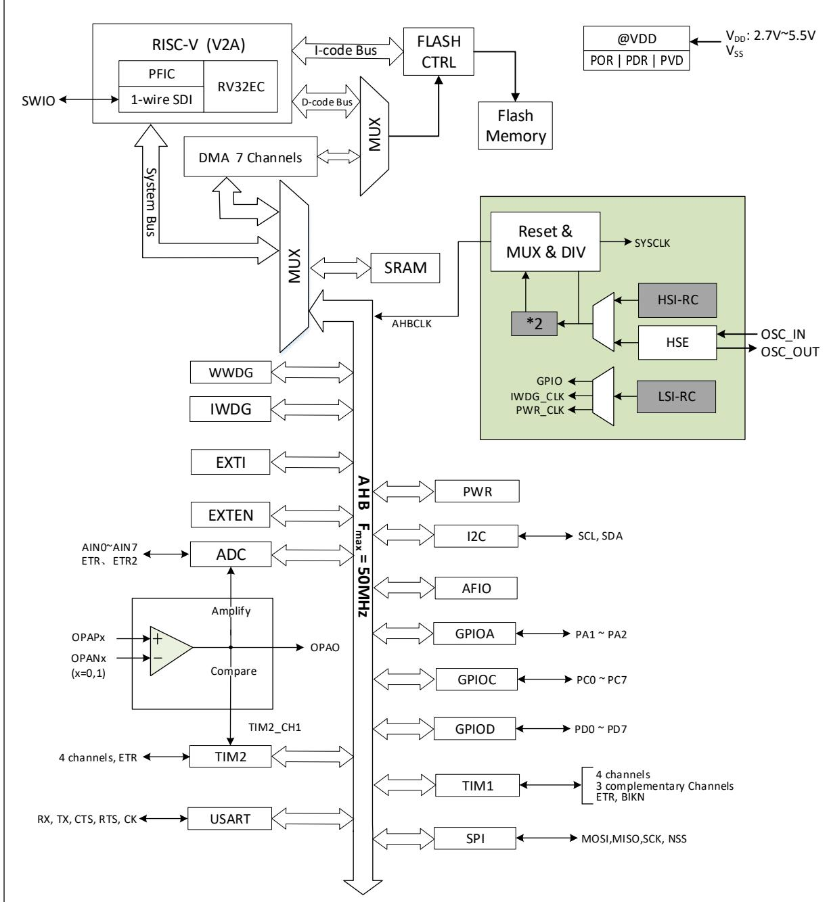  
图 1-1 CH32V003 系统框图

系统中设有：通用DMA控制器用以减轻CPU负担、提高效率；时钟树分级管理用以降低了外设总的运行功耗，同时还兼有数据保护机制，时钟安全系统保护机制等措施来增加系统稳定性。

$\bullet$ 指令总线(I-Code)将内核和FLASH指令接口相连，预取指在此总线上完成。$\bullet$ 数据总线(D-Code)将内核和FLASH数据接口相连，用于常量加载和调试。$\bullet$ 系统总线将内核和总线矩阵相连，用于协调内核、DMA、SRAM 和外设的访问。$\bullet$ DMA总线负责DMA的AHB主控接口与总线矩阵相连，该总线访问对象是FLASH数据、SRAM和外

# 设。

$\bullet$ 总线矩阵负责的是系统总线、数据总线、DMA总线、SRAM和AHB桥之间的访问协调。

# 1.2 存储器映像

CH32V003 系列产品都包含了程序存储器、数据存储器、内核寄存器和外设寄存器等等，它们都在一个4GB的线性空间寻址。

系统存储以小端格式存放数据，即低字节存放在低地址，高字节存放在高地址。

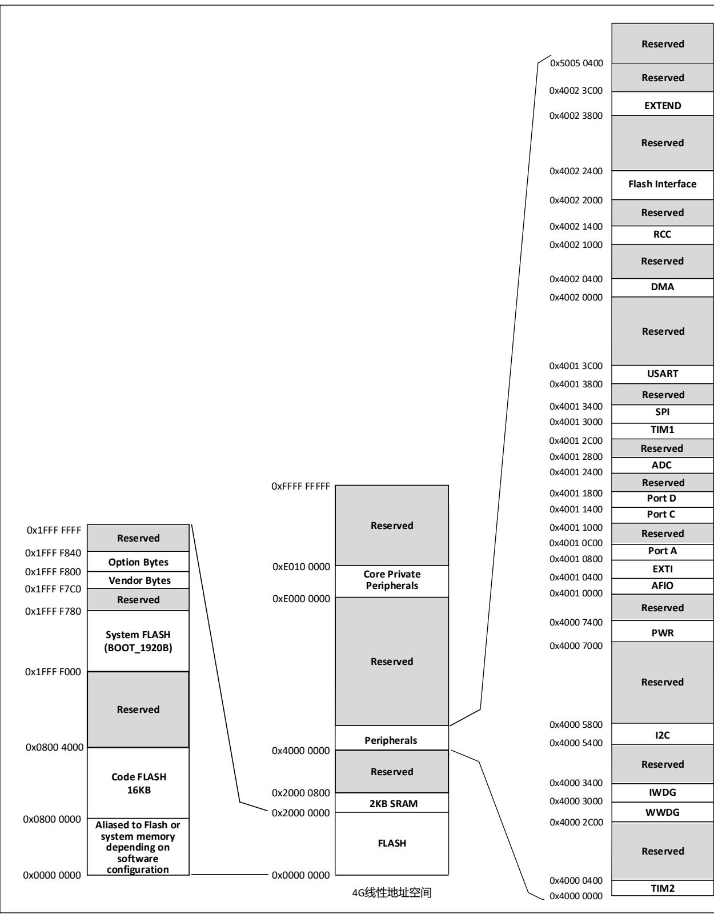  
图1-2 存储映像

# 1.2.1 存储器分配

内置2KB的SRAM，起始地址 $0 { \times } 2 0 0 0 0 0 0 0$ ，支持字节、半字(2字节)、全字(4字节)访问。  
内置16KB的程序闪存存储区(CodeFlash)，用于存储用户应用程序。  
内置1920B的系统存储器(bootloader)，用于存储系统引导程序（厂家固化自举加载程序）。  
内置 64B 空间用于厂商配置字存储，出厂前固化，用户不可修改。  
内置 64B 空间用于用户选择字存储。

# 第 2章 电源控制（PWR）

# 2.1 概述

系统工作电压 $\mathsf { V } _ { \mathsf { D } \mathsf { D } }$ 范围为 $2 . 7 { \sim } 5 . 5 \lor$ ，内置电压调节器提供内核所需的工作电源。

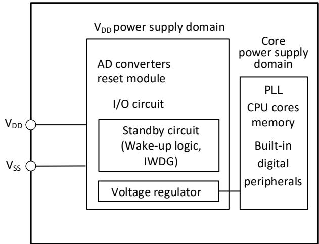  
图2-1 电源结构框图

# 2.2 电源管理

# 2.2.1 上电复位和掉电复位

系统内部集成了上电复位POR和掉电复位PDR电路，当芯片供电电压 $\mathsf { V } _ { \mathsf { D } \mathsf { D } }$ 低于对应门限电压时，系统被相关电路复位，无需外置额外的复位电路。上电门限电压 $V _ { P O R }$ 和掉电门限电压 $V _ { P D R }$ 的参数请参考对应的数据手册。

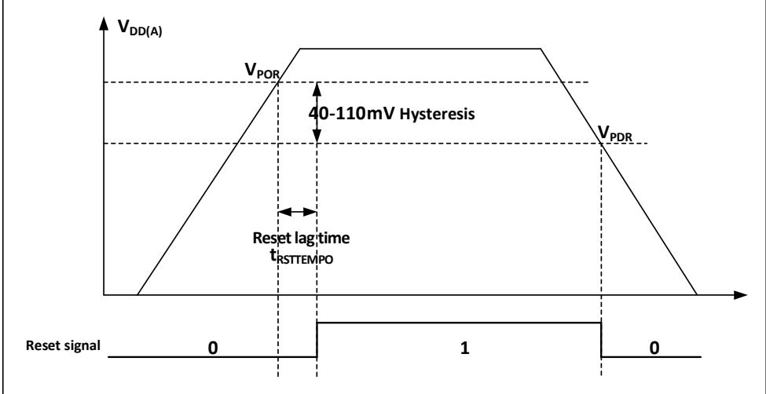  
图 2-2 POR 和 PDR 的工作示意图

# 2.2.2 可编程电压监测器

可编程电压监测器 PVD，主要被用于监控系统主电源的变化，与电源控制寄存器 PWR_CTLR 的PLS[2:0]所设置的门槛电压相比较，配合外部中断寄存器（EXTI）设置，可产生相关中断，以便及时通知系统进行数据保存等掉电前操作。

具体配置如下：

1）设置PWR_CTLR寄存器的PLS[2:0]域，选择要监控电压阈值。2） 可选的中断处理。PVD 功能内部连接 EXTI 模块的第 8 线的上升/下降边沿触发设置，开启此中断（配置EXTI），当 $\mathsf { V } _ { \mathsf { D } \mathsf { D } }$ 下降到PVD阈值以下或上升到PVD阈值之上时就会产生PVD中断。

3） 设置 PWR_CTLR 寄存器的 PVDE 位来开启 PVD 功能。

4）读取PWR_CSR状态寄存器的PVD0位可获取当前系统主电源与PLS[2:0]设置阈值关系，执行相应软处理。当 VDD 电压高于 PLS[2:0]设置阈值，PVD0 位置 0；当 VDD 电压低于 PLS[2:0]设置阈值，PVD0 位置 1。

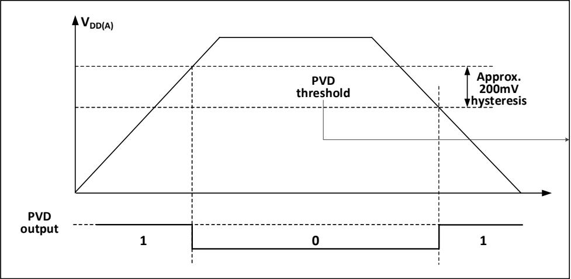  
图 2-3 PVD 的工作示意图

# 2.3 低功耗模式

在系统复位后，微控制器处于正常工作状态（运行模式），此时可以通过降低系统主频或者关闭不用外设时钟或者降低工作外设时钟来节省系统功耗。如果系统不需要工作，可设置系统进入低功耗模式，并通过特定事件让系统跳出此状态。

微控制器目前提供了2种低功耗模式，从处理器、外设、电压调节器等的工作差异上分为：

$\bullet$ 睡眠模式：内核停止运行，所有外设（包含内核私有外设）仍在运行。

$\bullet$ 待机模式：停止所有时钟，唤醒后，时钟切换到HSI。

表2-1 低功耗模式一览  

<table><tr><td>tt</td><td>i#a</td><td></td><td>Xf Af$+An</td><td>Ei$*</td></tr><tr><td rowspan="2">A#AR</td><td>WF1</td><td>1IF </td><td rowspan="2">At$i], # 1tb Af$Fc#n[]</td><td rowspan="2">E</td></tr><tr><td>WFE</td><td>A</td></tr><tr><td>1#tl</td><td>SLEEPDEEP  1 PDDS  1 WF1 g&amp; WFE</td><td>AWU 1NRST 31AJ11WDG . i 1IA , 1T1i.</td><td>i] HSE, HS1. PLL FA5Ni&amp;Af$</td><td>*i</td></tr></table>

SLEEPDEEP4i#J,CH32VO03PF1C SCTLR

# 2.3.1 低功耗配置选项

$\bullet$ WFI 和 WFE 方式

WFI：微控制器被具有中断控制器响应的中断源唤醒，系统唤醒后，将最先执行中断服务函数（微控制器复位除外）。

WFE：唤醒事件触发微控制器将退出低功耗模式。唤醒事件包括：

1）配置一个外部或内部的EXTI线为事件模式，此时无需配置中断控制器；  
2） 或者配置某个中断源，等效为 WFI 唤醒，系统优先执行中断服务函数；  
3） 或者配置 SLEEPONPEN 位，开启外设中断使能，但不开启中断控制器中的中断使能，系统唤醒后需要清除中断挂起位。SLEEPONEXIT启用：执行 WFI 或 WFE 指令后，微控制器确保所有待处理的中断服务退出后进入低功耗模式。不启用：执行 WFI 或 WFE 指令后，微控制器立即进入低功耗模式。

SEVONPEND

启用：所有中断或者唤醒事件都可以唤醒通过执行WFE进入的低功耗。  
不启用：只有在中断控制器中使能的中断或者唤醒事件可以唤醒通过执行WFE进入的低功耗。

# 2.3.2 睡眠模式（SLEEP）

此模式下，所有的IO引脚都保持他们运行模式下的状态，所有的外设时钟都正常，所以进入睡眠模式前，尽量关闭无用的外设时钟，以减低功耗。该模式唤醒所需时间最短。

进入：配置内核寄存器控制位 SLEEPDEEP $\mathtt { = 0 }$ ，电源控制寄存器 $\mathsf { P D D S = } 0$ ，执行 WFI 或 WFE，可选SEVONPEND 和 SLEEPONEXIT。

退出：任意中断或者唤醒事件。

# 2.3.3 待机模式（STANDBY）

待机模式是在内核的深睡眠模式（SLEEPDEEP）基础上结合了外设的时钟控制机制，并让电压调节器的运行处于更低功耗的状态。此模式高频时钟（HSE/HSI/PLL）域被关闭，SRAM 和寄存器内容保持，IO引脚状态保持。该模式唤醒后系统可以继续运行，HSI称为默认系统时钟。

如果正在进行闪存编程，直到对内存访问完成，系统才进入待机模式。

待机模式下可工作模块：独立看门狗（IWDG）、低频时钟（LSI）。

进入：配置内核寄存器控制位 SLEEPDEE $\mathsf { P } { = } 1$ ，电源控制寄存器的 $\mathsf { P D D S } = 1$ ，执行 WFI 或 WFE，可选 SEVONPEND 和 SLEEPONEXIT。

退出：

1）任意中断或事件(在外部中断寄存器中设置)。  
2）AWU事件，此唤醒后时钟切换到HSI，系统不复位。

# 2.3.4 自动唤醒（AWU）

可以实现无需外部中断的情况下自动唤醒。通过对时间基数进行编程，可周期性地从待机模式下唤醒。

可选择的内部低频128KHz时钟振荡器LSI作为自动唤醒计数时基。

在开启AWU中断功能时，需要把内部连接EXTI模块的第9线的上升/下降边沿触发进行设置，开启此中断（配置EXTI）。

# 2.4 寄存器描述

表2-2 PWR相关寄存器列表  

<table><tr><td></td><td>ijitttt</td><td>##it</td><td></td></tr><tr><td>R32_PWR_CTLR</td><td>0x40007000</td><td></td><td>0x00000000</td></tr><tr><td>R32_PWR_CSR</td><td>0x40007004</td><td>it$J/X$17</td><td>0x00000000</td></tr><tr><td>R32_PWR_AWUCSR</td><td>0x40007008</td><td></td><td>0x00000000</td></tr><tr><td>R32_PWR_AWUWR</td><td>0x4000700C</td><td></td><td>0x0000003f</td></tr><tr><td>R32_PWR_AWUPSC</td><td>0x40007010</td><td></td><td>0x00000000</td></tr></table>

# 2.4.1 电源控制寄存器（PWR_CTLR）

偏移地址： $0 \times 0 0$

<table><tr><td>31</td><td>30</td><td>29</td><td>28</td><td>27</td><td>26</td><td>25</td><td>24</td><td>23</td><td>22</td><td>21</td><td>20</td><td>19</td><td>18</td><td>17</td><td>16</td></tr><tr><td colspan="14">Reserved</td></tr><tr><td>15</td><td>14</td><td>13</td><td>12</td><td>11</td><td>10</td><td>9</td><td>8</td><td>7</td><td>6</td><td>5</td><td>4</td><td>3</td><td>2</td><td>1</td><td>0</td></tr><tr><td colspan="10">Reserved</td><td colspan="3">PLS[2: 0]</td><td>PVDE</td><td colspan="2">Reserved</td><td> PDDS Reser</td><td></td></tr></table>

<table><tr><td></td><td></td><td></td><td></td><td></td><td>ved</td></tr></table>

<table><tr><td>1</td><td>F</td><td>iji</td><td>##it</td><td></td></tr><tr><td>[31: 8]</td><td>Reserved</td><td>RO</td><td>1R</td><td>0</td></tr><tr><td>[7:5]PLS[2:0]</td><td></td><td>RW</td><td>PVD ;iii#FM+# 000: FHi 2.85V/T#i 2.7V; 001: FHi 3. 05V/ T#i 2.9V; 010: Hi 3.3V/Ti 3.15V; 011: Fi 3.5V/T#i 3.3V; 100: EHHi 3.7V/T#i 3.5V; 101: HHi 3.9V/T#i 3.7V; 110: FHi 4.1V/T#i 3.9V;</td><td>0</td></tr><tr><td>4</td><td>PVDE</td><td>RW</td><td>111: EJHi 4.4V/T$i 4.2V. i ;IAA. 1: F;Ae;</td><td>0</td></tr><tr><td>[3:2]</td><td>Reserved</td><td>RO</td><td>0: #AE. 1R.</td><td>0</td></tr><tr><td>1</td><td>PDDS</td><td>RW</td><td>fRT, tl/A#Ri1. 1: i#a#$t;</td><td>0</td></tr><tr><td>0</td><td>Reserved</td><td>RO</td><td>0: i##R. 1R.</td><td></td></tr></table>

# 2.4.2 电源控制/状态寄存器（PWR_CSR）

偏移地址： $0 \times 0 4$

<table><tr><td>31</td><td>30</td><td>29</td><td>28</td><td>27</td><td>26</td><td>25</td><td>24</td><td></td><td>23</td><td>22</td><td>21</td><td>20</td><td>19</td><td>18</td><td>17 16</td></tr><tr><td></td><td colspan="13">Reserved</td></tr><tr><td>15</td><td>14</td><td>13</td><td>12</td><td>11</td><td>10</td><td>9</td><td>8</td><td>7</td><td></td><td>6</td><td>5</td><td>4</td><td>3 2</td><td>1</td><td>0</td></tr><tr><td></td><td></td><td></td><td></td><td></td><td></td><td>Reserved</td><td></td><td></td><td></td><td></td><td></td><td></td><td> PVDO</td><td>Reserved</td><td></td></tr></table>

<table><tr><td>1i</td><td></td><td>ii</td><td>##it</td><td></td></tr><tr><td>[31: 3]</td><td>Reser ved</td><td>RO</td><td>1R.</td><td>0</td></tr><tr><td>2</td><td>PVDO</td><td>RO</td><td>PVD #W${.  PWR_CTLR $17] PVDE=1 Af, i. 1: VDD F VDDA 1F PLS[2:O]i&amp;EAJ PVD j1;</td><td>0</td></tr><tr><td>[1:0]</td><td>Reser ved</td><td> RO</td><td>0: VDD F VDDA F PLS[2:O]iEAJ PVD p1. R.</td><td>0</td></tr></table>

# 2.4.3 自动唤醒控制状态寄存器（PWR_AWUCSR）

偏移地址： $0 \times 0 8$

<table><tr><td>31</td><td>30</td><td>29</td><td>28</td><td>27</td><td>26</td><td>25</td><td>24</td><td>23</td><td>22</td><td>21</td><td></td><td>20</td><td>19</td><td>18</td><td>17</td><td>16</td></tr><tr><td></td><td></td><td></td><td></td><td></td><td></td><td></td><td></td><td>Reserved</td><td></td><td></td><td></td><td></td><td></td><td></td><td></td><td></td></tr></table>

<table><tr><td>15</td><td>14</td><td>13</td><td>12</td><td>11</td><td>10</td><td>9</td><td>8</td><td>7</td><td>6</td><td>5</td><td>4</td><td>3</td><td>2</td><td>1</td><td></td></tr><tr><td></td><td></td><td></td><td></td><td></td><td></td><td></td><td>Reserved</td><td></td><td></td><td></td><td></td><td></td><td></td><td>AWUEN</td><td>Reser ved</td></tr></table>

<table><tr><td>1</td><td></td><td>iji]</td><td>##it</td><td></td></tr><tr><td>[31:2]</td><td>Reservede</td><td>RO</td><td>1R.</td><td>0</td></tr><tr><td>1</td><td>AWUEN</td><td>RW</td><td>z1AE. 1: #TT O: Ft.</td><td>0</td></tr><tr><td>0</td><td>Reserved</td><td>RO</td><td>1R.</td><td>0</td></tr></table>

# 2.4.4 自动唤醒窗口比较值寄存器（PWR_AWUWR）

偏移地址： $0 \times 0 0$

<table><tr><td>31</td><td>30</td><td>29</td><td>28</td><td>27</td><td>26</td><td>25</td><td>24</td><td></td><td>23</td><td>22</td><td>21</td><td>20</td><td>19</td><td>18</td><td>17</td><td>16</td></tr><tr><td></td><td colspan="14">Reserved</td></tr><tr><td>15 14</td><td colspan="14">13 12</td><td>3 2 1</td><td colspan="2">AWUUWR [5: 0]</td></tr><tr><td>7 6</td><td colspan="14">11 10 9 8 Reserved</td></tr><tr><td colspan="14"></td></tr><tr><td></td><td colspan="14"></td></tr><tr><td></td><td colspan="14"></td></tr></table>

<table><tr><td>1</td><td></td><td>ii</td><td>##it</td><td></td></tr><tr><td>[31: 6]</td><td>Reserved</td><td>RO</td><td>1R.</td><td>0</td></tr><tr><td>[5: 0]</td><td>AWUWR [5: 0]</td><td>RW</td><td>AWu : AWU T AWU +1; AWU *Si+i+i#t$,i#) 5*3.</td><td>0x3f</td></tr></table>

# 2.4.5 自动唤醒分频因子寄存器（PWR_AWUPSC）

偏移地址： $0 \times 1 0$

<table><tr><td>31</td><td>30</td><td>29</td><td>28</td><td>27</td><td>26</td><td>25</td><td>24</td><td>23</td><td>22</td><td></td><td>21</td><td>20</td><td>19</td><td>18</td><td>17</td><td>16</td></tr><tr><td></td><td colspan="14">Reserved</td></tr><tr><td>15</td><td colspan="14">14</td><td></td><td colspan="2">AWUPSC[3: 0]</td></tr><tr><td></td><td></td><td>13</td><td>12</td><td>11</td><td>10</td><td>9 Reserved</td><td></td><td>8</td><td>7</td><td>6</td><td>5</td><td>4</td><td>3</td><td>2</td><td>1</td></tr><tr><td colspan="14"></td></tr></table>

<table><tr><td>1</td><td></td><td>iji]</td><td>##it</td><td></td></tr><tr><td>[31:4]</td><td>Reserved</td><td>RO</td><td>1RE.</td><td>0</td></tr><tr><td>[3:0]</td><td>AWUPSC [3 : 0]</td><td>RW 0100: 8 ; 101: 16 ;</td><td>i+#f#. 0000: T; 0001: T; 0010: 2 ; 0011: 4 ;</td><td>0</td></tr></table>

<table><tr><td></td><td></td><td>0111: 64 ; 1000: 128 ; 1001: 256 ; 1010: 512 ; 1011: 1024 ; 1100: 2048 5; 1101: 4096 ; 1110: 10240 ; 1111: 61440 5;</td></tr></table>

# 第 3 章 复位和时钟控制 （RCC）

控制器根据电源区域的划分以及应用中的外设功耗管理考虑，提供了不同的复位形式以及可配置的时钟树结构。此章节描述了系统中各个时钟的作用域。

# 3.1 主要特性

$\bullet$ 多种复位形式  
$\bullet$ 多路时钟源，总线时钟管理  
$\bullet$ 内置外部晶体振荡监测和时钟安全系统  
$\bullet$ 各外设时钟独立管理：复位、开启、关闭  
$\bullet$ 支持内部时钟输出

# 3.2 复位

控制器提供了2种复位形式：电源复位和系统复位。

# 3.2.1 电源复位

电源复位发生时，将复位所有寄存器。其产生条件包括：$\bullet$ 上电/掉电复位(POR/PDR 复位)

# 3.2.2 系统复位

系统复位发生时，将复位除了控制/状态寄存器RCC_RSTSCKR中的复位标志和所有寄存器。通过查看RCC_RSTSCKR寄存器中的复位状态标志位识别复位事件来源。

其产生条件包括：

$\bullet$ NRST引脚上的低电平信号（外部复位）  
$\bullet$ 窗口看门狗计数终止(WWDG复位)  
$\bullet$ 独立看门狗计数终止(IWDG复位)  
$\bullet$ 软件复位(SW复位)  
$\bullet$ 低功耗管理复位

窗口/独立看门狗复位：由窗口/独立看门狗外设定时器计数周期溢出触发产生，详细描述看其相应章节。

软件复位：CH32V003产品通过可编程中断控制器PFIC中的中断配置寄存器PFIC_CFGR的RSTSYS位置1复位系统或配置寄存器PFIC_SCTLR的SYSRST位置1复位系统柜，具体参考对应章节。

低功耗管理复位：通过将用户选择字节中的 STANDBY_RST 位置 1，将启用待机模式复位。这时执行了进入待机模式的过程后，将执行系统复位而不是进入待机模式。

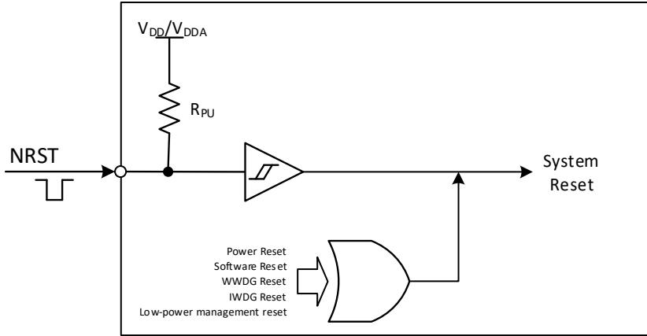  
图3-1 系统复位结构

# 3.3 时钟

# 3.3.1 系统时钟结构

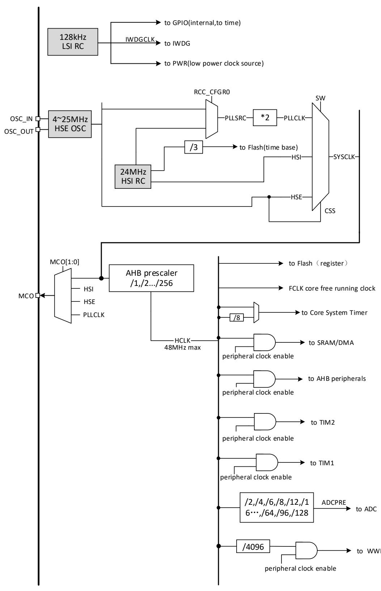  
图 3-2 CH32V003 时钟树框图

# 3.3.2 高速时钟（HSI/HSE）

HSI是系统内部24MHz的RC振荡器产生的高速时钟信号。HSI RC振荡器能够在不需要任何外部器件的条件下提供系统时钟。它的启动时间很短。HSI 通过设置 RCC_CTLR 寄存器中的 HSION 位被启动和关闭，HSIRDY位指示HSI RC振荡器是否稳定。系统默认HSION和HSIRDY置1（建议不要关闭）。如果设置了RCC_INTR寄存器的HSIRDYIE位，将产生相应中断。

$\bullet$ 出厂校准：制造工艺的差异会导致每个芯片的RC振荡频率不同，所以在芯片出厂前，会为每颗芯片进行 HSI 校准。系统复位后，工厂校准值被装载到 RCC_CTLR 寄存器的 HSICAL[7:0]中。  
$\bullet$ 用户调整：基于不同的电压或环境温度，应用程序可以通过RCC_CTLR寄存器里的HSITRIM[4:0]位来调整 HSI 频率。

j t HSE1 HS11i (A#)

HSE是外部的高速时钟信号，包括外部晶体/陶瓷谐振器产生或者外部高速时钟送入。$\bullet$ 外部晶体/陶瓷谐振器（HSE晶体）：外接 $4 - 2 5 M H z$ 外部振荡器为系统提供更为精确的时钟源。进一步信息可参考数据手册的电气特性部分。HSE晶体可以通过设置RCC_CTLR寄存器中的HSEON位被启动和关闭，HSERDY 位指示 HSE 晶体振荡是否稳定，硬件在 HSERDY 位置 1 后才将时钟送入系统。如果设置了RCC_INTR寄存器的HSERDYIE位，将产生相应中断。

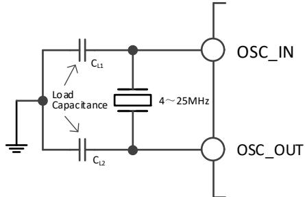  
图3-3 高速外部晶体电路

it3 #tR#$\bullet$ 外部高速时钟源（HSE旁路）：此模式从外部直接送入时钟源到OSC_IN引脚，OSC_OUT引脚悬空。最高支持 25MHz 频率。应用程序需在 HSEON 位为 0 情况下，置位 HSEBYP 位，打开 HSE 旁路功能，然后再置位HSEON位。

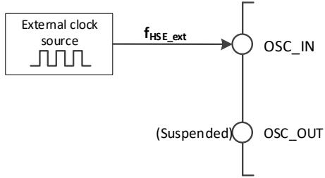  
图3-4 高速时钟源电路

# 3.3.3 低速时钟（LSI）

LSI 是系统内部约 128KHz 的 RC 振荡器产生的低速时钟信号。它可以在停机和待机模式下保持运行，为RTC时钟、独立看门狗和唤醒单元提供时钟基准。进一步信息可参考数据手册的电气特性部分。LSI可以通过设置RCC_RSTSCKR寄存器中的LSION位被启动和关闭，然后通过查询LSIRDY位检测 LSI RC 振荡是否稳定，硬件在 LSIRDY 位置 1 后才将时钟送入。如果设置了 RCC_INTR 寄存器的LSIRDYIE位，将产生相应中断。

# 3.3.4 PLL 时钟

通过配置 RCC_CFGR0 寄存器和扩展寄存器 EXTEN_CTR，内部 PLL 时钟可以选择 2 种时钟来源，这些设置必须在 PLL 被开启前完成，一旦 PLL 被启动，这些参数就不能被改动。设置 RCC_CTLR 寄存

器中的PLLON位被启动和关闭，PLLRDY位指示PLL时钟是否稳定，硬件在PLL位置1后才将时钟送入系统。如果设置了RCC_INTR寄存器的PLLRDYIE位、将产生相应中断。

PLL时钟来源：$\bullet$ HSI时钟送入$\bullet$ HSE时钟送入

# 3.3.5 总线/外设时钟

# 3.3.5.1 系统时钟（SYSCLK）

通过配置RCC_CFGR0寄存器SW[1:0]位配置系统时钟来源，SWS[1:0]指示当前的系统时钟源。

$\bullet$ HSI作为系统时钟$\bullet$ HSE作为系统时钟$\bullet$ PLL时钟作为系统时钟

控制器复位后，默认 HSI 时钟被选为系统时钟源。时钟源之间的切换必须在目标时钟源准备就绪后才会发生。

# 3.3.5.2 AHB 总线外设时钟（HCLK）

通过配置 RCC_CFGR0 寄存器的 HPRE[3:0]位，可以配置 AHB 总线的时钟。总线时钟决定了挂载在其下面的外设接口访问时钟基准。应用程序可以调整不同的数值，来降低部分外设工作时的功耗。

通过RCC_APB1PRSTR、RCC_APB2PRSTR寄存器中各个位可以复位不同的外设模块，将其恢复到初始状态。

通过 RCC_AHBPCENR、RCC_APB1PCENR、RCC_APB2PCENR 寄存器中各个位可以单独开启或关闭不同外设模块通讯时钟接口。使用某个外设时，首先需要开启其时钟使能位，才能访问其寄存器。

# 3.3.5.3 独立看门狗时钟

如果独立看门狗已经由硬件配置设置或软件启动，LSI 振荡器将被强制打开，并且不能被关闭。在LSI振荡器稳定后，时钟供应给IWDG。

# 3.3.5.4 时钟输出（MCO）

微控制器允许输出时钟信号到 MCO 引脚。在相应的 GPIO 端口寄存器配置复用推挽输出模式，通过配置 RCC_CFGR0 寄存器 MCO[2:0]位，可以选择以下 4 个时钟信号作为 MCO 时钟输出：

$\bullet$ 系统时钟(SYSCLK)输出  
$\bullet$ HSI 时钟输出  
$\bullet$ HSE时钟输出  
$\bullet$ PLL 时钟输出

# 3.3.6 时钟安全系统

时钟安全系统是控制器的一种运行保护机制，它可以在HSE时钟发送故障的情况下，切换到HSI时钟下，并产生中断通知，允许应用程序软件完成营救操作。

通过设置RCC_CTLR寄存器的CSSON位置1，激活时钟安全系统。此时，时钟监测器将在HSE振荡器启动（ $\mathtt { \backslash H S E R D Y = 1 }$ ）延迟后被使能，并在HSE时钟关闭后关闭。一旦系统运行过程中HSE时钟发生故障，HSE 振荡器将被关闭，时钟失效事件将被送到高级定时器(TIM1)的刹车输入端，并产生时钟安全中断，CSSF位置1，并且应用程序进入NMI不可屏蔽中断，通过置位CSSC位，可以清除CSSF位标志，可撤销NMI中断挂起位。

如果当前 HSE 作为系统时钟，或者当前 HSE 作为 PLL 输入时钟，PLL 作为系统时钟，时钟安全系统将在HSE故障时自动将系统时钟切换到HSI振荡器，并关闭HSE振荡器和PLL。

# 3.4 寄存器描述

表3-1 RCC相关寄存器列表  

<table><tr><td></td><td>iji@ttt</td><td>#it</td><td></td></tr><tr><td>R32_RCC_CTLR</td><td>0x40021000</td><td>A$#$$75 9</td><td>0x0000xx83</td></tr><tr><td>R32_RCC_CFGRO</td><td>0x40021004</td><td>A$+ 0</td><td>0x00000020</td></tr><tr><td>R32_RCC_INTR</td><td>0x40021008</td><td>A$+$7 </td><td>0x00000000</td></tr><tr><td>R32_RCC_APB2PRSTR</td><td>0x4002100C</td><td>APB2 i117</td><td>0x00000000</td></tr><tr><td>R32_RCC_APB1PRSTR</td><td>0x40021010</td><td>APB1 yi1$1</td><td>0x00000000</td></tr><tr><td>R32_RCC_AHBPCENR</td><td>0x40021014</td><td>AHB 5NiAf$+1ET7 </td><td>0x00000004</td></tr><tr><td>R32_RCC_APB2PCENR</td><td>0x40021018</td><td>APB2 5liA$1AET7</td><td>0x00000000</td></tr><tr><td>R32_RCC_APB1PCENR</td><td>0x4002101C</td><td>APB1 yliA$1AE$17</td><td>0x00000000</td></tr><tr><td>R32_RCC_RSTSCKR</td><td>0x40021024</td><td>t$J/$1</td><td>Ox0C000000</td></tr></table>

# 3.4.1 时钟控制寄存器（RCC_CTLR）

偏移地址： $0 \times 0 0$

<table><tr><td>31</td><td>30</td><td>29</td><td>28</td><td>27</td><td>26</td><td>25</td><td>24</td><td>23</td><td>22</td><td>21</td><td>20</td><td>19</td><td>18</td><td>17</td><td>16</td></tr><tr><td></td><td></td><td>Reserved</td><td></td><td></td><td></td><td>PLL RDY</td><td>PLL ON</td><td></td><td>Reserved</td><td></td><td></td><td>CSSON</td><td>HSE BYP</td><td>HSE RDY</td><td>HSEON</td></tr><tr><td>15 14 13</td><td colspan="3">12</td><td>11</td><td>10</td><td>9</td><td colspan="3">8 7 6</td><td>5</td><td>4</td><td>3</td><td>2</td><td>1</td><td>0</td></tr><tr><td></td><td colspan="7">HSICAL [7 : 0]</td><td></td><td></td><td>HSITRIM[4: 0]</td><td></td><td></td><td>Reser ved</td><td>HSI RDY</td><td>HS ION</td></tr></table>

<table><tr><td>1i</td><td></td><td></td><td>#it</td><td></td></tr><tr><td>[31: 26]</td><td>Reserved</td><td>RO</td><td>1R.</td><td>0</td></tr><tr><td>25</td><td>PLLRDY</td><td>RO</td><td>PLL A$$. 1: PLL A$$E; 0: PLL A$E.</td><td>0</td></tr><tr><td>24</td><td>PLLON</td><td>RW</td><td>PLL A$1AEt$J1. 1: 1E PLL A$; 0: i] PLL A$. ii: i#\t1I$Ett, u11; 0.</td><td>0</td></tr><tr><td>[23: 20]</td><td>Reserved</td><td>RO</td><td>1R.</td><td>0</td></tr><tr><td>19</td><td>CSSON</td><td>RW</td><td>A$1AE$J1. 1: 1AEA$ HSE(HSERDY 1), A1#JTAXf HSE AJAf$*;JIAE, E HSE F#A CSSFt NM1 ; HSEitF, A1#iJ Xf HSE AJAf$#J;WJIJAE. 0:i$</td><td>0</td></tr><tr><td>18</td><td>HSEBYP</td><td>RW</td><td>yli1$J1: 1: 3/i&lt;1B$); 0: T*/i.</td><td>0</td></tr><tr><td>17</td><td>HSERDY</td><td>RO</td><td>i: ut1# HSEON0 F5\.</td><td>0</td></tr></table>

<table><tr><td></td><td></td><td></td><td>1: 9 0: y$#. j: HSEON0, i6HSE 0.</td><td></td></tr><tr><td>16</td><td>HSEON</td><td>RW</td><td>yli1$#%1At$J. 1:1 HSE 0: i] HSE t%. ii: i#\#t1I#tt, u11; 0.</td><td>0</td></tr><tr><td>[15:8]</td><td>HSICAL [7 : 0]</td><td>RO</td><td>i*$t, z1. *+$i.</td><td>xxh</td></tr><tr><td>[7:3]</td><td>HSITRIM[4: 0]</td><td>RW</td><td>aiA] HSCAL[7:0]#E, tR#F;MA1iB HS1 RC #R%A *. i1 16, aJ HS1 i#J 24MHz1%; </td><td>10000</td></tr><tr><td>2</td><td>Reserved</td><td>RO</td><td>HS1CAL AJ1LiJ#J*J 60KHzo 1R.</td><td>0</td></tr><tr><td>1</td><td>HSIRDY</td><td>RO</td><td>j$(24MHz){). 1: BiA$ (24MHz) E; 0: i$ (24MHz) i. #HSION0, i6HS1 #0.</td><td>1</td></tr><tr><td>0</td><td>HSION</td><td>RW</td><td>FBi*A$ (24MHz) 1AEt$J1. 1: 1AE HSI #R O i HS1 t. HSE #$Af, i1i1# 1 *sP#B 24MHz H RC tR.</td><td>1</td></tr></table>

# 3.4.2 时钟配置寄存器 0（RCC_CFGR0）

偏移地址： $0 \times 0 4$

<table><tr><td>31</td><td>30 29</td><td>28</td><td>27 26</td><td>25</td><td>24</td><td>23</td><td>22</td><td>21</td><td>20</td><td>19</td><td>18</td><td>17 16</td></tr><tr><td></td><td>Reserved</td><td></td><td colspan="2">MCO [2: 0]</td><td></td><td></td><td></td><td>Reserved</td><td></td><td></td><td></td><td>PLL SRC</td></tr><tr><td>15 14</td><td colspan="3">13 12 11 10</td><td>9 8</td><td colspan="2">7 6</td><td>5</td><td>4</td><td>3</td><td>2</td><td>1</td><td>0</td></tr><tr><td></td><td>ADCPRE [4 : 0]</td><td></td><td>Reserved</td><td></td><td></td><td>HPRE [3: 0]</td><td></td><td></td><td>SwS[1:0]</td><td></td><td>SW[1: 0]</td></tr></table>

<table><tr><td>1i</td><td></td><td></td><td>##it</td><td></td></tr><tr><td>[31 : 27]</td><td>Reser ved</td><td>RO</td><td>1R.</td><td>0</td></tr><tr><td>[26:24]MC0[2:0]</td><td></td><td>RW</td><td>$ MCO 3A$$J. 0xx:i&amp;$$W; 100:(SYSCLK); 101: 24MHz  RC $(HS1); 110:9B#HSE);</td><td>0</td></tr><tr><td>[23 : 17]</td><td>Reserved</td><td>RO</td><td>111: PLL A$$. 1RE.</td><td>0</td></tr><tr><td>16</td><td>PLLSRC</td><td>RW</td><td>PLL a9$Af$#i (# PLL XiJfaJSA) o</td><td>0</td></tr></table>

<table><tr><td></td><td></td><td>1: HSE T5$i PLL; 0: HS1 TtiX PLL.</td><td></td></tr><tr><td>[15:11]ADCPRE[4:0] [10:8]Reserved</td><td>RW</td><td>ADC $*i$J. 000xx: AHBCLK 2 5&gt;#1&#x27;F ADC AJ$; 010xx: AHBCLK 4 5&gt;#1&#x27;F ADC $; 100xx: AHBCLK 6 5#1&#x27;F ADC $; 110xx:AHBCLK 8 5tF1&#x27;Fj ADC A$; 00100: AHBCLK 4 &gt;F1F ADC A$; 01100: AHBCLK 8 5#1F ADC $; 10100: AHBCLK 12 #F1F ADC $; 11100: AHBCLK 16 5$1F ADC A$; 00101: AHBCLK 8 5$1F ADC A$; 01101: AHBCLK 16 &gt;#1F ADC $; 10101: AHBCLK 24 $1F ADC A$; 11101: AHBCLK 32 $F1F ADC $; 00110: AHBCLK 16 #1F ADC $; 01110: AHBCLK 32 #1F ADC $; 10110: AHBCLK 48 &gt;#F1F ADC $; 11110: AHBCLK 64 $F1F ADC A$; 00111: AHBCLK 32 t1F ADC A$;</td><td>0</td></tr><tr><td></td><td>RW</td><td>01111: AHBCLK 64 $F1&#x27;F ADC A$; 10111: AHBCLK 96 t1F ADC A$; 11111: AHBCLK 128 tF1F ADC A$. : ADC $T 24MHz.</td><td></td></tr><tr><td>[7:4] HPRE[3: 0]</td><td>RW</td><td>1RE. AHB A$*i$$J. 0000: T; 0001: SYSCLK 2 ; 0010: SYSCLK 3 ; 0011: SYSCLK 4 5; 0100: SYSCLK 5 #; 0101: SYSCLK 6 5#; 0110: SYSCLK 7 ; 0111: SYSCLK 8 #; 1000: SYSCLK 2 #; 1001: SYSCLK 4 ; 1010: SYSCLK 8 5#; 1011: SYSCLK 16 5#; 1100: SYSCLK 32 #; 1101: SYSCLK 64 5#; 1110: SYSCLK 128 ; 1111: SYSCLK 256 #</td><td>0 0010 AHB#*iF##F1f, FF</td></tr></table>

<table><tr><td></td><td></td><td></td><td>01:$iHSE; 10:$iPLL; 11: TaJJ. i$*i.</td><td></td></tr><tr><td>[1: 0]</td><td>Sw [1 : 0]</td><td>RW</td><td>00: HS11F$; 01: HSE 1F$; 10: PLL 1FA$; 11: TaJ. ;: #17#T (CSSON=1) M Fo1$1EttiEstM1F323Af#A95l#B#;% HSE ##Aj,13$Ji HS11F32AJ$o</td><td>0</td></tr></table>

# 3.4.3 时钟中断寄存器（RCC_INTR）

偏移地址： $0 \times 0 8$

<table><tr><td>31</td><td> 30</td><td>29</td><td>28</td><td>27</td><td>26</td><td>25</td><td>24</td><td>23</td><td>22</td><td>21</td><td>20</td><td>19</td><td>18</td><td>17</td><td>16</td></tr><tr><td></td><td></td><td></td><td></td><td>Reserved</td><td></td><td></td><td></td><td>CS Sc</td><td></td><td>Reserved</td><td>PLL RDYC</td><td>HSE RDYC</td><td>HSI RDYC</td><td>Reser ved</td><td>LSI RDYC</td></tr><tr><td>15</td><td>14</td><td>13</td><td>12</td><td>11</td><td>10</td><td>9</td><td>8</td><td>7</td><td>6</td><td>5</td><td>4</td><td>3</td><td>2</td><td>1</td><td>0</td></tr><tr><td></td><td>Reserved</td><td></td><td>PLL</td><td>HSE RDYIERDYIERDYIE</td><td>HSI</td><td>Reserv ed</td><td>LSI RDYIE</td><td>CS SF</td><td>Reserved</td><td></td><td>PLL RDYF</td><td>HSE RDYF</td><td>HSI RDYF</td><td>Reser ved</td><td>LSI RDYF</td></tr></table>

<table><tr><td>1i</td><td></td><td>iji</td><td>##it</td><td></td></tr><tr><td>[31:24]</td><td>Reserved</td><td>RO</td><td>1R.</td><td>0</td></tr><tr><td>23</td><td>csSc</td><td>WO</td><td>$+F (CSSF). 1: CSSF ; 0: F1F.</td><td>0</td></tr><tr><td>[22:21]</td><td>Reserved</td><td>RO</td><td>1R.</td><td>0</td></tr><tr><td>20</td><td>PLLRDYC</td><td>WO</td><td>PLL jt+*F$1. 1: PLLRDYF F; 0: F1&#x27;F.</td><td>0</td></tr><tr><td>19</td><td>HSERDYC</td><td></td><td>HSE #$++1. 1:HSERDYF ; 0: FEa1F.</td><td>0</td></tr><tr><td>18</td><td>HS I RDYC</td><td>Wo</td><td>HS1 #%. 1:HS1RDYF F; O: F1F.</td><td>0</td></tr><tr><td>17</td><td>Reserved</td><td>RO</td><td>1R.</td><td>0</td></tr><tr><td>16</td><td>LSIRDYC</td><td>Wo</td><td>LS1 t+. 1: LS1RDYF ; 0: Faj1&#x27;F.</td><td>0</td></tr><tr><td>[15:13]</td><td>Reserved</td><td>RO</td><td>1R.</td><td>0</td></tr><tr><td>12</td><td>PLLRDYIE</td><td>RW</td><td>PLL ji+F1AE1. 1:1AE PLL t+; 0: i] PLL t+F.</td><td>0</td></tr></table>

<table><tr><td>11</td><td>HSERDYIE</td><td>RW</td><td>HSE i+1e1. 1: 1AE HSE 0 i] HSE t+.</td><td>0</td></tr><tr><td>10</td><td>HSIRDYIE</td><td>RW</td><td>HS1 jt+F1AE1. 1: 1AEHS1 +; O: i] HS1 jt+.</td><td>0</td></tr><tr><td>9</td><td>Reserved</td><td>RO</td><td>r. LS1 jt+F1AE1.</td><td>0</td></tr><tr><td>8</td><td>LSIRDYIE</td><td>RW</td><td>1: 1AE LS1 + 0: i] LSI t+. A$+1.</td><td>0</td></tr><tr><td>7</td><td>CSSF</td><td>RO</td><td>1: HSE A$, #$+ CSS1; 0: F. A1, #1 CSSC1.</td><td>0</td></tr><tr><td>[6:5]</td><td>Reserved</td><td>RO</td><td>1R. PLL A$$ +F.</td><td>0</td></tr><tr><td>4</td><td>PLLRDYF</td><td>RO</td><td>1: PLL A$$*+F; O: FC PLL A$$. A11, #1 PLLRDYC1 #.</td><td>0</td></tr><tr><td>3</td><td>HSERDYF</td><td>RO</td><td>HSE $+F. 1: HSE A$*; 0: FC HSE A$t. #, #1 HSERDYC|1.</td><td>0</td></tr><tr><td>2</td><td>HS I RDYF</td><td>RO</td><td>HS1 A$$+F+. 1: HS1 $$+; O: FC HS1 A$i. A1#1, #1# HSIRDYC{1.</td><td>0</td></tr><tr><td>1</td><td>Reserved</td><td>RO</td><td>1R. LS1 A$$+$.</td><td>0</td></tr><tr><td>0</td><td>LSIRDYF</td><td>RO</td><td>1: LS1 A$+; O: FC LS1 A$. 1#1, ##5 LSIRDYC11#.</td><td>0</td></tr></table>

# 3.4.4 APB2 外设复位寄存器 （RCC_APB2PRSTR）

偏移地址： $0 \times 0 0$

<table><tr><td>31</td><td>30</td><td>29</td><td>28</td><td>27</td><td>26</td><td>25</td><td>24</td><td>23</td><td>22</td><td>21</td><td>20</td><td>19</td><td>18</td><td>17</td><td>16</td></tr><tr><td colspan="14"></td></tr><tr><td>15</td><td>14</td><td>13</td><td>12</td><td>11</td><td>10</td><td>9</td><td>8</td><td colspan="2">Reserved 7</td><td>5</td><td>4</td><td>3</td><td>2</td><td>1</td><td>0</td></tr><tr><td>Rese rved</td><td>USART1 RST</td><td>Rese rved</td><td>SP11 RST</td><td>T IM1 RST</td><td>Reser ved</td><td>ADC1 RST</td><td colspan="2">Reserved</td><td>I OPD RST</td><td>1OPC RST</td><td>Reser ved</td><td>I OPA RST</td><td>Reser ved</td><td></td><td>AF10 RST</td></tr></table>

<table><tr><td>1</td><td></td><td></td><td>#it</td><td></td></tr><tr><td>[31 : 15]</td><td>Reserved</td><td>RO</td><td>RE</td><td></td></tr><tr><td>14</td><td>USART1RSTE</td><td>RW</td><td>USART1 [$].</td><td>0</td></tr></table>

<table><tr><td></td><td></td><td></td><td>1: ; O: FlF.</td><td></td></tr><tr><td>13</td><td>Reserved</td><td>RO</td><td>1R.</td><td>0</td></tr><tr><td>12</td><td>SP I1RST</td><td>RW</td><td>SP11 t[t$]. 1: ; O: F1FH.</td><td>0</td></tr><tr><td>11</td><td>TIM1RST</td><td>RW</td><td>T1M1 tt[#$]. 1: t; O: FF.</td><td>0</td></tr><tr><td>10</td><td>Reserved</td><td>RO</td><td>1R.</td><td>0</td></tr><tr><td>9</td><td>ADC1RST</td><td>RW</td><td>ADC1 tt1$]. 1: ; O: Fl.</td><td>0</td></tr><tr><td>[8:6]</td><td>Reserved</td><td>RO</td><td>1R.</td><td>0</td></tr><tr><td>5</td><td>IOPDRST</td><td>RW</td><td>10 A PD i#tt1$J. 1: ; O: FlF.</td><td>0</td></tr><tr><td>4</td><td>1OPCRST</td><td>RW</td><td>10 A PC i#tt1$]. 1: ; O: FlF.</td><td>0</td></tr><tr><td>3</td><td>Reserved</td><td>RO</td><td>1R.</td><td>0</td></tr><tr><td>2</td><td>IOPARST</td><td>RW</td><td>10 #J PA i[$]. 1: ; O: F1F.</td><td>0</td></tr><tr><td>1</td><td>Reserved</td><td>RO</td><td>1R.</td><td>0</td></tr><tr><td>0</td><td>AF IORST</td><td>RW</td><td>10 ##Att1$J. 1: ; O: FF.</td><td>0</td></tr></table>

# 3.4.5 APB1 外设复位寄存器（RCC_APB1PRSTR）

偏移地址： $0 \times 1 0$

<table><tr><td>31</td><td>30</td><td>29</td><td>28</td><td>27</td><td>26 25</td><td>24</td><td>23</td><td></td><td>22</td><td>21</td><td>20</td><td>19</td><td>18</td><td>17</td><td>16</td></tr><tr><td colspan="2">Reserved</td><td></td><td>PWR RST</td><td colspan="3"></td><td>Reserved</td><td></td><td></td><td>I2C1 RST</td><td colspan="3"></td><td>Reserved</td><td></td></tr><tr><td colspan="3">15 14 13</td><td>12 11</td><td colspan="10">10 9 8</td><td>1 0</td></tr><tr><td colspan="3">Reserved</td><td>WWDG RST</td><td colspan="10"></td><td>T I M2</td></tr></table>

<table><tr><td>1</td><td></td><td>iji8]</td><td>##it</td><td></td></tr><tr><td>[31: 29]</td><td>Reserved</td><td>RO</td><td>1R.</td><td>0</td></tr><tr><td>28</td><td>PWRRST</td><td>RW</td><td>$]. 1: ; O: FF.</td><td>0</td></tr><tr><td>[27: 22]</td><td>Reserved</td><td>RO</td><td>1R.</td><td>0</td></tr><tr><td>21</td><td>12C1RST</td><td>RW</td><td>I2C 1f1t$]. 1: ; O: F1FM.</td><td>0</td></tr><tr><td>[20:12]</td><td>Reserved</td><td>RO</td><td>1R.</td><td>0</td></tr><tr><td>11</td><td>WWDGRST</td><td>RW</td><td>1: ; O: FF.</td><td>0</td></tr><tr><td>[10:1]</td><td>Reserved</td><td>RO</td><td>1R.</td><td>0</td></tr><tr><td>0</td><td>T IM2RST</td><td>RW</td><td>2 t1$]. 1: ; O: F.</td><td>0</td></tr></table>

# 3.4.6 AHB 外设时钟使能寄存器（RCC_AHBPCENR）

偏移地址： $0 \times 1 4$

<table><tr><td>31</td><td>30</td><td>29</td><td>28</td><td>27</td><td>26</td><td>25</td><td>24</td><td></td><td>23</td><td>22</td><td>21</td><td>20</td><td>19</td><td>18</td><td>17 16</td></tr><tr><td></td><td></td></tr><tr><td>15 14</td><td>13</td><td>12</td><td>11</td><td>10</td><td>9</td><td></td><td>Reserved 8</td><td>7</td><td>6</td><td>5</td><td>4</td><td>3</td><td>1</td><td>0</td></tr><tr><td></td><td colspan="10"></td><td></td><td>2</td><td></td><td></td><td></td></tr><tr><td></td><td colspan="9">Reserved</td><td></td><td></td><td>SRAM EN</td><td>Rese rved</td><td>DMA1 EN</td></tr></table>

<table><tr><td>1i</td><td></td><td></td><td>##it</td><td></td></tr><tr><td>[31: 3]</td><td>Reser ved</td><td>RO</td><td>1R.</td><td>0</td></tr><tr><td>2</td><td>SRAMEN</td><td>RW</td><td>SRAM ttA$1E1. 1: #R, SRAMtA$T; O: #R, SRAM tA$i.</td><td>1</td></tr><tr><td>1</td><td>Reser ved</td><td>RO</td><td>1RE.</td><td>0</td></tr><tr><td>0</td><td>DMA1EN</td><td>RW</td><td>DMA1 tA$1AE1. 1: t$T; 0: t$.</td><td>0</td></tr></table>

# 3.4.7 APB2 外设时钟使能寄存器 （RCC_APB2PCENR）

偏移地址： $0 \times 1 8$

<table><tr><td>31</td><td>30</td><td>29</td><td>28</td><td>27</td><td>26</td><td>25</td><td>24</td><td>23</td><td>22</td><td>21</td><td>20</td><td>19</td><td>18</td><td>17</td><td>16</td></tr><tr><td colspan="14">Reserved</td></tr><tr><td>15</td><td>14</td><td>13</td><td>12</td><td>11</td><td>10</td><td>9</td><td>8</td><td colspan="2">7</td><td>5</td><td>4</td><td>3</td><td>2</td><td>1</td><td>0</td></tr><tr><td>Reser ved</td><td>USART1 EN</td><td>Reser ved</td><td>SP I1 EN</td><td>T IM1 EN</td><td>Reser ved</td><td>ADC1 EN</td><td colspan="2">Reserved</td><td>IOPD EN</td><td>IOPC EN</td><td>Reser ved</td><td>I OPA EN</td><td>Reser ved</td><td>AF10 EN</td></tr></table>

<table><tr><td>1</td><td></td><td></td><td>##it</td><td></td></tr><tr><td>[31: 15]</td><td>Reserved</td><td>RO</td><td>1R.</td><td>0</td></tr><tr><td>14</td><td>USART1EN</td><td>RW</td><td>USART1 $1AE1. 1: O: $.</td><td>0</td></tr><tr><td>13</td><td>Reserved</td><td>RO</td><td>1R.</td><td>0</td></tr><tr><td>12</td><td>SPI1EN</td><td>RW</td><td>SP11 A$1AE1. 1: 0: .</td><td>0</td></tr><tr><td>11</td><td>TIM1EN</td><td>RW</td><td>T1M1 tA$1AE1. 1: 0: t.</td><td>0</td></tr><tr><td>10</td><td>Reserved</td><td>RO</td><td>1R.</td><td>0</td></tr><tr><td>9</td><td>ADC1EN</td><td>RW</td><td>ADC1 tt$11 1: $ 0: $.</td><td>0</td></tr><tr><td>[8:6]</td><td>Reserved</td><td>RO</td><td>1R.</td><td>0</td></tr><tr><td>5</td><td>IOPDEN</td><td>RW</td><td>1O A PD #ttA$1A1. 1: 0: .</td><td>0</td></tr><tr><td>4</td><td>IOPCEN</td><td>RW</td><td>1O A PC #ttA$1A1. 1: $ 0</td><td>0</td></tr><tr><td>3</td><td>Reserved</td><td>RO</td><td>1R.</td><td>0</td></tr></table>

<table><tr><td>2</td><td>IOPAEN</td><td>RW</td><td>IO A PA i#tA$11. 1: $ 0 .</td><td>0</td></tr><tr><td>1</td><td>Reserved</td><td>RO</td><td>1R.</td><td>0</td></tr><tr><td>0</td><td>AFIOEN</td><td>RW</td><td>10 #$11. 1: $T; 0: $.</td><td>0</td></tr></table>

# 3.4.8 APB1 外设时钟使能寄存器 （RCC_APB1PCENR）

偏移地址： ${ 0 } { \times 1 } { 0 }$

<table><tr><td>31</td><td>30</td><td>29</td><td>28</td><td>27</td><td>26</td><td>25</td><td>24</td><td>23</td><td>22</td><td>21</td><td>20</td><td>19</td><td>18</td><td>17</td><td>16</td></tr><tr><td colspan="2">Reserved</td><td colspan="2">PWR EN</td><td colspan="4">Reserved</td><td></td><td></td><td>12C1 EN</td><td></td><td></td><td>Reserved</td><td></td><td></td></tr><tr><td>15</td><td colspan="3">14 13 12</td><td>11</td><td colspan="3">10 9 8</td><td>7</td><td>6</td><td>5</td><td>4</td><td>3</td><td>2</td><td>1</td><td>0</td></tr><tr><td colspan="3">Reserved</td><td>WWDG EN</td><td colspan="9"></td><td>T I M2 EN</td></tr></table>

<table><tr><td>1</td><td></td><td>iji8]</td><td>##it</td><td></td></tr><tr><td>[31 : 29]</td><td>Reserved</td><td>RO</td><td>1R.</td><td>0</td></tr><tr><td>28</td><td>PWREN</td><td>RW</td><td>i$1A1. 1: $ 0: .</td><td>0</td></tr><tr><td>[27: 22]</td><td>Reserved</td><td>RO</td><td>1R.</td><td>0</td></tr><tr><td>21</td><td>I2C1EN</td><td>RW</td><td>12C 1 t$11. 1: ; 0:.</td><td>0</td></tr><tr><td>[20:12]</td><td>Reserved</td><td>RO</td><td>1R.</td><td>0</td></tr><tr><td>11</td><td>WWDGEN</td><td>RW</td><td>ijA$1A1. 1 0: t.</td><td>0</td></tr><tr><td>[10:1]</td><td>Reservede</td><td>RO</td><td>1R.</td><td>0</td></tr><tr><td>0</td><td>T IM2EN</td><td>RW</td><td>2 $1. 1: ; 0: .</td><td>0</td></tr></table>

# 3.4.9 控制/状态寄存器 （RCC_RSTSCKR）

偏移地址： ${ 0 } { \times 2 4 }$

<table><tr><td>31</td><td>30</td><td>29</td><td>28</td><td>27</td><td>26</td><td>25</td><td>24</td><td>23</td><td>22</td><td>21</td><td>20</td><td>19</td><td>18</td><td>17</td><td>16</td></tr><tr><td>LPWR</td><td>WWDG</td><td>IWDG</td><td>SFT</td><td>POR</td><td>PIN</td><td>Reser</td><td>RMVF</td><td></td><td></td><td></td><td>Reserved</td><td></td><td></td><td></td><td></td></tr><tr><td>RSTF</td><td>RSTF</td><td>RSTF 13</td><td>RSTF 12</td><td>RSTF 11</td><td>RSTF 10</td><td>ved 9</td><td>8</td><td>7</td><td>6</td><td>5</td><td></td><td>3</td><td>2</td><td>1</td><td></td></tr><tr><td colspan="10">15 14 Reserved</td><td></td><td>4</td><td></td><td></td><td>LS1</td><td>0 LSION RDY</td></tr></table>

<table><tr><td>1</td><td></td><td>ii</td><td>t#it</td><td></td></tr><tr><td>31</td><td>LPWRRSTF</td><td>RO</td><td>1I#1. 1: #; 0: F#. 1h$1A1; #1#S RMVF 1</td><td>0</td></tr></table>

<table><tr><td>30</td><td>WWDGRSTF</td><td>4. i*. RO P.</td><td>1: ; O: Fi. 0 i1A1; #S RMVF ;</td></tr><tr><td>29</td><td>IWDGRSTF</td><td rowspan="2">RO #1#1$*. RO</td><td>1: ; 0: Fi. 0 jzij1A11; ##S RMVF </td></tr><tr><td>28</td><td>SFTRSTF</td><td>1: #; 0 0: F##. ##1A1#1; #1S RMVF 1#. T/#$.</td></tr><tr><td>27</td><td>PORRSTF</td><td>RO F.</td><td>1: /$; O: /. 1 /#$#1; #5 RMVF 9l#BFzJ1z (NRST3|A#J) $.</td></tr><tr><td>26</td><td>PINRSTF</td><td>RO P.</td><td>1: NRST3|A1; O: FENRST3IA1. 0 NRST31A1A1#1; $1SRMVF1</td></tr><tr><td>25</td><td>Reserved</td><td>RO *.</td><td>0 $].</td></tr><tr><td>24</td><td>RMVF</td><td>RW O: F1FM.</td><td>1: #*; 0</td></tr><tr><td>[23:2]</td><td>Reserved</td><td>RO *.</td><td>0 #B1it$ (LS1) $t$((1#() .</td></tr><tr><td>1</td><td>LSIRDY</td><td>RO</td><td>1: B1i$ (128KHz) E; 0 0:B1EiAf$ (128KHz) i##E. iLSION0, i3LS1 # 0.</td></tr><tr><td>0</td><td>LSION</td><td>RW</td><td>#B1i*A$ (LS1) 1AEt$J(i. 1: 1AE LS1 (128KHz) tR%; 0 i]LS1 128KHz) #R</td></tr></table>

j: #1t3;

# 第 4章 独立看门狗（IWDG）

系统设有独立看门狗（IWDG）用来检测逻辑错误和外部环境干扰引起的软件故障。IWDG时钟源来自于LSI，可独立于主程序之外运行，适用于对精度要求低的场合。

# 4.1 主要特征

$\bullet$ 12位自减型计数器  
$\bullet$ 时钟来源LSI分频，可以在低功耗模式下运行  
$\bullet$ 复位条件：计数器值减到0

# 4.2 功能说明

# 4.2.1 原理和用法

独立看门狗的时钟来源 LSI 时钟，其功能在停机和待机模式时仍能正常工作。当看门狗计数器自减到0时，将会产生系统复位，所以超时时间为（重装载值 $\cdot ^ { + 1 }$ ）个时钟。

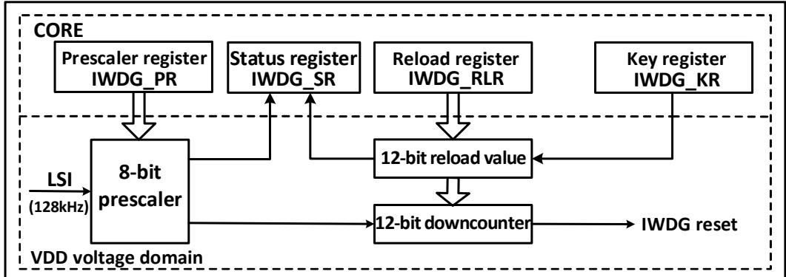  
图4-1 独立看门狗的结构框图

启动独立看门狗

系统复位后，看门狗处于关闭状态，向 IWDG_CTLR 寄存器写 $0 \times 0 0 0 0$ 开启看门狗，随后它不能再被关闭，除非发生复位。

如果在用户选择字开启了硬件独立看门狗使能位（IWDG_SW），在微控制器复位后将固定开启IWDG。

看门狗配置

看门狗内部是一个递减运行的 12 位计数器，当计数器的值减为 0 时，将发生系统复位。开启IWDG功能，需要执行下面几点操作：

1) 计数时基：IWDG时钟来源LSI，通过IWDG_PSCR寄存器设置LSI分频值时钟作为IWDG的计数时基。操作方法先向 IWDG_CTLR 寄存器写 $0 \times 5 5 5 5$ ，再修改 IWDG_PSCR 寄存器中的分频值。IWDG_STATR寄存器中的PVU位指示了分频值更新状态，在更新完成的情况下才可以进行分频值的修改和读出。  
2) 重装载值：用于更新独立看门狗中计数器当前值，并且计数器由此值进行递减。操作方法先向IWDG_CTLR 寄存器写 $0 \times 5 5 5 5$ ，再修改 IWDG_RLDR 寄存器设置目标重装载值。IWDG_STATR 寄存器中的RVU位指示了重装载值更新状态，在更新完成的情况下才可以进行IWDG_RLDR寄存器的修改和读出。

3) 看门狗使能：向IWDG_CTLR寄存器写 $0 \times 0 0 0 0$ ，即可开启看门狗功能。

4) 喂狗：即在看门狗计数器递减到0前刷新当前计数器值防止发生系统复位。向IWDG_CTLR寄存器写0xAAAA，让硬件将IWDG_RLDR寄存值更新到看门狗计数器中。此动作需要在看门狗功能开启后定时执行，否则会出现看门狗复位动作。

# 4.2.2 调试模式

系统进入调试模式时，可以由调试模块寄存器配置IWDG的计数器继续工作或停止。

# 4.3 寄存器描述

表 4-1 IWDG 相关寄存器列表  

<table><tr><td></td><td>ii@tttt</td><td>##it</td><td></td></tr><tr><td>R16_IWDG_CTLR</td><td>0x40003000</td><td>t$J$72</td><td>0x0000</td></tr><tr><td>R16_1WDG_PSCR</td><td>0x40003004</td><td></td><td>0x0000</td></tr><tr><td>R16_1WDG_RLDR</td><td>0x40003008</td><td></td><td>0x0FFF</td></tr><tr><td>R16_IWDG_STATR</td><td>0x4000300C</td><td></td><td>0x0000</td></tr></table>

# 4.3.1 IWDG 控制寄存器（IWDG_CTLR）

偏移地址： $0 \times 0 0$

<table><tr><td>15</td><td>14</td><td>13</td><td>12</td><td>11</td><td>10</td><td>9</td><td>8</td><td>7</td><td>6</td><td>5</td><td>4</td><td>3</td><td>2</td><td>1</td><td></td></tr><tr><td></td><td colspan="13">KEY[15:0]</td></tr></table>

<table><tr><td>1</td><td></td><td>i</td><td>##it</td><td></td></tr><tr><td>[15:0]KEY[15:0]</td><td></td><td>WO</td><td>1F$. OxAAAA:ARJ]. tA$ 1WDG_RLDR $17#1JJ ii+#+; Ox5555:ftiF12 R16_1WDG_PSCR F R16_1WDG RLDR $17; 0xCCCCzi7j,tnR 7 1#iJ (MFi7) JTixR#J.</td><td>0</td></tr></table>

# 4.3.2 分频因子寄存器（IWDG_PSCR）

偏移地址： $0 \times 0 4$

<table><tr><td>15</td><td>14</td><td>13</td><td>12</td><td>11</td><td>10</td><td></td><td></td><td></td><td></td><td>6</td><td>5</td><td>4</td><td>3</td><td>2</td><td>1</td><td></td></tr><tr><td></td><td></td><td>Reserved</td></tr></table>

<table><tr><td>1</td><td></td><td>iji]</td><td>##it</td><td></td></tr><tr><td>[15:3]</td><td>Reserved</td><td>RO</td><td>1R.</td><td>0</td><td rowspan="9"></td></tr><tr><td></td><td></td><td>0x5555. RW</td><td>1WDG A$$3, 12Xutg KEY S</td><td rowspan="6">0</td></tr><tr><td rowspan="4">[2:0]</td><td rowspan="4">PR[2:0]</td><td>000: 4; 001: 8 ;</td></tr><tr><td>010: 16 ; 011: 32 ;</td></tr><tr><td>100: 64 ; 101: 128 ;</td></tr><tr><td>110: 256; 111: 256 .</td></tr><tr><td></td><td>1WDG i+#f=LS1/$#o</td><td></td></tr><tr><td></td><td></td><td></td><td>i: i$it1J, #1R 1WDG_STATR #1</td><td></td></tr><tr><td></td><td></td><td></td><td></td><td></td></tr></table>

<table><tr><td></td><td></td><td></td><td>+#I PVU 13J 0, i.</td><td></td></tr></table>

# 4.3.3 重装载值寄存器（IWDG_RLDR）

偏移地址： $0 \times 0 8$

<table><tr><td>15</td><td>14 13</td><td>12</td><td>11</td><td>10</td><td>9</td><td>8</td><td></td><td>7</td><td></td><td>5</td><td>4</td><td>3</td><td>2</td><td>1</td><td></td></tr><tr><td></td><td>Reserved</td><td></td><td></td><td colspan="10">RL[11: 0]</td></tr></table>

<table><tr><td>1</td><td></td><td>i</td><td>#it</td><td></td></tr><tr><td>[15:12]</td><td>Reserved</td><td>RO</td><td>1R.</td><td>0</td></tr><tr><td>[11:0]RL[11:0]</td><td></td><td>RW</td><td>i#$12 KEY S 0x5555. ] KEY S 0xAAAA ,ltgA91l#iT 1###Ji+#+, i+#ixTtH i$it#. ii: i$Sit1AJ, #1R 1WDG_STATR #17 #+# RVU { 0, li$SttF.</td><td>FFFh</td></tr></table>

# 4.3.4 状态寄存器（IWDG_STATR）

偏移地址： $0 \times 0 0$

<table><tr><td>15</td><td>14 13</td><td></td><td>12</td><td>11</td><td>10</td><td>9</td><td>8</td><td>7</td><td>6</td><td>5</td><td>4</td><td>3</td><td>2</td><td>1</td><td></td></tr><tr><td></td><td></td><td></td><td></td><td></td><td></td><td></td><td>Reserved</td><td></td><td></td><td></td><td></td><td></td><td></td><td>RVU</td><td>PVU</td></tr></table>

<table><tr><td>1</td><td></td><td></td><td>##it</td><td></td></tr><tr><td>[15:2]</td><td>Reserved</td><td>RO</td><td>1R.</td><td>0</td></tr><tr><td>1</td><td>RVU</td><td>RO</td><td>0. 1: *$#E#i#; 0 *$#* (5LS1#) . j: *$1$1 1WDG_RLDRR## RVU1 i; 0 FfaJi$5iji].</td><td>0</td></tr><tr><td>0</td><td>PVU</td><td>RO</td><td>A$3#*1. 1 0. 1: A$*Ei#; 0: $*( 5LS1 ) . i: 7$ 1WDG PSCR# PVU1 t; 0 FfaJi$5iji].</td><td>0</td></tr></table>

#TR PWUt#stT, ut5tR1FJ}i\$2\*\$#1t)

# 第 5章 窗口看门狗 （WWDG）

窗口看门狗一般用来监测系统运行的软件故障，例如外部干扰、不可预见的逻辑错误等情况。它需要在一个特定的窗口时间（有上下限）内进行计数器刷新（喂狗），否则早于或者晚于这个窗口时间看门狗电路都会产生系统复位。

# 5.1 主要特征

$\bullet$ 可编程的7位自减型计数器$\bullet$ 双条件复位：当前计数器值小于 $0 \times 4 0$ ，或者计数器值在窗口时间外被重装载$\bullet$ 唤醒提前通知功能（EWI），用于及时喂狗动作防止系统复位

# 5.2 功能说明

# 5.2.1 原理和用法

窗口看门狗运行基于一个 7 位的递减计数器，其挂载在 AHB 总线下，计数时基 WWDG_CLK 来源（HCLK/4096）时钟的分频，分频系数在配置寄存器 WWDG_CFGR 中的 WDGTB[1:0]域设置。递减计数器处于自由运行状态，无论看门狗功能是否开启，计数器一直循环递减计数。如图 5-1 所示，窗口看门狗内部结构框图。

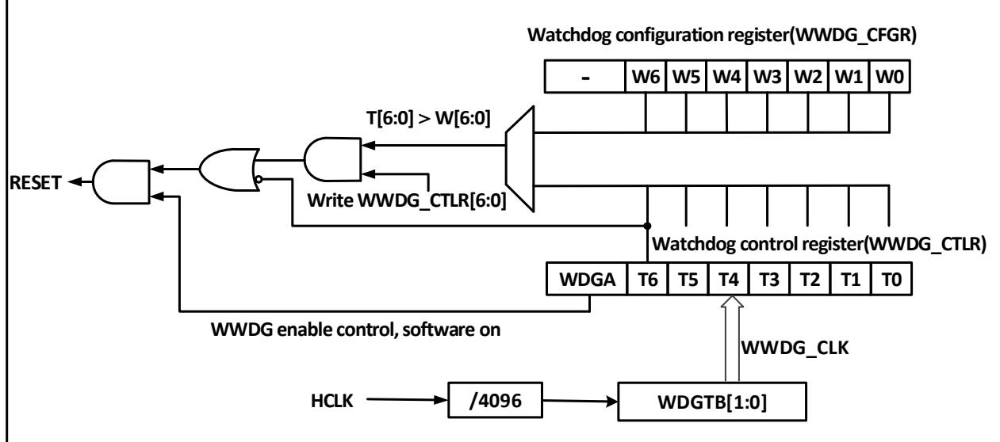  
图5-1 窗口看门狗结构框图

$\bullet$ 启动窗口看门狗

系统复位后，看门狗处于关闭状态，设置WWDG_CTLR寄存器的WDGA位能够开启看门狗，随后它不能再被关闭，除非发生复位。

jJliiRCC APB1PCENR1i] WWDG AJA#\*#1WWDG CLKi# iJ1   
i7I, i#iRCC APB1PRSTR\$11 WWDG , #1A1

$\bullet$ 看门狗配置

看门狗内部是一个不断循环递减运行的7位计数器，支持读写访问。使用看门狗复位功能，需要执行下面几点操作：

1） 计数时基：通过WWDG_CFGR寄存器的WDGTB[1:0]位域，注意要开启RCC单元的WWDG模块时钟。2） 窗口计数器：设置WWDG_CFGR寄存器的W[6:0]位域，此计数器由硬件用作和当前计数器比较使用，数值由用户软件配置，不会改变。作为窗口时间的上限值。

3） 看门狗使能：WWDG_CTLR寄存器WDGA位软件置1，开启看门狗功能，可以系统复位。

4） 喂狗：即刷新当前计数器值，配置WWDG_CTLR寄存器的T[6:0]位域。此动作需要在看门狗功能开启后，在周期性的窗口时间内执行，否则会出现看门狗复位动作。

$\bullet$ 喂狗窗口时间

如图5-2所示，灰色区域为窗口看门狗的监测窗口区域，其上限时间 $^ { \ t 2 }$ 对应当前计数器值达到窗口值 W[6:0]的时间点；其下限时间 t3 对应当前计数器值达到 ${ 0 } \times { 3 } { \mathsf F }$ 的时间点。此区域时间内$\tt t 2 < t < \tt t 3$ 可以进行喂狗操作（写T[6:0]），刷新当前计数器的数值。

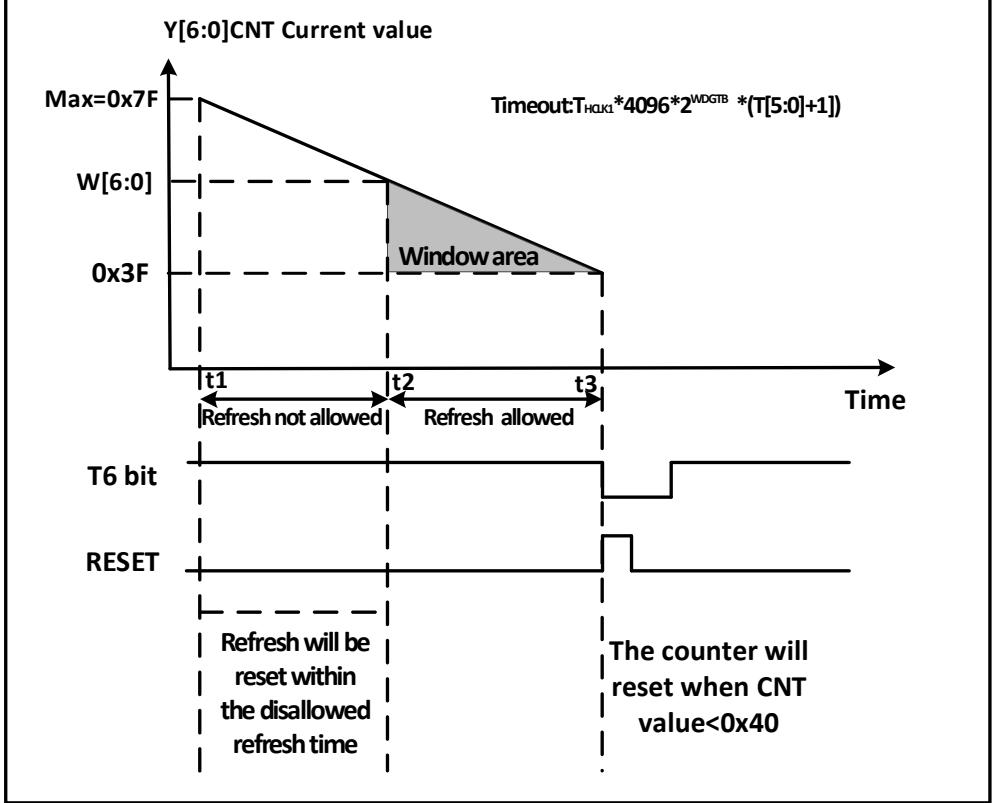  
图5-2 窗口看门狗的计数模式

$\bullet$ 看门狗复位：

1） 当没有及时喂狗操作，导致T[6:0]计数器的值由 $0 \times 4 0$ 变成 ${ 0 } \times { 3 } { \mathsf F }$ ，将出现“窗口看门狗复位”，产生系统复位。即 T6-bit 被硬件检测为 0，将出现系统复位。j i#T6-bit0,  #\$e  
2） 当在不允许喂狗时间内执行计数器刷新动作，即在 $\mathtt { t } 1 \leqslant \mathtt { t } \leqslant \mathtt { t } 2$ 时间内操作写T[6:0]位域，将出现“窗口看门狗复位”，产生系统复位。

# 提前唤醒

为了防止没有及时刷新计数器导致系统复位，看门狗模块提供了早期唤醒中断（EWI）通知。当计数器自减到 $0 \times 4 0$ 时，产生提前唤醒信号，EWIF标志置1，如果置位了EWI位，会同时触发窗口看门狗中断。此时距离硬件复位有1个计数器时钟周期（自减为 ${ 0 } \times { 3 } { \mathsf F }$ ），应用程序可在此时间内即时进行喂狗操作。

# 5.2.2 调试模式

系统进入调试模式时，可以由调试模块寄存器配置WWDG的计数器继续工作或停止。

# 5.3 寄存器描述

表 5-1 WWDG 相关寄存器列表  

<table><tr><td></td><td>iji@#ttt</td><td>#it</td><td></td></tr><tr><td>R16_WWDG_CTLR</td><td>0x40002C00</td><td>$$</td><td>0x007F</td></tr><tr><td>R16_WWDG_CFGR</td><td>0x40002C04</td><td></td><td>0x007F</td></tr><tr><td>R16_WWDG_STATR</td><td>0x40002C08</td><td></td><td>0x0000</td></tr></table>

# 5.3.1 WWDG 控制寄存器（WWDG_CTLR）

偏移地址： $0 \times 0 0$

<table><tr><td>15</td><td>14</td><td>13</td><td>12</td><td>11</td><td>10</td><td>9</td><td>8</td><td>7</td><td>6</td><td>5</td><td>4</td><td>3</td><td></td><td>2</td><td>1</td><td>0</td></tr><tr><td></td><td></td><td></td><td></td><td>Reserved</td><td></td><td></td><td></td><td></td><td>WDGA</td><td></td><td></td><td></td><td>T[6:0]</td><td></td><td></td><td></td></tr></table>

<table><tr><td>1i</td><td></td><td>iji]</td><td>##it</td><td></td></tr><tr><td>[15:8]</td><td>Reser ved</td><td>RO</td><td>1R.</td><td>0</td></tr><tr><td>7</td><td>WDGA</td><td>RW1</td><td>ij1A. 1: JAiA (a*() ; 0: #iIAE.</td><td>0</td></tr><tr><td>[6:0]</td><td>T[6:0]</td><td>RW</td><td>#1#S1 JT, 1Ri#1F; 0. 7 1i+, 4096*2&quot;DGTBHCLK 1 i Ox40J Ox3F , QJ T6 Hk 0Af, #i{.</td><td>7Fh</td></tr></table>

# 5.3.2 WWDG 配置寄存器（WWDG_CFGR）

偏移地址： $0 \times 0 4$

<table><tr><td>15</td><td>14</td><td>13</td><td>12</td><td>11</td><td>10</td><td>9</td><td>8</td><td>7</td><td>6</td><td>5</td><td>4</td><td>3</td><td>2</td><td>1</td><td></td></tr><tr><td></td><td></td><td>Reserved</td><td></td><td></td><td></td><td>EWI</td><td>WDGTB[1: 0]</td><td></td><td></td><td></td><td></td><td>w[6:0]</td><td></td><td></td><td></td></tr></table>

<table><tr><td>1i</td><td></td><td></td><td>##it</td><td></td></tr><tr><td>[15: 10]</td><td>Reserved</td><td>RO</td><td>1Rm.</td><td>0</td></tr><tr><td>9</td><td>EW1</td><td>RW1</td><td># 1, JiAi] 0x40 j# +. uRA11#i 0.</td><td>0</td></tr><tr><td>[8:7]</td><td>WDGTB[1 : 0]</td><td>RW</td><td>00: 1, i+# =HCLK/4096; 01: 2, i# = HCLK/4096/2; 10: 4, i+# = HCLK/4096/4; 11: 8, i = HCLK/4096/8.</td><td>0</td></tr><tr><td>[6: 0]</td><td>W[6: 0]</td><td>RW</td><td>7 *S# t#. A1FRAi#AF1 EF 0x3F Afi#1To</td><td>7Fh</td></tr></table>

# 5.3.3 WWDG 状态寄存器（WWDG_STATR）

偏移地址： $0 \times 0 8$

<table><tr><td>15</td><td>14 13</td><td></td><td>12</td><td>11</td><td>10</td><td>9</td><td>8</td><td>7</td><td></td><td>5</td><td>4</td><td>3</td><td>2</td><td>1</td><td></td></tr><tr><td></td><td></td></tr><tr><td>Reserved</td><td></td></tr></table>

<table><tr><td>1</td><td></td><td>iji]</td><td>t#it</td><td></td></tr><tr><td>[15:1]</td><td>Reserved</td><td>Wo</td><td>1R.</td><td>0</td></tr><tr><td>0</td><td>EWIF</td><td>RWO</td><td>if##Ji 0x40 Af, 1ti#1, i$#0, MT R EW1 *i, $#Ai Hl.</td><td>0</td></tr></table>

# 第 6章 中断和事件 （PFIC）

CH32V003 系 列 内 置 可 编 程 快 速 中 断 控 制 器 （ PFIC– Programmable Fast InterruptController），最多支持255个中断向量。当前系统管理了23个外设中断通道和4个内核中断通道，其他保留。

# 6.1 主要特征

# 6.1.1 PFIC 控制器

$\bullet$ 23个外设中断，每个中断请求都有独立的触发和屏蔽控制位，有专用的状态位$\bullet$ 可编程多级中断嵌套，最大嵌套深度2级，硬件压栈深度2级$\bullet$ 特有快速中断进出机制，硬件自动压栈和恢复$\bullet$ 特有免表VTF（Vector Table Free）中断响应机制，2路可编程直达中断向量地址

# 6.2 系统定时器

$\bullet$ CH32V003 系列产品

内核自带了一个32位加计数器（SysTick），支持HCLK或者HCLK/8作为时基，具有较高优先级，校准后可用于时间基准。

# 6.3 中断和异常的向量表

表 6-1 CH32V003 系列产品向量表  

<table><tr><td></td><td></td><td>*</td><td></td><td>#it</td><td>X#tt</td></tr><tr><td>0</td><td>-</td><td>-</td><td>-</td><td>-</td><td>0x00000000</td></tr><tr><td>1</td><td>-</td><td>-</td><td>-</td><td></td><td>0x00000004</td></tr><tr><td>2</td><td>-2</td><td></td><td>NMI</td><td>TaJ J$+T</td><td>0x00000008</td></tr><tr><td>3</td><td>-1</td><td>B</td><td>HardFault</td><td>*++</td><td>0x0000000C</td></tr><tr><td>4-11</td><td></td><td></td><td></td><td>1R</td><td>0x00000010- 0x0000002C</td></tr><tr><td>12</td><td>0</td><td></td><td>SysTick</td><td></td><td>0x00000030</td></tr><tr><td>13</td><td>-</td><td></td><td></td><td>1R</td><td>0x00000034</td></tr><tr><td>14</td><td>1</td><td>aJ </td><td>SW</td><td></td><td>0x00000038</td></tr><tr><td>15</td><td>-</td><td></td><td></td><td>1R</td><td>0x0000003C</td></tr><tr><td>16</td><td>2</td><td></td><td>WWDG</td><td>+</td><td>0x00000040</td></tr><tr><td>17</td><td>3</td><td></td><td>PVD</td><td>i;W+F(EXT1)</td><td>0x00000044</td></tr><tr><td>18</td><td>4</td><td>aJ </td><td>FLASH</td><td></td><td>0x00000048</td></tr><tr><td>19</td><td>5</td><td></td><td>RCC</td><td>1FAAf$+t$J+T</td><td>0x0000004C</td></tr><tr><td>20</td><td>6</td><td>aJ </td><td>EXT17_0</td><td>EXT1  0-7 </td><td>0x00000050</td></tr><tr><td>21</td><td>7</td><td>aJ 19</td><td>AWU</td><td>A+</td><td>0x00000054</td></tr><tr><td>22</td><td>8</td><td></td><td>DMA1_CH1</td><td>DMA1 i#j1 +f</td><td>0x00000058</td></tr><tr><td>23</td><td>9</td><td></td><td>DMA1_CH2</td><td>DMA1 ij 2 +</td><td>0x0000005C</td></tr><tr><td>24</td><td>10</td><td></td><td>DMA1_CH3</td><td>DMA1 ij 3 +</td><td>0x00000060</td></tr><tr><td>25</td><td>11</td><td>aJ </td><td>DMA1_CH4</td><td>DMA1 ij4 6+</td><td>0x00000064</td></tr><tr><td>26</td><td>12</td><td></td><td>DMA1_CH5</td><td>DMA1 jii 56+</td><td>0x00000068</td></tr></table>

<table><tr><td>27</td><td>13</td><td></td><td>DMA1_CH6</td><td>DMA1 ii 6F</td><td>0x0000006C</td></tr><tr><td></td><td></td><td></td><td></td><td></td><td></td></tr><tr><td>28</td><td>14</td><td></td><td>DMA1_CH7</td><td>DMA1 j#j 70F</td><td>0x00000070</td></tr><tr><td>29</td><td>15</td><td></td><td>ADC</td><td>ADC </td><td>0x00000074</td></tr><tr><td>30</td><td>16</td><td></td><td>I2C1_EV</td><td>12C1$#+</td><td>0x00000078</td></tr><tr><td>31</td><td>17</td><td></td><td>12C1_ER</td><td>12C1$#iR+</td><td>0x0000007C</td></tr><tr><td>32</td><td>18</td><td></td><td>USART1</td><td>USART1 </td><td>0x00000080</td></tr><tr><td>33</td><td>19</td><td></td><td>SPI1</td><td>SP11 </td><td>0x00000084</td></tr><tr><td>34</td><td>20</td><td></td><td>T IM1 BRK</td><td>T1M1J$+</td><td>0x00000088</td></tr><tr><td>35</td><td>21</td><td></td><td>T IM1UP</td><td>T1M1 $f+T</td><td>0x0000008C</td></tr><tr><td>36</td><td>22</td><td></td><td>T IM1TRG TIM1CC</td><td>TIM1 </td><td>0x00000090</td></tr><tr><td>37</td><td>23</td><td></td><td></td><td>T1M1 ##3tC$+T</td><td>0x00000094</td></tr><tr><td>38</td><td>24</td><td></td><td>T IM2</td><td>T 1m2 6+0</td><td>0x00000098</td></tr></table>

# 6.4 外部中断和事件控制器（EXTI）

# 6.4.1 概述

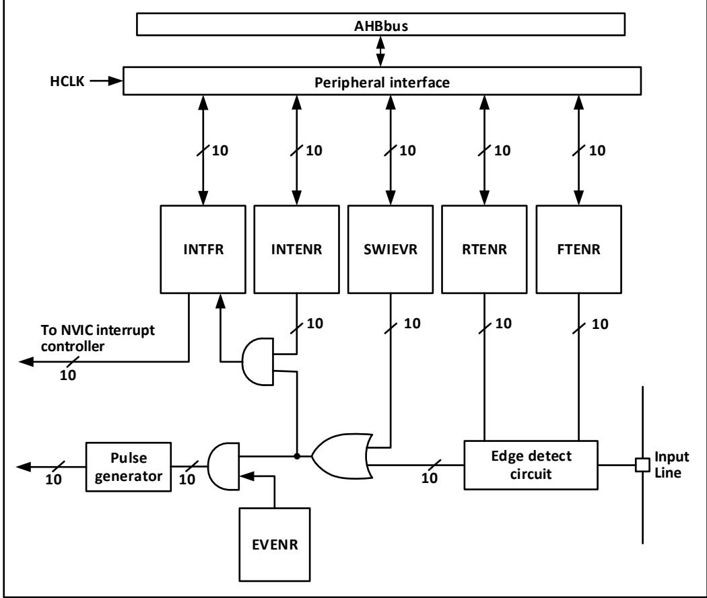  
图 6-1 外部中断(EXTI)接口框图

由图6-1可以看出，外部中断的触发源既可以是软件中断（SWIEVR）也可以是实际的外部中断通道，外部中断通道的信号会先经过边沿检测电路（edge detect circuit）的筛选。只要产生软件中断或外部中断信号其一，就会通过图中的或门电路输出给事件使能和中断使能两个与门电路，只要有中断被使能或事件被使能，就会产生中断或事件。EXTI的六个寄存器由处理器通过AHB接口访问。

# 6.4.2 唤醒事件说明

系统可以通过唤醒事件来唤醒由WFE指令引起的睡眠模式。唤醒事件通过以下两种配置产生：

$\bullet$ 在外设的寄存器里使能一个中断，但不在内核的 PFIC 里使能这个中断，同时在内核里使能SEVONPEND 位。体现在 EXTI 中，就是使能 EXTI 中断，但不在 PFIC 中使能 EXTI 中断，同时使能SEVONPEND位。当CPU从WFE中唤醒后，需要清除EXTI的中断标志位和PFIC挂起位。  
$\bullet$ 使能一个EXTI通道为事件通道，CPU从WFE唤醒后无需清除中断标志位和PFIC挂起位的操作。

# 6.4.3 说明

使用外部中断需要配置相应外部中断通道，即选择相应触发沿，使能相应中断。当外部中断通道上出现了设定的触发沿时，将产生一个中断请求，对应的中断标志位也会被置位。对标志位写 1可以清除该标志位。

使用外部硬件中断步骤：

1） 配置GPIO操作；  
2） 配置对应的外部中断通道的中断使能位（EXTI_INTENR）；  
3） 配置触发沿（EXTI_RTENR或EXTI_FTENR），选择上升沿触发、下降沿触发或双边沿触发；  
4） 在内核的 PFIC 中配置 EXTI 中断，以保证其可以正确响应。

使用外部硬件事件步骤：

1） 配置 GPIO 操作；  
2） 配置对应的外部中断通道的事件使能位（EXTI_EVENR）；  
3） 配置触发沿（EXTI_RTENR或EXTI_FTENR），选择上升沿触发、下降沿触发或双边沿触发。

使用软件中断/事件步骤：

1） 使能外部中断（EXTI_INTENR）或外部事件（EXTI_EVENR）；  
2） 如果使用中断服务函数，需要设置内核的PFIC里EXTI中断；  
3） 设置软件中断触发（EXTI_SWIEVR），即会产生中断。

# 6.4.4 外部事件映射

表 6-2 EXTI 中断映射  

<table><tr><td>y*F/$1</td><td>A$1##i</td></tr><tr><td>EXT10~EXT17</td><td>Px0~Px7 (x=A/C/D) ,1I(J- 10 #Ba]lJM5l Bf/$1#IAE,  AF1O_EXT1CR772.</td></tr><tr><td>EXT18</td><td>PVD$: .</td></tr><tr><td>EXT19</td><td>$1.</td></tr></table>

# 6.5 寄存器描述

# 6.5.1 EXTI 寄存器描述

表 6-3 EXTI 相关寄存器列表  

<table><tr><td></td><td>iji@#tt</td><td>#it</td><td></td></tr><tr><td>R32_EXTI_INTENR</td><td>0x40010400</td><td>+0F 1 A$ </td><td>0x00000000</td></tr><tr><td>R32_EXT1_EVENR</td><td>0x40010404</td><td></td><td>0x00000000</td></tr><tr><td>R32_EXT1_RTENR</td><td>0x40010408</td><td></td><td>0x00000000</td></tr><tr><td>R32_EXTI_FTENR</td><td>0x4001040C</td><td>T#1$</td><td>0x00000000</td></tr></table>

<table><tr><td>R32_EXTI_SWIEVR</td><td>0x40010410</td><td>$+$$</td><td>0x00000000</td></tr><tr><td>R32_EXTI_INTFR</td><td>0x40010414</td><td>+$1</td><td>0x0000XXXX</td></tr></table>

# 6.5.1.1 中断使能寄存器（EXTI_INTENR）

偏移地址： $0 \times 0 0$

<table><tr><td>31</td><td>30</td><td>29</td><td>28</td><td>27</td><td>26</td><td>25</td><td>24</td><td>23</td><td>22</td><td>21</td><td>20</td><td>19</td><td>18</td><td>17</td><td>16</td></tr><tr><td></td><td colspan="13">Reserved</td></tr><tr><td>15</td><td>14</td><td>13</td><td>12</td><td>11</td><td>10</td><td>9</td><td>8</td><td>7</td><td>6</td><td>5</td><td>4</td><td>3</td><td>2</td><td>1</td><td></td></tr><tr><td></td><td></td><td>Reserved</td><td></td><td></td><td></td><td>MR9</td><td>MR8</td><td>MR7</td><td>MR6</td><td>MR5</td><td>MR4</td><td>MR3</td><td>MR2</td><td>MR1</td><td>MRO</td></tr></table>

<table><tr><td>1i</td><td></td><td></td><td>##it</td><td></td></tr><tr><td>[31:10]</td><td>Reserved</td><td>RO</td><td>1R.</td><td>0</td></tr><tr><td>[9: 0]</td><td>MRx</td><td>RW</td><td>1AE5#+Fii x +Fi3. 1: 1i; 0: #*+i+.</td><td>0</td></tr></table>

# 6.5.1.2 事件使能寄存器（EXTI_EVENR）

偏移地址： $0 \times 0 4$

<table><tr><td>31</td><td>30</td><td>29</td><td>28</td><td>27</td><td>26</td><td>25</td><td>24</td><td>23</td><td>22</td><td>21</td><td>20</td><td>19</td><td>18</td><td>17</td><td>16</td></tr><tr><td colspan="14">Reserved</td></tr><tr><td>15</td><td>14</td><td>13</td><td>12</td><td>11</td><td>10</td><td>9</td><td>8</td><td>7</td><td>6</td><td>5</td><td>4</td><td>3</td><td>2</td><td>1</td><td></td></tr><tr><td></td><td></td><td>Reserved</td><td></td><td></td><td></td><td>MR9</td><td>MR8</td><td>MR7</td><td>MR6</td><td>MR5</td><td>MR4</td><td>MR3</td><td>MR2</td><td>MR1</td><td>MRO</td></tr></table>

<table><tr><td>1i</td><td></td><td></td><td>##it</td><td></td></tr><tr><td>[31:10]</td><td>Reserved</td><td>RO</td><td>1RE.</td><td>0</td></tr><tr><td>[9: 0]</td><td>MRx</td><td>RW</td><td>1AE9#B+Fij x A$1#i#13. 1: O: *i.</td><td>0</td></tr></table>

# 6.5.1.3 上升沿触发使能寄存器（EXTI_RTENR）

偏移地址： $0 \times 0 8$

<table><tr><td>31</td><td>30</td><td>29</td><td>28</td><td>27</td><td>26</td><td>25</td><td>24</td><td>23</td><td>22</td><td>21</td><td>20</td><td>19</td><td>18</td><td>17</td><td>16</td></tr><tr><td colspan="14">Reserved</td></tr><tr><td>15</td><td colspan="2">14 13</td><td>12</td><td>11</td><td>10</td><td>9</td><td>8</td><td>7</td><td>6</td><td>5</td><td>4</td><td>3</td><td>2</td><td>1</td><td>0</td></tr><tr><td></td><td colspan="2">Reserved</td><td colspan="2"></td><td></td><td>TR9</td><td>TR8</td><td>TR7</td><td>TR6</td><td>TR5</td><td>TR4</td><td>TR3</td><td>TR2</td><td>TR1</td><td>TRO</td></tr></table>

<table><tr><td>1i</td><td></td><td>ii</td><td>##it</td><td></td></tr><tr><td>[31 : 10]</td><td>Reserved</td><td>RO</td><td>r.</td><td>0</td></tr><tr><td>[9: 0]</td><td>TRx</td><td>RW</td><td>1AE9B+Fij x  EH. 1: 1AiEHH; 0: #tiH.</td><td>0</td></tr></table>

# 6.5.1.4 下降沿触发使能寄存器（EXTI_FTENR）

偏移地址： $0 \times 0 0$

<table><tr><td>31</td><td>30</td><td>29</td><td>28</td><td>27</td><td>26</td><td>25</td><td>24</td><td>23</td><td>22</td><td>21</td><td>20</td><td>19</td><td>18</td><td>17</td><td>16</td></tr><tr><td colspan="14">Reserved</td></tr><tr><td>15</td><td>14</td><td>13</td><td>12</td><td>11</td><td>10</td><td>9</td><td>8</td><td>7</td><td>6</td><td>5</td><td>4</td><td>3</td><td>2</td><td>1</td><td>0</td></tr><tr><td></td><td></td><td>Reserved</td><td></td><td></td><td></td><td>TR9</td><td>TR8</td><td>TR7</td><td>TR6</td><td>TR5</td><td>TR4</td><td>TR3</td><td>TR2</td><td>TR1</td><td>TRO</td></tr></table>

<table><tr><td>1i</td><td></td><td>ii]</td><td>#it</td><td></td></tr><tr><td>[31:10]</td><td>Reserved</td><td>RO</td><td>r.</td><td>0</td></tr><tr><td>[9: 0]</td><td>TRx</td><td>RW</td><td>1AE5l#B+Fij x  T#iA. 0: #HiT 1: 1AiT#A.</td><td>0</td></tr></table>

# 6.5.1.5 软中断事件寄存器（EXTI_SWIEVR）

偏移地址： $0 \times 1 0$

<table><tr><td>31</td><td>30</td><td>29</td><td>28</td><td>27</td><td>26</td><td> 25</td><td>24</td><td> 23</td><td>22</td><td>21</td><td>20</td><td>19</td><td>18</td><td>17</td><td>16</td></tr><tr><td></td><td colspan="13">Reser ved</td></tr><tr><td>15</td><td>14</td><td>13</td><td>12</td><td>11</td><td>10</td><td>9</td><td>8</td><td>7</td><td>6</td><td>5</td><td>4</td><td>3</td><td>2</td><td>1</td><td>0</td></tr><tr><td></td><td></td><td> Reserved</td><td></td><td></td><td></td><td>9</td><td>8</td><td>SWIERSWIERSWIERSWIERSWIERSWIERSWIERSWIERSWIERSWIER 7</td><td>6</td><td>5</td><td>4</td><td>3</td><td>2</td><td>1</td><td>O</td></tr></table>

<table><tr><td>1</td><td></td><td>i</td><td>##it</td><td></td></tr><tr><td>[31 : 10]</td><td>Reserved</td><td>RO</td><td>1R.</td><td>0</td></tr><tr><td>[9 : 0]</td><td>SWIERx</td><td>RW</td><td>1 i (EXT1_1NTFR) Xf(1, tAR*F1A (EXT1_1NTENR) g$1#1AE (EXT1_EVENR) FA, #+$#.</td><td>0</td></tr></table>

# 6.5.1.6 中断标志位寄存器（EXTI_INTFR）

偏移地址： $0 \times 1 4$

<table><tr><td>31</td><td>30</td><td>29</td><td>28</td><td>27</td><td>26</td><td>25</td><td>24</td><td>23</td><td>22</td><td>21</td><td>20</td><td>19</td><td>18</td><td>17</td><td>16</td></tr><tr><td></td><td colspan="13">Reserved</td></tr><tr><td>15</td><td>14</td><td>13</td><td>12</td><td>11</td><td>10</td><td>9</td><td>8</td><td>7</td><td>6</td><td>5</td><td>4</td><td>3</td><td>2</td><td>1</td><td>0</td></tr><tr><td></td><td></td><td>Reserved</td><td></td><td></td><td></td><td>1F9</td><td>IF8</td><td>1F7</td><td>IF6</td><td>IF5</td><td>IF4</td><td>IF3</td><td>1F2</td><td>IF1</td><td>IFO</td></tr></table>

<table><tr><td>1</td><td></td><td>i</td><td>#it</td><td></td></tr><tr><td>[31 : 10]</td><td>Reser ved</td><td>RO</td><td>1R.</td><td>0</td></tr><tr><td>[9 : 0]</td><td>IFx</td><td>W1</td><td>9#+. 51 a.</td><td>X</td></tr></table>

# 6.5.2 PFIC 寄存器描述

表 6-4 PFIC 相关寄存器列表  

<table><tr><td></td><td>i5i@#tt</td><td>##it</td><td></td></tr><tr><td>R32_PF1C_ISR1</td><td>0xE000E000</td><td>PF1CF1$1</td><td>0x0000000C</td></tr><tr><td>R32_PF1C_ISR2</td><td>OxE000E004</td><td>PF1C 1$ 2</td><td>0x00000000</td></tr><tr><td>R32_PFIC_IPR1</td><td>0xE000E020</td><td>PF1C2$11</td><td>0x00000000</td></tr><tr><td>R32_PF1C_IPR2</td><td>0xE000E024</td><td>PF1C 2$ 2</td><td>0x00000000</td></tr><tr><td>R32_PFIC_1THRESDR</td><td>0xE000E040</td><td>PF1C 1i21</td><td>0x00000000</td></tr><tr><td>R32_PF1C_CFGR</td><td>0xE000E048</td><td>PF1C2</td><td>0x00000000</td></tr><tr><td>R32_PF1C_G1SR</td><td>0xE000E04C</td><td>PF1C +$1</td><td>0x00000000</td></tr><tr><td>R32_PF1C_VTF 1DR</td><td>0xE000E050</td><td>PF1C VTF f 1D @2$1</td><td>0x00000000</td></tr><tr><td>R32_PF1C_VTFADDRROE</td><td>0xE000E060</td><td>PF1C VTF f O 1#3tbtT</td><td>0x00000000</td></tr><tr><td>R32_PF1C_VTFADDRR1</td><td>0xE000E064</td><td>PF1C VTF F1 #3tbt17</td><td>0x00000000</td></tr><tr><td>R32_PFIC_IENR1</td><td>0xE000E100</td><td>PF1C1Ai 1</td><td>0x00000000</td></tr><tr><td>R32_PFIC_IENR2</td><td>0xE000E104</td><td>PF1C 1i 2</td><td>0x00000000</td></tr><tr><td>R32_PF1C_1RER1</td><td>0xE000E180</td><td>PF1C 1 1</td><td>0x00000000</td></tr><tr><td>R32_PFIC_IRER2</td><td>0xE000E184</td><td>PF1C A7 2</td><td>0x00000000</td></tr><tr><td>R32_PF1C_IPSR1</td><td>0xE000E200</td><td>PF1CF2i$1z1</td><td>0x00000000</td></tr><tr><td>R32_PF1C_1PSR2</td><td>0xE000E204</td><td>PF1C F2i$1 2</td><td>0x00000000</td></tr><tr><td>R32_PF1C_1PRR1</td><td>0xE000E280</td><td>PF1C2$71</td><td>0x00000000</td></tr><tr><td>R32_PFIC_IPRR2</td><td>0xE000E284</td><td>PF1C 2 2</td><td>0x00000000</td></tr><tr><td>R32_PFIC_IACTR1</td><td>0xE000E300</td><td>PF1C$11</td><td>0x00000000</td></tr><tr><td>R32_PF1C_1ACTR2</td><td>0xE000E304</td><td>PF1CF$1 2</td><td>0x00000000</td></tr><tr><td>R32_PF1C_1PR1ORx</td><td>0xE000E400</td><td>PF1C </td><td>0x00000000</td></tr><tr><td>R32_PFIC_SCTLR</td><td>0xE000ED10</td><td>PF1C $1</td><td>0x00000000</td></tr></table>

i: 1.PF1C_1SR1\$i $o _ { x \mathcal { C } }$ RJ NM1F#i1AA 2. NMI. $E X C$ 2;Fit1 T#1A;\$Fit\*1F.

# 6.5.2.1 PFIC 中断使能状态寄存器 1（PFIC_ISR1）

偏移地址： $0 \times 0 0$

<table><tr><td>31</td><td>30</td><td>29</td><td>28</td><td>27</td><td>26</td><td>25</td><td>24</td><td>23</td><td>22</td><td>21</td><td>20</td><td>19</td><td>18</td><td>17</td><td>16</td></tr><tr><td colspan="14">INTENSTA[31 : 16]</td></tr><tr><td>15</td><td>14</td><td>13</td><td>12</td><td colspan="6">11 10 9</td><td>5</td><td>4</td><td>3</td><td>2</td><td>1</td><td>0</td></tr><tr><td>Reser</td><td></td><td>INTENReser</td><td>INTEN</td><td></td><td colspan="6">8</td><td></td><td>INTEN INTEN</td><td></td><td></td><td></td></tr><tr><td>ved</td><td>STA14</td><td>ved</td><td>STA12</td><td></td><td colspan="6">Reserved</td><td></td><td>STA3</td><td>STA2</td><td></td><td>Reserved</td></tr></table>

<table><tr><td>1i</td><td></td><td>iji]</td><td>##it</td><td></td></tr><tr><td>[31:16]</td><td>INTENSTA</td><td>RO</td><td>16#-31#1. 1: +; 0: +*.</td><td>0</td></tr><tr><td>15</td><td>Reserved</td><td>RO</td><td>1R.</td><td>0</td></tr><tr><td>14</td><td>INTENSTA</td><td>RO</td><td>14#1AEX. 1: +e; 0: +*.</td><td>0</td></tr></table>

<table><tr><td>13</td><td>Reserved</td><td>RO</td><td>1*.</td><td>0</td></tr><tr><td>12</td><td>INTENSTA</td><td>RO</td><td>12#1AEX. 1: +;</td><td>0</td></tr><tr><td>[11:4]</td><td>Reserved</td><td>RO</td><td>0: +*. 1R.</td><td>0</td></tr><tr><td>[3:2]</td><td>INTENSTA</td><td>RO</td><td>2#-3#+1AE|X. 1: e</td><td>0</td></tr><tr><td>[1:0]</td><td>Reserved</td><td>RO</td><td>0: *. IR.</td><td>0</td></tr></table>

# 6.5.2.2 PFIC 中断使能状态寄存器 2（PFIC_ISR2）

偏移地址： $0 \times 0 4$

<table><tr><td>31</td><td>30</td><td>29</td><td>28</td><td>27</td><td>26</td><td>25</td><td>24</td><td>23</td><td>22</td><td>21</td><td>20</td><td>19</td><td>18</td><td>17</td><td>16</td></tr><tr><td></td><td colspan="13">Reserved</td></tr><tr><td>15</td><td>14</td><td>13</td><td>12</td><td>11</td><td>10</td><td>9</td><td>8</td><td>7</td><td>6</td><td>5</td><td>4</td><td>3</td><td>2</td><td>1</td><td>0</td></tr><tr><td colspan="10"></td></tr><tr><td></td><td</table>

<table><tr><td>1</td><td></td><td>iji</td><td>##it</td><td></td></tr><tr><td>[31: 7]</td><td>Reserved</td><td>RO</td><td>1R.</td><td>0</td></tr><tr><td>[6:0]</td><td>INTENSTAE</td><td>RO</td><td>32#-38#1. 1: +e O: +*.</td><td>0</td></tr></table>

# 6.5.2.3 PFIC 中断挂起状态寄存器 1（PFIC_IPR1）

偏移地址： $_ { 0 \times 2 0 }$

<table><tr><td>31</td><td>30</td><td>29</td><td>28</td><td>27</td><td>26</td><td>25 24</td><td></td><td>23</td><td>22</td><td>21</td><td>20</td><td>19</td><td>18</td><td>17</td><td>16</td></tr><tr><td colspan="14">PENDSTA[31 : 16]</td></tr><tr><td>15</td><td>14</td><td>13</td><td>12</td><td colspan="6">11 10 9</td><td>6</td><td>4</td><td>3</td><td>2</td><td>1</td><td>0</td></tr><tr><td>ved</td><td>TA14</td><td>ved</td><td>ReserPENDS|ReserPENDS TA12</td><td colspan="6"></td><td>5</td><td></td><td>TA3</td><td>PENDSPENDS TA2</td><td></td><td>Reserved</td></tr></table>

<table><tr><td>1</td><td></td><td></td><td>##it</td><td></td></tr><tr><td>[31: 16]</td><td>PENDSTA</td><td>RO</td><td>16#-31#2. 1:+; 0 +*.</td><td>0</td></tr><tr><td>15</td><td>Reserved</td><td>RO</td><td>1R.</td><td>0</td></tr><tr><td>14</td><td>PENDSTA</td><td></td><td>14#2. 1: +C; 0: +**.</td><td>0</td></tr><tr><td>13</td><td>Reserved</td><td>RO</td><td></td><td>0</td></tr><tr><td>12</td><td>PENDSTA</td><td></td><td>12#2. 1:+; 0: +*.</td><td>0</td></tr></table>

<table><tr><td>[11:4]</td><td>Reserved</td><td>RO</td><td>1*.</td><td>0</td></tr><tr><td>[3: 2]</td><td>PENDSTA</td><td>RO</td><td>2#-3#2. 1: +e#; 0: +*.</td><td>0</td></tr><tr><td>[1: 0]</td><td>Reserved</td><td>RO</td><td>1R.</td><td>0</td></tr></table>

# 6.5.2.4 PFIC 中断挂起状态寄存器 2（PFIC_IPR2）

偏移地址： ${ 0 } { \times 2 4 }$

<table><tr><td>31</td><td>30</td><td>29</td><td>28</td><td>27</td><td>26</td><td>25</td><td>24</td><td>23</td><td>22</td><td>21</td><td>20</td><td>19</td><td>18</td><td>17</td><td>16</td></tr><tr><td></td><td colspan="13">Reserved</td></tr><tr><td>15</td><td>14</td><td>13</td><td>12</td><td>11</td><td>10</td><td>9</td><td>8</td><td>7</td><td>6</td><td>5</td><td>4</td><td>3</td><td>2</td><td>1</td><td>0</td></tr><tr><td colspan="10">Reserved</td></tr></table>

<table><tr><td>1i</td><td></td><td>iji</td><td>##it</td><td></td></tr><tr><td>[31: 7]</td><td>Reserved</td><td> RO</td><td>1*.</td><td>0</td></tr><tr><td>[6: 0]</td><td>PENDSTA</td><td>RO</td><td>32#-38#2. 1: ; 0 +*.</td><td>0</td></tr></table>

# 6.5.2.5 PFIC 中断优先级阈值配置寄存器（PFIC_ITHRESDR）

偏移地址： $0 \times 4 0$

31 30 29 28 27 26 25 24 23 22 21 20 19 18 17 16 15 14 13 12 11 10 9 8 7 6 5 4 3 2 1 0

<table><tr><td>Reserved</td><td>THRESHOLD [7 : 0]</td></tr></table>

<table><tr><td>1</td><td></td><td>ii]</td><td>##it</td><td></td></tr><tr><td>[31 : 8]</td><td>Reserved</td><td>RO</td><td>1R.</td><td>0</td></tr><tr><td>[7:0]</td><td>THRESHOLD [7 : 0]</td><td>RW</td><td>+i. 1Ti+t, 2AT#1+fARu$1 0 Af [7:6]: 1t; [5:0]: , 0, S.</td><td>0</td></tr></table>

# 6.5.2.6 PFIC 中断配置寄存器（PFIC_CFGR）

偏移地址： $0 \times 4 8$

<table><tr><td>31</td><td>30</td><td>29</td><td>28</td><td>27</td><td>26</td><td>25</td><td>24</td><td>23</td><td>22</td><td>21</td><td>20</td><td>19</td><td>18</td><td>17</td><td>16</td></tr><tr><td></td><td colspan="3"></td><td></td><td colspan="3">KEYCODE [15: 0]</td><td></td><td></td><td></td><td></td><td></td><td></td><td></td><td></td></tr><tr><td>15</td><td>14</td><td>13</td><td>12</td><td>11</td><td>10</td><td>9</td><td>8</td><td>7</td><td>6</td><td>5</td><td>4</td><td>3</td><td>2</td><td>1</td><td>0</td></tr><tr><td></td><td></td><td></td><td>Reserved</td><td></td><td></td><td></td><td></td><td>RSTSY s</td><td></td><td></td><td></td><td>Reserved</td><td></td><td></td><td></td></tr></table>

<table><tr><td>1i</td><td></td><td>iji8</td><td>##it</td><td></td></tr><tr><td>[31 : 16]</td><td>KEYCODE [15: 0]</td><td>wo</td><td>iii##A12, i### 0. KEY1 = 0xFA05; KEY2 = 0xBCAF;</td><td>0</td></tr><tr><td>[15:8]</td><td>Reser ved</td><td>RO</td><td>KEY3 = 0xBEEF. 1*.</td><td>0</td></tr><tr><td>7</td><td>RSTSYS</td><td>WO</td><td>F&amp;(i (tSKEY3) . ;# 0. 51, 50F. i: 5 PFIC_SCTLR #17# SYSRST 11F#*].</td><td>0</td></tr><tr><td>[6:0]</td><td>Reser ved</td><td>RO</td><td>1R.</td><td>0</td></tr></table>

# 6.5.2.7 PFIC 中断全局状态寄存器（PFIC_GISR）

偏移地址： $\mathtt { 0 } \mathtt { x } 4 0$

<table><tr><td>31</td><td>30</td><td>29</td><td>28</td><td>27</td><td>26</td><td>25</td><td>24</td><td>23</td><td>22</td><td>21</td><td>20</td><td>19</td><td>18</td><td>17</td><td>16</td></tr><tr><td></td><td colspan="13">Reserved</td></tr><tr><td>15</td><td>14</td><td>13</td><td>12</td><td>11</td><td>10</td><td>9</td><td>8</td><td>7</td><td>6</td><td>5</td><td>4</td><td>3</td><td>2</td><td>1</td><td>0</td></tr><tr><td></td><td></td><td>Reserved</td><td></td><td></td><td></td><td>GPEND STA</td><td>GACT STA</td><td></td><td></td><td></td><td>NESTSTA[7: 0]</td><td></td><td></td><td></td><td></td></tr></table>

<table><tr><td>1</td><td></td><td></td><td>##it</td><td></td></tr><tr><td>[31 : 10]</td><td>Reserved</td><td>RO</td><td>1R.</td><td>0</td></tr><tr><td>9</td><td>GPENDSTA</td><td>RO</td><td>A+Tt. 1: #; 0: i.</td><td>0</td></tr><tr><td>8</td><td>GACTSTA</td><td>RO</td><td>+T. 1: ; 0: i.</td><td>0</td></tr><tr><td>[7:0]</td><td>NESTSTA[7 : 0]</td><td>RO</td><td>+# 2# , 12. 0x03:$2; 0x01:$1; #1t i+.</td><td>0</td></tr></table>

# 6.5.2.8 PFIC VTF 中断 ID 配置寄存器（PFIC_VTFIDR）

偏移地址： $_ { 0 \times 5 0 }$

<table><tr><td>31</td><td>30</td><td>29</td><td>28</td><td>27</td><td>26</td><td>25</td><td>24</td><td>23</td><td>22</td><td>21</td><td>20</td><td>19</td><td>18</td><td>17</td><td>16</td></tr><tr><td></td><td colspan="13">Reserved</td></tr><tr><td>15</td><td>14</td><td>13</td><td>12</td><td>11</td><td>10</td><td>9</td><td>8</td><td>7</td><td>6</td><td>5</td><td>4</td><td>3</td><td>2</td><td>1</td><td>0</td></tr><tr><td colspan="10">VTFID1</td><td colspan="7">VTF IDO</td></tr></table>

<table><tr><td>1</td><td></td><td></td><td>#it</td><td></td></tr><tr><td>[31 : 16]</td><td>Reserved</td><td>RO</td><td>1R.</td><td>0</td></tr><tr><td>[15:8]</td><td>VTF ID1</td><td>RW</td><td>C VTF  1 F3.</td><td>0</td></tr><tr><td>[7:0]</td><td>VTF IDO</td><td>RW</td><td>C VTF +f O A+?.</td><td>0</td></tr></table>

# 6.5.2.9 PFIC VTF 中断 0 地址寄存器（PFIC_VTFADDRR0）

偏移地址： $0 \times 6 0$

<table><tr><td>31</td><td>30</td><td>29</td><td>28</td><td>27</td><td>26</td><td>25</td><td>24</td><td>23</td><td>22</td><td>21</td><td></td><td>20</td><td>19</td><td>18</td><td>17 16</td></tr><tr><td></td><td></td></tr><tr><td>15 14</td><td>13</td><td>12</td><td>11</td><td></td><td></td><td>9</td><td>ADDRO [31 : 16] 8</td><td>7</td><td>6</td><td>5</td><td>4</td><td>3</td><td>2 1</td><td></td><td>0</td></tr><tr><td></td><td></td><td></td><td></td><td></td><td>10</td><td></td><td>ADDRO[15: 1]</td><td></td><td></td><td></td><td></td><td></td><td></td><td></td><td>VTFOEN</td></tr></table>

<table><tr><td>1</td><td></td><td>iji</td><td>##it</td><td></td></tr><tr><td>[31 : 1]</td><td>ADDRO [31 : 1]</td><td>RW</td><td>VTF +f 0 ARttl bit[31:1], bit0 0.</td><td>0</td></tr><tr><td>0</td><td>VTFOEN</td><td>RW</td><td>VTF f O1E. 1:  VTF O; 0: i.</td><td>0</td></tr></table>

# 6.5.2.10 PFIC VTF 中断 1 地址寄存器（PFIC_VTFADDRR1）

偏移地址： $0 \times 6 4$

<table><tr><td>31</td><td>30</td><td>29</td><td>28</td><td>27</td><td>26</td><td>25</td><td>24</td><td>23</td><td>22</td><td>21</td><td></td><td>20</td><td>19</td><td>18</td><td>17 16</td></tr><tr><td></td><td>ADDR1 [31 : 16]</td></tr><tr><td>15 14</td><td>13</td><td>12</td><td>11</td><td></td><td></td><td>9</td><td>8</td><td>7</td><td>6</td><td>5</td><td>4</td><td>3</td><td>2 1</td><td></td><td>0</td></tr><tr><td></td><td></td><td></td><td></td><td></td><td>10</td><td></td><td>ADDR1 [15: 1]</td><td></td><td></td><td></td><td></td><td></td><td></td><td></td><td>VTF1EN</td></tr></table>

<table><tr><td>1</td><td></td><td>i</td><td>##it</td><td></td></tr><tr><td>[31:1]</td><td>ADDR1 [31 : 1]</td><td>RW</td><td>VTF  1 ARTtttl bit[31:1], bit0 t 0.</td><td>0</td></tr><tr><td>0</td><td>VTF1EN</td><td>RW</td><td>VTF f 1 1AE1. 1: VTF1i;0 i.</td><td>0</td></tr></table>

# 6.5.2.11 PFIC 中断使能设置寄存器 1（PFIC_IENR1）

偏移地址： $0 \times 1 0 0$

<table><tr><td>31</td><td>30</td><td>29</td><td>28</td><td>27</td><td>26 25</td><td></td><td>24</td><td>23</td><td>22</td><td>21</td><td></td><td>20</td><td>19</td><td>18</td><td>17</td><td>16</td></tr><tr><td colspan="13">INTEN[31 : 16]</td></tr><tr><td>15</td><td>14</td><td>13</td><td>12 11</td><td>10</td><td>9</td><td></td><td>8</td><td>7</td><td>6</td><td></td><td>5</td><td>4</td><td>3</td><td>2</td><td>1</td><td>0</td></tr><tr><td>Reser ved</td><td>INTEN14</td><td>Rese rved</td><td>INTEN12</td><td>Reserved</td><td colspan="10"></td><td></td><td></td><td></td></tr></table>

<table><tr><td>1</td><td></td><td>iji</td><td>##it</td><td></td></tr><tr><td>[31:16]</td><td>INTEN</td><td></td><td>16#-31#1$J. 1 +AE 0: F.</td><td>0</td></tr><tr><td>15</td><td>Reserved</td><td>RO</td><td>1R.</td><td>0</td></tr><tr><td>14</td><td>INTEN</td><td></td><td>14#F1$J.</td><td>0</td></tr></table>

<table><tr><td></td><td></td><td></td><td>1: E O: F.</td><td></td></tr><tr><td>13</td><td>Reserved</td><td>RO</td><td>1R.</td><td>0</td></tr><tr><td>12</td><td>INTEN</td><td>wo</td><td>12#F1AE$J. 1 +E; O: F.</td><td>0</td></tr><tr><td>[11:0]</td><td>Reserved</td><td>RO</td><td>1R.</td><td>0</td></tr></table>

# 6.5.2.12 PFIC 中断使能设置寄存器 2（PFIC_IENR2）

偏移地址： $0 \times 1 0 4$

<table><tr><td>31</td><td>30</td><td>29</td><td>28</td><td>27</td><td>26</td><td>25</td><td>24</td><td>23</td><td>22</td><td>21</td><td>20</td><td>19</td><td>18</td><td>17</td><td>16</td></tr><tr><td></td><td colspan="13">Reserved</td></tr><tr><td>15</td><td>14</td><td>13</td><td>12</td><td>11</td><td>10</td><td>9</td><td>8</td><td>7</td><td>6</td><td>5</td><td>4</td><td>3</td><td>2</td><td>1</td><td>0</td></tr><tr><td colspan="10">Reserved</td><td colspan="7">INTEN [38 : 32]</td></tr></table>

<table><tr><td>1</td><td></td><td>ii</td><td>##it</td><td></td></tr><tr><td>[31:7]</td><td>Reserved</td><td>RO</td><td>1R.</td><td>0</td></tr><tr><td>[6:0]</td><td>INTEN</td><td>WO</td><td>32#-38#1$J. 1: +E; O: F.</td><td>0</td></tr></table>

# 6.5.2.13 PFIC 中断使能清除寄存器 1（PFIC_IRER1）

偏移地址： $\mathtt { 0 } \times 1 8 0$

<table><tr><td>31</td><td>30</td><td>29</td><td>28</td><td>27</td><td>26</td><td>25</td><td>24</td><td>23</td><td>22</td><td>21</td><td></td><td>20</td><td>19</td><td>18</td><td>17</td><td>16</td></tr><tr><td colspan="13">INTRSET [31 : 16]</td></tr><tr><td>15</td><td>14</td><td>13</td><td>12 11</td><td>10</td><td>9</td><td></td><td>8</td><td>7</td><td>6</td><td></td><td>5</td><td>4</td><td>3</td><td>2</td><td>1</td><td>0</td></tr><tr><td></td><td>Reser| INTRSET|Rese</td><td></td><td>INTRSET1</td><td colspan="10"></td><td></td><td></td><td></td><td></td></tr><tr><td>ved</td><td>14</td><td>rved</td><td>2</td><td colspan="10">Reserved</td><td></td><td></td><td></td><td></td></tr></table>

<table><tr><td>1i</td><td></td><td></td><td>##it</td><td></td></tr><tr><td>[31:16]</td><td>INTRSET</td><td>wo</td><td>16#-31#i$J. 1; 0: F.</td><td>0</td></tr><tr><td>15</td><td>Reserved</td><td>RO</td><td>1*.</td><td>0</td></tr><tr><td>14</td><td>INTRSET</td><td>wo</td><td>14#iJ$J. 1: O: F.</td><td>0</td></tr><tr><td>13</td><td>Reserved</td><td>RO</td><td>1R.</td><td>0</td></tr><tr><td>12</td><td>INTRSET</td><td>wo</td><td>12#*i$J. 1:+ 0: F.</td><td>0</td></tr><tr><td>[11:0]</td><td>Reserved</td><td>RO</td><td>1RE.</td><td>0</td></tr></table>

# 6.5.2.14 PFIC 中断使能清除寄存器 2（PFIC_IRER2）

偏移地址： $0 \times 1 8 4$

<table><tr><td>31</td><td>30</td><td>29</td><td>28</td><td>27</td><td>26</td><td>25</td><td>24</td><td>23</td><td>22</td><td>21</td><td>20</td><td>19</td><td>18</td><td>17</td><td>16</td></tr><tr><td></td><td colspan="13">Reserved</td></tr><tr><td>15</td><td>14</td><td>13</td><td>12</td><td>11</td><td>10</td><td>9</td><td>8</td><td>7</td><td>6</td><td>5</td><td>4</td><td>3</td><td>2</td><td>1</td><td>0</td></tr><tr><td colspan="10">Reserved</td><td colspan="7">INTRSET [38 : 32]</td></tr></table>

<table><tr><td>1</td><td></td><td>iji</td><td>##it</td><td></td></tr><tr><td>[31: 7]</td><td>Reserved</td><td>RO</td><td>1r.</td><td>0</td></tr><tr><td>[6:0]</td><td>INTRSET</td><td>Wo</td><td>32#-38#$J. 1: + O: F.</td><td>0</td></tr></table>

# 6.5.2.15 PFIC 中断挂起设置寄存器 1（PFIC_IPSR1）

偏移地址： $\mathtt { 0 \times 2 0 0 }$

<table><tr><td>31</td><td>30</td><td>29</td><td>28</td><td>27</td><td>26</td><td>25</td><td>24</td><td>23</td><td>22</td><td>21</td><td>20</td><td>19</td><td>18</td><td>17</td><td>16</td></tr><tr><td colspan="14">PENDSET [31 : 16]</td></tr><tr><td>15</td><td>14</td><td>13</td><td>12 11</td><td>10</td><td></td><td>9</td><td>8</td><td>7</td><td>6</td><td></td><td>5</td><td>4</td><td>3</td><td>2</td><td>0</td></tr><tr><td>Reser ved</td><td>PEND SET14</td><td>Rese r ved</td><td>PEND SET12</td><td></td><td></td><td></td><td></td><td>Reserved</td><td></td><td></td><td></td><td>PEND SET3</td><td>PEND SET2</td><td>1</td><td>Reserved</td></tr></table>

<table><tr><td>1i</td><td></td><td></td><td>#it</td><td></td></tr><tr><td>[31:16]</td><td>PENDSET</td><td>wo</td><td>16#-31#2i. 1:; 0: F.</td><td>0</td></tr><tr><td>15</td><td>Reserved</td><td>RO</td><td>1R.</td><td>0</td></tr><tr><td>14</td><td>PENDSET</td><td>wo</td><td>14#2i. 1: 0: F.</td><td>0</td></tr><tr><td>13</td><td>Reserved</td><td>RO</td><td>1R.</td><td>0</td></tr><tr><td>12</td><td>PENDSET</td><td>wo</td><td>12#2i. 1: 0: F.</td><td>0</td></tr><tr><td>[11:4]</td><td>Reserved</td><td>RO</td><td>1R.</td><td>0</td></tr><tr><td>[3:2]</td><td>PENDSET</td><td>wo</td><td>2#-3#2i. 1: </td><td>0</td></tr><tr><td>[1:0]</td><td>Reserved</td><td>RO</td><td>O: F. 1RE.</td><td>0</td></tr></table>

# 6.5.2.16 PFIC 中断挂起设置寄存器 2（PFIC_IPSR2）

偏移地址： $0 \times 2 0 4$

<table><tr><td>31</td><td>30</td><td>29</td><td>28</td><td>27</td><td>26</td><td>25</td><td>24</td><td>23</td><td>22</td><td>21</td><td>20</td><td>19</td><td>18</td><td>17</td><td>16</td></tr><tr><td></td><td colspan="13">Reserved</td></tr><tr><td>15</td><td>14</td><td>13</td><td>12</td><td>11</td><td>10</td><td>9</td><td>8</td><td>7</td><td>6</td><td>5</td><td>4</td><td>3</td><td>2</td><td>1</td><td>0</td></tr><tr><td colspan="10">Reserved</td><td colspan="7">PENDSET [38: 32]</td></tr></table>

<table><tr><td>1</td><td></td><td>iji</td><td>##it</td><td></td></tr><tr><td>[31: 7]</td><td>Reserved</td><td>RO</td><td>1r.</td><td>0</td></tr><tr><td>[6:0]</td><td>PENDSET</td><td>WO</td><td>32#-38#2i. 1:+ O: F.</td><td>0</td></tr></table>

# 6.5.2.17 PFIC 中断挂起清除寄存器 1（PFIC_IPRR1）

偏移地址： $\mathtt { 0 } \mathtt { x } 2 8 0$

<table><tr><td>31</td><td>30</td><td>29</td><td>28</td><td>27</td><td>26</td><td>25</td><td>24</td><td>23</td><td>22</td><td>21</td><td>20</td><td>19</td><td>18</td><td>17</td><td>16</td></tr><tr><td colspan="14">PENDRST [31 : 16]</td></tr><tr><td>15</td><td>14</td><td>13</td><td>12 11</td><td>10</td><td>9</td><td></td><td>8</td><td>7</td><td>6</td><td>5</td><td></td><td>4</td><td>3</td><td>2</td><td>0</td></tr><tr><td>Reser ved</td><td>PEND RST14</td><td>Rese r ved</td><td>PEND RST12</td><td></td><td></td><td></td><td></td><td>Reserved</td><td></td><td></td><td></td><td>PEND RST3</td><td>PEND</td><td>1 RST2</td><td>Reserved</td></tr></table>

<table><tr><td>1i</td><td></td><td></td><td>##it</td><td></td></tr><tr><td>[31:16]</td><td>PENDRST</td><td>wo</td><td>16#-31#2. 1: </td><td>0</td></tr><tr><td>15</td><td>Reserved</td><td>RO</td><td>0: F. 1*.</td><td>0</td></tr><tr><td>14</td><td>PENDRST</td><td>wo</td><td>14#2. 1: 0: F.</td><td>0</td></tr><tr><td>13</td><td>Reserved</td><td>RO</td><td>1R.</td><td>0</td></tr><tr><td>12</td><td>PENDRST</td><td>wo</td><td>12#2. 1:</td><td>0</td></tr><tr><td>[11:4]</td><td>Reserved</td><td>RO</td><td>O: F. 1R.</td><td>0</td></tr><tr><td>[3:2]</td><td>PENDRST</td><td>wo</td><td>2#-3#. 1: </td><td>0</td></tr><tr><td>[1:0]</td><td>Reserved</td><td>RO</td><td>O: F. 1RE.</td><td>0</td></tr></table>

# 6.5.2.18 PFIC 中断挂起清除寄存器 2（PFIC_IPRR2）

偏移地址： $0 \times 2 8 4$

<table><tr><td>31</td><td>30</td><td>29</td><td>28</td><td>27</td><td>26</td><td>25</td><td>24</td><td>23</td><td>22</td><td>21</td><td>20</td><td>19</td><td>18</td><td>17</td><td>16</td></tr><tr><td></td><td colspan="13">Reserved</td></tr><tr><td>15</td><td>14</td><td>13</td><td>12</td><td>11</td><td>10</td><td>9</td><td>8</td><td>7</td><td>6</td><td>5</td><td>4</td><td>3</td><td>2</td><td>1</td><td>0</td></tr><tr><td colspan="10">Reserved</td><td colspan="7">PENDRST [38 : 32]</td></tr></table>

<table><tr><td>1</td><td></td><td>ii</td><td>##it</td><td></td></tr><tr><td>[31: 7]</td><td>Reserved</td><td>RO</td><td>1R.</td><td>0</td></tr><tr><td>[6:0]</td><td>PENDRST</td><td>WO</td><td>32#-38#. 1: + O: F.</td><td>0</td></tr></table>

# 6.5.2.19 PFIC 中断激活状态寄存器 1（PFIC_IACTR1）

偏移地址： $0 \times 3 0 0$

<table><tr><td>31</td><td>30</td><td>29</td><td>28</td><td>27</td><td>26</td><td>25</td><td>24</td><td>23</td><td>22</td><td>21</td><td>20</td><td>19</td><td></td><td>18</td><td>17 16</td></tr><tr><td colspan="14"></td></tr><tr><td>15</td><td>14</td><td>13</td><td>12 11</td><td>10</td><td></td><td>9</td><td>IACTS 8</td><td>[31:16] 7</td><td>6</td><td>5</td><td>4</td><td>3</td><td></td><td>2</td><td>0</td></tr><tr><td>Reser ved</td><td>IACTS14</td><td>Rese rved</td><td>IACTS12</td><td colspan="6">Reserved</td><td></td><td></td><td>IACTS31ACTS2</td><td></td><td>1</td><td>Reserved</td></tr></table>

<table><tr><td>1i</td><td></td><td></td><td>#it</td><td></td></tr><tr><td>[31:16]</td><td>IACTS</td><td>RO</td><td>16#-31#. 1: ; 0 +.</td><td>0</td></tr><tr><td>15</td><td>Reserved</td><td>RO</td><td>1R.</td><td>0</td></tr><tr><td>14</td><td>IACTS</td><td>RO</td><td>14##1. 1: +; 0: +.</td><td>0</td></tr><tr><td>13</td><td>Reserved</td><td>RO</td><td>1*.</td><td>0</td></tr><tr><td>12</td><td>IACTS</td><td>RO</td><td>12#*F$. 1 0: +.</td><td>0</td></tr><tr><td>[11:4]</td><td>Reserved</td><td>RO</td><td>1.</td><td>0</td></tr><tr><td>[3:2]</td><td>IACTS</td><td>RO</td><td>2#-3#+F#1. 1: +; 0: .</td><td>0</td></tr><tr><td>[1:0]</td><td>Reserved</td><td>RO</td><td>1RE.</td><td>0</td></tr></table>

# 6.5.2.20 PFIC 中断激活状态寄存器 2（PFIC_IACTR2）

偏移地址： $0 \times 3 0 4$

<table><tr><td>31</td><td>30</td><td>29</td><td>28</td><td>27</td><td>26</td><td>25</td><td>24</td><td>23</td><td>22</td><td>21</td><td>20</td><td>19</td><td>18</td><td>17</td><td>16</td></tr><tr><td></td><td colspan="13">Reserved</td></tr><tr><td>15</td><td>14</td><td>13</td><td>12 11</td><td></td><td>10</td><td>9</td><td>8</td><td>7</td><td>6</td><td>5</td><td>4</td><td>3</td><td>2</td><td>1</td><td>0</td></tr><tr><td colspan="10"></td><td>IACTS [38:32]</td></tr><tr><td></td><td></td><td>Reserved</td><td></td><td></td><td></td><td></td><td></td><td></td><td></td><td></td><td></td><td></td><td></td></tr></table>

<table><tr><td>1i</td><td></td><td>iji</td><td>##it</td><td></td></tr><tr><td>[31: 7]</td><td>Reserved</td><td>RO</td><td>1R.</td><td>0</td></tr><tr><td>[6:0]</td><td>IACTS</td><td>RO</td><td>32#-38#F#1. 1: +; 0: .</td><td>0</td></tr></table>

# 6.5.2.21 PFIC 中断优先级配置寄存器（PFIC_IPR $1 0 \mathsf { R } \mathsf { x }$ ） （ $: x = 0 - 6 3 )$

偏移地址： $0 { \times } 4 0 0 - 0 { \times } 4 5 { \mathsf { F } }$

控制器支持256个中断（0-255），每个中断使用8bit来设置控制优先级。

<table><tr><td rowspan="3">I PRIOR63</td><td>31</td><td>24 23</td><td></td><td>16 15</td><td></td><td>8 7</td><td>0</td></tr><tr><td>PR1O_255</td><td></td><td>PR1O_254</td><td colspan="2">PR1O_253</td><td colspan="2">PR1O_252</td></tr><tr><td colspan="7"></td></tr><tr><td rowspan="2">1 PR| ORx</td><td colspan="2">PR1O_(4x+3)</td><td colspan="2">PR1O_(4x+2)</td><td colspan="2">PR1O_(4x+1)</td><td colspan="2">PR1O_(4x)</td></tr><tr><td colspan="2"></td><td colspan="2"></td><td colspan="2"></td><td colspan="2"></td></tr><tr><td>IPRIORO</td><td colspan="2">PRIO_3</td><td colspan="2">PRIO_2</td><td colspan="2">PR10_1</td><td colspan="2">PR1O_0</td></tr></table>

<table><tr><td>1</td><td></td><td>ii8]</td><td>#it</td><td></td></tr><tr><td>[2047 : 2040]</td><td>IP_255</td><td>RW</td><td> IP_0 #i.</td><td>0</td></tr><tr><td></td><td></td><td>...</td><td></td><td>..</td></tr><tr><td>[31 : 24]</td><td>IP_3</td><td>RW</td><td> IP_0 f#i.</td><td>0</td></tr><tr><td>[23: 16]</td><td>IP_2</td><td>RW</td><td> IP_0 f#i.</td><td>0</td></tr><tr><td>[15:8]</td><td>IP_1</td><td>RW</td><td> IP_0 f#i.</td><td>0</td></tr><tr><td>[7:0]</td><td>IP_0</td><td>RW</td><td>y# 01t2. [7:6]: 1t$J[. ##, Ft; # 2#, bit7t1; [5:0]: , 0, S.</td><td>0</td></tr></table>

# 6.5.2.22 PFIC 系统控制寄存器（PFIC_SCTLR）

偏移地址： $0 \times 0 1 0$

<table><tr><td>31</td><td>30</td><td>29</td><td>28</td><td>27</td><td>26</td><td>25</td><td>24</td><td>23</td><td>22</td><td>21</td><td>20</td><td>19</td><td>18</td><td>17</td><td>16</td></tr><tr><td>SYS</td><td></td><td></td><td></td><td></td><td></td><td></td><td></td><td>Reserved</td><td></td><td></td><td></td><td></td><td></td><td></td><td></td></tr><tr><td>RST</td><td></td><td></td><td></td></tr><tr><td></td><td></td><td></td><td></td><td></td><td></td><td></td><td></td><td></td><td></td><td></td><td></td><td></td><td></td><td></td></tr></table>

<table><tr><td>15</td><td>14</td><td>13</td><td>12</td><td>11</td><td>10</td><td>9</td><td>8</td><td>7</td><td>6</td><td>5</td><td>4</td><td>3</td><td>2</td><td>1</td><td></td></tr><tr><td></td><td></td><td></td><td></td><td></td><td></td><td></td><td></td><td></td><td></td><td>SET</td><td>SEV</td><td>WF I TO|SLEEP</td><td></td><td>SLEEP</td><td>Reser</td></tr><tr><td></td><td></td><td></td><td></td><td>Reserved</td><td></td><td></td><td></td><td></td><td></td><td></td><td>EVENTONPEND</td><td>WFE</td><td>DEEP</td><td>ONEXIT</td><td>ved</td></tr></table>

<table><tr><td>1i</td><td></td><td>ii8</td><td>##it</td><td></td></tr><tr><td>31</td><td>SYSRST</td><td>wo</td><td>0. 1, 0 Fcx, 5j PF1C_CFGR$17#tR.</td><td>0</td></tr><tr><td>[30 : 6]</td><td>Reserved</td><td>RO</td><td>1*.</td><td>0</td></tr><tr><td>5</td><td>SETEVENT</td><td>wo</td><td>i&amp;$1#, aJWFE A. $#+2, a</td><td>0</td></tr><tr><td>4</td><td>SEVONPEND</td><td>RW</td><td>M wFE fA3,tnR*#1 WFE F. 1: $#@* 0: R$1A aA</td><td>0</td></tr><tr><td>3</td><td>WF I TOWFE</td><td>RW</td><td>y# WF1 tBQht WFE #1T. 1: l#ZFAJ wF1 tHQ# WFE tH; 0: F1F.</td><td>0</td></tr><tr><td>2</td><td>SLEEPDEEP</td><td>RW</td><td>1: DEEPSLEEP; O: SLEEP.</td><td>0</td></tr><tr><td>1</td><td>SLEEPONEXIT</td><td>RW</td><td>$+ARF . 1: 3i#1#t;</td><td>0</td></tr><tr><td>0</td><td>Reserved</td><td>RO</td><td>0: F#. 1R.</td><td>0</td></tr></table>

# 6.5.3 专用 CSR 寄存器

RISC-V 架构中定义了一些控制和状态寄存器（Control and Status Register,CSR），用于配置或标识或记录运行状态。CSR 寄存器属于内核内部的寄存器，使用专用的 12 位地址空间。CH32V003芯片除了RISC-V 特权架构文档中定义的标准寄存器外，还增加了一些厂商自定义寄存器，需要使用csr 指令进行访问。

i: u\*\$1+; "MRW, MRO, MRW1" A#K#tTAEii].

# 6.5.3.1 中断系统控制寄存器（INTSYSCR）

CSR 地址： $0 \times 8 0 4$

<table><tr><td>31</td><td>30</td><td>29</td><td>28</td><td>27</td><td>26</td><td>25</td><td>24</td><td>23</td><td>22</td><td>21</td><td>20</td><td></td><td>19</td><td>18 17</td><td>16</td></tr><tr><td></td><td></td><td></td><td></td><td></td><td></td><td></td><td>Reserved</td><td></td><td></td><td></td><td></td><td></td><td></td><td></td><td></td></tr><tr><td>15</td><td>14</td><td>13</td><td>12</td><td>11</td><td>10</td><td>9</td><td>8</td><td>7</td><td>6</td><td></td><td>5</td><td>4</td><td>3 2</td><td>1</td><td>0</td></tr><tr><td colspan="10">Reserved</td><td></td><td></td><td></td><td></td><td>I NESTHWSTK EN</td><td>EN</td></tr></table>

<table><tr><td>1i</td><td></td><td>iji</td><td>##it</td><td></td></tr><tr><td>[31:2]</td><td>Reserved</td><td>MRO</td><td>1*.</td><td>0</td></tr><tr><td>1</td><td>INESTEN</td><td>MRW</td><td>+#AE. 0: # 1: #AE.</td><td>0</td></tr><tr><td>0</td><td>HWSTKEN</td><td>MRW</td><td>TE1#1AE. 0: A##i; 1: ##A1AE.</td><td>0</td></tr></table>

# 6.5.3.2 异常入口基地址寄存器（MTVEC）

CSR 地址： $0 \times 3 0 5$

<table><tr><td>31</td><td>30</td><td>29</td><td>28</td><td>27</td><td>26</td><td>25</td><td>24</td><td>23</td><td>22</td><td>21</td><td></td><td>20 19</td><td>18</td><td>17</td><td>16</td></tr><tr><td></td><td></td><td></td><td></td><td></td><td></td><td></td><td>BASEADDR[31 : 16]</td><td></td><td></td><td></td><td></td><td></td><td></td><td></td><td></td></tr><tr><td>15</td><td>14</td><td>13</td><td>12</td><td>11</td><td>10</td><td>9</td><td>8</td><td>7</td><td>6</td><td></td><td>5</td><td>4</td><td>3 2</td><td>1</td><td>0</td></tr><tr><td colspan="10">BASEADDR[15: 2]</td><td></td><td></td><td></td><td></td><td>MODE1</td><td>MODEO</td></tr></table>

<table><tr><td>1i</td><td></td><td></td><td>##it</td><td></td></tr><tr><td>[31:2]</td><td>BASEADDR [31 : 2]</td><td>MRW</td><td>f [#tttt.</td><td>0</td></tr><tr><td>1</td><td>MODE1</td><td>MRW</td><td>fiJ. 0ti R #Fkt; 1: tti  1</td><td>0</td></tr><tr><td>0</td><td>MODEO</td><td>MRW</td><td>+fsttti. 0:1Mttt; 1: tRF#*4 i#1#bt#T3.</td><td>0</td></tr></table>

# 6.5.4 STK 寄存器描述

表6-5 STK相关寄存器列表  

<table><tr><td></td><td>ihi@tttt</td><td>#it</td><td></td></tr><tr><td>R32_STK_CTLR</td><td>0xE000F000</td><td>Kti+#$$</td><td>0x00000000</td></tr><tr><td>R32_STK_SR</td><td>0xE000F004</td><td>Ki+#+$**</td><td>0x00000000</td></tr><tr><td>R32_STK_CNTL</td><td>0xE000F008</td><td>K++#**+</td><td>0x00000000</td></tr><tr><td>R32_STK_CMPLR</td><td>0xE000F010</td><td>i+#t$**</td><td>0x00000000</td></tr></table>

# 6.5.4.1 系统计数控制寄存器（STK_CTLR）

偏移地址： $0 \times 0 0$

<table><tr><td>31</td><td>30</td><td>29</td><td>28</td><td>27</td><td>26</td><td>25</td><td>24</td><td>23</td><td>22</td><td>21</td><td></td><td>20</td><td>19</td><td>18 17</td><td>16</td></tr><tr><td>SWIE</td><td colspan="13">Reserved</td></tr><tr><td>15</td><td colspan="13">14 13 12 11</td></tr><tr><td colspan="13"></td><td></td><td>3</td><td>2</td></tr><tr><td></td><td></td><td></td><td></td><td></td><td></td><td>Reserved</td><td></td><td></td><td></td><td></td><td></td><td>STRE</td><td></td><td>STCLK STIE</td><td>0 STE</td></tr></table>

<table><tr><td>1i</td><td></td><td></td><td>##it</td><td></td></tr><tr><td>31</td><td>SWIE</td><td>RW</td><td>#1#+1AE (SW1) . 1: 0: . i##+, #$#0, .</td><td>0</td></tr><tr><td>[30: 4]</td><td>Reserved</td><td>RO</td><td>1R.</td><td></td></tr><tr><td>3</td><td>STRE</td><td>RW</td><td>sJ#$i+#1AE1. 1: bEi#t$# 0 FFti#; 0: bEil#Jt$R*$Ei#.</td><td></td></tr><tr><td>2</td><td>STCLK</td><td>RW</td><td>it#$ii. 1: HCLK#A#; O: HCLK/8 #.</td><td></td></tr><tr><td>1</td><td>STIE</td><td>RW</td><td>if#+F1A$J1. 1: 1+ 0: ii+.</td><td></td></tr><tr><td>0</td><td>STE</td><td>RW</td><td>i+#1AEt$J. 1: i# STK; 0: ii+# STK, i+#i+#.</td><td>0</td></tr></table>

# 6.5.4.2 系统计数状态寄存器（STK_SR）

偏移地址： $0 \times 0 4$

<table><tr><td>31</td><td>30</td><td>29</td><td>28</td><td>27</td><td>26</td><td>25</td><td>24</td><td>23</td><td></td><td>22</td><td>21</td><td>20</td><td>19</td><td>18</td><td>17</td><td>16</td></tr><tr><td></td><td colspan="14">Reserved</td><td></td></tr><tr><td>15</td><td>14</td><td>13</td><td>12</td><td>11</td><td>10</td><td>9</td><td>8</td><td></td><td>7</td><td>6</td><td>5</td><td>4</td><td>3</td><td>2</td><td>1</td><td>0</td></tr><tr><td></td><td colspan="14">Reserved</td><td>CNT IF</td></tr></table>

<table><tr><td>1</td><td></td><td>iji</td><td>##it</td><td></td></tr><tr><td>[31 :1]</td><td>Reserved</td><td>RO</td><td>1R.</td><td>0</td></tr><tr><td>0</td><td>CNTIF</td><td>RWO</td><td>it#t$, 50#, 51F. 1: bEi#iJtt$; 0: *iJtt$.</td><td>0</td></tr></table>

# 6.5.4.3 系统计数器寄存器（STK_CNTL）

偏移地址： $0 \times 0 8$

<table><tr><td>31</td><td>30</td><td>29</td><td>28</td><td>27</td><td>26</td><td>25</td><td>24</td><td></td><td>23</td><td>22</td><td>21</td><td>20</td><td>19</td><td>18</td><td>17</td><td>16</td></tr><tr><td></td><td></td><td></td><td></td><td></td><td></td><td></td><td></td><td>CNT [31 : 16]</td><td></td><td></td><td></td><td></td><td></td><td></td><td></td><td></td></tr><tr><td>15</td><td>14</td><td>13</td><td>12</td><td>11</td><td>10</td><td>9</td><td>8</td><td></td><td>7</td><td>6</td><td>5</td><td>4</td><td>3</td><td>2</td><td>1</td><td>0</td></tr><tr><td></td><td colspan="14"></td></tr></table>

<table><tr><td>1</td><td></td><td>i</td><td>#it</td><td></td></tr><tr><td>[31 : 0]</td><td>CNT [31 : 0]</td><td>RW</td><td>+*+ 32 .</td><td>0</td></tr></table>

# 6.5.4.4 计数比较寄存器（STK_CMPLR）

偏移地址： $0 \times 1 0$

<table><tr><td>31</td><td>30</td><td>29</td><td>28</td><td>27</td><td>26</td><td>25</td><td>24</td><td></td><td>23</td><td>22</td><td>21</td><td>20</td><td>19</td><td>18</td><td>17</td><td>16</td></tr><tr><td></td><td colspan="14">CMP[31 : 16]</td></tr><tr><td>15</td><td>14</td><td>13</td><td>12</td><td>11</td><td></td><td></td><td></td><td>8</td><td>7</td><td>6</td><td>5</td><td>4</td><td>3</td><td>2</td><td>1</td><td></td></tr><tr><td></td><td></td><td></td><td></td><td></td><td>10</td><td>9</td><td></td><td>CMP [15: 0]</td><td></td><td></td><td></td><td></td><td></td><td></td><td></td><td>0</td></tr></table>

<table><tr><td>1</td><td></td><td>ii</td><td></td><td></td></tr><tr><td>[31: 0]</td><td>CMP [31: 0]</td><td>RW</td><td>it$i+# 32 .</td><td></td></tr></table>

# 第 7 章 GPIO 及其复用功能（GPIO/AFIO）

GPIO口可以配置成多种输入或输出模式，内置可关闭的上拉或下拉电阻，可以配置成推挽或开漏功能。GPIO口还可以复用成其他功能。

# 7.1 主要特征

端口的每个引脚都可以配置成以下的多种模式之一：

$\bullet$ 浮空输入 $\bullet$ 开漏输出$\bullet$ 上拉输入 $\bullet$ 推挽输出$\bullet$ 下拉输入 $\bullet$ 复用功能的输入和输出$\bullet$ 模拟输入

许多引脚拥有复用功能，很多其他的外设把自己的输出和输入通道映射到这些引脚上，这些复用引脚具体用法需要参照各个外设，而对这些引脚是否复用和是否重映射的内容由本章说明。

# 7.2 功能描述

# 7.2.1 概述

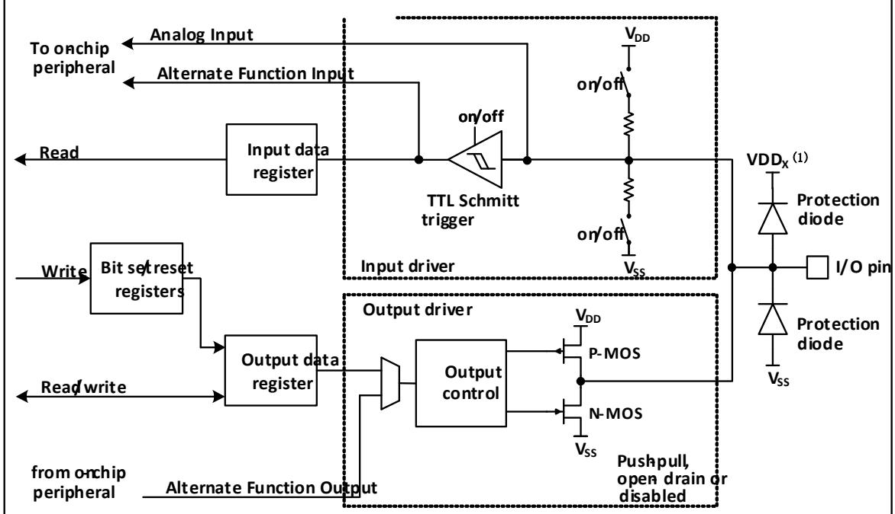  
图7-1 GPIO模块基本结构框图

;(1)GPIO#iIOf, VDDxj VDD, GPIOFTIORf, VDDxVDD FT.

如图 7-1 所示 IO 口结构，每个引脚在芯片内部都有两只保护二极管，IO 口内部可分为输入和输出驱动模块。其中输入驱动有弱上下拉电阻可选，可连接到 AD 等模拟输入的外设；如果输入到数字外设，就需要经过一个TTL施密特触发器，再连接到GPIO输入寄存器或其他复用外设。而输出驱动有一对MOS管，可通过配置上下的MOS管是否使能来将IO口配置成开漏或推挽输出；输出驱动内部也可以配置成由GPIO控制输出还是由复用的其他外设控制输出。

# 7.2.2 GPIO 的初始化功能

刚复位后，GPIO 口运行在初始状态，这时大多数 IO 口都是运行在浮空输入状态，但也有 HSE等外设相关的引脚是运行在外设复用的功能上。具体的初始化功能请参照引脚描述相关的章节。

# 7.2.3 外部中断

所有的GPIO口都可以被配置外部中断输入通道，但一个外部中断输入通道最多只能映射到一个GPIO引脚上，且外部中断通道的序号必须和GPIO端口的位号一致，比如PA1（或PC1、PD1等）只能映射到EXTI1上，且EXTI1只能接受PA1、PC1或PD1等其中之一的映射，两方都是一对一的关系。

# 7.2.4 复用功能

使用复用功能必须要注意：

$\bullet$ 使用输入方向的复用功能，端口必须配置成复用输入模式，上下拉设置可根据实际需要来设置$\bullet$ 使用输出方向的复用功能，端口必须配置成复用输出模式，推挽或开漏可根据实际情况设置$\bullet$ 对于双向的复用功能，端口必须配置成复用输出模式，这时驱动器被配置成浮空输入模式同一个IO口可能有多个外设复用到此管脚，因此为了使各个外设都有最大的发挥空间，外设的复用引脚除了默认复用引脚，还可以进行重映射，重映射到其他的引脚，避开被占用的引脚。

# 7.2.5 锁定机制

锁定机制可以锁定IO口的配置。经过特定的一个写序列后，选定的IO引脚配置将被锁定，在下一个复位前无法更改。

# 7.2.6 输入配置

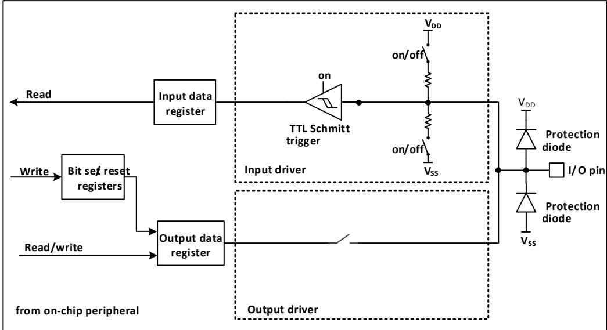  
图7-2 GPIO模块输入配置结构框图

当IO口配置成输入模式时，输出驱动断开，输入上下拉可选，不连接复用功能和模拟输入。在每个 IO 口上的数据在每个 AHB 时钟被采样到输入数据寄存器，读取输入数据寄存器对应位即获取了对应引脚的电平状态。

# 7.2.7 输出配置

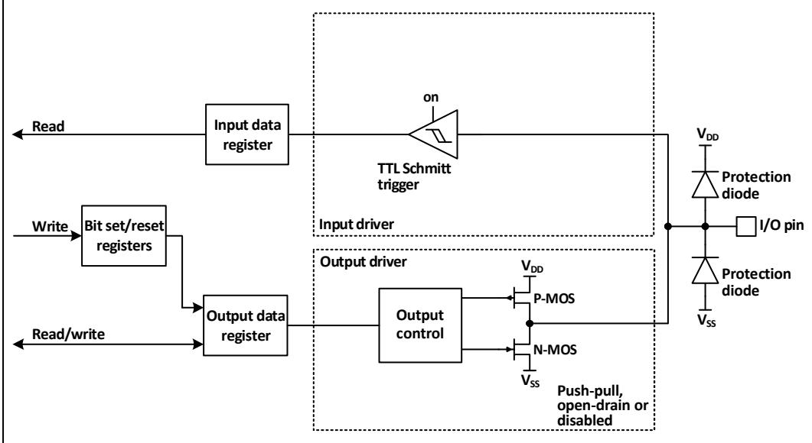  
图7-3 GPIO模块输出配置结构框图

当IO口配置成输出模式时，输出驱动器中的一对MOS可根据需要被配置成推挽或开漏模式，不使用复用功能。输入驱动的上下拉电阻被禁用，TTL施密特触发器被激活，出现在IO引脚上的电平将会在每个 AHB 时钟被采样到输入数据寄存器，所以读取输入数据寄存器将会得到 IO 状态，在推挽输出模式时，对输出数据寄存器的访问就会得到最后一次写入的值。

# 7.2.8 复用功能配置

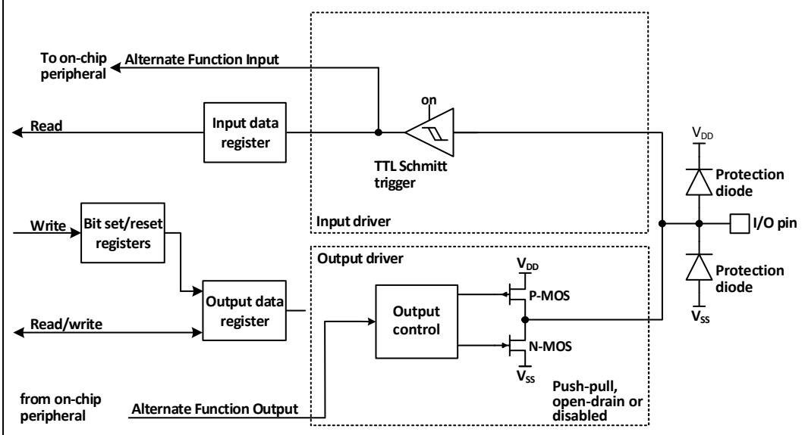  
图7-4 GPIO模块被其他外设复用时的结构框图

在启用复用功能时，输出驱动器被使能，可以按需要被配置成开漏或推挽模式，施密特触发器也被打开，复用功能的输入和输出线都被连接，但是输出数据寄存器被断开，出现在IO引脚上的电平将会在每个 AHB 时钟被采样到输入数据寄存器，在开漏模式下，读取输入数据寄存器将会得到 IO口当前状态；在推挽模式下，读取输出数据寄存器将会得到最后一次写入的值。

# 7.2.9 模拟输入配置

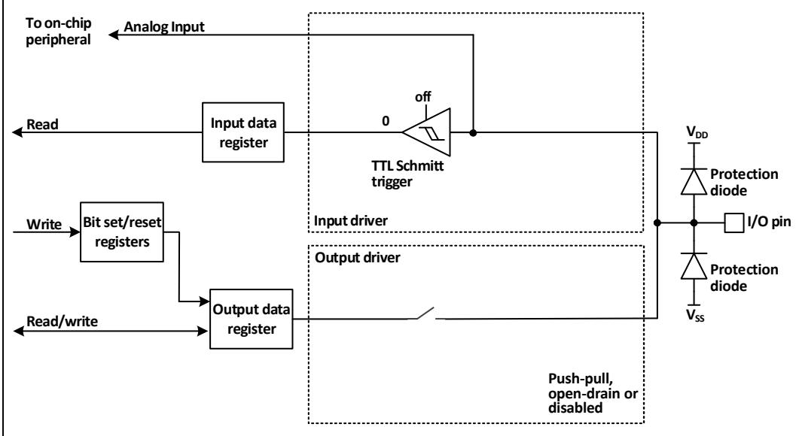  
图7-5 GPIO模块作为模拟输入时的配置结构框图

在启用模拟输入时，输出缓冲器被断开，输入驱动中施密特触发器的输入被禁止以防止产生IO口上的消耗，上下拉电阻被禁止，读取输入数据寄存器将一直为0。

# 7.2.10 外设的 GPIO 设置

下列表格推荐了各个外设的引脚相应的GPIO口配置。

表 7-1 高级定时器（TIM1）  

<table><tr><td>T IM1</td><td></td><td>GP1O C</td></tr><tr><td rowspan="2">T1M1_CHx</td><td>#3i x</td><td></td></tr><tr><td>#t$i x</td><td>#</td></tr><tr><td>T1M1_CHxN</td><td>Ek#i x</td><td>#</td></tr><tr><td>TIM1_BKIN</td><td></td><td></td></tr><tr><td>TIM1_ETR</td><td>5#B$+$</td><td></td></tr></table>

表 7-2 通用定时器（TIM2）  

<table><tr><td>T 1M2 3|Atp</td><td></td><td>GP1O C</td></tr><tr><td rowspan="2">T1M2_CHx</td><td>#a#3i#j x</td><td></td></tr><tr><td>$W tC$i#j x</td><td>#</td></tr><tr><td>T IM2_ETR</td><td>5B$$</td><td></td></tr></table>

表7-3 通用同步异步串行收发器（USART）  

<table><tr><td>USART 3|AtP</td><td></td><td>GP1O C</td></tr><tr><td rowspan="2">USARTx_TX</td><td>XXI##t</td><td></td></tr><tr><td>XIt</td><td>F</td></tr><tr><td rowspan="2">USARTx_RX</td><td>XI#t</td><td></td></tr><tr><td>XIt</td><td>*#</td></tr><tr><td>USARTx_CK</td><td></td><td></td></tr><tr><td>USARTx_RTS</td><td>T 1$]</td><td></td></tr><tr><td>USARTx_CTS</td><td>T 1# it$]</td><td></td></tr></table>

表7-4 串行外设接口（SPI）模块  

<table><tr><td>SP1 3|Ap</td><td></td><td>GP1O C</td></tr><tr><td rowspan="2">SP1x_SCK</td><td>tt</td><td></td></tr><tr><td>Mtt</td><td></td></tr><tr><td rowspan="4">SP1x_MOS1</td><td>XXIt</td><td></td></tr><tr><td>XXIMt</td><td>i#E</td></tr><tr><td>X#t/t</td><td></td></tr><tr><td>A##/tt</td><td>*1</td></tr><tr><td rowspan="4">SP1x_M1SO</td><td>XIt#</td><td>i#E$</td></tr><tr><td>XIMt</td><td>t</td></tr><tr><td></td><td>*1</td></tr><tr><td>A##/tt</td><td>t</td></tr><tr><td rowspan="3">SP1x_NSS</td><td>A1#g</td><td></td></tr><tr><td>1#t/NSS 1AEt</td><td></td></tr><tr><td>#1#tt</td><td>*</td></tr></table>

表7-5 内部集成总线（I2C）模块  

<table><tr><td>1C 3|Ap</td><td></td><td>GPI O C</td></tr><tr><td>1&#x27;c_SCL</td><td>1C At$</td><td>FF</td></tr><tr><td>1?C_SDA</td><td>1C ##</td><td></td></tr></table>

表7-6 模拟转数字转换器（ADC）  

<table><tr><td>ADC 31Ap</td><td>GP1 O C</td></tr><tr><td>ADC</td><td>ta</td></tr></table>

表7-7 其他的IO功能设置  

<table><tr><td>31Atp</td><td>CIAE</td><td>GP10 C</td></tr><tr><td>MCO</td><td>A$+$</td><td></td></tr><tr><td>EXTI</td><td></td><td></td></tr><tr><td>OPA</td><td>iz#xa</td><td></td></tr></table>

# 7.2.11 复用功能重映射 GPIO 设置

# 7.2.11.1 定时器复用功能重映射

表 7-8 TIM1 复用功能重映射  

<table><tr><td>AE</td><td>T1M1_RM=OO</td><td>T1M1_RM=O1</td><td>TIM1_RM=1O</td><td>T1M1_RM=11 9</td></tr><tr><td>TIM1_ETR</td><td>PC5</td><td>PC5</td><td>PD4</td><td>PC2</td></tr><tr><td>TIM1_CH1</td><td>PD2</td><td>PC6</td><td>PD2</td><td>PC4</td></tr><tr><td>T1M1_CH2</td><td>PA1</td><td>PC7</td><td>PA1</td><td>PC7</td></tr><tr><td>TIM1_CH3</td><td>PC3</td><td>PCO</td><td>PC3</td><td>PC5</td></tr><tr><td>TIM1_CH4</td><td>PC4</td><td>PD3</td><td>PC4</td><td>PD4</td></tr><tr><td>T IM1 BKIN</td><td>PC2</td><td>PC1</td><td>PC2</td><td>PC1</td></tr><tr><td>TIM1_CH1N</td><td>PDO</td><td>PC3</td><td>PDO</td><td>PC3</td></tr></table>

<table><tr><td>TIM1 CH2N</td><td>PA2</td><td> PC4</td><td>PA2</td><td>PD2</td></tr><tr><td>T IM1_ CH3N</td><td>PD1</td><td>PD1</td><td>PD1</td><td>PC6</td></tr></table>

i: XfF T1M1_CH1 AJA9IAE, 1#JT1M1_1_RM=O. T1M1_1_RM=1A, T1M1_CH1 AEJ LS1 (#FLS1t)

表 7-9 TIM2 复用功能重映射  

<table><tr><td>AE</td><td>T1M2_RM=OO miAA9f</td><td>T1M2_RM=O1</td><td>T1M2_RM=1O</td><td>T1M2_RM=11 9t</td></tr><tr><td>TIM2_ETR</td><td>PD4</td><td>PC5</td><td>PC1</td><td>PC1</td></tr><tr><td>T1M2_CH1</td><td>PD4</td><td>PC5</td><td>PC1</td><td>PC1</td></tr><tr><td>TIM2_CH2</td><td>PD3</td><td>PC2</td><td>PD3</td><td>PC7</td></tr><tr><td>TIM2_CH3</td><td>PCO</td><td>PD2</td><td>PCO</td><td>PD6</td></tr><tr><td>T1M2_CH4</td><td>PD7</td><td>PC1</td><td>PD7</td><td>PD5</td></tr></table>

# 7.2.11.2 USART 复用功能重映射

表 7-10 USART1 复用功能重映射  

<table><tr><td></td><td>USART1_RM=0O</td><td>USART1_RM=01 AR9</td><td>USART1_RM=10 A*9</td><td>USART1_RM=11 A9</td></tr><tr><td>USART1_CK</td><td>PD4</td><td>PD7</td><td>PD7</td><td>PC5</td></tr><tr><td>USART1_TX</td><td>PD5</td><td>PDO</td><td>PD6</td><td>PCO</td></tr><tr><td>USART1_RX</td><td>PD6</td><td>PD1</td><td>PD5</td><td>PC1</td></tr><tr><td>USART1_CTS</td><td>PD3</td><td>PC3</td><td>PC6</td><td>PC6</td></tr><tr><td>USART1_RTS</td><td>PC2</td><td>PC2</td><td>PC7</td><td>PC7</td></tr></table>

# 7.2.11.3 SPI 复用功能重映射

表 7-11 SPI1 复用功能重映射  

<table><tr><td></td><td>SP11_RM=0</td><td>SP11_RM=1</td></tr><tr><td>SP11_NSS</td><td>PC1</td><td>PCO</td></tr><tr><td>SP11_SCK</td><td>PC5</td><td>PC5</td></tr><tr><td>SP11_MISO</td><td>PC7</td><td>PC7</td></tr><tr><td>SP11_MOS1</td><td>PC6</td><td>PC6</td></tr></table>

# 7.2.11.4 I2C 复用功能重映射

表 7-12 I2C1 复用功能重映射  

<table><tr><td></td><td>I2C1_RM=OO XiAA9f</td><td>I2C1_RM=O1</td><td>I2C1_RM=1x</td></tr><tr><td>I2C1_SCL</td><td>PC2</td><td>PD1</td><td>PC5</td></tr><tr><td>I2C1_SDA</td><td>PC1</td><td>PDO</td><td>PC6</td></tr></table>

# 7.2.11.5 ADC 复用功能重映射

表7-13 ADC外部触发注入转换复用功能重映射  

<table><tr><td></td><td>ADC_ETRG1NJ_RM=O</td><td>ADC_ETRG1NJ_RM=1</td></tr><tr><td>ADC y#B#ia##</td><td>ADC5l#B# PD1 tit</td><td>ADC5B#;# PA2 tiE</td></tr></table>

表7-14 ADC外部触发规则转换复用功能重映射  

<table><tr><td>IAE</td><td>ADC_ETRGREG_RM=O #iAA9f</td><td>ADC_ETRGREG_RM=1</td></tr><tr><td>ADC yl#B##J#</td><td>ADCJ PD3 tHitE</td><td>ADC PC2 tHiE</td></tr></table>

# 7.3 寄存器描述

# 7.3.1 GPIO 的寄存器描述

除非特殊说明，GPIO 的寄存器必须以字的方式操作（以32位来操作这些寄存器）。

表 7-15 GPIO 相关寄存器列表  

<table><tr><td></td><td></td><td>##it</td><td></td></tr><tr><td>R32_GP1OA_CFGLR</td><td>0x40010800</td><td>PA i#$</td><td>0x44444444</td></tr><tr><td>R32_GP1OC_CFGLR</td><td>0x40011000</td><td>PC y#T1</td><td>0x44444444</td></tr><tr><td>R32_GP1OD_CFGLR</td><td>0x40011400</td><td>PD j#$</td><td>0x44444444</td></tr><tr><td>R32_GP1OA_INDR</td><td>0x40010808</td><td>PA i##$</td><td>0x000000XX</td></tr><tr><td>R32_GP1OC_1NDR</td><td>0x40011008</td><td>PC 2#1</td><td>0x000000XX</td></tr><tr><td>R32_GP1OD_INDR</td><td>0x40011408</td><td>PD i#</td><td>0x000000XX</td></tr><tr><td>R32_GP1OA_OUTDR</td><td>0x4001080C</td><td>PA #</td><td>0x00000000</td></tr><tr><td>R32_GP1OC_OUTDR</td><td>0x4001100C</td><td>PC # </td><td>0x00000000</td></tr><tr><td>R32_GP1OD_OUTDR</td><td>0x4001140C</td><td>PD #</td><td>0x00000000</td></tr><tr><td>R32_GP1OA_BSHR</td><td>0x40010810</td><td>PA i#/$</td><td>0x00000000</td></tr><tr><td>R32_GP1OC_BSHR</td><td>0x40011010</td><td>PC i#/$</td><td>0x00000000</td></tr><tr><td>R32_GP1OD_BSHR</td><td>0x40011410</td><td>pD i#/$</td><td>0x00000000</td></tr><tr><td>R32_GP1OA_BCR</td><td>0x40010814</td><td>PA i#$</td><td>0x00000000</td></tr><tr><td>R32_GP1OC_BCR</td><td>0x40011014</td><td>PC i#$</td><td>0x00000000</td></tr><tr><td>R32_GP1OD_BCR</td><td>0x40011414</td><td>PD i#$</td><td>0x00000000</td></tr><tr><td>R32_GP1OA_LCKR</td><td>0x40010818</td><td>PA i#$2</td><td>0x00000000</td></tr><tr><td>R32_GP1OC_LCKR</td><td>0x40011018</td><td>PC $</td><td>0x00000000</td></tr><tr><td>R32_GP1OD_LCKR</td><td>0x40011418</td><td>PD #$</td><td>0x00000000</td></tr></table>

# 7.3.1.1 GPIO 配置寄存器低位（GPIOx_CFGLR） （x=A/C/D）

偏移地址： $0 \times 0 0$

<table><tr><td colspan="17">31 30 29 28 27 26 25 24 23 22 20 19 18 17 16</td></tr><tr><td>CNF7[1: 0]</td><td></td><td>MODE7[1 : 0]</td><td>CNF6[1: 0]</td><td></td><td>MODE6[1: 0]</td><td></td><td>CNF5[1 : 0]</td><td>21</td><td>MODE5[1 : 0]</td><td></td><td>CNF4[1: 0]</td><td>MODE4[1: 0]</td></tr><tr><td>15</td><td>14 13</td><td>12</td><td>11</td><td>10</td><td>9 8</td><td>7</td><td>6</td><td>5</td><td>4</td><td>3</td><td>2</td><td>1</td></tr><tr><td>CNF3[1: 0]</td><td>MODE3[1 : 0]</td><td></td><td>CNF2[1: 0]</td><td></td><td>MODE2[1: 0]</td><td></td><td>CNF1 [1: 0]</td><td>MODE1 [1: 0]</td><td></td><td>CNFO[1 : 0]</td><td></td><td>MODEO[1 : 0]</td></tr></table>

<table><tr><td>1</td><td></td><td></td><td>#it</td><td></td></tr><tr><td>[31 : 30] [27:26] [23: 22] [19:18] [15:14] [11:10] [7:6] [3:2]</td><td>CNFy[1:0]</td><td>RW</td><td>(y=0-7), i# x #@2(, iiiX#{#2 A. 7E#jttAf (MODE=00b) : 0o: t 01: ; 10: #Tt. 11: 1. #tt (MODE&gt;O0b) : 00:i 01:iT; 10:</td><td rowspan="2">01b</td></tr><tr><td>[29 : 28] [25: 24] [21 : 20] [17:16] [13:12] [9:8] [5:4] [1:0]</td><td>MODEy[1: 0]</td><td>RW</td><td>11:. (y=0-7), i# xtti, i#i2 . 00: t; 00b 01: t, i10MHz; 10: ,i2MHz; 11 i50MHz.</td></tr></table>

# 7.3.1.2 端口输入寄存器（GPIOx_INDR） （ $\scriptstyle x = A ( 0 / 0 )$

偏移地址： $0 \times 0 8$

<table><tr><td>31</td><td>30</td><td>29</td><td>28</td><td>27</td><td>26</td><td>25</td><td>24</td><td>23</td><td>22</td><td>21</td><td>20</td><td>19</td><td>18</td><td>17</td><td>16</td></tr><tr><td></td><td colspan="13">Reserved</td></tr><tr><td>15</td><td>14</td><td>13</td><td>12</td><td>11</td><td>10</td><td>9</td><td>8</td><td>7</td><td>6</td><td>5</td><td>4</td><td>3</td><td>2</td><td>1</td><td>0</td></tr><tr><td></td><td></td><td></td><td>Reserved</td><td></td><td></td><td></td><td></td><td>IDR7</td><td>I DR6</td><td>I DR5</td><td>I DR4</td><td>I DR3</td><td>I DR2</td><td>I DR1</td><td>IDRO</td></tr></table>

<table><tr><td>1</td><td></td><td>i</td><td>##it</td><td></td></tr><tr><td>[31 : 8]</td><td>Reser ved</td><td>RO</td><td>1RE.</td><td>0</td></tr><tr><td>[7: 0]</td><td>I DRy</td><td>RO</td><td>(y=0-7), i###. ix#(i 16 1i$. itxf)</td><td>X</td></tr></table>

# 7.3.1.3 端口输出寄存器（GPIOx_OUTDR） （x=A/C/D）

偏移地址： $0 \times 0 0$

<table><tr><td>31</td><td>30</td><td>29</td><td>28</td><td>27</td><td>26</td><td>25</td><td>24</td><td>23</td><td>22</td><td>21</td><td>20</td><td>19</td><td>18</td><td>17</td><td>16</td></tr><tr><td></td><td colspan="13">Reserved</td></tr><tr><td>15</td><td>14</td><td>13</td><td>12</td><td>11</td><td>10</td><td>9</td><td>8</td><td>7</td><td>6</td><td>5</td><td>4</td><td>3</td><td>2</td><td>1</td><td>0</td></tr><tr><td></td><td></td><td></td><td>Reserved</td><td></td><td></td><td></td><td></td><td> ODR7</td><td>ODR6</td><td>ODR5</td><td>ODR4</td><td> ODR3</td><td> ODR2</td><td>ODR1</td><td> ODRO</td></tr></table>

<table><tr><td>1i</td><td></td><td>iid]</td><td>##it</td><td></td></tr><tr><td>[31 : 8]</td><td>Reserved</td><td>RO</td><td></td><td>0</td></tr><tr><td>[7:0]</td><td>0DRy</td><td>RW</td><td>(y=0-7)i# iX# 16 11F. 10 Xlix$17 A. xfF#ETt$tt: 0: Tt$; 1: E$.</td><td>0</td></tr></table>

# 7.3.1.4 端口复位/置位寄存器（GPIOx_BSHR） （ $( x = A / ( C / 0 )$

偏移地址： $0 \times 1 0$

<table><tr><td>31</td><td>30</td><td>29</td><td>28</td><td>27</td><td>26</td><td>25</td><td>24</td><td>23</td><td></td><td>22</td><td>21</td><td>20</td><td>19 18</td><td>17</td><td></td><td>16</td></tr><tr><td></td><td colspan="4">Reserved</td><td></td><td></td><td></td><td></td><td>BR7</td><td>BR6</td><td>BR5</td><td>BR4</td><td>BR3</td><td>BR2</td><td>BR1</td><td>BRO</td></tr><tr><td>15</td><td>14</td><td>13</td><td>12</td><td>11</td><td></td><td>10</td><td>9</td><td>8</td><td>7</td><td>6</td><td>5</td><td>4</td><td>3</td><td>2</td><td>1</td><td></td></tr><tr><td></td><td></td><td></td><td></td><td> Reserved</td><td></td><td></td><td></td><td>BS7</td><td></td><td>BS6</td><td>BS5</td><td>BS4</td><td>BS3</td><td>BS2</td><td>BS1</td><td>BSO</td></tr></table>

<table><tr><td>1</td><td></td><td></td><td>##it</td><td></td></tr><tr><td>[31 : 24]</td><td>Reserved</td><td>RO</td><td>1R.</td><td>0</td></tr><tr><td>[23:16]BRy</td><td></td><td>wo</td><td>(y=0-7) Xfi1x 0UTDR 1, 5 0 T##. ix161) Htii]. tnRAi&amp;7 BR F BS [, JI] BS</td><td>0</td></tr><tr><td>[15:8]</td><td>Reser ved</td><td>RO</td><td>121F. 1*.</td><td>0</td></tr><tr><td>[7:0]</td><td>BSy</td><td>wo</td><td>(y=0-7), XJiX(11x] 0UTDR 1 1, 5 0T#. i161 Aiji]. tnRa]Ai7 BRF BS{, QJ BS 121F .</td><td>0</td></tr></table>

# 7.3.1.5 端口复位寄存器（GPIOx_BCR） （ $( x = A / ( C / 0 )$

偏移地址： $0 \times 1 4$

<table><tr><td>31</td><td>30</td><td>29</td><td>28</td><td>27</td><td>26</td><td>25</td><td>24</td><td>23</td><td>22</td><td>21</td><td>20</td><td>19</td><td>18</td><td>17</td><td>16</td></tr><tr><td></td><td colspan="13">Reserved</td></tr><tr><td>15</td><td>14</td><td>13</td><td>12</td><td>11</td><td>10</td><td>9</td><td>8</td><td>7</td><td>6</td><td>5</td><td>4</td><td>3</td><td>2</td><td>1</td><td>0</td></tr><tr><td></td><td></td><td></td><td>Reserved</td><td></td><td></td><td></td><td></td><td>BR7</td><td>BR6</td><td>BR5</td><td>BR4</td><td>BR3</td><td>BR2</td><td>BR1</td><td>BRO</td></tr></table>

<table><tr><td>1</td><td></td><td>ii</td><td>##it</td><td></td></tr><tr><td>[31 : 8]</td><td>Reser ved</td><td>RO</td><td>RE.</td><td>0</td></tr><tr><td>[7: 0]</td><td>BRy</td><td>WO</td><td>(y=0-7), Xfi#(#x 0UTDR 1, 5 0 T#. ix161) stini.</td><td>0</td></tr></table>

# 7.3.1.6 配置锁定寄存器（GPIOx_LCKR） （ $\scriptstyle x = A ( 0 / 0 )$

偏移地址： $0 \times 1 8$

<table><tr><td>31</td><td>30</td><td>29</td><td>28</td><td>27</td><td>26</td><td>25</td><td>24</td><td>23</td><td>22</td><td>21</td><td>20</td><td>19</td><td>18</td><td>17</td><td>16</td></tr><tr><td colspan="14">Reserved</td></tr><tr><td>15</td><td>14</td><td>13</td><td>12</td><td>11</td><td>10</td><td>9</td><td>8</td><td>7</td><td>6</td><td>5</td><td>4</td><td>3</td><td>2</td><td>1</td><td></td></tr><tr><td></td><td></td><td></td><td>Reserved</td><td></td><td></td><td></td><td>LCKK</td><td>LCK7</td><td>LCK6</td><td>LCK5</td><td>LCK4</td><td>LCK3</td><td>LCK2</td><td>LCK1</td><td>LCKO</td></tr></table>

<table><tr><td>1</td><td></td><td></td><td>##it</td><td></td></tr><tr><td>[31: 9]</td><td>Reserved</td><td>RO</td><td>1R5.</td><td>0</td></tr><tr><td>8</td><td>LCKK</td><td>RW</td><td># eai#S , 1ai. EiW0$R* $ i1A$. $5J: 51-50-51-i0-i# 1, #1i $Ei. S51I(]#i#T1#, S/yJ], T#2 LCK[7:0]A. # R#Ti1A2A</td><td>0</td></tr><tr><td>[7:0]</td><td>LCKy</td><td>RW</td><td>H. (y=0-7),iX#j 1 Af$#Xfi#J 2. RA LCKK *$2i#{. tii A2tAJ2T7 GP1Ox_CFGLR F GP|0x_CFGHR.</td><td>0</td></tr></table>

#7 LOCKJ#TZT#2

# 7.3.2 AFIO 寄存器

除非特殊说明，AFIO的寄存器必须以字的方式操作（以32位来操作这些寄存器）。

表 7-16 AFIO 相关寄存器列表  

<table><tr><td></td><td>ij@ttt</td><td>#it</td><td></td></tr><tr><td>R32_AF10_PCFR1</td><td>0x40010004</td><td>1</td><td>0x00000000</td></tr><tr><td>R32_AF10_EXTICR</td><td>0x40010008</td><td>5$1</td><td>0x00000000</td></tr></table>

# 7.3.2.1 重映射寄存器 1（AFIO_PCFR1）

偏移地址： $0 \times 0 4$

<table><tr><td>31</td><td>30</td><td>29</td><td>28</td><td>27</td><td>26</td><td>25</td><td>24</td><td>23</td><td>22</td><td>21</td><td>20</td><td>19</td><td>18</td><td>17</td><td>16</td></tr><tr><td></td><td></td><td>Reserved</td><td></td><td></td><td></td><td>SWCFG[2: 0]</td><td></td><td>T IM1 1_RM</td><td>I2C1 RM1</td><td>USART 1 RM1</td><td></td><td>Reserved</td><td>TRGRE G_RM</td><td>ADC_E|ADC_E TRGIN</td><td>Reser ved</td></tr></table>

<table><tr><td>15</td><td>14</td><td>13</td><td>12</td><td>11</td><td>10</td><td>9 8</td><td>7</td><td>6</td><td>5</td><td>4</td><td>3</td><td>2</td><td>1</td><td></td></tr><tr><td>PA12</td><td></td><td></td><td>Reserved</td><td></td><td></td><td>TIM2_RM</td><td></td><td>TIM1_RM</td><td></td><td></td><td></td><td>USART1</td><td>I2C1</td><td>SP I1</td></tr><tr><td>RM</td><td></td><td></td><td></td><td></td><td></td><td>[1:0]</td><td></td><td>[1:0]</td><td></td><td>Reserved</td><td></td><td>_RM</td><td>RM</td><td>_RM</td></tr></table>

<table><tr><td>1</td><td></td><td></td><td>#it</td><td></td></tr><tr><td>[31:27]Reserved</td><td></td><td>RO</td><td>R. jX#{2 SW IAEF#RAEA 1O .</td><td>0</td></tr><tr><td>[26:24]SWCFG[2:0]</td><td></td><td>RW</td><td>SWD (SD1) ijitAiit. K1 HetF swd i. Oxx: F SWD (SDI) ; 100: ] SWD (SD1) , 1F GPIO IAE; #it: Fa.</td><td>0</td></tr><tr><td>23</td><td>TIM1_1_RM</td><td>RW</td><td>f$JAf1 j#j1 9i. O: j#5l#B31AtP; 1: j LS1 A$. 12C1 a9t1i 2 AF10_PCFR1 $1 bit1 I2C1_RM1[22,1]) o</td><td>0</td></tr><tr><td>22 I2C1_RM1</td><td></td><td>RW</td><td>0O: #XiA9t (SCL/PC2, SDA/PC1) ; 01: A9t(SCL/PD1, SDA/PDO) ; 1X: Af (SCL/PC5, SDA/PC6) . USART1 a9t@21z &lt;2A AF1O_PCFR1 #77 bit2 USART1_RM 1[21,2]) o</td><td>0</td></tr><tr><td>21</td><td>USART1_RM1</td><td>RW</td><td>00: #iAA (CK/PD4, TX/PD5, RX/PD6, CTS/PD3, RTS/PC2) ; 01 : At (CK/PD7, TX/PDO, RX/PD1, CTS/PC3, RTS/PC2) ; 10: A3f (CK/PD7, TX/PD6, RX/PD5, CTS/PC6, RTS/PC7) ;</td><td>0</td></tr><tr><td>[20:19]Reserved</td><td>RO</td><td></td><td>11 : A3 (CK/PC5, TX/PCO, RX/PC1, CTS/PC6, RTS/PC7) . 1R.</td><td>0</td></tr><tr><td>18</td><td>ADC_ETRGREG_RM</td><td>RW</td><td>ADC 5#B1. O: ADC5 PD3 i; 1: ADC 5lB## PC2 ti.</td><td>0</td></tr><tr><td>17</td><td>ADC_ETRGINJ_RM</td><td>RW</td><td>ADC y#$a1. 0: ADC 5l#B#i$S PD1 ti; 1: ADC l#B;# PA2 i.</td><td>0</td></tr><tr><td>16</td><td>Reserved</td><td>RO</td><td>1R. 31Ap PA1&amp;PA2 aR3t1, i1aMi$S. Et#$J PA1 FA PA2 AIJAEiE (t9l#B</td><td>0</td></tr><tr><td>15</td><td>PA12_RM</td><td>RW</td><td>#R3|A1) . 0: 31AP1F GP1O FMIAE1;</td><td>0</td></tr><tr><td>[14:10]</td><td>Reserved</td><td>RO</td><td>1: 31AP3EIAE1FA. 1R.</td><td>0</td></tr><tr><td>[9:8]</td><td>TIM2_RM[1:0]</td><td>RW</td><td>A2 1 ix#i$5.</td><td>0</td></tr></table>

<table><tr><td></td><td></td><td>Cfr]3EA`J as Z AJ1#1E F7HyI`aPA GP10  AA9t. 00 : # i A f (CH1/ETR/PD4, CH2/PD3, CH3/PCO, CH4/PD7) ; 01 : B  A  (CH1/ETR/PC5, CH2/PC2, CH3/PD2, CH4/PC1) ; 10 :  f(CH1/ETR/PC1, CH2/PD3, CH3/PCO, CH4/PD7) ; 11 :   A f (CH1/ETR/PC1, CH2/PC7, CH3/PD6, CH4/PD5) . A1a91. iX#ai$5.</td><td></td></tr><tr><td>[7:6]</td><td>TIM1_RM[1:0]</td><td>Ct$JAj 1 A9ij 1  4 1N  3N9N (ETR) FnJ#(BK1N)  GP1O iAAR Ht. 00: #XiAA9(ETR/PC5, CH1/PD2, CH2/PA1, CH3/PC3, CH4/PC4, BK1N/PC2, CH1N/PDO, CH2N/PA2, CH3N/PD1) ; 01: B3&gt;A(ETR/PC5, CH1/PC6, CH2/PC7, RW CH3/PCO, CH4/PD3, BKIN/PC1, CH1N/PC3, CH2N/PC4, CH3N/PD1) ; 10: B&gt;At(ETR/PD4, CH1/PD2, CH2/PA1, CH3/PC3, CH4/PC4, BKIN/PC2, CH1N/PDO, CH2N/PA2, CH3N/PD1) ; 11: 5A(ETR/PC2, CH1/PC4, CH2/PC7,</td><td>0</td></tr><tr><td>[5:3]</td><td>Reserved</td><td>CH3/PC5, CH4/PD4, BKIN/PC1, CH1N/PC3, CH2N/PD2, CH3N/PC6) . RO 1R. USART1 AR211i &lt;2A AF1O_PCFR1 17 bit21 USART1RM1 1[21, 2]) . 00: #iAAt(CK/PD4, TX/PD5, RX/PD6, CTS/PD3, RTS/PC2) ;</td><td>0</td></tr><tr><td>2</td><td>USART1_RM</td><td>01 :  (CK/PD7, TX/PDO, RX/PD1, CTS/PC3, RW RTS/PC2) ; 10: A (CK/PD7, TX/PD6, RX/PD5, CTS/PC6, RTS/PC7) ; 11 : A9t (CK/PC5, TX/PCO, RX/PC1, CTS/PC6, RTS/PC7) . 12C1 AR91E1i @CA AF1O_PCFR1 $1 bit22 12C1_RM1 1A[22,1]) o</td><td>0</td></tr><tr><td>1</td><td>I2C1_RM</td><td>RW 0O: #XiAA9t (SCL/PC2, SDA/PC1) ; 01: A5(SCL/PD1, SDA/PDO) ; 1X: At (SCL/PC5, SDA/PC6) .</td><td>0</td></tr><tr><td>0</td><td>SPI1_RM</td><td>SP11 AJt. i[ai$S. Et$] SP11 AJ NSS, SCK. MISO F MOSI FIJAETE RW GP1O #AAR9t. O: #i3(NSS/PC1, CK/PC5, MISO/PC7,</td><td>0</td></tr></table>

<table><tr><td></td><td></td><td>MOSI/PC6) ; MOSI/PC6) .</td><td>1: A3 (NSS/PCO, CK/PC5, MISO/PC7,</td></tr></table>

# 7.3.2.2 外部中断配置寄存器 1（AFIO_EXTICR）

偏移地址： $0 \times 0 8$

<table><tr><td>31</td><td>30</td><td>29</td><td>28</td><td>27</td><td>26</td><td>25</td><td>24</td><td>23</td><td>22</td><td>21</td><td>20</td><td>19</td><td>18</td><td>17 16</td></tr><tr><td colspan="14"></td></tr><tr><td rowspan="2">15</td><td colspan="2" rowspan="2">14 13</td><td rowspan="2">12</td><td rowspan="2">11 10</td><td rowspan="2">9</td><td rowspan="2">8</td><td rowspan="2">Reserved</td><td rowspan="2"></td><td rowspan="2">5</td><td rowspan="2">4</td><td rowspan="2">3</td><td rowspan="2">2</td><td rowspan="2">1</td><td rowspan="2">0</td></tr><tr><td>7 6</td></tr><tr><td>EXT17[1:0]</td><td colspan="2"></td><td>EXT|6[1:0]</td><td>EXTI5[1: 0]</td><td></td><td>EXTI4[1: 0]</td><td></td><td>EXTI3[1: 0]</td><td></td><td>EXTI2[1: 0]</td><td></td><td>EXTI1[1: 0]</td><td></td><td>EXTI0[1: 0]</td></tr></table>

<table><tr><td>1</td><td></td><td></td><td>#it</td><td></td></tr><tr><td>[31 : 16]</td><td>Reser ved</td><td>RO</td><td>R.</td><td>0</td></tr><tr><td>[15:14] [13:12] [11:10] [9:8] [7:6] [5:4] [3:2] [1:0]</td><td>EXT1x [1: 0]</td><td>RW</td><td>(x=0-7) 3A E5l#BF 31Atpa$JAjBi#S 31AtP_E. OO: PA 31APAS x31AP; 10: PC 31APAS x3|AP; 11: PD 31AA x31Ap.</td><td>0</td></tr></table>

# 第 8章 直接存储器访问控制 （DMA）

直接存储器访问控制器（DMA）提供在外设和存储器之间或存储器和存储器之间的高速数据传输方式，无须CPU干预，数据可以通过DMA快速地移动，以节省CPU的资源来做其他操作。

DMA 控制器每个通道专门用来管理来自于一个或多个外设对存储器访问的请求。还有一个仲裁器来协调各通道之间的优先级。

# 8.1 主要特性

$\bullet$ 多个独立可配置通道  
$\bullet$ 每个通道都直接连接专用的硬件DMA请求，并支持软件触发  
$\bullet$ 支持循环的缓冲器管理  
$\bullet$ 多个通道之间的请求优先权可以通过软件编程设置(最高、高、中和低)，优先权设置相等时由通道号决定（通道号越低优先级越高）  
$\bullet$ 支持外设到存储器、存储器到外设、存储器到存储器之间的传输  
$\bullet$ 闪存、SRAM、外设的SRAM和AHB外设均可作为访问的源和目标  
$\bullet$ 可编程的数据传输字节数目：最大为 65535

# 8.2 功能描述

# 8.2.1 DMA 通道处理

# 1）仲裁优先级

多个独立的通道产生的DMA请求通过逻辑或结构输入到DMA控制器，当前只会有一个通道的请求得到响应。模块内部的仲裁器根据通道请求的优先级来选择要启动的外设/存储器的访问。

软件管理中，应用程序通过对 DMA_CFGRx 寄存器的 PL[1:0]位设置，可以为每个通道独立配置优先等级，包括最高、高、中、低4个等级。当通道间的软件设置等级一致时，模块会按固定的硬件优先级选择，通道编号偏低的要比偏高的有较高优先权。

# 2）DMA 配置

当 DMA 控制器收到一个请求信号时，会访问发出请求的外设或存储器，建立外设或存储器和存储器之间的数据传输。主要包括下面3个操作步骤：

1） 从外设数据寄存器或当前外设/存储器地址寄存器指示的存储器地址取数据，第一次传输时的开始地址是DMA_PADDRx或DMA_MADDRx寄存器指定的外设基地址或存储器地址。  
2）存数据到外设数据寄存器或当前外设/存储器地址寄存器指示的存储器地址，第一次传输时的开始地址是DMA_PADDRx或DMA_MADDRx寄存器指定的外设基地址或存储器地址。  
3）执行一次DMA_CNTRx寄存器中数值的递减操作，该寄存器指示当前未完成转移的操作数目。

每个通道包括3种DMA数据转移方式：

$\bullet$ 外设到存储器（MEM2MEM=0， $\mathsf { D } 1 \mathsf { R } { = } 0$ ）$\bullet$ 存储器到外设（MEM2MEM=0， $\mathsf { D } | \mathsf { R } { = } 1$ ）$\bullet$ 存储器到存储器（MEM2MEM=1）

1J1ii,MEM2MEM=1) iT(EN=1 aJs#\$# tT##

配置过程如下：

1）在 DMA_PADDRx 寄存器中设置外设寄存器的首地址或存储器到存储器方式（MEM2MEM=1）下存储器数据地址。发生DMA请求时，这个地址将是数据传输的源或目标地址。

2）在DMA_MADDRx寄存器中设置存储器数据地址。发生DMA请求时，传输的数据将从这个地址读出或写入这个地址。

3）在DMA_CNTRx寄存器中设置要传输的数据数量。在每个数据传输后，这个数值递减。

4） 在 DMA_CFGRx 寄存器的 PL[1:0]位中设置通道的优先级。

5）在 DMA_CFGRx 寄存器中设置数据传输的方向、循环模式、外设和存储器的增量模式、外设和存储器的数据宽度、传输过半、传输完成、传输错误中断使能位。

6） 设置 DMA_CCRx 寄存器的 ENABLE 位，启动通道 x。

j:DMA PADDRx/DMA MADDRx/DMA CNTRx 1zZ DMA CFGRx T+AJ#E1\$#AJ(D1R) 1T9iFMINC/P1NC\$J DMA j] Ws.

# 3）循环模式

设置DMA_CFGRx寄存器的CIRC位置1，可以启用通道数据传输的循环模式功能。循环模式下，当数据传输的数目变为 0 时，DMA_CNTRx 寄存器的内容会自动被重新加载为其初始数值，内部的外设和存储器地址寄存器也被重新加载为 DMA_PADDRx 和 DMA_MADDRx 寄存器设定的初始地址值，DMA操作将继续进行，直到通道被关闭或关闭DMA模式。

# 4）DMA处理状态

$\bullet$ 传输过半：对应DMA_INTFR寄存器中的 $\mathsf { H T I F x }$ 位硬件置位。当DMA的传输字节数目减至初始设定值一半以下将会产生 DMA 传输过半标志，如果在 DMA_CCRx 寄存器中置位了 HTIE，则将产生中断。硬件通过此标志提醒应用程序，可以为新一轮数据传输做准备。传输完成：对应DMA_INTFR寄存器中的 ${ \mathsf { T C l } } \mathsf { F x }$ 位硬件置位。当DMA的传输字节数目减至0将会产生DMA传输完成标志，如果在DMA_CCRx寄存器中置位了TCIE，则将产生中断。  
$\bullet$ 传输错误：对应 DMA_INTFR 寄存器中的 TEIFx 位硬件置位。读写一个保留的地址区域，将会产生DMA传输错误。同时模块硬件会自动清0发生错误的通道所对应的DMA_CCRx寄存器的EN位，该通道被关闭。如果在 ${ \mathsf { D M A \_ C C R x } }$ 寄存器中置位了 TEIE，则将产生中断。应用程序在查询DMA通道状态时，可以先访问DMA_INTFR寄存器的 $\mathtt { G I F x }$ 位，判断出当前哪个通  
道发生了DMA事件，进而处理该通道的具体DMA事件内容。

# 8.2.2 可编程的数据传输总大小/数据位宽/对齐方式

DMA每个通道一轮传输的数据量总大小可编程，最大65535次。DMA_CNTRx寄存器中指示待传输字节数目。在 $\mathsf { E N } { = } 0$ 时，写入设置值，在 $E N = 1$ 开启DMA传输通道后，此寄存器变为只读属性，在每次传输后数值递减。

外设和存储器的传输数据取值支持地址指针自动递增功能，指针增量可编程。它们访问的第一个传输的数据地址存放在 DMA_PADDRx 和 DMA_MADDRx 寄存器中，通过设置 DMA_CFGRx 寄存器的 PINC位或 MINC 位置 1，可以分别开启外设地址自增模式或存储器地址自增模式，PSIZE[1:0]设置外设地址取数据大小及地址自增大小，MSIZE[1:0]设置存储器地址取数据大小及地址自增大小，包括3种选择：8位、16位、32位。具体数据转移方式如下表：

表8-1 不同数据位宽下DMA转移 $\scriptstyle ( \mathsf { P } \mid \mathsf { N C } = \mathsf { M } \mid \mathsf { N C } = 1 )$ ）  

<table><tr><td>1</td><td>1</td><td>1</td><td>i: tt/##</td><td>t: tttt/##</td><td>1*1F</td></tr><tr><td>8</td><td>8</td><td>4</td><td>0x00/B0 0x01/B1 0x02/B2</td><td>0x00/B0 0x01/B1 0x02/B2</td><td>iR#ttt$#SR#i ##x*, i</td></tr></table>

<table><tr><td rowspan="4">8</td><td rowspan="4">16</td><td rowspan="4">4</td><td>0x00/B0</td><td>0x00/00B0</td><td rowspan="9">#A{*x*, HX]$F DMA#T3iXty### #E]: ##XTE(*) 0, #### #1#J#,1</td></tr><tr><td>0x01/B1</td><td></td><td>0x02/00B1</td></tr><tr><td>0x02/B2</td><td>0x04/00B2</td></tr><tr><td>0x03/B3</td><td>0x06/00B3</td></tr><tr><td rowspan="5">8</td><td rowspan="5">32</td><td rowspan="4">4</td><td>0x00/B0</td><td>0x00/000000B0</td></tr><tr><td>0x01/B1</td><td>0x04/000000B1</td></tr><tr><td>0x02/B2</td><td>0x08/000000B2</td></tr><tr><td>0x03/B3</td><td>0x0C/000000B3</td></tr><tr><td rowspan="5"></td><td rowspan="4">4</td><td>0x00/B1B0</td><td>0x00/B0</td></tr><tr><td>0x02/B3B2</td><td>0x01/B2</td></tr><tr><td>0x04/B5B4</td><td>0x02/B4</td></tr><tr><td>0x06/B7B6</td><td>0x03/B6</td></tr><tr><td rowspan="5"></td><td rowspan="5">4</td><td>0x00/B1B0</td><td>0x00/B1B0</td></tr><tr><td>0x02/B3B2</td><td>0x02/B3B2</td></tr><tr><td>0x04/B5B4</td><td>0x04/B5B4</td></tr><tr><td>0x06/B7B6</td><td>0x06/B7B6</td></tr><tr><td>0x00/B1B0</td><td>0x00/0000B1B0</td></tr><tr><td rowspan="4">16</td><td rowspan="4">32</td><td rowspan="4">4</td><td>0x02/B3B2</td><td>0x04/0000B3B2</td></tr><tr><td>0x04/B5B4</td><td>0x08/0000B5B4</td></tr><tr><td>0x06/B7B6</td><td>OxOC/0000B7B6</td></tr><tr><td>0x00/B3B2B1B0</td><td>0x00/B0</td></tr><tr><td rowspan="4">32</td><td rowspan="4">8</td><td rowspan="4">4</td><td>0x04/B7B6B5B4</td><td>0x01/B4</td></tr><tr><td>0x08/BBBAB9B8</td><td>0x02/B8</td></tr><tr><td>0xOC/BFBEBDBC</td><td>0x03/BC</td></tr><tr><td>0x00/B3B2B1B0</td><td>0x00/B1B0</td></tr><tr><td rowspan="4">32</td><td rowspan="4">16</td><td rowspan="4">4</td><td>0x04/B7B6B5B4</td><td>0x02/B5B4</td></tr><tr><td>0x08/BBBAB9B8</td><td></td></tr><tr><td>0xOC/BFBEBDBC</td><td>0x04/B9B8</td></tr><tr><td>0x00/B3B2B1B0</td><td>0x06/BDBC 0x00/B3B2B1B0</td></tr><tr><td rowspan="4">32</td><td rowspan="4">32</td><td rowspan="4">4</td><td></td><td></td></tr><tr><td>0x04/B7B6B5B4</td><td>0x04/B7B6B5B4</td></tr><tr><td>0x08/BBBAB9B8</td><td>0x08/BBBAB9B8</td></tr><tr><td>OxOC/BFBEBDBC</td><td>OxOC/BFBEBDBC</td></tr></table>

# 8.2.3 DMA 请求映射

DMA 控制器提供 7 个通道，每个通道对应多个外设请求，通过设置相应外设寄存器中对应 DMA控制位，可以独立的开启或关闭各个外设的DMA功能，具体对应关系如下。

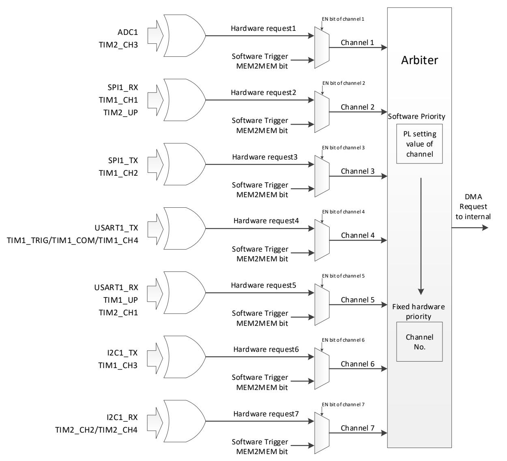  
图 8-1 DMA1 请求映像

表8-2 DMA1各通道外设映射表  

<table><tr><td>9Ni</td><td>i#j 1</td><td>ii 2</td><td>i# 3</td><td>ij 4</td><td>i5</td><td>i 6</td><td>i#j 7</td></tr><tr><td>ADC1</td><td>ADC1</td><td></td><td></td><td></td><td></td><td></td><td></td></tr><tr><td>SP11</td><td></td><td>SPI1_RX</td><td>SPI1_TX</td><td></td><td></td><td></td><td></td></tr><tr><td>USART1</td><td></td><td></td><td></td><td>USART1_TX</td><td>USART1_RX</td><td></td><td></td></tr><tr><td>I2C1</td><td></td><td></td><td></td><td></td><td></td><td>I2C1_TX</td><td>I2C1_RX</td></tr><tr><td>TIM1</td><td></td><td>T1M1_CH1</td><td>T1M1_CH2</td><td>T1M1_CH4 TIM1_TRIG TIM1_COM</td><td>T1M1_UP</td><td>T1M1_CH3</td><td></td></tr><tr><td>T IM2</td><td>T1M2_CH3</td><td>T1M2_UP</td><td></td><td></td><td>T1M2_CH1</td><td></td><td>T1M2_CH2 T IM2_CH4</td></tr></table>

# 8.3 寄存器描述

表8-3 DMA相关寄存器列表  

<table><tr><td></td><td>ij@ttt</td><td>##it</td><td></td></tr><tr><td>R32_DMA_INTFR</td><td>0x40020000</td><td>DMA +$</td><td>0x00000000</td></tr><tr><td>R32_DMA_INTFCR</td><td>0x40020004</td><td>DMA +$</td><td>0x00000000</td></tr><tr><td>R32_DMA_CFGR1</td><td>0x40020008</td><td>DMA jj 1 2$</td><td>0x00000000</td></tr><tr><td>R32_DMA_CNTR1</td><td>0x40020000</td><td>DMA jj1$</td><td>0x00000000</td></tr><tr><td>R32_DMA_PADDR1</td><td>0x40020010</td><td>DMA j#j 1 9liQtt$7</td><td>0x00000000</td></tr><tr><td>R32_DMA_MADDR1</td><td>0x40020014</td><td>DMA ij 11$</td><td>0x00000000</td></tr><tr><td>R32_DMA_CFGR2</td><td>0x4002001C</td><td>DMA jj 2 2</td><td>0x00000000</td></tr><tr><td>R32_DMA_CNTR2</td><td>0x40020020</td><td>DMA j#j 21</td><td>0x00000000</td></tr><tr><td>R32_DMA_PADDR2</td><td>0x40020024</td><td>DMA j#j 2 9littt$77</td><td>0x00000000</td></tr><tr><td>R32_DMA_MADDR2</td><td>0x40020028</td><td>DMA jj 2 1tt1</td><td>0x00000000</td></tr><tr><td>R32_DMA_CFGR3</td><td>0x40020030</td><td>DMA jj 3 C</td><td>0x00000000</td></tr><tr><td>R32_DMA_CNTR3</td><td>0x40020034</td><td>DMA i 31</td><td>0x00000000</td></tr><tr><td>R32_DMA_PADDR3</td><td>0x40020038</td><td>DMA ij 3 5Nittt$77</td><td>0x00000000</td></tr><tr><td>R32_DMA_MADDR3</td><td>0x4002003C</td><td>DMA jj 3 71#tbt$1</td><td>0x00000000</td></tr><tr><td>R32_DMA_CFGR4</td><td>0x40020044</td><td>DMA i 4 2$T</td><td>0x00000000</td></tr><tr><td>R32_DMA_CNTR4</td><td>0x40020048</td><td>DMA jj41$</td><td>0x00000000</td></tr><tr><td>R32_DMA_PADDR4</td><td>0x4002004C</td><td>DMA i#j 4 9littbtL77</td><td>0x00000000</td></tr><tr><td>R32_DMA_MADDR4</td><td>0x40020050</td><td>DMA j#j 41#t$1</td><td>0x00000000</td></tr><tr><td>R32_DMA_CFGR5</td><td>0x40020058</td><td>DMA j 5 </td><td>0x00000000</td></tr><tr><td>R32_DMA_CNTR5</td><td>0x4002005C</td><td>DMA j#j 51</td><td>0x00000000</td></tr><tr><td>R32_DMA_PADDR5</td><td>0x40020060</td><td>DMA j#j 5 5litttl7z</td><td>0x00000000</td></tr><tr><td>R32_DMA_MADDR5</td><td>0x40020064</td><td>DMA jj 5 71bt1</td><td>0x00000000</td></tr><tr><td>R32_DMA_CFGR6</td><td>0x4002006C</td><td>DMA ij 62$1</td><td>0x00000000</td></tr><tr><td>R32_DMA_CNTR6</td><td>0x40020070</td><td>DMA j#j 61$</td><td>0x00000000</td></tr><tr><td>R32_DMA_PADDR6</td><td>0x40020074</td><td>DMA i#j 6 9littt$7</td><td>0x00000000</td></tr><tr><td>R32_DMA_MADDR6</td><td>0x40020078</td><td>DMA jj 61tt1</td><td>0x00000000</td></tr><tr><td>R32_DMA_CFGR7</td><td>0x40020080</td><td>DMA ij 7 C$7</td><td>0x00000000</td></tr><tr><td>R32_DMA_CNTR7</td><td>0x40020084</td><td>DMA ij 7 1</td><td>0x00000000</td></tr><tr><td>R32_DMA_PADDR7</td><td>0x40020088</td><td>DMA j#j 7 9NiQttt$</td><td>0x00000000</td></tr><tr><td>R32_DMA_MADDR7</td><td>0x4002008C</td><td>DMA j#j 71#ttl$1</td><td>0x00000000</td></tr></table>

# 8.3.1 DMA 中断状态寄存器（DMA_INTFR）

偏移地址： $0 \times 0 0$

<table><tr><td>31</td><td>30</td><td>29</td><td>28</td><td>27</td><td>26</td><td>25</td><td>24</td><td>23</td><td>22</td><td></td><td>21</td><td>20</td><td>19 18</td><td></td><td>17</td><td>16</td></tr><tr><td></td><td>Reservede</td><td></td><td></td><td></td><td></td><td>TEIF7|HT1F7|TC1F7</td><td>GIF7</td><td></td><td>TEIF6|HT IF6|TCIF6</td><td></td><td></td><td>GIF6</td><td>TEIF5HT IF5TCIF5</td><td></td><td></td><td>GIF5</td></tr><tr><td>15</td><td>14</td><td>13</td><td>12</td><td>11</td><td>10</td><td>9</td><td>8</td><td></td><td>7</td><td>6</td><td>5</td><td>4</td><td>3</td><td>2</td><td>1</td><td>0</td></tr><tr><td>TEIF4|HTIF4|TCIF4</td><td></td><td></td><td>GIF4</td><td></td><td></td><td>TEIF3HT IF3TCIF3</td><td>GIF3</td><td></td><td>TEIF2|HT IF2|TCIF2</td><td></td><td></td><td></td><td></td><td></td><td></td><td>GIF2 |TEIF1HTIF1TCIF1GIF1</td></tr></table>

<table><tr><td>1</td><td></td><td>i3id]</td><td>##it</td><td></td></tr><tr><td>[31 : 28]</td><td>Reserved</td><td>RO</td><td>1R.</td><td>0</td></tr><tr><td>27/23/19/ 15/11/7/3</td><td>TE1Fx</td><td>RO</td><td>j#j x 1#i (x=1/2/3/4/5/6/7) . 1: #x 7#i; 0: #ix E1#i. A1#1, #1# CTE1Fx1;$U#.</td><td>0</td></tr><tr><td>26/22/18/ 14/10/6/2</td><td>HT IFx</td><td>RO</td><td>ij x 1i\t (x=1/2/3/4/5/6/7) o 1: x#71$# 0: #i#xE1#. A1#1, #1S CHT1Fx1.</td><td>0</td></tr><tr><td>25/21/17/ 13/9/5/1</td><td>TC|Fx</td><td>RO</td><td>j#j x 1#h (x=1/2/3/4/5/6/7) . 1: ix#71#$#; 0: i# x E1$#. A1#1, #1# CTC1Fx1.</td><td>0</td></tr><tr><td>24/20/16/ 12/8/4/0</td><td>G|Fx</td><td>RO</td><td>i#j xJ*F$ (x=1/2/3/4/5/6/7) . 1: #ij x E#7 TElFx gHT1Fx g TC1Fx; 0: #i#j x EiQ$ TE1Fx g HT1Fx g TC1Fxo A1#1, #1# CG1Fx1;$$.</td><td>0</td></tr></table>

# 8.3.2 DMA 中断标志清除寄存器 （DMA_INTFCR）

偏移地址： $0 \times 0 4$

<table><tr><td>31</td><td>30</td><td>29</td><td>28</td><td>27</td><td>26</td><td>25</td><td>24</td><td></td><td>23</td><td>22</td><td>21</td><td>20</td><td>19</td><td>18</td><td>17</td><td>16</td></tr><tr><td></td><td>Reser ved</td><td></td><td></td><td>CTEIF7</td><td>CHT IF7</td><td></td><td>CTCIF7|CG|F7</td><td></td><td>CTEIF6CHT IF6CTCIF6CGIF6CTEIF5</td><td></td><td></td><td></td><td></td><td>CHT IF5</td><td></td><td>CTCIF5|CGIF5</td></tr><tr><td>15</td><td>14</td><td>13</td><td>12</td><td>11</td><td>10</td><td>9</td><td>8</td><td></td><td>7</td><td>6</td><td>5</td><td>4</td><td>3</td><td>2</td><td>1</td><td>0</td></tr><tr><td>CTEIF4HTIF4CTCIF4CGIF4CTEIF3CHTIF3TCIF3CGIF3CTEIF2CHTIF2CTCIF2GIF2CTEIF1CHTIF1TCIF1CGIF1]</td><td></td><td></td><td></td><td></td><td></td><td></td><td></td><td></td><td></td><td></td><td></td><td></td><td></td><td></td><td></td><td></td></tr></table>

<table><tr><td>1i</td><td></td><td>iji</td><td>##it</td><td></td></tr><tr><td>[31: 28]</td><td>Reserved</td><td>RO</td><td>1RE9.</td><td>0</td></tr><tr><td>27/23/19/ 15/11/7/3</td><td>CTE|Fx</td><td>Wo</td><td>jj x #i (x=1/2/3/4/5/6/7) . 1: DMA_1NTFR $17 TE1Fx; 0: F1F.</td><td>0</td></tr><tr><td>26/22/18/ 14/10/6/2</td><td>CHT 1Fx</td><td>wo</td><td>ij x1 (x=1/2/3/4/5/6/7) . 1: DMA_1NTFR $77 HT1Fx; O: FF.</td><td>0</td></tr><tr><td>25/21/17/ 13/9/5/1</td><td>CTC|Fx</td><td>wo</td><td>ij x 1#h (x=1/2/3/4/5/6/7) . 1: DMA_1NTFR$T7 TC1Fx; O: FF.</td><td>0</td></tr><tr><td>24/20/16/ 12/8/4/0</td><td>CG|Fx</td><td>wo</td><td>$ij x Jf (x=1/2/3/4/5/6/7) . 1:i DMA_1NTFR $17#3+ TE1Fx/HT1Fx/TC1Fx/ G1Fx$; O: FE1FM.</td><td>0</td></tr></table>

# 8.3.3 DMA 通道 $\pmb { \times }$ 配置寄存器（DMA_CFGRx） （ $\mathbf { x } \mathbf { = } \mathbf { \cdot }$ 1/2/3/4/5/6/7）

偏移地址： $0 \times 0 8 + ( \times - 1 ) \times 2 0$

<table><tr><td>31</td><td>30</td><td>29</td><td>28</td><td>27</td><td>26</td><td>25</td><td>24</td><td>23</td><td>22</td><td>21</td><td>20</td><td>19</td><td>18</td><td>17</td><td>16</td></tr><tr><td colspan="12">Reserved</td></tr><tr><td>15</td><td>14</td><td>13</td><td colspan="2">12 11</td><td colspan="2">10 9</td><td>7</td><td>6</td><td>5</td><td>4</td><td></td><td>3</td><td>2 1</td><td></td><td>0</td></tr><tr><td>Reser ved</td><td>MEM2 MEM</td><td>PL[1:0]</td><td></td><td colspan="2">MSIZE[1: 0]</td><td colspan="2">PSIZE[1 : 0]</td><td>MINC</td><td>PINC</td><td>CIRC</td><td>DIR</td><td>TEIE</td><td>HTIE</td><td>TCIE</td><td>EN</td></tr></table>

<table><tr><td>1i</td><td></td><td>iji8</td><td>#it</td><td></td></tr><tr><td>[31 : 15]</td><td>Reserved</td><td>RO</td><td>1RE.</td><td>0</td></tr><tr><td>14</td><td>MEM2MEM</td><td>RW</td><td>1F1i# J1i$t1AE. 1: 1A11#1; 0:#F1i1i1</td><td>0</td></tr><tr><td>[13:12]</td><td>PL[1:0]</td><td>RW</td><td>i#ti. 00 E; 01: +; 10: ; 11: #.</td><td>0</td></tr><tr><td>[11:10]</td><td>MSIZE[1: 0]</td><td>RW</td><td>T71#tbt#i. 00: 8; 01: 16; 10: 32 ; 11: 1.</td><td>0</td></tr><tr><td>[9:8]</td><td>PSIZE[1: 0]</td><td>RW</td><td>5ittt##i&amp;. 00: 8; 01: 16; 10: 32 ; 11: 1.</td><td>0</td></tr><tr><td>7</td><td>MINC</td><td>RW</td><td>71bE. 1: 11#$#*1F; 0: #1i#t1RTt*1F.</td><td>0</td></tr><tr><td>6</td><td>PINC</td><td>RW</td><td>9littbt$1E. 1:1Ait@1F; 0: 5Kittt#Tt#1F.</td><td>0</td></tr><tr><td>5</td><td>CIRC</td><td>RW</td><td>DMA i#jT1AE. 1: 1AT*1F; 0: #1*1F.</td><td>0</td></tr><tr><td>4 DIR</td><td></td><td>RW</td><td>##1. 1: M1i; 0: Mii#.</td><td>0</td></tr><tr><td>3 TEIE</td><td></td><td>RW</td><td>1$#i+F1AEt$J. 1: 11+; 0: #1i+. 1+1AE$J.</td><td>0</td></tr><tr><td>2 HTIE</td><td></td><td>RW</td><td>1: +; 0: #+. 1$$h+FA$J.</td><td>0</td></tr><tr><td>1 TCIE</td><td></td><td>RW</td><td>1: 1A+ #+.</td><td>0</td></tr><tr><td>0 EN</td><td></td><td>RW</td><td></td><td>0</td></tr></table>

<table><tr><td></td><td></td><td>1: i;</td><td>0: i. DMA 1#i, 1zt{ 0, iii.</td></tr></table>

# 8.3.4 DMA 通道 $\pmb { \times }$ 传输数据数目寄存器（DMA_CNTRx） （x=1/2/3/4/5/6/7）

偏移地址： $0 \times 0 0 + ( x - 1 ) \times 2 0$

<table><tr><td>31</td><td>30</td><td>29</td><td>28</td><td>27</td><td>26</td><td>25</td><td>24</td><td></td><td>23</td><td>22</td><td>21</td><td>20</td><td>19</td><td>18</td><td>17</td><td>16</td></tr><tr><td></td><td colspan="10">Reserved</td><td></td><td></td><td></td><td></td><td></td><td></td></tr><tr><td>15</td><td>14</td><td>13</td><td>12</td><td>11</td><td>10</td><td>9</td><td>8</td><td></td><td>7</td><td>6</td><td>5</td><td>4</td><td>3</td><td>2</td><td>1</td><td>0</td></tr><tr><td>NDT [15: 0]</td><td colspan="10"></td><td></td><td></td><td></td><td></td><td></td><td></td></tr></table>

<table><tr><td>1</td><td></td><td>ii</td><td>t#it</td><td></td></tr><tr><td>[31 : 16]</td><td>Reserved</td><td>RO</td><td>1R.</td><td>0</td></tr><tr><td>[15:0]NDT[15:0]</td><td></td><td>RW</td><td>, 0-65535. iX$17AEijTI1F (DMA_CFGRx AJ EN=O) ASX. i#@ARi$##Ri, t*$J 11 DMA1.</td><td>0</td></tr></table>

u\$EN=0A2 EN=1f, Ri\$\*1\$1# j 0Aj, FiEi#iJT, #BT1I1##1\$#j

# 8.3.5 DMA 通道 $\pmb { \times }$ 外设地址寄存器（DMA_PADDRx） （x=1/2/3/4/5/6/7）

偏移地址： $0 \times 1 0 + ( \times - 1 ) \times 2 0$

31 30 29 28 27 26 25 24 23 22 21 20 19 18 17 16 15 14 13 12 11 10 9 8 7 6 5 4 3 2 1 0

PA[31:0]

<table><tr><td>1</td><td></td><td>i</td><td>t#it</td><td></td></tr><tr><td>[31:0]PA[31:0]</td><td></td><td>RW</td><td>ylitttt, 1F9i##1$#Aitttl. PS1ZE[10]=01 16), bit0, t#1Fttj2#x;PS1ZE[1:0]= 10 32 1) ,ttzJm bit[1:0], t#1Ftttj4#</td><td>0</td></tr></table>

ii: ut\$7aRAEf EN=0 AfE2, EN=1 AfTaJ5.

# 8.3.6 DMA 通道 $\pmb { \times }$ 存储器地址寄存器（DMA_MADDRx） （x=1/2/3/4/5/6/7）

偏移地址： $0 \times 1 4 + ( \times - 1 ) \times 2 0$

31 30 29 28 27 26 25 24 23 22 21 20 19 18 17 16 15 14 13 12 11 10 9 8 7 6 5 4 3 2 1 0

MA[31:0]

<table><tr><td>1</td><td></td><td>ii</td><td>##it</td><td></td></tr><tr><td>[31 : 0]</td><td>MA[31 : 0]</td><td>RW</td><td>11i###t,1F##1#itbtt. MSIZE[1:0]= &#x27;01&#x27; (16),tt bit0,</td><td>0</td></tr></table>

<table><tr><td></td><td></td><td>t.</td><td>t1Fttbtj2#x;MSIZE[1:0]= 10&#x27; 32 1)  tt bit[1:0], t#1Ftbtj 4#</td></tr></table>

i: ut\$1#RA EN=0AJE2, EN=1 AfTaJS.

# 第 9章 模拟/数字转换（ADC）

ADC模块包含1个10位的逐次逼近型的模拟数字转换器，最高允许24MHz的输入时钟。支持8个外部通道和2个内部信号源采样源。可完成通道的单次转换、连续转换，通道间自动扫描模式、间断模式、外部触发模式、双重采样、触发延迟等功能。可以通过模拟看门狗功能监测通道电压是否在阈值范围内。

# 9.1 主要特性

$\bullet$ 10位分辨率  
$\bullet$ 支持8个外部通道和2个内部信号源采样  
$\bullet$ 多通道的多种采样转换方式：单次、连续、扫描、触发、间断等  
$\bullet$ 数据对齐模式：左对齐、右对齐  
$\bullet$ 采样时间可按通道分别编程  
$\bullet$ 规则转换和注入转换均支持外部触发  
$\bullet$ 模拟看门狗监测通道电压，自校准功能  
$\bullet$ ADC通道输入范围： $0 \leqslant V _ { \mathsf { I N } } \leqslant V _ { \mathsf { D O A } }$   
$\bullet$ 触发延迟

# 9.2 功能描述

# 9.2.1 模块结构

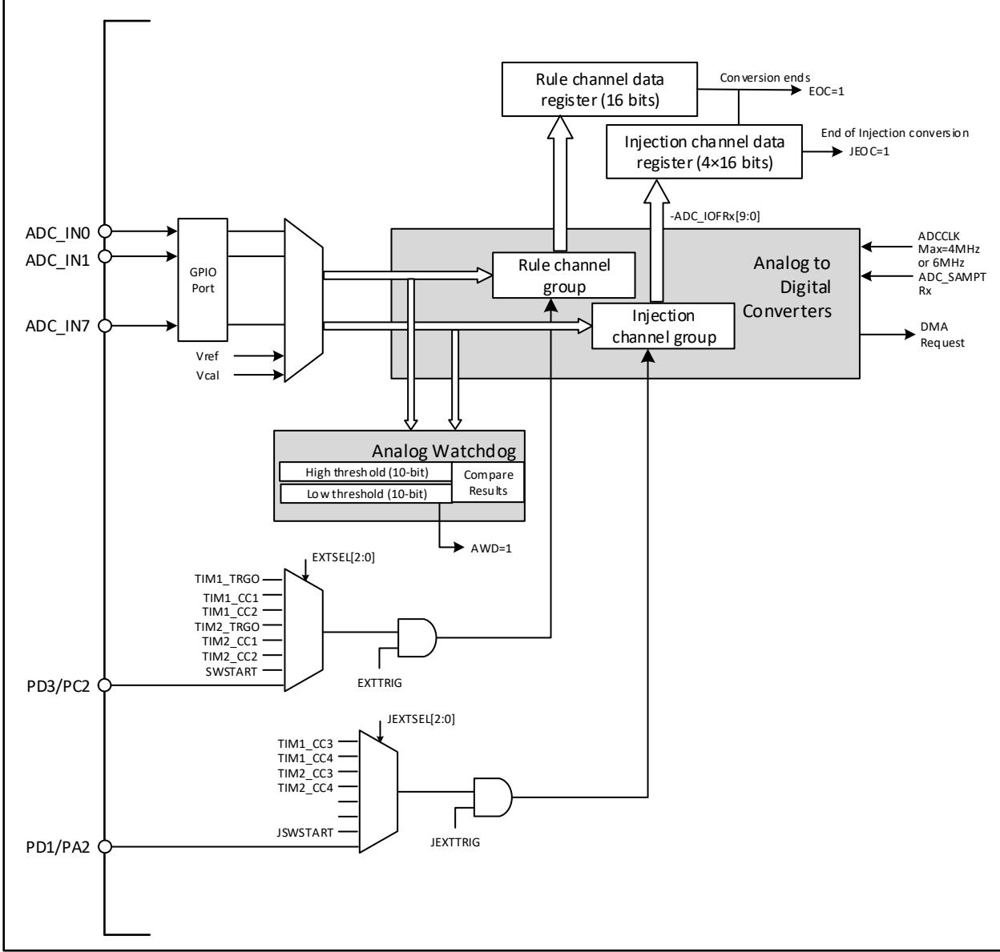  
图 9-1 ADC 模块框图

# 9.2.2 ADC 配置

# 1）模块上电

ADC_CTLR2寄存器的ADON位为1表示ADC模块上电。当ADC模块从断电模式（ $\therefore A D O N = 0$ ）下进入上电状态（ $\Delta D O N = 1$ ）后，需要延迟一段时间tSTAB用于模块稳定时间。之后再次写入ADON位为1，用于作为软件启动ADC转换的启动信号。通过清除ADON位为0，可以终止当前转换并将ADC模块置于断电模式，这个状态下，ADC 几乎不耗电。

# 2）采样时钟

模块的寄存器操作基于AHBCLK（AHB总线）时钟，其转换单元的时钟基准ADCCLK，由RCC_CFGR0寄存器的ADCPRE域配置分频，详细信息参考数据手册CH32V003DS0。

# 3）通道配置

ADC模块提供了10个通道采样源，包括8个外部通道和2个内部通道。它们可以配置到两种转换组中：规则组和注入组。以实现任意多个通道上以任意顺序进行一系列转换构成的组转换。

# 转换组：

$\bullet$ 规则组：由多达16个转换组成。规则通道和它们的转换顺序在ADC_RSQRx寄存器中设置。规则组中转换的总数量应写入ADC_RSQR1寄存器的L[3:0]中。  
$\bullet$ 注入组：由多达4个转换组成。注入通道和它们的转换顺序在ADC_ISQR寄存器中设置。注入组里的转换总数量应写入ADC_ISQR寄存器的JL[1:0]中。

ADC_RSQRx ADC1SQRT2,#F #iXJ ADC lX\$##ifAJ2o

2个内部通道：

$\bullet$ Vref内部参考电压：连接ADC_IN8通道。  
$\bullet$ Vcal内部校准电压：连接ADC_IN9通道，2档可选。

# 4）校准

ADC有一个内置自校准模式。经过校准环节可大幅减小因内部电容器组的变化而造成的精准度误差。在校准期间，在每个电容器上都会计算出一个误差修正码，用于消除在随后的转换中每个电容器上产生的误差。

通过写 ADC_CTLR2 寄存器的 RSTCAL 位置 1 初始化校准寄存器，等待 RSTCAL 硬件清 0 表示初始化完成。置位CAL位，启动校准功能，一旦校准结束，硬件会自动清除CAL位，将校准码存储到ADC_RDATAR中。之后可以开始正常的转换功能。建议在ADC模块上电时执行一次ADC校准。iE ADCFADON=1j>ADC #

# 5）可编程采样时间

ADC使用若干个ADCCLK周期对输入电压采样，通道的采样周期数目可以通过ADC_SAMPTR1和ADC_SAMPTR2 寄存器中的 $\mathsf { S M P } \times [ 2 : 0 ]$ 位更改。每个通道可以分别使用不同的时间采样。总转换时间如下计算：

TCONV $\underline { { \underline { { \mathbf { \delta \pi } } } } }$ 采样时间 $+ 1 1 \mathsf { T } _ { \mathsf { A D C C L K } }$

ADC的规则通道转换支持DMA功能。规则通道转换的值储存在一个仅有的数据寄存器ADC_RDATAR中，为防止连续转换多个规则通道时，没有及时取走 ADC_RDATAR 寄存器中的数据，可以开启 ADC的 DMA 功能。硬件会在规则通道的转换结束时（EOC 置位）产生 DMA 请求，并将转换的数据从ADC_RDATAR 寄存器传输到用户指定的目的地址。

对 DMA 控制器模块的通道配置完成后，写 ADC_CTLR2 寄存器的 DMA 位置 1，开启 ADC 的 DMA 功能。i: i\H\$T# DMA IAE

# 6）数据对齐

ADC_CTLR2寄存器中的ALIGN位选择ADC转换后的数据存储对齐方式。10位数据支持左对齐和右对齐模式。

规则组通道的数据寄存器 ADC_RDATAR 保存的是实际转换的 10 位数字值；而注入组通道的数据寄存器ADC_IDATARx是实际转换的数据减去ADC_IOFRx寄存器的定义的偏移量后写入的值，会存在正负情况，所以有符号位（SIGNB）。

表9-1 数据左对齐  
规则组数据寄存器  

<table><tr><td>D9</td><td>D8</td><td>D7</td><td>D6</td><td>D5</td><td>D4</td><td> D3</td><td>D2</td><td>D1</td><td>DO</td><td>0</td><td></td><td></td><td></td><td></td><td></td></tr></table>

注入组数据寄存器  

<table><tr><td>SIGNB</td><td>D9</td><td>D8</td><td>D7</td><td>D6</td><td>D5</td><td>D4</td><td>D3</td><td> D2</td><td>D1</td><td>DO</td><td></td><td></td><td></td><td></td><td></td></tr></table>

# 表9-2 数据右对齐

规则组数据寄存器  

<table><tr><td></td><td></td><td></td><td></td><td></td><td></td><td>D9</td><td>D8</td><td>D7</td><td>D6</td><td>D5</td><td>D4</td><td>D3</td><td>D2</td><td>D1</td><td>DO</td></tr></table>

注入组数据寄存器  

<table><tr><td>SIGNB</td><td>SIGNB</td><td>SIGNB</td><td>SIGNB</td><td>SIGNB</td><td>SIGNB</td><td>D9</td><td>D8</td><td>D7</td><td>D6</td><td>D5</td><td>D4</td><td>D3</td><td>D2</td><td>D1</td><td>DO</td></tr></table>

# 9.2.3 外部触发源

ADC 转换的启动事件可以由外部事件触发。如果设置了 ADC_CTLR2 寄存器的 EXTTRIG 或JEXTTRIG 位，则可分别通过外部事件触发规则组或注入组通道的转换。此时，EXTSEL[2:0]和JEXTSEL[2:0]位的配置决定规则组和注入组的外部事件源。i #B#13ADC###, Hi\$

表9-3 规则组通道的外部触发源  

<table><tr><td>EXTSEL [2 : 0]</td><td></td><td>*</td></tr><tr><td>000</td><td>A1  TRGO $1</td><td rowspan="5">*EA3</td></tr><tr><td>001</td><td>A1  CC1 $1#</td></tr><tr><td>010</td><td>AJ 1  CC2 $1</td></tr><tr><td>011</td><td>AJ 2 AJ TRGO $1#</td></tr><tr><td>100</td><td>A 2 J CC1 $1#</td></tr><tr><td>101</td><td>A 2  CC2 $1#</td><td></td></tr><tr><td>110</td><td>PD3/PC2 $1#</td><td>*5I#B31AtP</td></tr><tr><td>111</td><td>SWSTART #1#</td><td>#X1#t$J1</td></tr></table>

表9-4注入组通道的外部触发源  

<table><tr><td>JEXTSEL [2: 0]</td><td></td><td>*</td></tr><tr><td>000</td><td>1  CC3 1#</td><td rowspan="5">*E</td></tr><tr><td>001</td><td>A1  CC4 $1</td></tr><tr><td>010</td><td>A 2  CC3 $1</td></tr><tr><td>011</td><td>A 2  CC4 $1</td></tr><tr><td>100</td><td></td></tr><tr><td>101</td><td></td><td></td></tr><tr><td>110</td><td>PD1/PA2</td><td>*9I#B31Atp</td></tr><tr><td>111</td><td>JSWSTART #1#</td><td>#1#t$J1z</td></tr></table>

# 9.2.4 转换模式

表9-5 转换模式组合  

<table><tr><td colspan="5">ADC_CTLR1 F ADC_CTLR2 73t$J1</td><td rowspan="2">ADC$t</td></tr><tr><td>CONT</td><td>SCAN</td><td>RDISCEN/IDISCENJAUTOE</td><td></td><td>$</td></tr><tr><td rowspan="3">0</td><td>0</td><td>0</td><td>0</td><td>ADON 1</td><td>#. Xit #ii#</td></tr><tr><td></td><td></td><td></td><td>AIt ADON |1</td><td>3#t tFxi+AFF#i</td></tr><tr><td>1</td><td>0</td><td>0</td><td></td><td>i(ADC_RSQRx) 3tFF;i2i#j(ADC_1SQR) #1$</td></tr></table>

<table><tr><td rowspan="7">1</td><td></td><td></td><td>1</td><td>ADON 1</td><td>##st#i#$+al i#j$;18#Xi#ijTtG#J j(ADC_RSQRx)gtFF#;j#j(ADC_1SQR) iAst ##Ji$#ZR, i ai#ji$ i: ##iFTti#W;\i#j9#B#</td></tr><tr><td>0</td><td>1 (RDI SCEN F IDISCEN TAE</td><td>0</td><td>Ait</td><td>$, t FlJ(D1SCNUM[2:0]X#) ij##, ID1SCEN F RD1SCEN, TAEJAJJ#QJ@HF;</td></tr><tr><td></td><td>Af(J1)</td><td></td><td></td><td>#.</td></tr><tr><td>1</td><td>1</td><td>1 x</td><td></td><td># ttt. FEutt.</td></tr><tr><td>0</td><td>0</td><td>0 0</td><td>ADON  1</td><td>i$i/3# $** #EA2$, J CONT 0AEE.</td></tr></table>

i#QF;A9#A\$1#Tt#AJ, M ACON 1RAEh#Qi@\$FF

# 1）单次单通道转换模式

此模式下，对当前1个通道只执行一次转换。该模式对规则组或注入组中排序第1的通道执行转换，其中通过设置ADC_CTLR2寄存器的ADON位置1(只适用于规则通道)启动也可通过外部触发启动(适用于规则通道或注入通道)。一旦选择通道的转换完成将：

如果转换的是规则组通道，则转换数据被储存在 16 位 ADC_RDATAR 寄存器中，EOC 标志被置位，如果设置了EOCIE位，将触发ADC中断。

如果转换的是注入组通道，则转换数据被储存在 16 位 ADC_IDATAR1 寄存器中，EOC 和 JEOC 标志被置位，如果设置了 JEOCIE 或 EOCIE 位，将触发 ADC 中断。

# 2）单次扫描模式转换

通过设置ADC_CTLR1寄存器的SCAN位为1进入ADC扫描模式。此模式用来扫描一组模拟通道，对被ADC_RSQRx寄存器(对规则通道)或ADC_ISQR(对注入通道)选中的所有通道逐个执行单次转换，当前通道转换结束时，同一组的下一个通道被自动转换。

在扫描模式里，根据JAUTO位的状态，又分为触发注入方式和自动注入方式。

# $\bullet$ 触发注入

JAUTO 位为 0，当在扫描规则组通道过程中，发生了注入组通道转换的触发事件，当前转换被复位，注入通道的序列被以单次扫描方式进行，在所有选中的注入组通道扫描转换结束后，恢复上次被中断的规则组通道转换。

如果当前在扫描注入组通道序列时，发生了规则通道的启动事件，注入组转换不会被中断，而是在注入序列转换完成后再执行规则序列的转换。

1 iE#iKF/5.1, \$ \$j 28ADCCLK,;ij#iP| 29ADCCLK.

$\bullet$ 自动注入

JAUTO位为1，在扫描完规则组选中的所有通道转换后，自动进行注入组选中通道的转换。这种方式可以用来转换ADC_RSQRx和ADC_ISQR寄存器中多达20个转换序列。

此模式里，必须禁止注入通道的外部触发（JEXTTRI $\mathtt { G } = 0$ ）。F ADC## (ADCPRE[1:0]) 48f #tJ5##tJ#Q5JA 1ADCCLK jJ ADC \$F## 2 f,  2间隔的延迟。

# 3）单次间断模式转换

通过设置ADC_CTLR1寄存器的RDISCEN或IDISCEN位为1进入规则组或注入组的间断模式。此模式区别扫描模式中扫描完整的一组通道，而是将一组通道分为多个短序列，每次外部触发事件将执行一个短序列的扫描转换。

短序列的长度 n（ $\scriptstyle \mathbf { n } < = 8 .$ ）定义在 ADC_CTLR1 寄存器的 DISCNUM[2:0]中，当 RDISCEN 为 1，则是规则组的间断模式，待转换总长度定义在ADC_RSQR1寄存器的L[3:0]中；当IDISCEN为1，则是注入组的间断模式，待转换总长度定义在ADC_ISQR寄存器的JL[1:0]中。不能同时将规则组和注入组设置为间断模式。

规则组间断模式举例：

RDISCEN=1，DISCNUM[2:0] $^ { = 3 }$ ， $L \left[ 3 : 0 \right] = 8$ ，待转换通道 $\cdot = 1$ ，3，2，5，8，4，10，6第1次外部触发：转换序列为：1，3，2第2次外部触发：转换序列为：5，8，4第3次外部触发：转换序列为：10，6，同时产生EOC事件第4次外部触发：转换序列为：1，3，2注入组间断模式举例：IDISCEN=1，DISCNUM $\left[ 2 : 0 \right] = 1$ ，JL $[ 1 : 0 ] = 3$ ，待转换通道 $\mathop { : = } 1$ ，3，2第1次外部触发：转换序列为：1第2次外部触发：转换序列为：3第3次外部触发：转换序列为：2，同时产生EOC和JEOC事件第4次外部触发：转换序列为：1

1.# \*T7###, T\$7\$.  
2. T1s; $\scriptstyle \left( J A U T O = 1 \right.$

# 4）连续转换

在连续转换模式中，当前面ADC转换一结束马上就启动另一次转换，转换不会在选择组的最后一个通道上停止，而是再次从选择组的第一个通道继续转换。此模式的启动事件包括外部触发事件和ADON位置1，设置启动后，需将CONT位置1。

如果一个规则通道被转换，转换数据被存储于 ADC_RDATAR 寄存器中，转换结束标志 EOC 被置位，如果设置了EOCIE，则产生中断。

如果一个注入通道被转换，转换数据被存储于ADC_IDATARx寄存器中，注入转换结束标志JEOC被置位，如果设置了JEOCIE，则产生中断。

# 9.2.5 模拟看门狗

如果被ADC转换的模拟电压低于低阈值或高于高阈值，AWD模拟看门狗状态位被设置。阈值设

置位于 ADC_WDHTR 和 ADC_WDLTR 寄存器的最低 10 个有效位中。通过设置 ADC_CTLR1 寄存器的 AWDIE位以允许产生相应中断。

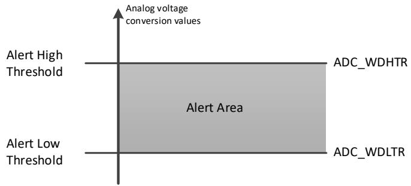  
图9-2 模拟看门狗阈值区

配置 ADC_CTLR1 寄存器的 AWDSGL、AWDEN、JAWDEN 及 AWDCH[4:0]位选择模拟看门狗警戒的通道，具体关系见下表：

表9-6 模拟看门狗通道选择  

<table><tr><td rowspan="2"></td><td colspan="4">ADC_CTLR1 T7t$J1</td></tr><tr><td>AWDSGL</td><td>AWDEN</td><td>JAWDEN</td><td>AWDCH[4: 0]</td></tr><tr><td>T#</td><td></td><td>0</td><td>0</td><td></td></tr><tr><td></td><td>0</td><td>0</td><td>1</td><td></td></tr><tr><td>FF$QJji#j</td><td>0</td><td>1</td><td>0</td><td></td></tr><tr><td></td><td>0</td><td>1</td><td>1</td><td></td></tr><tr><td></td><td>1</td><td>0</td><td>1</td><td>i</td></tr><tr><td>#Ji#</td><td>1</td><td>1</td><td>0</td><td></td></tr><tr><td></td><td>1</td><td>1</td><td>1</td><td></td></tr></table>

# 9.3 寄存器描述

表9-7 ADC相关寄存器列表  

<table><tr><td></td><td>iji@#tt</td><td>##it</td><td></td></tr><tr><td>R32_ADC_STATR</td><td>0x40012400</td><td>ADC$</td><td>0x00000000</td></tr><tr><td>R32_ADC_CTLR1</td><td>0x40012404</td><td>ADC $J1</td><td>0x00000000</td></tr><tr><td>R32_ADC_CTLR2</td><td>0x40012408</td><td>ADC t$ 2</td><td>0x00000000</td></tr><tr><td>R32_ADC_SAMPTR1</td><td>0x4001240C</td><td>ADC j1</td><td>0x00000000</td></tr><tr><td>R32_ADC_SAMPTR2</td><td>0x40012410</td><td>ADC #j 2</td><td>0x00000000</td></tr><tr><td>R32_ADC_1OFR1</td><td>0x40012414</td><td>ADC iii#37 1</td><td>0x00000000</td></tr><tr><td>R32_ADC_1OFR2</td><td>0x40012418</td><td>ADC iii#37 2</td><td>0x00000000</td></tr><tr><td>R32_ADC_1OFR3</td><td>0x4001241C</td><td>ADC ii#3 3</td><td>0x00000000</td></tr><tr><td>R32_ADC_1OFR4</td><td>0x40012420</td><td>ADC ii#3 4</td><td>0x00000000</td></tr><tr><td>R32_ADC_WDHTR</td><td>0x40012424</td><td>ADC i</td><td>0x00000000</td></tr><tr><td>R32_ADC_WDLTR</td><td>0x40012428</td><td>ADC ij1$1</td><td>0x00000000</td></tr><tr><td>R32_ADC_RSQR1</td><td>0x4001242C</td><td>ADC #Jij 1</td><td>0x00000000</td></tr><tr><td>R32_ADC_RSQR2</td><td>0x40012430</td><td>ADC #Jj#jFJ$ 2</td><td>0x00000000</td></tr><tr><td>R32_ADC_RSQR3</td><td>0x40012434</td><td>ADC #Jij1 3</td><td>0x00000000</td></tr><tr><td>R32_ADC_1SQR</td><td>0x40012438</td><td>ADC iXi#jF5J$1</td><td>0x00000000</td></tr><tr><td>R32_ADC_1DATAR1</td><td>0x4001243C</td><td>ADC i#1</td><td>0x00000000</td></tr></table>

<table><tr><td>R32_ADC_IDATAR2</td><td>0x40012440</td><td>ADC ;# 2</td><td>0x00000000</td></tr><tr><td>R32_ADC_IDATAR3</td><td>0x40012444</td><td>ADC # 3</td><td>0x00000000</td></tr><tr><td>R32_ADC_IDATAR4</td><td>0x40012448</td><td>ADC i## 4</td><td>0x00000000</td></tr><tr><td>R32_ADC_RDATAR</td><td>0x4001244C</td><td>ADC #1 8</td><td>0x00000000</td></tr><tr><td>R32_ADC_DLYR</td><td>0x40012450</td><td>ADC 3EjR$TF </td><td>0x00000000</td></tr></table>

# 9.3.1 ADC 状态寄存器（ADC_STATR）

偏移地址： $0 \times 0 0$

<table><tr><td>31</td><td>30</td><td>29</td><td>28</td><td>27</td><td>26</td><td>25</td><td>24</td><td></td><td>23</td><td>22</td><td>21</td><td>20</td><td>19</td><td>18</td><td>17</td><td>16</td></tr><tr><td></td><td colspan="14">Reserved</td></tr><tr><td>15</td><td>14</td><td>13</td><td>12</td><td>11</td><td>10</td><td>9</td><td></td><td>8</td><td>7</td><td>6</td><td>5</td><td>4</td><td>3</td><td>2</td><td>1</td><td></td></tr><tr><td>Reserved</td><td colspan="14"></td><td>JSTRT</td></tr></table>

<table><tr><td>1</td><td></td><td>iji</td><td>##it</td><td></td></tr><tr><td>[31:5]</td><td>Reserved</td><td>RO</td><td>1R.</td><td>0</td></tr><tr><td>4</td><td>STRT</td><td>RWO</td><td>1: #JiETtA; 0:#]i#*TtH. i#1, $0(51) .</td><td>0</td></tr><tr><td>3</td><td>JSTRT</td><td>RWO</td><td>iai#it 1: i\i#@EtA; 0: i\i#$*F. i1#1, $0 (51F) .</td><td>0</td></tr><tr><td>2</td><td>JEOC</td><td>RWO</td><td>i\i##*. 1: #; O: #t*. i1#1 (F#;i#$) ##;0 (51F) .</td><td>0</td></tr><tr><td>1</td><td>EOC</td><td>RWO</td><td>$*. 1: #; O: #t*. i1#1#];i$*), #</td><td>0</td></tr><tr><td>0</td><td>AWD</td><td>RWO</td><td>1#;# 0 (S1 F) siADC_RDATARAJ;#. 1: i; 0: iti$#. i11#1 $t1 ADC_WDHTR F ADC_WDLTR $), $0 (51) .</td><td>0</td></tr></table>

# 9.3.2 ADC 控制寄存器 1（ADC_CTLR1）

偏移地址： $0 \times 0 4$

<table><tr><td>31</td><td>30</td><td>29</td><td>28</td><td>27</td><td>26 25</td><td>24</td><td>23</td><td>22</td><td>21</td><td>20</td><td>19</td><td>18</td><td>17</td><td>16</td></tr><tr><td></td><td></td><td>Reserved</td><td></td><td></td><td>CALVOL [1: 0]</td><td>Reserved</td><td>AWDEN</td><td>JAWDEN</td><td></td><td></td><td>Reserved</td><td></td><td></td><td></td></tr></table>

<table><tr><td>15</td><td>14 13</td><td>12</td><td>11</td><td>10</td><td>9</td><td>8</td><td>7</td><td>6</td><td>5</td><td>4</td><td>3</td><td></td><td>2</td><td>1</td></tr><tr><td>DISCNUM[2 : 0]</td><td></td><td>JDISC EN</td><td>DISC EN</td><td>JAUTO</td><td>AWD SGL</td><td></td><td>SCAN</td><td>JEOC IE</td><td>AWDIE</td><td>EoC IE</td><td></td><td></td><td>AWDCH[4 : 0]</td><td></td></tr></table>

<table><tr><td>1</td><td></td><td>ii</td><td>#it</td><td></td></tr><tr><td>[31: 27]</td><td>Reserved</td><td>RO</td><td>RE.</td><td>0</td></tr><tr><td>[26:25]</td><td>CALVOL [1 : 0]</td><td>RW</td><td>#. 01: 2/4 AVDD; 10: /3/4 AVDD;</td><td>01</td></tr><tr><td>24</td><td>Reserved</td><td>RO R.</td><td>#it F.</td><td>0</td></tr><tr><td>23</td><td>AWDEN</td><td>RW</td><td>1: # Ai; 0: #Ji#i EXti7j.</td><td>0</td></tr><tr><td>22</td><td>JAWDEN</td><td>RW</td><td>1 </td><td>0</td></tr><tr><td>[21:16]</td><td>Reserved</td><td>RO 1R.</td><td>o: ii.</td><td>0</td></tr><tr><td></td><td>[15:13]DISCNUM[2:0]</td><td>RW ..</td><td>000: 1; 111: 8i.</td><td>0</td></tr><tr><td>12 11</td><td>JD I SCEN</td><td>RW</td><td>1: a t; 0: i;i#Eht.</td><td>0</td></tr><tr><td></td><td>DISCEN</td><td>RW</td><td>1:1Aj; 0: #Ji#iEa. F#i#t, z$i. 1: 1$</td><td>0</td></tr><tr><td>10</td><td>JAUTO</td><td>RW</td><td>;:ttt##;j#j#B#IAE. t3#stT, #i#iE1tti1A{.</td><td>0</td></tr><tr><td>9</td><td>AWDSGL</td><td>RW</td><td>1ij1iAWDCH[4:0]i); 0: iE1Mi #3##t1Ae1</td><td>0</td></tr><tr><td>8</td><td>SCAN</td><td>RW</td><td>1: 1AEt#tt &lt;iE$t ADC_1OFRx F ADC_RSQRx jA9FFii); 0: #tt.</td><td>0</td></tr><tr><td>7</td><td>JEOCIE</td><td>RW</td><td>i#i$*+1A. 1: 1Aij+(JEOC);</td><td>0</td></tr><tr><td>6</td><td>AWDIE</td><td>RW</td><td>0: i$+.</td><td>0</td></tr></table>

<table><tr><td></td><td></td><td></td><td>1:1Ai; 0: ii. i: #3#tT, tnRut+f3t#</td><td></td></tr><tr><td>5</td><td>EOCIE</td><td>RW</td><td>###* (#]stiiAi#i) +h1A. 1: 1A* (EOC); 0: i*.</td><td>0</td></tr><tr><td>[4:0]</td><td>AWDCH [4 : 0]</td><td>RW</td><td>1tiJiii1. 00000 t0; 00001: 1; 01111: i15.</td><td>0</td></tr></table>

# 9.3.3 ADC 控制寄存器 2（ADC_CTLR2）

偏移地址： $0 \times 0 8$

<table><tr><td>31</td><td>30</td><td>29</td><td>28</td><td>27</td><td>26</td><td>25</td><td>24</td><td>23</td><td>22</td><td>21</td><td>20</td><td>19</td><td>18</td><td>17</td><td>16</td></tr><tr><td></td><td></td><td></td><td></td><td>Reserved</td><td></td><td></td><td></td><td></td><td>SW STARTSTART</td><td>JSW</td><td>EXT TRIG</td><td>EXTSEL [2: 0]</td><td></td><td></td><td>Reser ved</td></tr><tr><td>15</td><td>14</td><td>13</td><td>12</td><td>11</td><td>10</td><td>9</td><td>8</td><td>7</td><td>6</td><td>5</td><td>4</td><td>3</td><td>2</td><td>1</td><td>0</td></tr><tr><td>JEXT TRIG</td><td></td><td>JEXTSEL[2: 0]</td><td></td><td>AL I GN</td><td>Reserved</td><td></td><td>DMA</td><td></td><td>Reserved</td><td></td><td></td><td>RST CAL</td><td>CAL</td><td>CONT</td><td>ADON</td></tr></table>

<table><tr><td>1i</td><td></td><td></td><td>##it</td><td></td></tr><tr><td>[31: 23]</td><td>Reserved</td><td>RO</td><td>1R.</td><td>0</td></tr><tr><td>22</td><td>SWSTART</td><td>RW</td><td>j#ii$, #i#. 1:#Ji$ 0: . u1$11, #t1#; 0.</td><td>0</td></tr><tr><td>21</td><td>JSWSTART</td><td>RW</td><td>i$, #i##. 1:i$ 0: . ut1$1#1, #T1#; 0 s$#; 0.</td><td>0</td></tr><tr><td>20</td><td>EXTTRIG</td><td>RW</td><td>1: 1$ 0: AE.</td><td>0</td></tr><tr><td>[19:17]EXTSEL[2:0]</td><td></td><td>RW</td><td>000: A1  TRGO $1; 001: 1 CC1 010: 1  CC2 $; 011: 2 TRGO $; 100:2 CC1 101: 2CC2 ; 110: PD3/PC2 $1; 111: SWSTART $1.</td><td>0</td></tr><tr><td>16</td><td>Reserved</td><td>RO R.</td><td></td><td>0</td></tr></table>

<table><tr><td>15</td><td>JEXTTRIG</td><td>RW</td><td>iijAB$1AE. 1: $ 0: i$#AE.</td><td>0</td></tr><tr><td></td><td>[14:12]JEXTSEL[2:0]</td><td>RW</td><td>ii$A#B$1#i. 000:  1  CC3 ; 001:  1  CC4 $; 010:  2 CC3 ; 011:  2  CC4 100: 1; 101: 1; 110: PD1/PA2; 111: JSWSTART 1#.</td><td>0</td></tr><tr><td>11</td><td>AL IGN</td><td>RW</td><td>##. 1: x 0: x.</td><td>0</td></tr><tr><td>[10:9]</td><td>Reserved</td><td>RO</td><td>R. t171i#iji] (DMA) tt1AE.</td><td>0</td></tr><tr><td>8</td><td>DMA</td><td>RW</td><td>1: 1AE DMA t; 0: i] DMA t#t.</td><td>0</td></tr><tr><td>[7:4] 3</td><td>Reserved RSTCAL</td><td>RO RW</td><td>1R. , $#, 0. 1: 1 0: t$1. i: tARE#i#1##Aji RSTCAL, i#F$t$# A/Dt, i$, t$*#; 0.</td><td>0 0</td></tr><tr><td>2 1</td><td>CAL CONT</td><td>RW RW</td><td>1: F+; O: t. $AE. 1: j; : .</td><td>0 0</td></tr><tr><td></td><td></td><td></td><td>tnRi 7 tt{, $i#i#1TJi1# JF/ A/D$. i1 0 Aj, SX1 y#t ADC FtstF; i1j, 3A1$.</td><td></td></tr><tr><td>0</td><td>ADON</td><td>RW</td><td>1: JF ADC #J$#; 0: i] ADC$/tE, #i#\ftt. i $##ADON2j, $, tpRi##11I1ix1t, JJT##$#</td><td>0</td></tr></table>

# 9.3.4 ADC 采样时间配置寄存器 1（ADC_SAMPTR1）

偏移地址： $0 \times 0 0$

<table><tr><td>31</td><td>30</td><td>29</td><td>28</td><td>27</td><td>26</td><td>25</td><td>24</td><td>23</td><td>22</td><td>21</td><td>20</td><td>19</td><td>18</td><td>17</td><td>16</td></tr><tr><td></td><td></td><td></td><td></td><td></td><td></td><td></td><td>Reserved</td><td></td><td></td><td></td><td></td><td></td><td></td><td></td><td>SMP15[2: 1]</td></tr><tr><td>15</td><td>14</td><td>13</td><td>12</td><td>11</td><td>10</td><td>9</td><td>8</td><td>7</td><td>6</td><td>5</td><td>4</td><td>3</td><td>2</td><td>1</td><td>0</td></tr></table>

<table><tr><td>SMP15 [0]</td><td>SMP14[2: 0]</td><td>SMP13[2: 0]</td><td>SMP12[2: 0]</td><td>SMP11 [2: 0]</td><td>SMP10[2: 0]</td></tr></table>

<table><tr><td>1i</td><td></td><td>iji]</td><td>##it</td><td></td></tr><tr><td>[31: 18]</td><td>Reserved</td><td>RO</td><td>1R.</td><td>0</td></tr><tr><td>[17:0]SMPx[2:0]</td><td></td><td>RW</td><td>SMPx[2:0]:jjx []2 000: 3 ; 001: 9 ; 010:15 ; 011: 30 ; 100: 43 ; 101: 57 ; 110:73 ; 111: 241 ;</td><td>0</td></tr></table>

# 9.3.5 ADC 采样时间配置寄存器 2（ADC_SAMPTR2）

偏移地址： $0 \times 1 0$

<table><tr><td>31</td><td>30</td><td>29 28</td><td>27</td><td>26</td><td>25 24</td><td>23</td><td>22 SMP7[2: 0]</td><td>21</td><td>20 19</td><td>18</td><td>17 16</td><td></td></tr><tr><td>Reserved</td><td></td><td>SMP9 [2 : 0]</td><td>12 11</td><td></td><td>SMP8 [2 : 0]</td><td>8</td><td>7</td><td>6</td><td>5 4</td><td>SMP6[2: 0] 3</td><td>2</td><td>SMP5[2:1]</td></tr><tr><td>15</td><td colspan="3">14 13</td><td colspan="2">10 9</td><td colspan="3"></td><td colspan="3">SMP1 [2: 0]</td><td colspan="2">1 0 SMPO[2: 0]</td></tr><tr><td>SMP5 [0]</td><td colspan="3">SMP4[2: 0]</td><td colspan="2">SMP3[2: 0]</td><td colspan="2">SMP2 [2: 0]</td><td colspan="2"></td><td colspan="3"></td></tr></table>

<table><tr><td>1</td><td></td><td>iji]</td><td>##it</td><td></td></tr><tr><td>[31: 30]</td><td>Reserved</td><td>RO</td><td>1R.</td><td>0</td></tr><tr><td rowspan="5">[29:0]SMPx[2:0]</td><td rowspan="5"></td><td rowspan="5">RW</td><td>SMPx[2:0]:jjx K[]2.</td><td></td></tr><tr><td>000: 3 ; 001: 9 ;</td><td></td></tr><tr><td>010: 15; 011: 30;</td><td></td></tr><tr><td>100: 43 101: 57;</td><td></td></tr><tr><td>110:73 ; 111: 241; ix#Fi##f], K#</td><td></td></tr></table>

# 9.3.6 ADC 注入通道数据偏移寄存器 $\pmb { \times }$ （ADC_IOFRx） （x=1/2/3/4）

偏移地址： $0 \times 1 4 + ( \times - 1 ) \times 4$

<table><tr><td>31</td><td>30</td><td>29</td><td>28</td><td>27</td><td>26</td><td>25</td><td>24</td><td>23</td><td>22</td><td>21</td><td></td><td>20</td><td>19 18</td><td>17</td><td>16</td></tr><tr><td>Reserved</td><td colspan="13"></td></tr><tr><td>15</td><td>14</td><td>13</td><td>12</td><td>11</td><td>10</td><td>9</td><td>8</td><td>7</td><td>6</td><td>5</td><td>4</td><td>3</td><td>2</td><td>1</td><td>0</td></tr><tr><td></td><td colspan="5">Reserved</td><td colspan="10">JOFFSETx[9: 0]</td></tr></table>

<table><tr><td>1</td><td></td><td>ii</td><td>##it</td><td></td></tr><tr><td>[31:10]</td><td>Reserved</td><td>RO</td><td>1R.</td><td>0</td></tr><tr><td>[9: 0]</td><td>JOFFSETx[11: 0]</td><td>RW</td><td>iij x #3. ##i#i, ixMX7#F$### yA#1 #ARaJ ADC_1DATARx $17 +i$.</td><td>0</td></tr></table>

# 9.3.7 ADC 看门狗高阈值寄存器（ADC_WDHTR）

偏移地址： ${ 0 } { \times 2 4 }$

<table><tr><td>31</td><td>30</td><td>29</td><td>28</td><td>27</td><td>26</td><td></td><td>25 24</td><td></td><td>23</td><td>22</td><td>21</td><td>20</td><td>19</td><td>18</td><td>17</td><td>16</td></tr><tr><td></td><td colspan="3"></td><td colspan="3"></td><td colspan="3">Reserved</td><td></td><td></td><td></td><td></td><td></td><td></td></tr><tr><td>15</td><td>14</td><td>13</td><td>12</td><td>11</td><td>10</td><td>9</td><td>8</td><td>7</td><td>6</td><td>5</td><td></td><td>4</td><td>3 2</td><td>1</td><td>0</td></tr><tr><td colspan="5">Reserved</td><td colspan="14"></td></tr><tr><td></td><td colspan="3"></td><td></td><td colspan="3"></td><td></td><td></td><td>HT[9: 0]</td><td></td><td></td><td></td><td></td><td></td></tr></table>

<table><tr><td>1</td><td></td><td>ii</td><td>#it</td><td></td></tr><tr><td>[31 : 10]</td><td>Reser ved</td><td>RO</td><td>RE.</td><td></td></tr><tr><td>[9 : 0]</td><td>HT [9 : 0]</td><td>RW</td><td>i.</td><td>0</td></tr></table>

i: aJ\$2 WDHTRFA WDLTR 1jT#

# 9.3.8 ADC 看门狗低阈值寄存器（ADC_WDLTR）

偏移地址： $_ { 0 \times 2 8 }$

<table><tr><td>31</td><td>30</td><td>29</td><td>28</td><td>27</td><td>26</td><td>25</td><td>24</td><td>23</td><td></td><td>22</td><td>21</td><td>20</td><td>19</td><td>18</td><td>17</td><td>16</td></tr><tr><td>Reserved</td><td colspan="10"></td><td></td><td></td><td></td><td></td><td></td><td></td></tr><tr><td>15</td><td>14</td><td>13</td><td>12</td><td>11</td><td>10</td><td>9</td><td>8</td><td>7</td><td>6</td><td></td><td>5</td><td>4</td><td>3</td><td>2</td><td>1</td><td>0</td></tr><tr><td></td><td colspan="6">Reserved</td><td colspan="10">LT[9:0]</td></tr></table>

<table><tr><td>1</td><td></td><td>ii</td><td>#it</td><td></td></tr><tr><td>[31 : 10]</td><td>Reser ved</td><td>RO</td><td>RE.</td><td></td></tr><tr><td>[9 : 0]</td><td>LT [9 : 0]</td><td>RW</td><td></td><td>0</td></tr></table>

i: aJ\$i2 WDHTRFA WDLTR 11i]T

# 9.3.9 ADC 规则通道序列寄存器 1（ADC_RSQR1）

偏移地址： $\mathtt { 0 } \mathtt { x } 2 0$

<table><tr><td>31</td><td>30</td><td>29</td><td>28</td><td>27</td><td>26</td><td>25</td><td>24</td><td>23</td><td>22</td><td>21</td><td>20</td><td>19</td><td>18</td><td>17 16</td></tr><tr><td colspan="7">Reserved</td><td colspan="3"></td><td colspan="3">L[3:0]</td><td>SQ16[4:1]</td><td></td></tr><tr><td>15</td><td>14</td><td>13</td><td>12</td><td>11</td><td>10</td><td>9</td><td>8</td><td>7</td><td>6</td><td>5</td><td>4 3</td><td></td><td>2</td><td>1 0</td></tr><tr><td>SQ16[0]</td><td colspan="4">SQ15[4: 0]</td><td colspan="4">SQ14[4:0]</td><td colspan="5">SQ13[4: 0]</td></tr></table>

<table><tr><td>1i</td><td></td><td></td><td>##it</td><td></td></tr><tr><td>[31 : 24]</td><td>Reser ved</td><td>RO</td><td>RE.</td><td>0</td></tr><tr><td>[23 : 20]</td><td>L[3: 0]</td><td>RW</td><td>#ji. 0000-1111: 1-16 </td><td>0</td></tr><tr><td>[19 : 15]</td><td>SQ16[4:0]</td><td>RW</td><td>#JF5J+16#ij# (0-9) .</td><td>0</td></tr><tr><td>[14:10]</td><td>SQ15[4: 0]</td><td>RW</td><td>#F5J 15#i (0-9).</td><td>0</td></tr><tr><td>[9 : 5]</td><td>SQ14[4:0]</td><td>RW</td><td>#JF5J+14#tii# (0-9) .</td><td>0</td></tr><tr><td>[4: 0]</td><td>SQ13[4: 0]</td><td>RW</td><td>#JJ13#i# (O-9).</td><td>0</td></tr></table>

# 9.3.10 ADC 规则通道序列寄存器 2（ADC_RSQR2）

偏移地址： $\mathtt { 0 } { \times } 3 0$

<table><tr><td>31</td><td>30</td><td>29</td><td>28 27</td><td>26</td><td>25</td><td>24</td><td>23</td><td>22 21</td><td>20</td><td>19</td><td>18</td><td>17</td><td>16</td></tr><tr><td colspan="2">Reserved</td><td colspan="4">SQ12[4:0]</td><td colspan="4">SQ11[4:0]</td><td colspan="3">SQ10[4:1]</td><td></td></tr><tr><td>15</td><td colspan="4">14 13 12 11</td><td colspan="5">10 9 8 7 6 5 0</td><td colspan="4">4 3 2 1</td></tr><tr><td>SQ10[0]</td><td colspan="4">SQ9 [4:0]</td><td colspan="4">SQ8[4: 0]</td><td colspan="4">SQ7[4:0]</td></tr></table>

<table><tr><td>1i</td><td></td><td></td><td>##it</td><td></td></tr><tr><td>[31 : 30]</td><td>Reserved</td><td>RO</td><td>1R.</td><td>0</td></tr><tr><td>[29 : 25]</td><td>SQ12 [4: 0]</td><td>RW</td><td>]FJ12#ij (0-9) .</td><td>0</td></tr><tr><td>[24: 20]</td><td>SQ11 [4: 0]</td><td>RW</td><td>#JFJ11##ii# (0-9) .</td><td>0</td></tr><tr><td>[19:15]</td><td>SQ10[4: 0]</td><td>RW</td><td>#F5J 10##ii (0-9).</td><td>0</td></tr><tr><td>[14:10]</td><td>SQ9 [4: 0]</td><td>RW</td><td>#J5J+ 9#i#i# (0-9).</td><td>0</td></tr><tr><td>[9:5]</td><td>SQ8[4: 0]</td><td>RW</td><td>#]F5JA 81##i#j# (0-9) .</td><td>0</td></tr><tr><td>[4:0]</td><td>SQ7[4:0]</td><td>RW</td><td>#JF5J7##i# (0-9) .</td><td>0</td></tr></table>

# 9.3.11 ADC 规则通道序列寄存器 3（ADC_RSQR3）

偏移地址： $0 \times 3 4$

<table><tr><td>31</td><td>30</td><td>29</td><td>28</td><td>27</td><td>26</td><td>25</td><td>24 23</td><td>22</td><td>21</td><td>20</td><td>19</td><td>18</td><td>17</td><td>16</td></tr><tr><td>Reserved</td><td colspan="2"></td><td colspan="4">SQ6[4:0]</td><td colspan="4">SQ5[4:0]</td><td colspan="4">SQ4[4:1]</td></tr><tr><td>15</td><td colspan="4">14 13 12 11 7</td><td colspan="5">10 8</td><td colspan="5">4 3 2 1 0</td></tr><tr><td>SQ4[0]</td><td colspan="4">SQ3[4:0]</td><td colspan="4">SQ2[4: 0]</td><td colspan="5">SQ1 [4:0]</td></tr></table>

<table><tr><td>1i</td><td></td><td>ij]</td><td>##it</td><td></td></tr><tr><td>[31 : 30]</td><td>Reserved</td><td>RO</td><td>1R.</td><td>0</td></tr><tr><td>[29 : 25]</td><td>SQ6[4:0]</td><td>RW</td><td>#F5JA$6#ii(0-9) .</td><td>0</td></tr><tr><td>[24: 20]</td><td>SQ5 [4 : 0]</td><td>RW</td><td>#JF5J+5#ij# (0-9) </td><td>0</td></tr><tr><td>[19:15]</td><td>SQ4[4: 0]</td><td>RW</td><td>tJ5J+41#i#i# (0-9) .</td><td>0</td></tr><tr><td>[14:10]</td><td>SQ3[4: 0]</td><td>RW</td><td>#JF5J+ 3#tii (0-9) .</td><td>0</td></tr><tr><td>[9:5]</td><td>SQ2[4: 0]</td><td>RW</td><td>#JF5J+#$21#tij# (0-9).</td><td>0</td></tr><tr><td>[4:0]</td><td>SQ1 [4:0]</td><td>RW</td><td>JFJ+a$11#ii (0-9) .</td><td>0</td></tr></table>

# 9.3.12 ADC 注入通道序列寄存器（ADC_ISQR）

偏移地址： ${ 0 } { \times } \ 3 { 8 }$

<table><tr><td>31</td><td>30</td><td>29</td><td>28</td><td>27</td><td>26</td><td>25</td><td>24</td><td>23</td><td>22</td><td>21</td><td>20</td><td>19</td><td>18</td><td>17 16</td></tr><tr><td colspan="3"></td><td colspan="3">Reserved</td><td></td><td></td><td></td><td colspan="2">JL[1:0]</td><td colspan="3">JSQ4[4:1]</td></tr><tr><td>15</td><td>14</td><td>13</td><td>12</td><td>11</td><td>10</td><td>9 8</td><td></td><td>7</td><td>6</td><td>5 4</td><td colspan="3">3 2 1</td></tr><tr><td>JSQ4[0]</td><td colspan="5">JSQ3[4: 0]</td><td colspan="3">JSQ2 [4: 0]</td><td colspan="4">0 JSQ1 [4:0]</td></tr></table>

<table><tr><td>1</td><td></td><td></td><td>#it</td><td></td></tr><tr><td>[31 :22]</td><td>Reserved</td><td>RO</td><td>.</td><td></td></tr></table>

<table><tr><td>[21:20]JL[1: 0]</td><td></td><td>RW</td><td>i. 00-11: 1-4 .</td><td>0</td></tr><tr><td>[19:15]JSQ4[4:0]</td><td></td><td>RW</td><td>ii\5J4##i#i#3 (0-9) . i:##5\, ##i## 0-9) 2J 5A4</td><td>0</td></tr><tr><td>[14:10]</td><td>JSQ3 [4: 0]</td><td>RW</td><td>iF5J$3#ii# (0-9) .</td><td>0</td></tr><tr><td>[9:5]</td><td>JSQ2 [4:0]</td><td>RW</td><td>iAF5J$2#ii#3 (0-9) .</td><td>0</td></tr><tr><td>[4:0]</td><td>JSQ1 [4:0]</td><td>RW</td><td>i\F5J+$11$tii# (0-9) .</td><td>0</td></tr></table>

TF#\$#J, tn JL[1:0]#KJF4, QJ\$5F(4-JL) F 15!tA, $\downarrow \downarrow [ 1 : 0 ] = 3$ (F#+ 4 iR;i##) Af, ADC #tFF\$#i#i: $J S 0 1 [ 4 ; 0 ]$ $J S 0 2 [ 4 ; 0 ]$ :JSQ3[4:0] JSQ4[4: 0];   
$\scriptstyle { \mathcal { I } } L [ 1 : O ] = 2$ 3;#) , ADC#Mi JSQ2[4:0] JSQ3[4:0] FA $J S 0 4 [ 4 ; 0 ]$ ;   
$\scriptstyle { \mathcal { I } } L [ 1 : O ] = 1$ 2;) , ADC#i $J S 0 3 [ 4 ; 0 ]$ $J S 0 4 [ 4 ; 0 ]$ ;   
$\scriptstyle { \mathcal { I } } L [ 1 : O ] = O$ /1;K;##) j, ADC#1X\$ JSQ4[4:0]j#j.   
t ADCx_1SQR[21:O] $= 1 0$ 00111 00011 00111 00010, ADC #7##i: JSQ2[4:0]. $J S 0 3 [ 4 ; 0 ]$ F $J S 0 4 [ 4 ; 0 ]$ \*#\$Ti#ii#1: 73 7.

# 9.3.13 ADC 注入数据寄存器 $\pmb { \times }$ （ADC_IDATARx） （x=1/2/3/4）

偏移地址： $0 \times 3 0 + ( x - 1 ) \times 4$

<table><tr><td>31</td><td>30</td><td>29</td><td>28</td><td>27</td><td>26</td><td>25</td><td>24</td><td></td><td>23</td><td>22</td><td>21</td><td>20</td><td>19</td><td>18</td><td>17</td><td>16</td></tr><tr><td></td><td colspan="14"></td></tr><tr><td>15</td><td>14</td><td>13</td><td>12</td><td>11</td><td>10</td><td>9</td><td>8</td><td>Reserved</td><td>7</td><td>6</td><td>5</td><td>4</td><td>3</td><td>2</td><td>1</td><td></td></tr><tr><td></td><td></td><td></td><td></td><td></td><td></td><td></td><td>JDATA[15: 0]</td><td></td><td></td><td></td><td></td><td></td><td></td><td></td><td></td><td>0</td></tr><tr><td></td><td colspan="14"></td></tr></table>

<table><tr><td>1</td><td></td><td>in</td><td>#it</td><td></td></tr><tr><td>[31: 16]</td><td>Reserved</td><td>RO</td><td>1R.</td><td>0</td></tr><tr><td>[15: 0]</td><td>JDATA[15: 0]</td><td>RO</td><td>i\i#j$## (##x+x*).</td><td>0</td></tr></table>

# 9.3.14 ADC 规则数据寄存器（ADC_RDATAR）

偏移地址： $\mathtt { 0 } \mathtt { x } 4 0$

<table><tr><td>31</td><td>30</td><td>29</td><td>28</td><td>27</td><td>26</td><td>25</td><td></td><td>24</td><td>23</td><td>22</td><td>21</td><td>20</td><td>19</td><td>18</td><td>17</td><td>16</td></tr><tr><td></td><td></td><td></td><td></td><td></td><td></td><td></td><td></td><td>Reserved</td><td></td><td></td><td></td><td></td><td></td><td></td><td></td><td></td></tr><tr><td>15</td><td>14</td><td>13</td><td>12</td><td>11</td><td>10</td><td>9</td><td></td><td>8</td><td>7</td><td>6</td><td>5</td><td>4</td><td>3</td><td>2</td><td>1</td><td>0</td></tr><tr><td></td><td></td><td></td><td></td><td></td><td></td><td></td><td></td><td>DATA[15:0]</td><td></td><td></td><td></td><td></td><td></td><td></td><td></td><td></td></tr></table>

<table><tr><td>1</td><td></td><td>ini</td><td>#it</td><td></td></tr><tr><td>[31 : 16]</td><td>Reserved</td><td>RO</td><td>1R</td><td>0</td></tr><tr><td>[15:0]</td><td>DATA[15: 0]</td><td>RO</td><td>(##x**).</td><td>0</td></tr></table>

# 9.3.15 ADC 延迟数据寄存器（ADC_DLYR）

偏移地址： $_ { 0 \times 5 0 }$

<table><tr><td>31</td><td>30</td><td>29</td><td>28</td><td>27</td><td>26</td><td>25</td><td>24</td><td>23</td><td>22</td><td>21</td><td>20</td><td>19</td><td>18</td><td>17</td><td>16</td></tr></table>

<table><tr><td colspan="10">Reserved</td></tr><tr><td>15 14 8</td><td>13 12</td><td>11 10</td><td>9</td><td>7</td><td>6</td><td>5</td><td>4</td><td>3 2</td><td>1</td><td>0</td></tr><tr><td></td><td>Reserved</td><td></td><td>DLYSR</td><td></td><td></td><td>DLYVLU[8: 0]</td><td></td><td></td><td></td><td></td></tr></table>

<table><tr><td>1</td><td></td><td>iji]</td><td>##it</td><td></td></tr><tr><td>[31:10]</td><td>Reser ved</td><td>RO</td><td>1RE.</td><td>0</td></tr><tr><td>9</td><td>DLYSRC</td><td>RW</td><td>5lBiFEiRi. 1: ii#Bi.</td><td>0</td></tr><tr><td>[8:0]</td><td>DLYVLU[8: 0]</td><td>RW</td><td>#Bi# 3Eij $1 ADC #A.</td><td>0</td></tr></table>

# 第 10 章 高级定时器 （ADTM）

高级定时器模块包含一个功能强大的 16 位自动重装定时器 TIM1，可用于测量脉冲宽度或产生脉冲、PWM波等。用于电机控制、电源等领域。

# 10.1 主要特征

高级定时器TIM1的主要特征包括：

$\bullet$ 16位自动重装计数器，支持增计数模式，减计数模式和增减计数模式  
$\bullet$ 16 位预分频器，分频系数从 $1 { \sim } 6 5 5 3 6$ 之间动态可调  
$\bullet$ 支持四路独立的比较捕获通道  
$\bullet$ 每路比较捕获通道支持多种工作模式，比如：输入捕获，输出比较，PWM生成和单脉冲输出  
$\bullet$ 支持可编程死区时间的互补输出  
$\bullet$ 支持外部信号控制定时器  
$\bullet$ 支持使用重复计数器在确定周期后更新定时器  
$\bullet$ 支持使用刹车信号将定时器复位或置其于确定状态  
$\bullet$ 支持在多种模式下使用 DMA  
$\bullet$ 支持增量式编码器  
$\bullet$ 支持定时器之间的级联和同步

# 10.2 原理和结构

本节主要论述高级定时器的内部构造。

# 10.2.1 概述

如图10-1，高级定时器的结构大致可以分为三部分，即输入时钟部分，核心计数器部分和比较捕获通道部分。

高级定时器的时钟可以来自于AHB总线时钟（CK_INT），可以来自外部时钟输入引脚（TIMx_ETR），亦可以来自于其他具有时钟输出功能的定时器（ITRx），还可以来自于比较捕获通道的输入端（TIMx_CHx）。这些输入的时钟信号经过各种设定的滤波分频等操作后成为 CK_PSC 时钟，输出给核心计数器部分。另外，这些复杂的时钟来源还可以作为TRGO输出给其他的定时器和ADC等外设。

高级定时器的核心是一个 16 位计数器（CNT）。CK_PSC 经过预分频器（PSC）分频后，成为 CK_CNT并输出给 CNT，CNT 支持增计数模式、减计数模式和增减计数模式，并有一个自动重装值寄存器（ATRLR）在每个计数周期结束后为 CNT 重装载初始值。另外还有个辅助计数器在一旁计数 ATRLR为CNT重装载初值的次数，当次数达到重复计数值寄存器（RPTCR）里设置的次数时，可以产生特定事件。

高级定时器拥有四组比较捕获通道，每组比较捕获通道都可以从专属的引脚上输入脉冲，也可以向引脚输出波形，即比较捕获通道支持输入和输出模式。比较捕获寄存器每个通道的输入都支持滤波、分频和边沿检测等操作，并支持通道间的互触发，还能为核心计数器CNT提供时钟。每个比较捕获通道都拥有一组比较捕获寄存器（ $\mathsf { C H } \times \mathsf { C V R } )$ ），支持与主计数器（CNT）进行比较而输出脉冲。

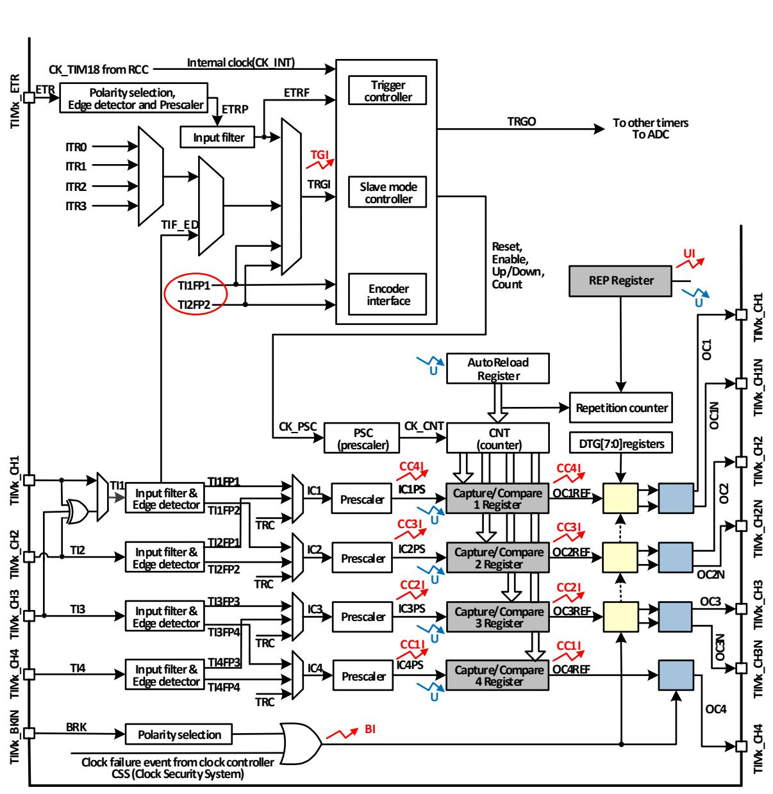  
图10-1 高级定时器的结构框图

# 10.2.2 时钟输入

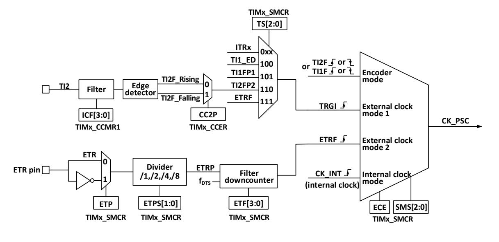  
图 10-2 高级定时器的 CK_PSC 来源框图

高级定时器CK_PSC的时钟来源很多，可以分为4类：

1） 外部时钟引脚（ETR）输入时钟的路线：ETR ETRP ETRF；  
2） 内部 AHB 时钟输入路线：CK_INT；  
3） 来自比较捕获通道引脚（TIMx_CHx）的路线：TIMx_CHx→TIx→TIxFPx，此路线也用于编码器模式；  
4） 来自内部其他定时器的输入：ITRx；通过决定CK_PSC来源的SMS的输入脉冲选择可以将实际的操作分为4类：  
1） 选择内部时钟源（CK_INT）；  
2） 外部时钟源模式 1；  
3） 外部时钟源模式 2；  
4） 编码器模式；上文提到的 4 种时钟源来源都可通过这 4 种操作选定。

# 10.2.2.1 内部时钟源（CK_INT）

如果将 SMS 域保持 000b 时启动高级定时器，那么就是选定内部时钟源（CK_INT）为时钟。此时CK_INT 就是 CK_PSC。

# 10.2.2.2 外部时钟源模式 1

如果将SMS域设置为111b时，就会启用外部时钟源模式1。启用外部时钟源1时，TRGI被选定为 CK_PSC 的来源，值得注意的，还需要通过配置 TS 域来选择 TRGI 的来源。TS 域可选择以下几种脉冲作为时钟来源：

1） 内部触发（ITRx， $\mathsf { x }$ 为 0,1,2,3）；  
2） 比较捕获通道1经过边缘检测器后的信号（TI1F_ED）；  
3） 比较捕获通道的信号 TI1FP1、TI2FP2；  
4） 来自外部时钟引脚输入的信号ETRF。

# 10.2.2.3 外部时钟源模式 2

使用外部触发模式2能在外部时钟引脚输入的每一个上升沿或下降沿计数。将ECE位置位时，将使用外部时钟源模式 2。使用外部时钟源模式 2 时，ETRF 被选定为 CK_PSC。ETR 引脚经过可选的

反相器（ETP），分频器（ETPS）后成为ETRP，再经过滤波器（ETF）后即成为ETRF。

在ECE位置位且将SMS设为111b时，相当于TS选择ETRF为输入。

# 10.2.2.4 编码器模式

将SMS置为001b，010b，011b将会启用编码器模式。启用编码器模式可以选择在TI1FP1和TI2FP2中某一个特定的电平下以另一个跳变沿作为信号进行信号输出。此模式用于外接编码器使用的情况下。具体功能参考10.3.9节。

# 10.2.3 计数器和周边

CK_PSC输入给预分频器（PSC）进行分频。PSC是16位的，实际的分频系数相当于R16_TIMx_PSC的值 $+ 1$ 。CK_PSC 经过 PSC 会成为 CK_INT。更改 R16_TIM1_PSC 的值并不会实时生效，而会在更新事件后更新给PSC。更新事件包括UG位清零和复位。定时器的核心是一个16位计数器（CNT），CK_CNT最终会输入给CNT，CNT支持增计数模式、减计数模式和增减计数模式，并有一个自动重装值寄存器（ATRLR）在每个计数周期结束后为CNT重新装载初始值。另外还有个辅助计数器在一旁记录ATRLR为CNT重新装载初值的次数，当达到重复计数值寄存器（RPTCR）里设置的次数时，可以产生特定事件。

# 10.2.4 比较捕获通道和周边

比较捕获通道是定时器实现复杂功能的主要组件，它的核心是比较捕获寄存器，辅以外围输入部分的数字滤波，分频和通道间复用、输出部分的比较器和输出控制组成。

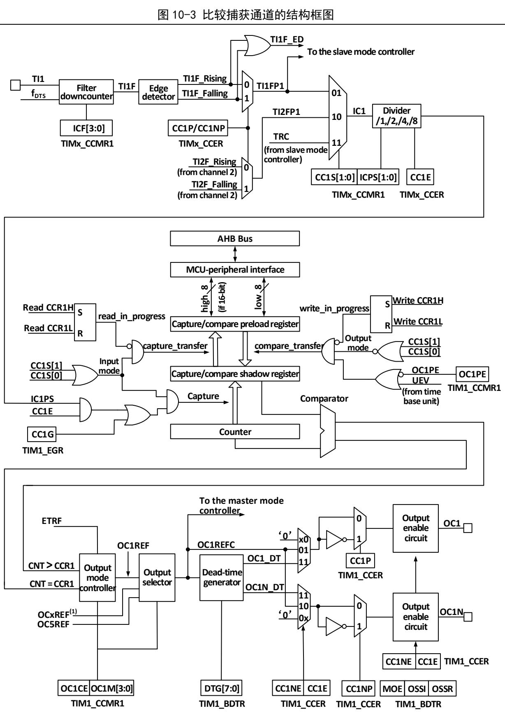

比较捕获通道的结构框图如图10-3所示。信号从通道 $\mathsf { x }$ 引脚输入进来后可选做为TIx（TI1的来源可以不只是 CH1，见定时器的结构框图 10-1），TI1 经过滤波器（ICF[3:0]）生成 TI1F，再经过边沿检测器分成 TI1F_Rising 和 TI1F_Falling，这两个信号经过选择（CC1P）生成 TI1FP1，TI1FP1和来自通道 2 的 TI2FP1 一起送给 CC1S 选择成为 IC1，经过 ICPS 分频后送给比较捕获寄存器。

比较捕获寄存器由一个预装载寄存器和一个影子寄存器组成，读写过程仅操作预装载寄存器。

在捕获模式下，捕获发生在影子寄存器上，然后复制到预装载寄存器；在比较模式下，预装载寄存器的内容被复制到影子寄存器中，然后影子寄存器的内容与核心计数器（CNT）进行比较。

# 10.3 功能和实现

高级定时器复杂功能的实现都是对定时器的比较捕获通道、时钟输入电路和计数器及周边部分的操作实现的。定时器的时钟输入可以来自于包括比较捕获通道的输入在内的多个时钟源。对比较捕获通道和时钟源选择的操作直接决定其功能。比较捕获通道是双向的，可以工作在输入和输出模式。

# 10.3.1 输入捕获模式

输入捕获模式是定时器的基本功能之一。输入捕获模式的原理是，当检测到 ${ \mathsf { I C X P S } }$ 信号上确定的边沿后，则发生捕获事件，计数器当前的值会被锁存到比较捕获寄存器（R16_TIMx_CHCTLRx）中。发生捕获事件时， ${ \mathsf { C C } } \times { \mathsf { I F } }$ （在 R16_TIMx_INTFR 中）被置位，如果使能了中断或 DMA，还会产生相应中断或DMA。如果发生捕获事件时， ${ \mathsf { C C } } \times { \mathsf { I F } }$ 已经被置位了，那么 ${ \tt C C } \tt { \times 0 } \tt { 5 }$ 位会被置位。 ${ \tt C C } \times { \tt I F }$ 可由软件清除，也可以通过读取比较捕获寄存器由硬件清除。 ${ \tt C C } \tt { \times 0 } \tt { 5 }$ 由软件清除。

举个通道1的例子来说明使用输入捕获模式的步骤，如下：

1） 配置 $\mathtt { C C } \mathtt { x } \mathtt { S }$ 域，选择 $1 0 \times$ 信号的来源。比如设为 10b，选择 TI1FP1 作为 IC1 的来源，而不可以使用默认设置， $\mathtt { C C } \mathtt { x S }$ 域默认是使比较捕获模块作为输出通道；  
2） 配置 ${ | 0 \times | }$ 域，设定TI信号的数字滤波器。数字滤波器会以确定的频率，采样确定的次数，再输出一个跳变。这个采样频率和次数是通过 ${ | 0 \times | }$ 来确定的；  
3） 配置 $\mathtt { C C } \mathtt { x } \mathtt { P }$ 位，设定 ${ \mathsf { T } } { \mathsf { I } } { \mathsf { x } } { \mathsf { F } } { \mathsf { P } } { \mathsf { x } }$ 的极性。比如保持CC1P位为低，选择上升沿跳变；  
4） 配置 ${ \mathsf { I C X P S } }$ 域，设定 $1 0 \times$ 信号成为 ${ \mathsf { I C X P S } }$ 之间的分频系数。比如保持 ${ \mathsf { I C X P S } }$ 为 00b，不分频；  
5） 配置 $\mathtt { C C } \mathtt { x } \mathtt { E }$ 位，允许捕获核心计数器（CNT）的值到比较捕获寄存器中。置 CC1E 位；  
6） 根据需要配置 $\mathsf { C C } \mathsf { \times } { \mathsf { I E } }$ 和 $\complement 0 \times \mathsf { D E }$ 位，决定是否允许使能中断或DMA。至此已经将比较捕获通道配置完成。

当TI1输入了一个被捕获的脉冲时，核心计数器（CNT）的值会被记录到比较捕获寄存器中，CC1IF被置位，当 CC1IF 在之前就已经被置位时，CCIOF 位也会被置位。如果 CC1IE 位，那么会产生一个中断；如果CC1DE被置位，会产生一个DMA请求。可以通过写事件产生寄存器（TIMx_SWEVGR）的方式由软件产生一个输入捕获事件。

# 10.3.2 比较输出模式

比较输出模式是定时器的基本功能之一。比较输出模式的原理是在核心计数器（CNT）的值与比较捕获寄存器的值一致时，输出特定的变化或波形。 $0 0 \times 1 1$ 域（在 R16_TIMx_CHCTLRx 中）和 $\mathtt { C C } \mathtt { x } \mathtt { P }$ 位（在R16_TIMx_CCER中）决定输出的是确定的高低电平还是电平翻转。产生比较一致事件时还会置${ \mathsf { C C } } \times { \mathsf { I F } }$ 位，如果预先置了 $\mathsf { C C } \mathsf { \times } { \mathsf { I E } }$ 位，则会产生一个中断；如果预先设置了 $\complement 0 \times \mathsf { D E }$ 位，则会产生一个DMA 请求。

配置为比较输出模式的步骤为下：

1） 配置核心计数器（CNT）的时钟源和自动重装值；  
2） 设置需要对比的计数值到比较捕获寄存器（R16_TIMx_CHxCVR）中；  
3） 如果需要产生中断，置 $\complement 0 \times 1 \mathsf { E }$ 位；  
4） 保持 ${ 0 0 } \times { \mathsf E }$ 为 0，禁用比较寄存器的预装载寄存器；  
5） 设定输出模式，设置 $0 0 \times 1 1$ 域和 $\complement 0 \times \emptyset$ 位；  
6） 使能输出，置 $\mathtt { C C } \mathtt { x } \mathtt { E }$ 位；  
7） 置CEN位启动定时器。

# 10.3.3 强制输出模式

定时器的比较捕获通道的输出模式可以由软件强制输出确定的电平，而不依赖比较捕获寄存器的影子寄存器和核心计数器的比较。

具体的做法是将 ${ 0 0 } \times { 1 1 }$ 置为100b，即为强制将 ${ 0 0 } \times { \mathsf { R E F } }$ 置为低；或者将 $0 0 \times 1 1$ 置为101b，即为强制将 ${ 0 0 } \times { \mathsf { R E F } }$ 置为高。

需要注意的是，将 $0 0 \times 1 1$ 强制置为100b或者101b，内部核心计数器和比较捕获寄存器的比较过程还在进行，相应的标志位还在置位，中断和 DMA 请求还在产生。

# 10.3.4 PWM 输入模式

PWM 输入模式是用来测量 PWM 的占空比和频率的，是输入捕获模式的一种特殊情况。除下列区别外，操作和输入捕获模式相同：PWM 占用两个比较捕获通道，且两个通道的输入极性设为相反，其中一个信号被设为触发输入，SMS 设为复位模式。

例如，测量从TI1输入的PWM波的周期和频率，需要进行以下操作：

1） 将 TI1(TI1FP1)设为 IC1 信号的输入。将 CC1S 置为 01b；  
2） 将 TI1FP1 置为上升沿有效。将 CC1P 保持为 0；  
3） 将 TI1(TI1FP2)置为 IC2 信号的输入。将 CC2S 置为 10b；  
4） 选 TI1FP2 置为下降沿有效。将 CC2P 置为 1；  
5） 时钟源的来源选择 TI1FP1。将 TS 设为 101b；  
6） 将 SMS 设为复位模式，即 100b；  
7） 使能输入捕获。CC1E 和 CC2E 置位；  
这样比较捕获寄存器1的值就是PWM的周期，而比较捕获寄存器2的值就是其占空比。

# 10.3.5 PWM 输出模式

PWM输出模式是定时器的基本功能之一。PWM输出模式最常见的是使用重装值确定PWM频率，使用捕获比较寄存器确定占空比的方法。将 $0 0 \times 1 1$ 域中置110b或111b使用PWM模式1或模式2，置 ${ \tt O C } \times { \tt P E }$ 位使能预装载寄存器，最后置ARPE位使能预装载寄存器的自动重装载。由于在发生一个更新事件时，预装载寄存器的值才能被送到影子寄存器，所以在核心计数器开始计数之前，需要置 UG 位来初始化所有寄存器。在PWM模式下，核心计数器和比较捕获寄存器一直在进行比较，根据CMS位，定时器能够输出边沿对齐或中央对齐的PWM信号。

$\bullet$ 边沿对齐

使用边沿对齐时，核心计数器增计数或减计数，在PWM模式1的情景下，在核心计数器的值大于比较捕获寄存器时，OCxREF为高；当核心计数器的值小于比较捕获寄存器时（比如核心计数器增长到 R16_TIMx_ATRLR 的值而恢复成全 0 时），OCxREF 为低。

$\bullet$ 中央对齐

使用中央对齐模式时，核心计数器运行在增计数和减计数交替进行的模式下， ${ 0 0 } \times { \mathsf { R E F } }$ 在核心计数器和比较捕获寄存器的值一致时进行上升和下降的跳变。但比较标志在三种中央对齐模式下，置位的时机有所不同。在使用中央对齐模式时，最好在启动核心计数器之前产生一个软件更新标志（置UG 位）。

# 10.3.6 互补输出和死区

比较捕获通道一般有两个输出引脚（比较捕获通道 4 只有一个输出引脚），能输出两个互补的信号（ $\mathtt { O C x }$ 和 ${ 0 } 0 \times 1 0 )$ ）， $\mathtt { 0 0 x }$ 和 $\tt O C \times \tt N$ 可以通过 $\mathtt { C C } \mathtt { x } \mathtt { P }$ 和 ${ \mathsf { C C } } { \mathsf { \times N P } }$ 位独立地设置极性，通过 $\mathtt { C C } \mathtt { x } \mathtt { E }$ 和 ${ \tt C C } \tt { \times N E }$ 独立地设置输出使能，通过 MOE、OIS、OISN、OSSI、OSSR 位进行死区和其他的控制。同时使能 $\mathtt { 0 0 x }$ 和 $0 0 \times 1 1$ 输出将插入死区，每个通道都有一个10位的死区发生器。如果存在刹车电路则还要设置MOE位。 $\mathtt { 0 0 x }$ 和 $0 0 \times 1 1$ 由 OCxREF 关联产生，如果 $\mathtt { 0 0 x }$ 和 $0 0 \times 1 1$ 都是高有效，那么 $\mathtt { 0 0 x }$ 与 OCxREF 相同，只是 $\mathtt { O C x }$ 的上升沿相当于 $\mathtt { O C x }$ REF有一个延迟， $0 0 \times 1 0$ 与 ${ 0 0 } \times { \mathsf { R E F } }$ 相反，它的上升沿相对参考信号的下降沿会有一个延迟，如果延迟大于有效输出宽度，则不会产生相应的脉冲。

如图10-4展示了 $\mathtt { 0 0 x }$ 和 $0 0 \times 1 1$ 与 ${ 0 0 } \times { \mathsf { R E F } }$ 的关系，并展示出死区。

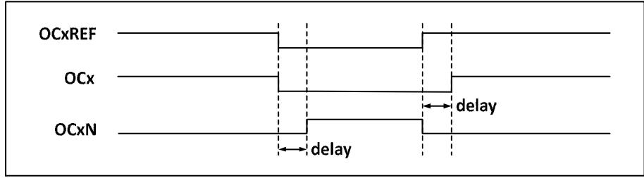  
图10-4 互补输出和死区

# 10.3.7 刹车信号

当产生刹车信号时，输出使能信号和无效电平都会根据MOE、OIS、OISN、OSSI和OSSR等位进行修改。但 $\mathtt { 0 0 x }$ 和 $\mathtt { 0 0 } \mathtt { x N }$ 不会在任何时间都处在有效电平。刹车事件源可以来自于刹车输入引脚，也可以是一个时钟失败事件，而时钟失败事件由 CSS（时钟安全系统）产生。

在系统复位后，刹车功能被默认禁止（MOE 位为低），置 BKE 位可以使能刹车功能，输入的刹车信号的极性可以通过设置 BKP 设置，BKE 和 BKP 信号可以被同时写入，在真正写入之前会有一个AHB时钟的延迟，因此需要等一个AHB周期才能正确读出写入值。

在刹车引脚出现选定的电平系统将产生如下动作：

1） MOE位被异步清零，根据SOOI位的设置将输出置为无效状态、空闲状态或复位状态；  
2） 在 MOE 被清零后，每一个输出通道输出由 $0 1 \mathtt { S } \times$ 确定的电平；  
3） 当使用互补输出时：输出被置于无效状态，具体取决于极性；  
4） 如果BIE被置位，当BIF置位，会产生一个中断；如果设置了BDE位，则会产生一个DMA请求；  
5） 如果AOE被置位，在下一个更新事件UEV时，MOE位被自动置位。

# 10.3.8 单脉冲模式

单脉冲模式可以用于让微控制器响应一个特定的事件，使之在一个延迟之后产生一个脉冲，延迟和脉冲的宽度可编程。置OPM位可以使核心计数器在产生下一个更新事件UEV时（计数器翻转到0）停止。

如图 10-5，需要在 TI2 输入引脚上检测到一个上升沿开始，延迟 Tdelay 之后，在 OC1 上产生一个长度为 Tpulse 的正脉冲：

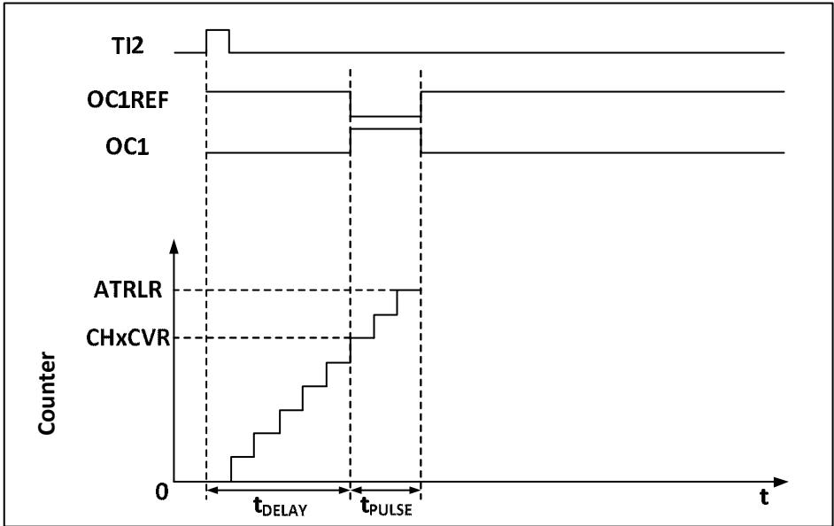  
图10-5 单脉冲的产生

1） 设定 TI2 为触发。置 CC2S 域为 01b，把 TI2FP2 映射到 TI2；置 CC2P 位为 0b，TI2FP2 设为上升

沿检测；置TS域为110b，TI2FP2设为触发源；置SMS域为110b，TI2FP2被用来启动计数器；2） Tdelay由比较捕获寄存器的的值确定，Tpulse由自动重装值寄存器的值和比较捕获寄存器的值确定。

# 10.3.9 编码器模式

编码器模式是定时器的一个典型应用，可以用来接入编码器的双相输出，核心计数器的计数方向和编码器的转轴方向同步，编码器每输出一个脉冲就会使核心计数器加一或减一。使用编码器的步骤为：将 SMS 域置为 001b（只在 TI2 边沿计数）、010b（只在 TI1 边沿计数）或 011b（在 TI1和TI2双边沿计数），将编码器接到比较捕获通道1、2的输入端，给重装值寄存器设一个值，这个值可以设的大一点。在编码器模式时，定时器内部的比较捕获寄存器，预分频器，重复计数寄存器等都正常工作。下表表明了计数方向和编码器信号的关系。

表10-1 定时器编码器模式的计数方向和编码器信号之间的关系  

<table><tr><td rowspan="2">if##ii</td><td rowspan="2">A</td><td colspan="2">T|1FP1 13iiA</td><td colspan="2">T |2FP2 1</td></tr><tr><td></td><td>T#iA</td><td></td><td>T#iA</td></tr><tr><td rowspan="2">1XE T11 iiAil#</td><td></td><td> Tif#</td><td>b Ei+#</td><td rowspan="2" colspan="2">Ti+#</td></tr><tr><td>1E</td><td>b Eif#</td><td>[] Fif#</td><td></td></tr><tr><td rowspan="2">1XE T12 iiAil#</td><td></td><td rowspan="2">Ti+#</td><td rowspan="2"></td><td>b_Eit#</td><td>] Fif#</td></tr><tr><td>1E</td><td>] Fif#</td><td>b Eif#</td></tr><tr><td rowspan="2">T T11 FA T12 XXitiAi+#</td><td></td><td>Ti+#</td><td>BEit#</td><td>bEif#</td><td>] Fif#</td></tr><tr><td>1E</td><td>bEit#</td><td> Fi+#</td><td> Fi+#</td><td>bEit#</td></tr></table>

# 10.3.10 定时器同步模式

定时器能够输出时钟脉冲（TRGO），也能接收其他定时器的输入（ITRx）。不同的定时器的ITRx的来源（别的定时器的 TRGO）是不一样的。定时器内部触发连接如表 10-2 所示。

表 10-2 TIMx 内部触发连接  

<table><tr><td>MEA</td><td>ITRO (TS=000)</td><td>ITR1 (TS=001)</td><td>I TR2 (TS=010)</td><td>ITR3 (TS=O11)</td></tr><tr><td>T IM1</td><td></td><td>TIM2</td><td></td><td></td></tr><tr><td>T Im2</td><td>TIM1</td><td></td><td></td><td></td></tr></table>

# 10.3.11 调试模式

当系统进入调试模式时，定时器根据DBG模块的设置继续运转或停止。

# 10.4 寄存器描述

表 10-3 TIM1 相关寄存器列表  

<table><tr><td></td><td></td><td>##it</td><td></td></tr><tr><td>R16_TIM1_CTLR1</td><td>0x40012C00</td><td>1</td><td>0x0000</td></tr><tr><td>R16_TIM1_CTLR2</td><td>0x40012C04</td><td>$2</td><td>0x0000</td></tr><tr><td>R16_TIM1_SMCFGR</td><td>0x40012C08</td><td>Mt$1</td><td>0x0000</td></tr><tr><td>R16_TIM1_DMAINTENR</td><td>0x40012C0C</td><td>DMA/+F1AE$T</td><td>0x0000</td></tr><tr><td>R16_TIM1_INTFR</td><td>0x40012C10</td><td>+$+</td><td>0x0000</td></tr><tr><td>R16_TIM1_SWEVGR</td><td>0x40012C14</td><td>$#***</td><td>0x0000</td></tr><tr><td>R16_TIM1_CHCTLR1</td><td>0x40012C18</td><td>tC$/##3$J7z 1</td><td>0x0000</td></tr><tr><td>R16_TIM1_CHCTLR2</td><td>0x40012C1C</td><td>tt$/##3t$$7 2</td><td>0x0000</td></tr></table>

<table><tr><td>R16_TIM1_CCER</td><td>0x40012C20</td><td>tC$/##31AE$18</td><td>0x0000</td></tr><tr><td>R16_TIM1_CNT</td><td>0x40012C24</td><td>i+#</td><td>0x0000</td></tr><tr><td>R16_TIM1_PSC</td><td>0x40012C28</td><td>i+#A$F$</td><td>0x0000</td></tr><tr><td>R16_TIM1_ATRLR</td><td>0x40012C2C</td><td></td><td>0x0000</td></tr><tr><td>R16_TIM1_RPTCR</td><td>0x40012C30</td><td>i#$1</td><td>0x0000</td></tr><tr><td>R32_T1M1_CH1CVR</td><td>0x40012C34</td><td>tC$/t#31z 1</td><td>0x00000000</td></tr><tr><td>R32_TIM1_CH2CVR</td><td>0x40012C38</td><td>tC$/##3$1 2</td><td>0x00000000</td></tr><tr><td>R32_T 1M1_CH3CVR</td><td>0x40012C3C</td><td>t$/t#31 3</td><td>0x00000000</td></tr><tr><td>R32_T 1M1_CH4CVR</td><td>0x40012C40</td><td>tC$/##3$1 4</td><td>0x00000000</td></tr><tr><td>R16_TIM1_BDTR</td><td>0x40012C44</td><td></td><td>0x0000</td></tr><tr><td>R16_T1M1_DMACFGR</td><td>0x40012C48</td><td>DMA $J$1</td><td>0x0000</td></tr><tr><td>R16_TIM1_DMAADR</td><td>0x40012C4C</td><td>iA DMA tbt7</td><td>0x0000</td></tr></table>

# 10.4.1 控制寄存器 1（TIM1_CTLR1）

偏移地址： $0 \times 0 0$

<table><tr><td>15</td><td>14</td><td>13</td><td>12</td><td>11</td><td>10 9</td><td>8</td><td>7</td><td>6</td><td>5</td><td>4</td><td></td><td>3 2</td><td></td><td>1</td><td>0</td></tr><tr><td>CAPLVL</td><td>CAPOV</td><td></td><td></td><td>Reserved</td><td></td><td>CKD[1 : 0]</td><td></td><td>ARPE</td><td>CMS[1 : 0]</td><td></td><td>DIR</td><td>OPM</td><td>URS</td><td>UDIS</td><td>CEN</td></tr></table>

<table><tr><td>1i</td><td></td><td>iji</td><td>#it</td><td></td></tr><tr><td>15</td><td>CAPLVL</td><td>RW</td><td>XXit#3tT, t#3Tt1AE. 0: iA; 1: .</td><td>0</td></tr><tr><td>14</td><td>CAPOV</td><td>RW</td><td>i: 1, CHxCVR [16]#3. 3. 0 # 1: # CHxCVR</td><td>0</td></tr><tr><td>[13:10]</td><td>Reserved</td><td>RO</td><td>0xFFFF. 1R.</td><td>0</td></tr><tr><td>[9:8]</td><td>CKD[1 : 0]</td><td>RW</td><td>iX 21X#AA$(CK_1NT) $*7EAfj] Fo3E#(ETR, T1x) FF AX 00: Tdts=Tck_int; 01: Tdts = 2 x Tck_int; 10: Tdts = 4 x Tck_int;</td><td>0</td></tr><tr><td>7</td><td>ARPE</td><td>RW</td><td>11: 1. . 1: 1AJ($17(ATRLR) ; 0: #J*(7(ATRLR) .</td><td>0</td></tr><tr><td>[6:5]CMS[1:0]</td><td></td><td>RW</td><td>+*x+tit. 00: i.i##D1R) Et Tit#. 01: x 1 i##ETif #2#AJij(CHCTLRx77 CCxS=0O) A#t$++, R#i+#Ti+# ite.</td><td>0</td></tr></table>

<table><tr><td colspan="2"></td><td rowspan="2">10: Rft 2. if#x*E7] Tif ie. Aft+i&amp;. Ak+t.</td><td rowspan="2">.2$Aij(CHCTLRx 17 CCxS=0O) H#Wt$+h$$ R#i+#Ei#A 11: +xt 3. i##tETif 2#ij(CHCTLRx 77 CCxS=0O) A9$Wt$+$$[, #i+#FATi+# i:#if##1AEAf(CEN=1),T5tiFiiXft 0</td></tr><tr><td>4 DIR</td><td>t#+xt i#+. 0: it##i+#tt#i+#; RW 1: i+#i+#ti+#. ji#A, itF.</td></tr><tr><td>3 OPM</td><td>RW RW</td><td>1:T, iCEN 1). 0: #T-#, i#T. E#i#KiF, #X1i#ii1j UEV $1#AgiR. 1: tnR1E7#f+F DMA i#K, JR#i# W/TM*#+f DMA i#; 0: 3nR1AE7 #+fg DMA i#K, J Ti1I$ 1*#+t DMA i#.</td><td>0 0</td></tr><tr><td>UDIS</td><td>RW</td><td>i#/Tm i&amp; UG | #1#h, ##iii{3ti#/# uEv $## . 1: # UEV. T#, $1ARR PSC CCRx) 1R#E1i]A1. tnRi7 uG (sttst #1; 0: ftiF UEV. $F(UEV)$1#Ti1I-$#*. i#/Tim</td><td>0</td></tr><tr><td>0 CEN</td><td>RW</td><td>1 AEi+#. 1:1Ai# 0: #i+#. i: ##1i7 CEN1, 9N#BAJ#i]ttt H1#i CEN 1</td><td>0</td></tr></table>

# 10.4.2 控制寄存器 2（TIM1_CTLR2）

偏移地址： $0 \times 0 4$

<table><tr><td>15</td><td>14</td><td>13</td><td>12</td><td>11</td><td>10</td><td>9</td><td>8</td><td>7</td><td>6</td><td>5</td><td>4</td><td>3</td><td>2</td><td>1</td><td></td></tr><tr><td>Reserved</td><td></td><td></td><td>01S4OIS3N OIS3</td><td></td><td>O1S2NOIS2</td><td></td><td>OIS1N</td><td>01S1</td><td>TI1S</td><td>MMS [2 : 0]</td><td></td><td>CCDS</td><td>CCUS</td><td></td><td>CCPC</td></tr></table>

<table><tr><td>1i</td><td></td><td>i5</td><td>#it</td><td></td></tr><tr><td>15</td><td>Reserved</td><td>RO</td><td>1R. #4.</td><td>0</td></tr><tr><td>14</td><td>01s4</td><td>RW</td><td>1: MOE=0 Aj, tnRh7 0C4N, JJ3EF 0C4=1; 0: MOE=0 , tnRt7 OC4N, JJ3E 0C4=0. i: EtZi7 LOCK(T1Mx_BDTR $T7#) 23J1 2 t 3 F, i1TAEi12.</td><td>0</td></tr><tr><td>13</td><td>O1S3N</td><td>RW</td><td># 3. 1: MOE=O j, 7E OC3N=1; 0: MOE=O j, 3E OC3N=O. i:EZi7 LOCK(T1Mx_BDTR ##) 23J 12 t 3 F, i1iTAEt122.</td><td>0</td></tr><tr><td>12</td><td>01s3</td><td>RW</td><td>#3, $ 01s4.</td><td>0</td></tr><tr><td>11</td><td>OIS2N</td><td>RW</td><td>#2, $OIS3N.</td><td>0</td></tr><tr><td>10</td><td>01S2</td><td>RW</td><td>#2, $01s4.</td><td>0</td></tr><tr><td>9</td><td>OIS1N</td><td>RW</td><td>1 $0IS3N.</td><td>0</td></tr><tr><td>8</td><td>01S1</td><td>RW</td><td>#1 $01s4. T11 i#.</td><td>0</td></tr><tr><td>7</td><td>TI1S</td><td>RW</td><td>1: T1Mx_CH1T1Mx_CH2 FA T1Mx_CH3 31ADZ5gF i$J T11$a;</td><td>0</td></tr><tr><td>[6:4]</td><td>MMS[2 : 0]</td><td>RW</td><td>t#ti ix 31Fi#tTiXJM AA(TRGO). eJ AEAS8AtA T: 000: 1-T1Mx_EGR$77A UG 1F1F (TRGO).tnR#*A1t #$JT1tt), J TRG0 a913txf AjR; 001: 1E- i11 CNT_EN T1F TRG0A3A $JA1A i#1AE 13i# CEN $J1FittTA#1 3Ai*# XAj, TRG0 -3i, $#Fi#7/Mt rt(DL T1Mx_SMCR $T7 MSM(AIt#i); 010: * - ##i(TRGO) .1Jn, 011: t$Ak;-#t#3it#hI Aj, iCC1F#$A(PE), iEAk(TRGO) :</td><td>0</td></tr></table>

<table><tr><td></td><td></td><td></td><td>100:-OC1REF1 (TRGO) ; 101-OC2REF1 (TRGO) ; 110-OC3REF1 (TRGO) ; 111  -0C4REF1 (TRGO) .</td><td></td></tr><tr><td>3</td><td>CCDS</td><td>RW</td><td>##3tL$A DMA i. 1: $f$1#j, iX CHxCVR DMA i#K; O:  CHxCVR j, # CHxCVR A DMA iK.</td><td>0</td></tr><tr><td>2</td><td>CCUS</td><td>RW</td><td>tC$t#3$#i1. 1: tR CCPC 1, aJliii COM 1 TRG1 Eag-EHA#fe1i]; 0: tnR CCPC 1, Aiiti&amp;i COm [#fe1i].</td><td>0</td></tr><tr><td>1</td><td>Reser ved</td><td>RO</td><td>ii: i1Rxf#Eil#WAJi#i21F#. 1*. tC#t#3F#$J1.</td><td>0</td></tr><tr><td>0</td><td>CCPC</td><td>RW</td><td>1: CCxE, CCxNE F OCxM 13$J ii1Z F, e]Ri&amp;7 C0M(F#; O: CCxE, CCxNE F OCxM 1TF#$AJo i: iRxE#WAi#i21F.</td><td>0</td></tr></table>

# 10.4.3 从模式控制寄存器 （TIM1_SMCFGR）

偏移地址： $0 \times 0 8$

<table><tr><td>15</td><td>14</td><td>13</td><td>12</td><td>11</td><td>10</td><td>9</td><td>8 7</td><td>6</td><td>5</td><td>4 3</td><td>2</td><td>1</td></tr><tr><td>ETP</td><td>ECE</td><td></td><td>ETPS[1: 0]</td><td></td><td>ETF [3:0]</td><td></td><td>MSM</td><td></td><td>TS[2: 0]</td><td>Reserved</td><td></td><td>SMS[2: 0]</td></tr></table>

<table><tr><td>1</td><td></td><td>iji</td><td>##it</td><td></td></tr><tr><td>15</td><td>ETP</td><td>RO</td><td>ETR #t#i, i1i ETR iTE #a ETR At. 1: # ETRt, 1Ti; 0: ETR, EJA.</td><td>0</td></tr><tr><td>14</td><td>ECE</td><td>RW</td><td>5#BA$t2  i. 1: 1B$2; 0: B$2. i 1: taS9#BA$tt2 A1 1 i7t 1 iX TRG1 TAEi$J ETRF(TS 1iTAtE&#x27; 111&#x27; )o i 2: yl#BAC1 F9#BA$#C2 ]A$1 AEAf, 9#BAf$#AJ$j ETRF.</td><td>0</td></tr><tr><td>[13:12]ETPS[1: 0]</td><td></td><td>RW</td><td>5l#B#1(ETRP)t, ix3th*#xT#E Bit T1MxCLK th*AI 1/4, aJliiixt*F#t 0o: ; 01: ETRP tj*2;</td><td>0</td></tr></table>

<table><tr><td></td><td></td><td></td><td>10: ETRP 4; 11: ETRP t*8.</td><td></td></tr><tr><td rowspan="2">[11:8]ETF[3:0]</td><td rowspan="2"></td><td rowspan="2">RW</td><td rowspan="2">5# , #$#it #, e-A9R#*, i2RJN$ R*. 0000 Fi, FdtsK#; 001: ##*Fsamp1 ing=Fck_int, N=2; 0010: Kt#*FsampI ing=Fck_int, N=4; 0011: Kt#3* Fsamp1ing=Fck_int, N=8; 0100: #*Fsamp1 ing=Fdts/2, N=6; 0101: K##3* Fsamp1ing=Fdts/2, N=8; 0110: t#$* FsampI ing=Fdts/4, N=6; 0111: Kt#3* Fsamp1 ing=Fdts/4, N=8; 1000: #* Fsamp1 ing=Fdts/8, N=6;</td><td rowspan="2">0</td></tr><tr><td>1001: t* Fsamp1 ing=Fdts/8, N=8; 1010: K#* Fsamp1 ing=Fdts/16, N=5; 1011: t##*Fsamp1 ing=Fdts/16, N=6; 1100: t* Fsamp1 ing=Fdts/16, N=8;</td></tr><tr><td>7</td><td>MSM</td><td>RW</td><td>1110: ti* Fsamp1ing=Fdts/32, N=6; 1111: t#* Fsamp1 ing=Fdts/32, N=8. /ti. 1: (TRG1) a1#3i7, lStiF $#A;</td><td>0</td></tr><tr><td>[6:4] 3</td><td>Ts[2: 0]</td><td>Air. RW</td><td>0: T1F. itix3{Fi+# 000:  O(ITRO) ; 001: 1(ITR1); 010: 2(1TR2) ; 011: B3(ITR3) ; 100: T11 A9i7;QJ8(T11F_ED); 101: 1(T1FP1); 110: EA 2(T12FP2); 111: y(ETRF).</td><td>0</td></tr><tr><td></td><td>Reserved</td><td>RO 1R.</td><td>WE# SMS F 0 At2. i: $10-2.</td><td>0</td></tr><tr><td>[2:0]</td><td>SMS[2: 0]</td><td>t. RW</td><td>OO0: BA$ CK_1NT 3EzJ; 001: #91, tR# T11FP1 , ti # T12FP2 A9i;##i+#; 010  2.  T2FP2 .</td><td>0 ti+</td></tr></table>

<table><tr><td></td><td></td><td>T11FP1 i@i#; 011: t3, tR, tti1# T11FP1 FA T12FP2 Aii@i+#; 100: 1, (TRG1) EH#1 i# #**; 101: i, TRG1), i AA$#, i# il 110: , i#TRG1 R#; 111 lB$1, iTRG1) E</td><td></td></tr></table>

# 10.4.4 DMA/中断使能寄存器（TIM1_DMAINTENR）

偏移地址： $0 \times 0 0$

<table><tr><td>15</td><td>14</td><td>13</td><td>12</td><td>11</td><td>10</td><td>9</td><td>8</td><td>7</td><td></td><td>5</td><td></td><td>4</td><td>3</td><td>2</td><td>1</td><td></td></tr><tr><td>Reser ved</td><td>TDE</td><td></td><td></td><td>COMDE|CC4DECC3DE|CC2DECC1DE</td><td></td><td></td><td></td><td>UDE</td><td>BIE</td><td>TIE</td><td>COMIE</td><td>CC4IE</td><td>CC3IE|CC2IE|CC1IE</td><td></td><td></td><td>UIE</td></tr></table>

<table><tr><td>1i</td><td></td><td>iji</td><td>##it</td><td></td></tr><tr><td>15</td><td>Reserved</td><td>RO</td><td>1R.</td><td>0</td></tr><tr><td>14</td><td>TDE</td><td>RW</td><td>DMA i#1AE1. 1: tiFDMA i; 0: # DMA i#.</td><td>0</td></tr><tr><td>13</td><td>COMDE</td><td>RW</td><td>COM ] DMA i#K1AE(. 1: 3tiF COM J DMA i#K; O: #IE COM A DMA i#K.</td><td>0</td></tr><tr><td>12</td><td>CC4DE</td><td>RW</td><td>tC#t#3ij 4 AJ DMA i#K1AE1. 1: 3tiFt##3ij 4  DMA i#; 0: t#3i4  DMA i#.</td><td>0b</td></tr><tr><td>11</td><td>CC3DE</td><td>RW</td><td>tL##3ij 3 J DMA i1A1. 1: 3tiFtL##3ii 3 J DMA i#K; 0: #tL$#3ii 3 J DMA i#K.</td><td>0</td></tr><tr><td>10</td><td>CC2DE</td><td>RW</td><td>tC##3ij 2 J DMA i#&gt;K1AE1. 1: 3tiFtL$#3i#j 2 J DMA i; 0: #t$3i2 DMA i.</td><td>0</td></tr><tr><td>9</td><td>CC1DE</td><td>RW</td><td>tL##3i#i 1 J DMA i#K1AE1. 1: 3tiFt$t#3ij 1 J DMA i#; 0: t##3ij1 DMA i#.</td><td>0</td></tr><tr><td>8</td><td>UDE</td><td>RW</td><td>#A] DMA i1AE. 1: ftiFE$fJ DMA i#K; 0: #1#JAJ DMA i#.</td><td>0b</td></tr><tr><td>7</td><td>BIE</td><td>RW</td><td>1: ftiFJ+f; 0: #J+.</td><td>0</td></tr><tr><td>6</td><td>TIE</td><td>RW</td><td>+.</td><td>0</td></tr></table>

<table><tr><td></td><td></td><td></td><td>1 1 0: #+.</td><td></td></tr><tr><td>5</td><td>COMIE</td><td>RW</td><td>COM FStiF{. 1: iF COM ; O: # COM .</td><td>0</td></tr><tr><td>4</td><td>CC41E</td><td>RW</td><td>tC##3ij 4 F11. 1: 3tiFtC$#3ij 4 f; 0: ##4*.</td><td>0</td></tr><tr><td>3</td><td>CC3IE</td><td>RW</td><td>tL$#3ii 3 F1AE1. 1: tit#3 ; 0: ##3.</td><td>0</td></tr><tr><td>2</td><td>CC21E</td><td>RW</td><td>tC#t#3ij 2 F11. 1: ftit3i2f; 0: 2.</td><td>0</td></tr><tr><td>1</td><td>CC1IE</td><td>RW</td><td>tC#t#3ij1 F11. 1: it$1; 0: ##1.</td><td>0</td></tr><tr><td>0</td><td>UIE</td><td>RW</td><td>#+1. 1: i*+; o: ##++.</td><td>0</td></tr></table>

# 10.4.5 中断状态寄存器 （TIM1_INTFR）

偏移地址： $0 \times 1 0$

<table><tr><td>15</td><td>14</td><td>13</td><td>12</td><td>11</td><td>10</td><td>9</td><td>8</td><td>7</td><td>6</td><td>5</td><td>4</td><td></td><td>3 2</td><td></td><td>1</td><td></td></tr><tr><td></td><td>Reserved</td><td></td><td>CC40F|CC30F</td><td></td><td>CC20F</td><td>CC10F</td><td></td><td>ReservedBIF</td><td></td><td>TIF</td><td>COMIF</td><td>CC4|F</td><td>CC31F</td><td>CC21F</td><td>CC1IF|U1F</td><td></td></tr></table>

<table><tr><td>1</td><td></td><td>i3i]</td><td>##it</td><td>1</td></tr><tr><td>[15: 13]</td><td>Reserved</td><td>RO</td><td>1R.</td><td>0</td></tr><tr><td>12</td><td>CC40F</td><td>RWO</td><td>tt$#3i 4 #$.</td><td>0</td></tr><tr><td>11</td><td>CC30F</td><td>RWO</td><td>tt$#i 3 #.</td><td>0</td></tr><tr><td>10</td><td>CC20F</td><td>RWO</td><td>t#t#3ii2#31.</td><td>0</td></tr><tr><td>9</td><td>CC10F</td><td>RWO</td><td>tC#t#3ii1#31 1XFt$t#3 jj2#3.ii21#1, #1#5 0 aJ;#t1. 1i CC11F 0: F#*.</td><td>0b</td></tr><tr><td>8</td><td>Reser ved</td><td>RO</td><td>1R.</td><td>0</td></tr><tr><td>7</td><td>BIF</td><td>RWO</td><td>$+$+ xi 1, a$. 1: 3;i; 0: F$##.</td><td>0</td></tr><tr><td>6</td><td>TIF</td><td>RWO</td><td>i 1, $# $#it 5&gt;AHEt#stAj, # TRG1 #i#;NJJxXiA,</td><td>0</td></tr></table>

<table><tr><td></td><td></td><td></td><td>sti7ttstTA91I-iiA. 1: #*; 0: F*.</td><td></td></tr><tr><td>5</td><td>COMIF</td><td>RWO</td><td>COM , # COM, i 1, $1#.C0M$1 CCxECCxNE0CxM 1: COM$#; O: F COM$#*.</td><td>0</td></tr><tr><td>4</td><td>CC4IF</td><td>RWO</td><td>t##3ii 4 F.</td><td>0</td></tr><tr><td>3</td><td>CC31F</td><td>RWO</td><td>tt$#3ij 3 f1.</td><td>0</td></tr><tr><td>2</td><td>CC21F</td><td>RWO</td><td>tt##3ii2 f1. t##3i#1 .</td><td>0</td></tr><tr><td>1</td><td>CC1IF</td><td>RWO</td><td>iSti 1 #eX#tT$5 i1$1#;#. 1: ti#St$#3$1 2; O: F. tnRt$#3i1 2t: #$i# $ giit$3. 1: i##t$#3$ 1; 0: F##.</td><td>0</td></tr><tr><td>0</td><td>UIF</td><td>RWO</td><td>$+ #*$i 1, $#. 1: **; 0: F#*. WT**$#: UDS=0,#ET URS=0UDIS=O,UG1, sii$1#] it#ti##h1t; #URS=O UD1S=O, i+# CNT 1</td><td>0</td></tr></table>

# 10.4.6 事件产生寄存器 （TIM1_SWEVGR）

偏移地址： $0 \times 1 4$

<table><tr><td>15</td><td>14</td><td>13</td><td>12</td><td>11</td><td>10</td><td>9</td><td>8</td><td>7</td><td>6</td><td>5</td><td></td><td>4</td><td>3</td><td>2 1</td><td></td><td></td></tr><tr><td></td><td></td><td></td><td></td><td>Reserved</td><td></td><td></td><td></td><td></td><td>BG</td><td>TG</td><td>COMG</td><td>CC4G</td><td>CC3G</td><td>CC2G</td><td>CC1G</td><td>UG</td></tr></table>

<table><tr><td>1</td><td></td><td></td><td>##it</td><td></td></tr><tr><td>[15:8]</td><td>Reserved</td><td>RO</td><td>r.</td><td>0</td></tr><tr><td>7</td><td>BG</td><td>Wo</td><td>N#$#*, $#+#, ** -*+$#. 1: #J MOE=0B1F=1 1 AEXfA+FA DMA, J#tAFFA DMA; O: FEaiF.</td><td>0</td></tr></table>

<table><tr><td>6</td><td>TG</td><td>wo</td><td>*, i,  T#-$. 1: *$, TF, # +0FFn DMA, JFt9A+0FFn DMA; O: Fa1F.</td><td>0</td></tr><tr><td>5</td><td>COMG</td><td>wo</td><td>tC$#3$*#1 #t$#3$#T $1 i$, . 1:  CCPC=1, 3tiF3E#T CCxECCxNE0CxM1Z; 0: FEa1F. i:i1RX##i (i#i1, 2, 3) #.</td><td>0</td></tr><tr><td>4</td><td>CC4G</td><td>wo wo</td><td>tC$#3$#14, #t$t#3$ 4.</td><td>0</td></tr><tr><td>3</td><td>CC3G</td><td></td><td>t$#3#13, #t$#3$ 3.</td><td>0</td></tr><tr><td>2</td><td>CC2G</td><td>wo</td><td>t##31#1i2, #t$#3$12. tC$#3$#*1, #t$#3$ 1.</td><td>0</td></tr><tr><td>1</td><td>CC1G</td><td>wo 1.</td><td>i1$,  T#t #3 1: #t$#i1#t$$: t$#3ij1 2: CC11F 1i. #1AEXA+fF DMA, J# AFF DMA; i12: Ai#1*#3t$#$11; CC11F 1, #1A7fF DMA, J# AFF DMA.  CC11F EZ1, J CC10F 0: Fs1F.</td><td>0</td></tr><tr><td>0</td><td>UG</td><td>Wo</td><td>#$#1, #*$. i#, 1: 1i#, ###$ 0: FEs1F. T. ###ixf#tTtt#i+#ttTJJt if###i+#tTJif##H</td><td>0</td></tr></table>

# 10.4.7 比较/捕获控制寄存器 1（TIM1_CHCTLR1）

偏移地址： $0 \times 1 8$

通道可用于输入(捕获模式)或输出(比较模式)，通道的方向由相应的 $\mathtt { C C } \mathtt { x S }$ 位定义。该寄存器其它位的作用在输入和输出模式下不同。 $_ { 0 0 \times \times }$ 描述了通道在输出模式下的功能， $1 0 \times \mathsf { x }$ 描述了通道在输入模式下的功能。

<table><tr><td>15</td><td>14 13 12 OC2M[2: 0]</td><td>11 OC2PEOC2FE</td><td>10</td><td rowspan="3">9 8</td><td>7 C1CE</td><td>6</td><td>5 4</td><td>3</td><td>2</td><td>1</td><td>0</td></tr><tr><td>C2CE</td><td></td><td colspan="2"></td><td rowspan="2">CC2S[1: 0]</td><td colspan="2">OC1M[2: 0]</td><td colspan="2">OC1PEOC1FE</td><td rowspan="2">CC1S[1: 0]</td><td rowspan="2"></td></tr><tr><td>1C2F [3:0]</td><td></td><td>1C2PSC[1 : 0]</td><td></td><td>1C1F [3:0]</td><td></td><td></td><td>C1PSC[1 : 0]</td></tr></table>

比较模式（引脚方向为输出）：  

<table><tr><td></td><td></td><td></td><td></td></tr><tr><td rowspan="2">15 OC2CE</td><td rowspan="2">RW</td><td>tC$#3ij 21AE1. 1:;J] ETRF , OC2REF (;</td><td>0</td></tr><tr><td>O: OC2REF T ETRF A. tC$#3i#j 2 tstitgt. i 3 (EX7#W*1 OC2REF Jz1F, m</td><td>OC2REF E7 OC2, OC2N AJ1. OC2REF T x,  OC2 F OC2N AHXF CC2PCC2NP</td></tr><tr><td>[14:12]OC2M[2:0]</td><td>RW</td><td>1. 000: . t$$i+# tC$1Xf OC2REF T#21F; 001: 3$ii+#t$ $77 1 91J, 3$ OC2REF ; 010: 3$i.ti#Stt# t#3$771 tJAf, 3$J 0C2REF 1; 011 ##1 tA, # OC2REF ; 100: 3$JT. 3$ OC2REF1; 101: 3$JT. 3$J 0C2REF ; 110: PWMst1: i#, i# XFt$#3$1#1ii 2, n$+ #Ti#f, #i# Ft#i2 111: PWM2i#, i X+t$#$, 2, S3 #Ti#, i# XFt$#$1#, i#2, (OC2REF=1). : L0CK 23i 3 # CC2S=00b JJi1 AEi12 # PWMtt1t PWMtt2#, # tC$2R27#Wtt+2ttJ</td><td>0</td></tr><tr><td>11 OC2PE</td><td>RW</td><td>FEIJ PWMt#stAf, OC2REF 2. tC$#31 F$11. 1: JTt$#31 1 9*#, iSt1F 1XX*#$*1F, t$$1 * +; 0 #t31 A#Ae, J AtSXtt$#3$71, #E#5X#Rp 21F. :  L0CK 3li 3 # CC2S=00, Ji1 AEi12;1X1X#Ak;#tst F(0PM=1) aJl#KT</td><td>0</td></tr><tr><td>10 OC2FE</td><td></td><td>i##$1#1#T1 PWMt#t, J#s1F TE. RW tC$#3ij 2Ri1A1,i1FbAt$</td><td>0</td></tr></table>

<table><tr><td></td><td></td><td></td><td>3i$A. 1:#117tt #2. t, 0c iiyt$mSt$R Tct$#i2 j]3A 3A$#; 0: tR##St$#3$11 #1, t$#3* i#2E1F,  A $#3i2 AxJ3A5A$#. OC2FE ij125 PWM1 gt PWM2 tsCA#21F</td></tr><tr><td>[9:8]CC2s[1:0]</td><td></td><td>RW</td><td>tL$#i 2 #it. 00:t32; 01: t$#3i 2 i2, 1C2  T12 E; 10: t$3i 2 i2#, 1C2  T11 E; 0 11: tC$22,1C2  TRC E. I1Fi+ TS (i) . i: t##3ij 21X#i#iiJ(CC2E jAt) 0</td></tr><tr><td></td><td></td><td></td><td></td></tr><tr><td>7</td><td>OC1CE OC1M[2: 0]</td><td>RW RW</td><td>tC##3i 1 11. tC#t#3i 1 itgt.</td></tr><tr><td>[6:4] 3</td><td>OC1PE</td><td>RW</td><td>tC$#3T1 F$1E1.</td></tr><tr><td>2</td><td>OC1FE</td><td>RW</td><td>t$#3ij1 i*1E1.</td></tr><tr><td>[1: 0]</td><td>CC1S[1: 0]</td><td>RW</td><td>0 tC##3ij1 it. 0</td></tr></table>

捕获模式（引脚方向为输入）：  

<table><tr><td>1</td><td></td><td>ii</td><td>#it</td><td></td></tr><tr><td>[15:12]1C2F[3:0]</td><td></td><td>RW</td><td>##22, ii7 T11# $#i#, Ei2RJ N$#R#-T 0000 FE,  fDTS; 1000: K#t Fsampl ing=Fdts/8, N=6; 0001: #t* Fsamp1ing=Fck_int, N=2; 1001: tt* Fsamp1 ing=Fdts/8, N=8; 0010: #* Fsamp1ing=Fck_int, N=4; 1010: Kt#* Fsamp1 ing=Fdts/16, N=5; 0011: K##i* Fsamp1ing=f=Fck_int, N=8; 1011: Ktt* Fsampl ing=Fdts/16, N=6; 0100: #t* FsampIing=Fdts/2, N=6; 1100: t* Fsamp1 ing=Fdts/16, N=8; 0101: t#t* FsampI ing=Fdts/2, N=8;</td><td>0</td></tr></table>

<table><tr><td></td><td></td><td></td><td>1101: # Fsampl ing=Fdts/32, N=5; 0110: #$* Fsamp1ing=Fdts/4, N=6; 1110: t#* Fsamp1ing=Fdts/32, N=6; 0111: K##* Fsamp1ing=Fdts/4, N=8; 1111: t* Fsamp1ing=Fdts/32, N=8.</td><td></td></tr><tr><td>[11:10]1C2PSC[1:0]</td><td></td><td>RW</td><td>tC#t#3ii 2 F$2t, iX 2 {X 7 tt# t#3i2 CC1E=0, J 1. 00 Ft#;i i#3 01: 2 10:4 11: 8.</td><td>0</td></tr><tr><td>[9:8]cc2s[1:0]</td><td></td><td>RW</td><td>t#x#3ij 2#jift iX 2 1Xi#j (/$),Ai. 00: l#3i1 i 01: t$1jj1C1J # TI1 E; 10: tC$#3i#i1 i#i2#,1C1 a9 # T12 E; 11: t$#3ii1 i#i2,1C1a9J TRC E. 11I1F#B#i$i</td><td>0</td></tr><tr><td></td><td></td><td></td><td>Af( TS (i) . i: CC1S1X#i#iXiJA(CC1Ej 0)JaJ5#J</td><td></td></tr><tr><td>[7:4] [3:2]</td><td>IC1F [3:0] IC1PSC[1 : 0]</td><td>RW RW</td><td>1. tC$#3ij1 F2tg.</td><td>0 0</td></tr><tr><td>[1:0]</td><td>CC1S[1: 0]</td><td>RW</td><td>tC##3ij1itgi.</td><td>0</td></tr></table>

# 10.4.8 比较/捕获控制寄存器 2（TIM1_CHCTLR2）

偏移地址： ${ 0 } { \times 1 } { 0 }$

通道可用于输入(捕获模式)或输出(比较模式)，通道的方向由相应的 $\mathtt { C C } \mathtt { x S }$ 位定义。该寄存器其它位的作用在输入和输出模式下不同。 $_ { 0 0 \times \times }$ 描述了通道在输出模式下的功能， $1 0 \times \mathsf { x }$ 描述了通道在输入模式下的功能。

<table><tr><td>15</td><td>14 13 12 OC4M[2 : 0]</td><td>11 OC4PE|OC4FE</td><td>10</td><td rowspan="3">9 8</td><td>7 OC3CE</td><td>6 5 OC3M[2: 0]</td><td>4</td><td>3</td><td>2</td><td>1</td><td>0</td></tr><tr><td>OC4CE</td><td></td><td colspan="2" rowspan="2"></td><td rowspan="2">CC4S[1 : 0]</td><td colspan="2"></td><td colspan="2">OC3PE|OC3FE [C3PSC[1 : 0]</td><td rowspan="2">CC3S[1 : 0]</td><td rowspan="2"></td></tr><tr><td>1C4F[3:0]</td><td>1C4PSC[1 : 0]</td><td></td><td>1C3F [3: 0]</td></tr></table>

比较模式（引脚方向为输出）：  

<table><tr><td>1i</td><td></td><td>iji</td><td>t#it</td><td></td></tr><tr><td>15</td><td>OC4CE</td><td>RW</td><td>tC$#3ii 4 1A1.</td><td>0</td></tr><tr><td>[14:12]</td><td>0C4M[2 : 0]</td><td>RW</td><td>tC$#3ii 4 titg.</td><td>0</td></tr><tr><td>11</td><td>OC4PE</td><td>RW</td><td>tC$#31 4 F*$11.</td><td>0</td></tr><tr><td>10</td><td>OC4FE</td><td>RW</td><td>tL##3*ij 4 li*1.</td><td>0</td></tr><tr><td>[9 : 8]</td><td>CC4S[1 : 0]</td><td>RW</td><td>tC$#3ij 4itk.</td><td>0</td></tr></table>

<table><tr><td>7</td><td>OC3CE</td><td>RW</td><td>tL$#i 31A1.</td><td>0</td></tr><tr><td>[6:4]</td><td>0C3M[2 : 0]</td><td>RW</td><td>tL##3i# 3titgf.</td><td>0</td></tr><tr><td>3</td><td>OC3PE</td><td>RW</td><td>tL#t#3$1 3 F#11.</td><td>0</td></tr><tr><td>2</td><td>OC3FE</td><td>RW</td><td>tL#t#3ij 3 li*1A1.</td><td>0</td></tr><tr><td>[1:0]</td><td>CC3S [1 : 0]</td><td>RW</td><td>tL#t#3ij 3#it.</td><td>0</td></tr></table>

捕获模式（引脚方向为输入）：  

<table><tr><td>1i</td><td></td><td></td><td>#it</td><td></td></tr><tr><td>[15:12]</td><td>IC4F [3: 0]</td><td>RW</td><td>34 2g.</td><td>0</td></tr><tr><td>[11:10]</td><td>1C4PSC[1 : 0]</td><td>RW</td><td>tC##3ij 4 F2 tgi.</td><td>0</td></tr><tr><td>[9 : 8]</td><td>CC4S[1 : 0]</td><td>RW</td><td>tt$#3ij 4 it.</td><td>0</td></tr><tr><td>[7:4]</td><td>I C3F [3: 0]</td><td>RW</td><td>33 tg.</td><td>0</td></tr><tr><td>[3: 2]</td><td>IC3PSC[1 : 0]</td><td>RW</td><td>tC$#3i 3 F tt.</td><td>0</td></tr><tr><td>[1: 0]</td><td>CC3S[1 : 0]</td><td>RW</td><td>tt$#3i 3 it.</td><td>0</td></tr></table>

# 10.4.9 比较/捕获使能寄存器（TIM1_CCER）

偏移地址： $_ { 0 \times 2 0 }$

<table><tr><td>15</td><td>14 13</td><td>12</td><td>11</td><td>10</td><td>9</td><td></td><td>8</td><td>7</td><td>6</td><td>5</td><td>4</td><td>3</td><td>2</td><td>1</td><td></td></tr><tr><td>Reserved</td><td>CC4P</td><td>CC4E</td><td></td><td>CC3NP|CC3NE</td><td></td><td>CC3P</td><td>CC3E</td><td></td><td>CC2NPCC2NE</td><td>CC2P</td><td>CC2E</td><td></td><td>CC1NPCC1NE</td><td>CC1P</td><td>CC1E</td></tr></table>

<table><tr><td>1i</td><td></td><td>i</td><td>##it</td><td></td></tr><tr><td>[15:14]</td><td>Reserved</td><td>RO</td><td>1R.</td><td>0</td></tr><tr><td>13</td><td>CC4P</td><td>RW</td><td>tC$#3ij 4i.</td><td>0</td></tr><tr><td>12</td><td>CC4E</td><td>RW</td><td>tC$#3ii 4 1A1.</td><td>0</td></tr><tr><td>11</td><td>CC3NP</td><td>RW</td><td>tC#t#3ij 3 *#ti1.</td><td>0</td></tr><tr><td>10</td><td>CC3NE</td><td>RW</td><td>tC##3ij 3 yl#1E1.</td><td>0</td></tr><tr><td>9</td><td>CC3P</td><td>RW</td><td>tC##3i 3ti1.</td><td>0</td></tr><tr><td>8</td><td>CC3E</td><td>RW</td><td>tL$#3ii 31AE1.</td><td>0</td></tr><tr><td>7</td><td>CC2NP</td><td>RW</td><td>tt##3ii2 ##i&amp;1.</td><td>0</td></tr><tr><td>6</td><td>CC2NE</td><td>RW</td><td>tC$3ij2 l#1A1.</td><td>0</td></tr><tr><td>5</td><td>CC2P</td><td>RW</td><td>tC##3ij 2 $ti1.</td><td>0</td></tr><tr><td>4</td><td>CC2E</td><td>RW</td><td>tC$#3ij 2 $11.</td><td>0</td></tr><tr><td>3</td><td>CC1NP</td><td>RW</td><td>tC$#3ij 1 #i1.</td><td>0</td></tr><tr><td>2</td><td>CC1NE</td><td>RW</td><td>tC$#3ii 1 E#1A1.</td><td>0</td></tr><tr><td>1</td><td>CC1P</td><td>RW</td><td>tC##3i#j1 t#i&amp;1. CC1 j: 1: 0C1 ; 0: 0C1. CC1 i: i1 1C1 iT 1C1 t31F# %. 1: 1C1T1 , 1C1 t. 0: TXt: t#3 1C1 aE; M1F5#B</td><td>0</td></tr></table>

<table><tr><td></td><td></td><td></td><td>, 1C1T. j: LOCK 23J(T1Mx_BDTR 1 LOCK 1) iQJ 3 gt 2, J]i31TAEt12. t##3ij111.</td><td></td></tr><tr><td>0</td><td>CC1E</td><td>RW</td><td>CC1 i 1: 0C1 1K*F MOE, OSS1. OSSR, O1S1. OIS1N F CC1NE 1A. 0:0C1 0C1* F MOE, OSSI. OSSR, OIS1, OIS1N F CC1NE 1AJ1. CC1 i: i1 7i+#A#E#3 T1Mx_CCR1 # 1: t#31E; 0: t#3#1.</td><td>0</td></tr></table>

# 10.4.10 高级定时器的计数器（TIM1_CNT）

偏移地址： ${ 0 } { \times 2 4 }$

<table><tr><td>15</td><td>14</td><td>13</td><td>12</td><td>11</td><td>10</td><td>9</td><td>8</td><td>7</td><td></td><td></td><td>5</td><td>4</td><td>3</td><td>2</td><td>1</td></tr><tr><td></td><td>CNT [15: 0]</td></tr> colspan="14"></td></tr></table>

<table><tr><td>1</td><td></td><td></td><td>#it</td><td></td></tr><tr><td>[15:0]</td><td>CNT [15: 0]</td><td>RW</td><td>+++i++++</td><td></td></tr></table>

# 10.4.11 计数时钟预分频器（TIM1_PSC）

偏移地址： $_ { 0 \times 2 8 }$

<table><tr><td>15</td><td>14</td><td>13</td><td>12</td><td>11</td><td>10</td><td>9</td><td>8</td><td>7</td><td>6</td><td>5</td><td></td><td>4</td><td>3 2</td><td></td><td>1 0</td></tr><tr><td></td><td>PSC[15: 0]</td></tr> colspan="14"></td></tr></table>

<table><tr><td>1</td><td>F</td><td>i</td><td>#it</td><td></td></tr><tr><td>[15: 0]</td><td>PSC [15: 0]</td><td>RW</td><td>i* F#A#*/(PSC+1) .</td><td>0</td></tr></table>

# 10.4.12 自动重装值寄存器（TIM1_ATRLR）

偏移地址： $\mathtt { 0 } \mathtt { x } 2 0$

<table><tr><td>15</td><td>14</td><td>13</td><td>12</td><td>11</td><td>10</td><td>9</td><td>8</td><td>7</td><td>6</td><td>5</td><td>4</td><td>3</td><td>2</td><td>1</td><td></td></tr><tr><td></td><td>ATRLR[15: 0]</td></tr> colspan="14"></td></tr></table>

<table><tr><td>1</td><td></td><td>i</td><td>#it</td><td></td></tr><tr><td>[15: 0]</td><td>ATRLR [15 : 0]</td><td>RW</td><td>uCtgtA91l#i#XiT#,ATRLR 1aJAfzh1FF # 10.2.3##; ATRLRf, i+#1E.</td><td>0</td></tr></table>

# 10.4.13 重复计数值寄存器（TIM1_RPTCR）

偏移地址： $\mathtt { 0 } { \times } 3 0$

<table><tr><td>15</td><td>14</td><td>13</td><td>12</td><td>11</td><td>10</td><td>9</td><td>8</td><td>7</td><td>6</td><td>5</td><td>4</td><td>3</td><td></td><td>2</td><td>1</td><td></td></tr><tr><td colspan="3"></td><td colspan="4">Reserved</td><td colspan="9">RPTCR[7 : 0]</td></tr></table>

<table><tr><td>1</td><td></td><td></td><td>#it</td><td></td></tr><tr><td>[15:8]</td><td>Reserved</td><td>RO</td><td></td><td>0</td></tr><tr><td>[7:0]</td><td>RPTCR[7 : 0]</td><td>RW</td><td>Ii+#.</td><td>0</td></tr></table>

# 10.4.14 比较/捕获寄存器 1（TIM1_CH1CVR）

偏移地址： $0 \times 3 4$

<table><tr><td>31</td><td>30</td><td>29</td><td>28</td><td>27</td><td>26</td><td>25</td><td>24</td><td>23</td><td>22</td><td>21</td><td>20</td><td>19</td><td>18</td><td>17</td><td>16</td></tr><tr><td></td><td></td><td></td><td></td><td></td><td></td><td>Reserved</td><td></td><td></td><td></td><td></td><td></td><td></td><td></td><td></td><td>LEVEL1</td></tr><tr><td>15</td><td>14</td><td>13</td><td>12</td><td>11</td><td>10</td><td>9</td><td>8</td><td>7</td><td>6</td><td>5</td><td>4</td><td>3</td><td>2</td><td>1</td><td>0</td></tr><tr><td></td><td></td><td></td><td></td><td></td><td></td><td></td><td>CH1CVR[15: 0]</td><td></td><td></td><td></td><td></td><td></td><td></td><td></td><td></td></tr></table>

<table><tr><td>1</td><td></td><td>ii</td><td>##it</td><td></td></tr><tr><td>[31:17]</td><td>Reserved</td><td>RO</td><td>R.</td><td>0</td></tr><tr><td>16</td><td>LEVEL1</td><td>RO</td><td>##3xbit</td><td>0</td></tr><tr><td>[15:0]</td><td>CH1CVR[15: 0]</td><td>RW</td><td>tC#t37i 1 1.</td><td>0</td></tr></table>

# 10.4.15 比较/捕获寄存器 2（TIM1_CH2CVR）

偏移地址： ${ 0 } { \times } \ 3 { 8 }$

<table><tr><td>31</td><td>30</td><td>29</td><td>28</td><td>27</td><td>26</td><td>25</td><td>24</td><td>23</td><td>22</td><td>21</td><td>20</td><td>19</td><td>18</td><td>17</td><td>16</td></tr><tr><td></td><td></td><td></td><td></td><td></td><td></td><td>Reserved</td><td></td><td></td><td></td><td></td><td></td><td></td><td></td><td></td><td>LEVEL2</td></tr><tr><td>15</td><td>14</td><td>13</td><td>12</td><td>11</td><td>10</td><td>9</td><td>8</td><td>7</td><td>6</td><td>5</td><td>4</td><td>3</td><td>2</td><td>1</td><td>0</td></tr><tr><td></td><td></td><td></td><td></td><td></td><td></td><td></td><td>CH2CVR[15: 0]</td><td></td><td></td><td></td><td></td><td></td><td></td><td></td><td></td></tr></table>

<table><tr><td>1</td><td></td><td>ijie]</td><td>##it</td><td></td></tr><tr><td>[31:17]</td><td>Reserved</td><td>RO</td><td>1R.</td><td>0</td></tr><tr><td>16</td><td>LEVEL2</td><td>RO</td><td>##3x bit</td><td>0</td></tr><tr><td>[15:0]</td><td>CH2CVR [15 : 0]</td><td>RW</td><td>tC$3 2 .</td><td>0</td></tr></table>

# 10.4.16 比较/捕获寄存器 3（TIM1_CH3CVR）

偏移地址： $\mathtt { 0 } \mathtt { x } \mathtt { 3 0 }$

<table><tr><td>31</td><td>30</td><td>29</td><td>28</td><td>27</td><td>26</td><td>25</td><td>24</td><td>23</td><td>22</td><td>21</td><td>20</td><td>19</td><td>18</td><td>17</td><td>16</td></tr><tr><td></td><td></td><td></td><td></td><td></td><td></td><td>Reserved</td><td></td><td></td><td></td><td></td><td></td><td></td><td></td><td></td><td>LEVEL3</td></tr><tr><td>15</td><td>14</td><td>13</td><td>12</td><td>11</td><td>10</td><td>9</td><td>8</td><td>7</td><td>6</td><td>5</td><td>4</td><td>3</td><td>2</td><td>1</td><td></td></tr><tr><td></td><td></td><td></td><td></td><td></td><td></td><td></td><td>CH3CVR[15: 0]</td><td></td><td></td><td></td><td></td><td></td><td></td><td></td><td></td></tr></table>

<table><tr><td>1i</td><td></td><td>ij</td><td>##it</td><td></td></tr><tr><td>[31:17]</td><td>Reserved</td><td>RO</td><td>R.</td><td>0</td></tr><tr><td>16</td><td>LEVEL3</td><td>RO</td><td>##3x bit</td><td>0</td></tr><tr><td>[15:0]</td><td>CH3CVR[15 : 0]</td><td>RW</td><td>t$#3$ 3 .</td><td>0</td></tr></table>

# 10.4.17 比较/捕获寄存器 4（TIM1_CH4CVR）

偏移地址： $0 \times 4 0$

<table><tr><td>31</td><td>30</td><td>29</td><td>28</td><td>27</td><td>26</td><td>25</td><td>24</td><td>23</td><td>22</td><td>21</td><td>20</td><td>19</td><td>18</td><td>17</td><td>16</td></tr><tr><td></td><td></td><td></td><td></td><td></td><td></td><td>Reserved</td><td></td><td></td><td></td><td></td><td></td><td></td><td></td><td></td><td>LEVEL4</td></tr><tr><td>15</td><td>14</td><td>13</td><td>12</td><td>11</td><td>10</td><td>9</td><td>8</td><td>7</td><td>6</td><td>5</td><td>4</td><td>3</td><td>2</td><td>1</td><td>0</td></tr><tr><td></td><td></td><td></td><td></td><td></td><td></td><td></td><td>CH4CVR[15: 0]</td><td></td><td></td><td></td><td></td><td></td><td></td><td></td><td></td></tr></table>

<table><tr><td>1</td><td></td><td>ij</td><td>#it</td><td></td></tr><tr><td>[31: 17]</td><td>Reserved</td><td>RO</td><td>1RE9.</td><td>0</td></tr><tr><td>16</td><td>LEVEL4</td><td>RO</td><td>##3x+ bit</td><td>0</td></tr><tr><td>[15:0]</td><td>CH4CVR [15 : 0]</td><td>RW</td><td>tC$1 4 1.</td><td>0</td></tr></table>

# 10.4.18 刹车和死区寄存器（TIM1_BDTR）

偏移地址： $0 \times 4 4$

<table><tr><td>15</td><td>14</td><td>13</td><td>12</td><td>11</td><td>10</td><td>9</td><td>8</td><td>7</td><td>6</td><td>5</td><td>4</td><td>3</td><td>2</td><td>1</td><td></td></tr><tr><td>MOE</td><td>AOE</td><td>BKP</td><td>BKE</td><td>OSSR</td><td>OSSI</td><td></td><td>LOCK[1 : 0]</td><td></td><td></td><td></td><td>DTG[7: 0]</td><td></td><td></td><td></td><td></td></tr></table>

<table><tr><td>1i</td><td></td><td></td><td>##it</td><td></td></tr><tr><td>15</td><td>MOE</td><td>RW</td><td>.*, +. 1:ftiF OCx F OCxN iY#; 0:#E 0Cx F 0CxN A#s3$Ji*.</td><td>0</td></tr><tr><td>14</td><td>AOE</td><td>RW</td><td>E. 1: M0E a$1#1T H; 0: MOE AE*$#1.</td><td>0</td></tr><tr><td>13</td><td>BKP</td><td>RW</td><td>ti. 1: \; 0: . i:i 7 L0CK 23J 1 , i1T#Et12. XJ i1AJ5#-AHBAf#lAE.</td><td>0</td></tr><tr><td>12</td><td>BKE</td><td>RW</td><td>1: FAJ#a; 0: #J. i:i 7 L0CK 23J 1 , i1T#Et12X. XJ i1AJ5#-AHBAf#lAE.</td><td>0</td></tr><tr><td>11</td><td>OSSR</td><td>RW</td><td>1:EATI1&#x27;FA, CCxE=1 g CCxNE=1, F 0C/OCNJ3, 0CxOCxN 1=1;</td><td>0</td></tr></table>

<table><tr><td></td><td></td><td></td><td>0: ATI1F, #OC/OCN. j: i&amp;7 L0CK3J1F, i1TAt12.</td><td></td></tr><tr><td>10</td><td>oss!</td><td>RW</td><td>1: EATI1FAj, CCxE=1 CCxNE=1, OC/OCN#Hi, 7 0Cx0CxN1E =1; 0: T1, OC/OCN. i: i7 L0CK 23J 1 , iT#i12.</td><td>0</td></tr><tr><td>[9:8]LOCK[1:0]</td><td></td><td>RW</td><td>$i I AEitg. 00: $AE; O1: $EJ1, TAE DTG, BKE, BKP AOE, O1Sx F O1SxN 1Z; 10: #J 2, TA5#J 1 A, tbT#E5 CCt1lL 0SSR F OSS1 1iz; 11: #J 3, T5#J 2 A1, tbTAE5a cct$J1. j: #31i, RA5L0CK, F;#</td><td>0</td></tr><tr><td>[7:0]DTG[7:0]</td><td></td><td>RW</td><td>11. 3Ei&amp;, ix#X7Etl#Zi] 2A[8]. 1i DT *HAfj]: DTG[7:5]=0xx=&gt;DT=DTG[7:0]*Tdtg,Tdtg =TDTS; DTG[7:5]=10x=&gt;DT=(64+DTG[5:0])*Tdtg Tdtg= 2*TDTS; DTG[7:5]=110=&gt;DT=(32+DTG[4:0])*Tdtg, Tdtg =8 X tDts; DTG[7:5]=111=&gt;DT=(32+DTG[4:0]) *Tdtg, Tdtg =16</td><td>0</td></tr></table>

# 10.4.19 DMA 控制寄存器（TIM1_DMACFGR）

偏移地址： $0 \times 4 8$

<table><tr><td>15 14</td><td>13</td><td>12</td><td>11 10 9</td><td>8 7</td><td>6</td><td>5</td><td>4 3</td><td>2</td></tr><tr><td>Reserved</td><td></td><td></td><td>DBL [4: 0]</td><td></td><td>Reserved</td><td>DBA[4:0]</td></tr></table>

<table><tr><td>1</td><td></td><td></td><td>##it</td><td></td></tr><tr><td>[15 : 13]</td><td>Reser ved</td><td>RO</td><td>1R.</td><td>0</td></tr><tr><td>[12: 8]</td><td>DBL [4: 0]</td><td>RW</td><td>DMA i$1iK, t+1.</td><td>0</td></tr><tr><td>[7:5]</td><td>Reser ved</td><td>RO</td><td>1R.</td><td>0</td></tr><tr><td>[4:0]</td><td>DBA[4 : 0]</td><td>RW</td><td>iX#{X7 DMAi$$tstTMt$]$11 FT ttt.</td><td>0</td></tr></table>

# 10.4.20 连续模式的 DMA 地址寄存器（TIM1_DMAADR）

偏移地址： $\mathtt { 0 } \mathtt { x } 4 0$

<table><tr><td>15</td><td>14</td><td>13</td><td>12</td><td>11</td><td>10</td><td>9</td><td>8</td><td>7</td><td>6</td><td>5</td><td>4</td><td>3</td><td>2</td><td>1</td><td></td></tr><tr><td></td><td></td><td></td><td></td><td></td><td></td><td></td><td></td><td></td><td></td><td></td><td></td><td></td><td></td><td></td><td></td><td></td></tr></table>

DMAB[15:0]   

<table><tr><td>1</td><td></td><td>i</td><td>#it</td><td></td></tr><tr><td>[15:0]</td><td>DMAB[15: 0]</td><td>RW</td><td>jttT, DMA Atttl.</td><td></td></tr></table>

# 第 11 章 通用定时器 （GPTM）

通用定时器模块包含一个 16 位可自动重装的定时器 TIM2，用于测量脉冲宽度或者产生特定频率的脉冲、PWM波等。可用于自动化控制、电源等领域。

# 11.1 主要特征

通用定时器的主要特征包括：

$\bullet$ 16位自动重装计数器，支持增计数模式，减计数模式和增减计数模式  
$\bullet$ 16位预分频器，分频系数从 $1 { \sim } 6 5 5 3 6$ 之间动态可调  
$\bullet$ 支持四路独立的比较捕获通道  
$\bullet$ 每路比较捕获通道支持多种工作模式，比如：输入捕获、输出比较、PWM生成和单脉冲输出  
$\bullet$ 支持外部信号控制定时器  
$\bullet$ 支持在多种模式下使用DMA  
$\bullet$ 支持增量式编码，定时器之间的级联和同步

# 11.2 原理和结构

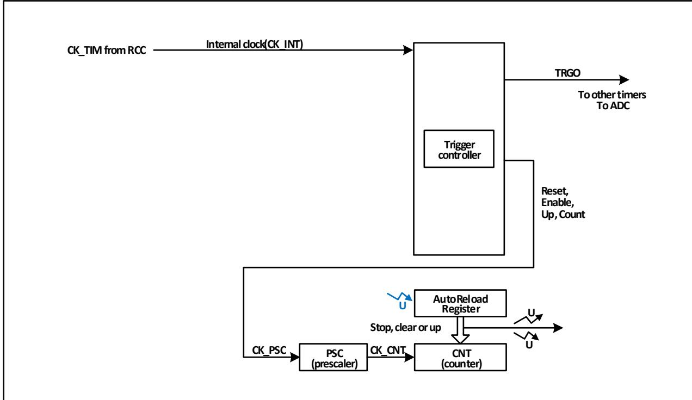  
图11-1 通用定时器的结构框图

# 11.2.1 概述

如图 11-1 所示，通用定时器的结构大致可以分为三部分，即输入时钟部分，核心计数器部分和比较捕获通道部分。

通用定时器的时钟可以来自于AHB总线时钟（CK_INT），可以来自外部时钟输入引脚（TIMx_ETR），可以来自于其他具有时钟输出功能的定时器（ITRx），还可以来自于比较捕获通道的输入端（TIMx_CHx）。这些输入的时钟信号经过各种设定的滤波分频等操作后成为CK_PSC时钟，输出给核心计数器部分。另外，这些复杂的时钟来源还可以作为TRGO输出给其他的定时器和ADC等外设。

通用定时器的核心是一个16位计数器（CNT）。CK_PSC经过预分频器（PSC）分频后，成为CK_CNT再最终输给 CNT，CNT 支持增计数模式、减计数模式和增减计数模式，并有一个自动重装值寄存器（ATRLR）在每个计数周期结束后为CNT重装载初始化值。

通用定时器拥有四组比较捕获通道，每组比较捕获通道都可以从专属的引脚上输入脉冲，也可以向引脚输出波形，即比较捕获通道支持输入和输出模式。比较捕获寄存器每个通道的输入都支持滤波、分频、边沿检测等操作，并支持通道间的互触发，还能为核心计数器CNT提供时钟。每个比较捕获通道都拥有一组比较捕获寄存器（CHxCVR），支持与主计数器（CNT）进行比较而输出脉冲。

# 11.2.2 通用定时器和高级定时器的区别

与高级定时器相比，通用定时器缺少以下功能：

1） 通用定时器缺少对核心计数器的计数周期进行计数的重复计数寄存器。  
2） 通用定时器的比较捕获通道缺少死区产生，没有互补输出。  
3） 通用定时器没有刹车信号机制。

# 11.2.3 时钟输入

本节论述CK_PSC的来源。此处截取通用定时器的整体结构框图的时钟源部分。

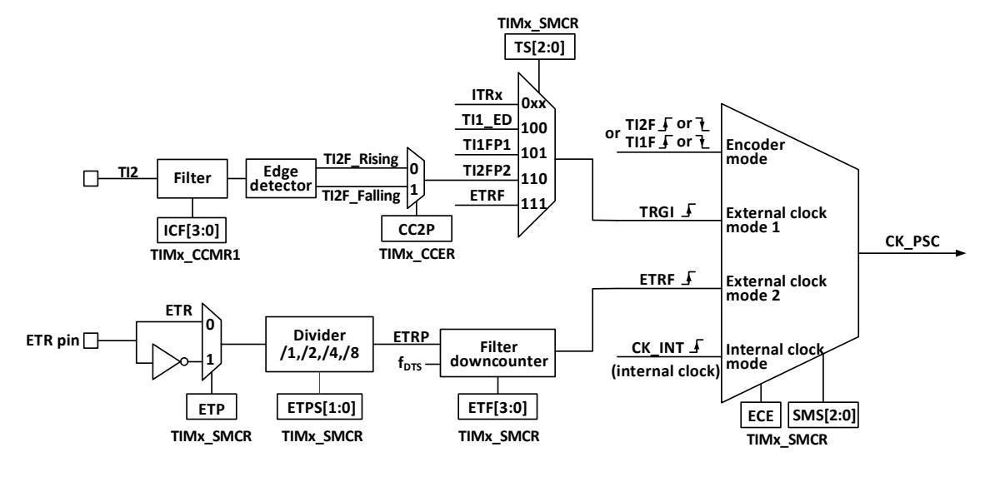  
图 11-2 通用定时器 CK_PSC 来源框图

可选的输入时钟可以分为4类：

1) 外部时钟引脚（ETR）输入的路线：ETR ETRP ETRF；  
2) 内部 AHB 时钟输入路线：CK_INT；  
3) 来自比较捕获通道引脚（TIMx_CHx）的路线：TIMx_CHx→TIx→TIxFPx，此路线也用于编码器模式；  
4) 来自内部其他定时器的输入：ITRx。通过决定CK_PSC来源的SMS的输入脉冲选择可以将实际的操作分为三类：  
1) 选择内部时钟源（CK_INT）；  
2) 外部时钟源模式 1；  
3) 外部时钟源模式 2；  
4) 编码器模式。上文提到的4种时钟源来源都可通过这4种操作选定。

# 11.2.3.1 内部时钟源（CK_INT）

如果将 SMS 域保持为 000b 时启动通用定时器，那么就是选定内部时钟源（CK_INT）为时钟。此时 CK_INT 就是 CK_PSC。

# 11.2.3.2 外部时钟源模式 1

如果将SMS域设置为111b时，就会启用外部时钟源模式1。启用外部时钟源1时，TRGI被选定为 CK_PSC 的来源，值得注意的，用户还需要通过配置 TS 域来选择 TRGI 的来源。TS 域可选择以下几种脉冲作为时钟来源：

1） 内部触发（ITRx，x 为 0,1,2,3）；  
2） 比较捕获通道1经过边缘检测器后的信号（TI1F_ED）；  
3） 比较捕获通道的信号 TI1FP1、TI2FP2；  
4） 来自外部时钟引脚输入的信号ETRF。

# 11.2.3.3 外部时钟源模式 2

使用外部触发模式2能在外部时钟引脚输入的每一个上升沿或下降沿计数。将ECE位置位时，将使用外部时钟源模式 2。使用外部时钟源模式 2 时，ETRF 被选定为 CK_PSC。ETR 引脚经过可选的反相器（ETP），分频器（ETPS）后成为ETRP，再经过滤波器（ETF）后即成为ETRF。

在ECE位置位且将SMS设为111b时，那么，相当于TS选择ETRF为输入。

# 11.2.3.4 编码器模式

将SMS置为001b，010b，011b将会启用编码器模式。启用编码器模式可以选择在TI1FP1和TI2FP2中某一个特定的电平下以另一个跳变沿作为信号进行信号输出。此模式用于外接编码器使用的情况下。具体功能参考11.3.7节。

# 11.2.4 计数器和周边

CK_PSC 输入给预分频器（PSC）进行分频。PSC 是 16 位的，实际的分频系数相当于 R16_TIMx_PSC的值 $+ 1$ 。CK_PSC 经过 PSC 会成为 CK_INT。更改 R16_TIM1_PSC 的值并不会实时生效，而会在更新事件后更新给PSC。更新事件包括UG位清零和复位。

# 11.2.5 比较捕获通道

比较捕获通道是定时器实现复杂功能的核心，它的核心是比较捕获寄存器，辅以外围输入部分的数字滤波，分频和通道间复用，输出部分的比较器和输出控制组成。比较捕获通道的结构框图如图 11-3 所示。

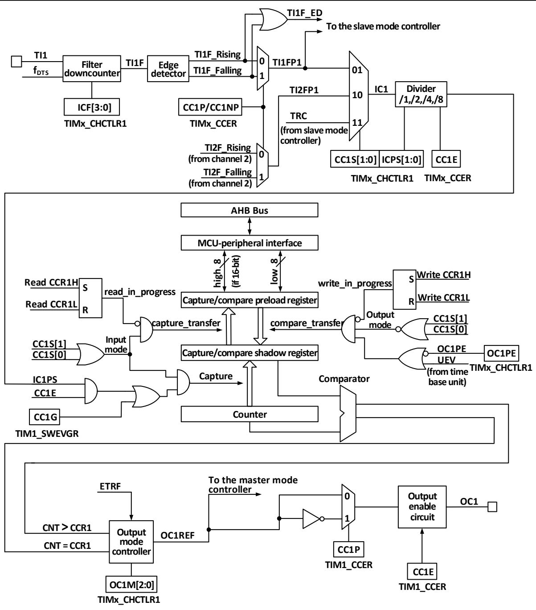  
图11-3 比较捕获通道的结构框图

信号从通道x引脚输入进来后可选做为 ${ \sf T I } \times \left( { \sf T I } 1 \right)$ 的来源可以不只是CH1，见定时器的框图10-1），TI1 经过滤波器（ICF[3:0]）生成 TI1F，再经过边沿检测器分成 TI1F_Rising 和 TI1F_Falling，这两个信号经过选择（CC1P）生成 TI1FP1，TI1FP1 和来自通道 2 的 TI2FP1 一起送给 CC1S 选择成为IC1，经过ICPS分频后送给比较捕获寄存器。

比较捕获寄存器由一个预装载寄存器和一个影子寄存器组成，读写过程仅操作预装载寄存器。在捕获模式下，捕获发生在影子寄存器上，然后复制到预装载寄存器；在比较模式下，预装载寄存器的内容被复制到影子寄存器中，然后影子寄存器的内容与核心计数器（CNT）进行比较。

# 11.3 功能和实现

通用定时器复杂功能的实现都是对定时器的比较捕获通道、时钟输入电路和计数器及周边组件进行操作实现的。定时器的时钟输入可以来自于包括比较捕获通道的输入在内的多个时钟源。对比

较捕获寄存通道和时钟源选择的操作直接决定其功能。比较捕获通道是双向的，可以工作在输入和输出模式。

# 11.3.1 输入捕获模式

输入捕获模式是定时器的基本功能之一。输入捕获模式的原理是，当检测到 ${ \mathsf { I C X P S } }$ 信号上确定的边沿后，则产生捕获事件，计数器当前的值会被锁存到比较捕获寄存器（R16_TIMx_CHCTLRx）中。发生捕获事件时， ${ \mathsf { C C } } \times { \mathsf { I F } }$ （在 R16_TIMx_INTFR 中）被置位，如果使能了中断或者 DMA，还会产生相应中断或者DMA。如果发生捕获事件时， ${ \mathsf { C C } } \times { \mathsf { I F } }$ 已经被置位了，那么 $\mathtt { C C } \mathtt { x O F }$ 位会被置位。 ${ \mathsf { C C } } \times { \mathsf { I F } }$ 可由软件清除，也可以通过读取比较捕获寄存器由硬件清除。 $\mathtt { C C } \mathtt { x O F }$ 由软件清除。

举个通道1的例子来说明使用输入捕获模式的步骤，如下：

1） 配置 $\mathtt { C C } \mathtt { x } \mathtt { S }$ 域，选择 $1 0 \times$ 信号的来源。比如设为 10b，选择 TI1FP1 作为 IC1 的来源，不可以使用默认设置， $\mathtt { C O x S }$ 域默认是使比较捕获模块作为输出通道；  
2） 配置 ${ | 0 \times | }$ 域，设定 TI 信号的数字滤波器。数字滤波器会以确定的频率，采样确定的次数，再输出一个跳变。这个采样频率和次数是通过 ${ | 0 \times | }$ 来确定的；  
3） 配置 $\mathtt { C C } \mathtt { x } \mathtt { P }$ 位，设定 ${ \mathsf { T } } { \mathsf { I } } { \mathsf { x } } { \mathsf { F } } { \mathsf { P } } { \mathsf { x } }$ 的极性。比如保持CC1P位为低，选择上升沿跳变；  
4） 配置 ${ \mathsf { I C X P S } }$ 域，设定 $1 0 \times$ 信号成为 ${ \mathsf { I C X P S } }$ 之间的分频系数。比如保持 ${ \mathsf { I C X P S } }$ 为 00b，不分频；  
5） 配置 $\mathtt { C C } \mathtt { x } \mathtt { E }$ 位，允许捕获核心计数器（CNT）的值到比较捕获寄存器中。置 CC1E 位；  
6） 根据需要配置 $\mathsf { C C } \mathsf { \times } { \mathsf { I E } }$ 和 $\complement 0 \times \mathsf { D E }$ 位，决定是否允许使能中断或者DMA。至此已经将比较捕获通道配置完成。

当 TI1 输入了一个被捕获的脉冲时，核心计数器（CNT）的值会被记录到比较捕获寄存器中，CC1IF被置位，当 CC1IF 在之前就已经被置位时，CCIOF 位也会被置位。如果 CC1IE 位，那么会产生一个中断；如果 CC1DE 被置位，会产生一个 DMA 请求。可以通过写事件产生寄存器的方式（R16_TIMx_SWEVGR）的方式由软件产生一个输入捕获事件。

# 11.3.2 比较输出模式

比较输出模式是定时器的基本功能之一。比较输出模式的原理是在核心计数器（CNT）的值与比较捕获寄存器的值一致时，输出特定的变化或波形。 $0 0 \times 1 1$ 域（在 R16_TIMx_CHCTLRx 中）和 $\mathtt { C C } \mathtt { x } \mathtt { P }$ 位（在R16_TIMx_CCER中）决定输出的是确定的高低电平还是电平翻转。产生比较一致事件时还会置${ \mathsf { C C } } \times { \mathsf { I F } }$ 位，如果预先置了 $\mathsf { C C } \mathsf { \times } { \mathsf { I E } }$ 位，则会产生一个中断；如果预先设置了 $\complement 0 \times \mathsf { D E }$ 位，则会产生一个DMA 请求。

配置为比较输出模式的步骤为下：

1） 配置核心计数器（CNT）的时钟源和自动重装值；  
2） 设置好需要对比的计数值到比较捕获寄存器（R16_TIMx_CHxCVR）中；  
3） 如果需要产生中断，置 $\complement 0 \times 1 \mathsf { E }$ 位；  
4） 保持 ${ 0 0 } \times { \mathsf E }$ 为0，禁用比较捕获寄存器的预装载寄存器；  
5） 设定输出模式，设置 $0 0 \times 1 1$ 域和 $\complement 0 \times \emptyset$ 位；  
6） 使能输出，置 $\mathtt { C C } \mathtt { x } \mathtt { E }$ 位；  
7） 置CEN位启动定时器。

# 11.3.3 强制输出模式

定时器的比较捕获通道的输出模式可以由软件强制输出确定的电平，而不依赖比较捕获寄存器的影子寄存器和核心计数器的比较。

具体的做法是将 ${ 0 0 } \times { 1 1 }$ 置为 100b，即为强制将 ${ 0 0 } \times { \mathsf { R E F } }$ 置为低；或者将 $0 0 \times 1 1$ 置为 101b，即为强制将 ${ 0 0 } \times { \mathsf { R E F } }$ 置为高。

需要注意的是，将 $0 0 \times 1 1$ 强制置为100b或者101b，内部主计数器和比较捕获寄存器的比较过程还在进行，相应的标志位还在置位，中断和DMA请求还在产生。

# 11.3.4 PWM 输入模式

PWM 输入模式是用来测量 PWM 的占空比和频率的，是输入捕获模式的一种特殊情况。除下列区别外，操作和输入捕获模式相同：PWM 占用两个比较捕获通道，且两个通道的输入极性设为相反，其中一个信号被设为触发输入，SMS设为复位模式。

例如，测量从TI1输入的PWM波的周期和频率，需要进行以下操作：  
1） 将 TI1(TI1FP1)设为 IC1 信号的输入。将 CC1S 置为 01b；  
2） 将 TI1FP1 置为上升沿有效。将 CC1P 保持为 0；  
3） 将 TI1(TI1FP2)置为 IC2 信号的输入。将 CC2S 置为 10b；  
4） 选TI1FP2置为下降沿有效。将CC2P置为1；  
5） 时钟源的来源选择 TI1FP1。将 TS 设为 101b；  
6） 将SMS设为复位模式，即100b；  
7） 使能输入捕获。CC1E和CC2E置位。

# 11.3.5 PWM 输出模式

PWM 输出模式是定时器的基本功能之一。PWM 输出模式最常见的是使用重装值确定 PWM 频率，使用捕获比较寄存器确定占空比的方法。将 $0 0 \times 1 1$ 域中置 110b 或者 111b 使用 PWM 模式 1 或者模式 2，置 ${ \tt O C } \tt { x P E }$ 位使能预装载寄存器，最后置ARPE位使能预装载寄存器的自动重装载。在发生一个更新事件时，预装载寄存器的值才能被送到影子寄存器，所以在核心计数器开始计数之前，需要置UG位来初始化所有寄存器。在 PWM 模式下，核心计数器和比较捕获寄存器一直在进行比较，根据 CMS 位，定时器能够输出边沿对齐或者中央对齐的PWM信号。

$\bullet$ 边沿对齐

使用边沿对齐时，核心计数器增计数或者减计数，在 PWM 模式 1 的情景下，在核心计数器的值大于比较捕获寄存器时，OCxREF上升为高；当核心计数器的值小于比较捕获寄存器时（比如核心计数器增长到 R16_TIMx_ATRLR 的值而恢复成全 0 时），OCxREF 下降为低。

$\bullet$ 中央对齐

使用中央对齐模式时，核心计数器运行在增计数和减计数交替进行的模式下， ${ 0 0 } \times { \mathsf { R E F } }$ 在核心计数器和比较捕获寄存器的值一致时进行上升和下降的跳变。但比较标志在三种中央对齐模式下，置位的时机有所不同。在使用中央对齐模式时，最好在启动核心计数器之前产生一个软件更新标志（置UG 位）。

# 11.3.6 单脉冲模式

单脉冲模式可以响应一个特定的事件，在一个延迟之后产生一个脉冲，延迟和脉冲的宽度可编程。置OPM位可以使核心计数器在产生下一个更新事件UEV时（计数器翻转到0）停止。

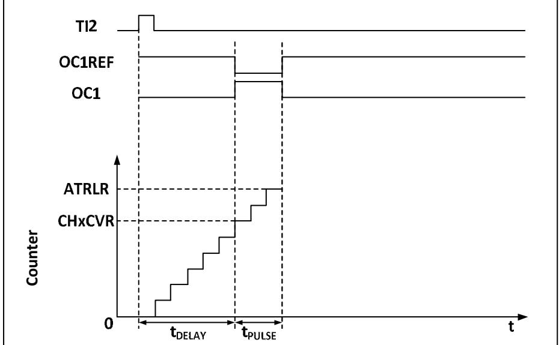  
图11-4 事件产生和脉冲响应

如图11-4所示，需要在TI2输入引脚上检测到一个上升沿开始，延迟Tdelay之后，在OC1上产生一个长度为Tpulse的正脉冲：

1） 设定 TI2 为触发。置 CC2S 域为 01b，把 TI2FP2 映射到 TI2；置 CC2P 位为 0b，TI2FP2 设为上升沿检测；置 TS 域为 110b，TI2FP2 设为触发源；置 SMS 域为 110b，TI2FP2 被用来启动计数器；2） Tdelay由比较捕获寄存器定义，Tpulse由自动重装值寄存器的值和比较捕获寄存器的值确定。

# 11.3.7 编码器模式

编码器模式是定时器的一个典型应用，可以用来接入编码器的双相输出，核心计数器的计数方向和编码器的转轴方向同步，编码器每输出一个脉冲就会使核心计数器加一或减一。使用编码器的步骤为：将SMS域置为001b（只在TI2边沿计数）、010b（只在TI1边沿计数）或者011b（在TI1和 TI2 双边沿计数），将编码器接到比较捕获通道 1、2 的输入端，设一个重装值计数器的值，这个值可以设的大一点。在编码器模式时，定时器内部的比较捕获寄存器，预分频器，重复计数寄存器等都正常工作。下表表明了计数方向和编码器信号的关系。

表11-1定时器编码器模式的计数方向和编码器信号之间的关系  

<table><tr><td rowspan="2">if#ii#</td><td rowspan="2">tx13 A</td><td colspan="2">T11FP1 3iiA</td><td colspan="2">T |2FP2 1</td></tr><tr><td></td><td>T#iA</td><td></td><td>T#iA</td></tr><tr><td rowspan="2">1X T11 iiAi1#</td><td></td><td> Fif#</td><td>b Ei+#</td><td rowspan="2" colspan="2">Ti+#</td></tr><tr><td>1E</td><td>b Eif#</td><td>Tif#</td></tr><tr><td rowspan="2">1XE T12 iiAil#</td><td></td><td rowspan="2">Ti+#</td><td rowspan="2"></td><td>bEif#</td><td>Fi+#</td></tr><tr><td>1E</td><td> Fif#</td><td>bEif#</td></tr><tr><td rowspan="2">T T11 FA T12 XXitiAi+#</td><td></td><td>Ti+#</td><td>bEit#</td><td>b Ei+#</td><td> Fi+#</td></tr><tr><td>1E</td><td>bEit#</td><td> Fit#</td><td>DTi+#</td><td>b_Ei+#</td></tr></table>

# 11.3.8 定时器同步模式

定时器能够输出时钟脉冲（TRGO），也能接收其他定时器的输入（ $( 1 \pi \mathsf { R } \mathsf { x } .$ ）。不同的定时器的 ITRx的来源（别的定时器的TRGO）是不一样的。定时器内部触发连接如表11-2所示。

表 11-2 GTPM 内部触发连接  

<table><tr><td></td><td>ITRO (TS=000)</td><td>ITR1 (TS=001)</td><td>ITR2(TS=O10)</td><td>ITR3 (TS=O11)</td></tr><tr><td>TIm2</td><td>TIM1</td><td></td><td></td><td></td></tr></table>

<table><tr><td>TIM1</td><td></td><td></td><td></td><td></td></tr><tr><td></td><td></td><td>T IM2</td><td></td><td></td></tr></table>

# 11.3.9 调试模式

当系统进入调试模式时，根据DBG模块的设置可以控制定时器继续运转或者停止。

# 11.4 寄存器描述

表 11-3 TIM2 相关寄存器列表  

<table><tr><td></td><td>1ttt</td><td>##it</td><td></td></tr><tr><td>R16_TIM2_CTLR1</td><td>0x40000000</td><td>T 1M2 $J$7z 1</td><td>0x0000</td></tr><tr><td>R16_TIM2_CTLR2</td><td>0x40000004</td><td>T 1m2 $J77 2</td><td>0x0000</td></tr><tr><td>R16_TIM2_SMCFGR</td><td>0x40000008</td><td>T1M2 Jttf*$J$7</td><td>0x0000</td></tr><tr><td>R16_TIM2_DMAINTENR</td><td>0x40000000</td><td>T1M2 DMA/F1AET</td><td>0x0000</td></tr><tr><td>R16_TIM2_INTFR</td><td>0x40000010</td><td>T1M2 +h$1</td><td>0x0000</td></tr><tr><td>R16_TIM2_SWEVGR</td><td>0x40000014</td><td>T1M2 $*$</td><td>0x0000</td></tr><tr><td>R16_TIM2_CHCTLR1</td><td>0x40000018</td><td>T1M2 t$/t#3$JT 1</td><td>0x0000</td></tr><tr><td>R16_TIM2_CHCTLR2</td><td>0x4000001C</td><td>T1M2 t$/##3$ 2</td><td>0x0000</td></tr><tr><td>R16_TIM2_CCER</td><td>0x40000020</td><td>T1M2 tC$/##31AE$T7</td><td>0x0000</td></tr><tr><td>R16_TIM2_CNT</td><td>0x40000024</td><td>T 1M2 i+#</td><td>0x0000</td></tr><tr><td>R16_T1M2_PSC</td><td>0x40000028</td><td>T IM2 i+#$</td><td>0x0000</td></tr><tr><td>R16_TIM2_ATRLR</td><td>0x4000002C</td><td>T1M2 z)$7</td><td>0xFFFF</td></tr><tr><td>R32_T IM2_CH1CVR</td><td>0x40000034</td><td>T1M2 t$/##3*$1 1</td><td>0x00000000</td></tr><tr><td>R32_T IM2_CH2CVR</td><td>0x40000038</td><td>T1M2 tC$/##31 2</td><td>0x00000000</td></tr><tr><td>R32_T1M2_CH3CVR</td><td>0x4000003C</td><td>T1M2 tt$/##3 3</td><td>0x00000000</td></tr><tr><td>R32_T1M2_CH4CVR</td><td>0x40000040</td><td>T1M2 t$/t#3$T 4</td><td>0x00000000</td></tr><tr><td>R16_T1M2_DMACFGR</td><td>0x40000048</td><td>T1M2 DMA $J$T</td><td>0x0000</td></tr><tr><td>R16_T1M2_DMAADR</td><td>0x4000004C</td><td>TIM2 iA DMA tttT</td><td>0x0000</td></tr></table>

# 11.4.1 控制寄存器 1（TIM2_CTLR1）

偏移地址： $0 \times 0 0$

<table><tr><td>15</td><td>14</td><td>13</td><td>12</td><td>11</td><td>10</td><td>9</td><td>8</td><td>7</td><td>6</td><td>5</td><td>4</td><td>3</td><td>2</td><td>1</td><td></td></tr><tr><td>CAPLV L</td><td>CAPO</td><td></td><td></td><td>Reserved</td><td></td><td></td><td>CKD[1 : 0]</td><td>ARPE</td><td>CMS[1 : 0]</td><td></td><td>DIR</td><td>OPM</td><td>URS</td><td>UDIS</td><td>CEN</td></tr></table>

<table><tr><td>1i</td><td></td><td></td><td>##it</td><td></td></tr><tr><td>15</td><td>CAPLVL</td><td>RW</td><td>Xi##3T, t#3T1AE. 0: iIE; 1: 1. i:1, CHxCVR [16]#3X.</td><td>0</td></tr><tr><td>14</td><td>CAPOV</td><td>RW</td><td>3. 0 t 1: # CHxCVR 0xFFFF.</td><td>0</td></tr><tr><td>[13: 10]</td><td>Reser ved</td><td>RO</td><td>R.</td><td>0</td></tr></table>

<table><tr><td>[9:8] 7</td><td>CKD[1: 0] RW ARPE RW</td><td>1X 2 1LiEXixEAJ#ATt4(CK_1NT) yn 00: Tdts=Tck_int; 01: Tdts= 2xTck_int; 10: Tdts= 4xTck_int; 11: 1. 1: 1A((ATRLR); 0: #*11(ATRLR) . +ti. 00: i.i#1#(D1R) E</td><td>0 0</td></tr><tr><td>[6:5] 4</td><td>MS[1: 0] RW DIR RW</td><td>Tit#. 01: x*t 1. i##ETi C#ij(CHCTLRx 17 CCxS=0O) A9#W$+, R#i+#Ti+#A it. 10: xt 2. i##ttETit #2#AJij(CHCTLRx77 CCxS=0O) A9#Wt$+#, Ri+#Ei+#A iti. 11: x 3. i##ETif #.AJij(CHCTLRx 77 CCxS=00) A#Wt$++, i+#+Ti+# Atit. i:#i+##1Af(CEN=1), T3tiFi;Xtt t##+xt. if#. o: i+#i+#i+#;</td><td>0 0</td></tr><tr><td>3</td><td>OPM RW</td><td>1: if#i#if#. #+xtAf, it1F. #Ak+t. 1:#T##, i#1 CEN</td><td>0</td></tr><tr><td>2</td><td>URS RW</td><td>1) ; 0: #T$$#, i#T. E$iKi, ##i#ii1 UEV $1#AiR. 1: tnR1E7#+ DMA i#X, Ri# W/T#+ DMA i; 0: tnR1A7$f+f DMA i#, J Ti1I$ 1##+ DMA i#K i+#/T i&amp; UG |</td><td>0</td></tr></table>

<table><tr><td>1</td><td>UDIS</td><td>RW</td><td>#1E$h, ##i#ii13tiF/#L uEv $1#A* . 1: #UEV. T#$$#, $T7(ATRLR. PSC CHCTLRx) 1RE1i]AS1. tnRi7 UG 19 Mt$JW71#1, i+#FF #1t. 0: ftiF UEV. $(UEV)$#Ti1I-$1##: 0 -i/T i&amp;UG | Mt$J*#</td></tr><tr><td>0</td><td>CEN</td><td>RW</td><td>1AEi+#(Counter enable). 1: 1 0: #i#. i: #$1i7 CEN1iF, 9l#BA#i]tt H1#iQ CEN 1i.</td></tr></table>

# 11.4.2 控制寄存器 2（TIM2_CTLR2）

偏移地址： $0 \times 0 4$

<table><tr><td>15</td><td>14</td><td>13</td><td>12</td><td>11</td><td>10</td><td>9</td><td>8</td><td>7</td><td>6</td><td>5</td><td>4 3</td><td>2</td><td>1</td><td>0</td></tr><tr><td></td><td></td><td></td><td></td><td>Reserved</td><td></td><td></td><td></td><td></td><td>TI1S</td><td>MMS[2 : 0]</td><td></td><td>CCDS</td><td>Reserved</td><td></td></tr></table>

<table><tr><td>1</td><td></td><td>i3i</td><td>##it</td><td></td></tr><tr><td>[15: 8]</td><td>Reser ved</td><td>RO</td><td>1R.</td><td>0</td></tr><tr><td>7</td><td>TI1S</td><td>RW</td><td>T|1 i: 1: T1Mx_CH1T1Mx_CH2 FA T1Mx_CH3 31AtDZ5gt i$J T11$a; O: T1Mx_CH1 31AIiJ T11#o</td><td>0</td></tr><tr><td>[6:4]</td><td>MMS [2 : 0]</td><td>RW</td><td>i ix 3TiTi]M AAJ(TRGO). aJAEASAtAT: 000 1-UG 1FTRGO R###1t$F1z tt) J TRG0 EA13tXA1 3EjR; 0011-  CNT_EN1F #TRG0#Aj3A 1 3 i#i CEN f$JAitt TAJ#1 XAj, TRG0 E#3Ii, $#Fif7/Mt</td><td>0</td></tr></table>

<table><tr><td></td><td></td><td></td><td>010: TRGO).1 011:t$Ak,it#3it#h, i cC1F(E), WiWiEAk(TRG0); 100: OC1REFF1FTRGO; 101: OC2REF1F(TRGO); 110 OC3REF 1F(TRGO);</td></tr><tr><td>3</td><td>CCDS</td><td>RW</td><td>111: OC4REF 1F1F(TRGO) . 1: E$f$1#j, i CHxCVRJ DMA i#; 0 O:  CHxCVR f, # CHxCVR J DMA i#K.</td></tr><tr><td>[2 : 0]</td><td>Reser ved</td><td>RO 1RE.</td><td>0</td></tr></table>

# 11.4.3 从模式控制寄存器 （TIM2_SMCFGR）

偏移地址： $0 \times 0 8$

<table><tr><td>15</td><td>14</td><td>13</td><td>12 11</td><td>10</td><td></td><td>9</td><td>8 7</td><td>6</td><td>5</td><td>4</td><td>3</td><td>2 1</td><td>0</td></tr><tr><td>ETP</td><td>ECE</td><td></td><td>ETPS[1:0]</td><td></td><td>ETF[3:0]</td><td></td><td></td><td>MSM</td><td>TS[2: 0]</td><td></td><td>Reserved</td><td>SMS[2: 0]</td><td></td></tr></table>

<table><tr><td>1</td><td></td><td>iji8</td><td>##it</td><td></td></tr><tr><td>15</td><td>ETP</td><td>RO</td><td>ETR #t#i, i1it# ETR i #a ETR AJ. 1:  ETRt, 1TTiA; 0: ETR, .</td><td>0</td></tr><tr><td>14</td><td>ECE</td><td>RW</td><td>5#BA$t 2 i. 1: 1AEBA$t2; 0: #l#B$t2. i 1: MttaS9#BA#tt2 A1: 1tC, i]ttFtC; 1, iXAf TRG1 TAEi$ElJ ETRF(TS 1iiT#EE 111b) o j 2: 5l#B1 FABC2 J1 AEAf, 9l#BA$#AJ$j ETRF.</td><td>0</td></tr><tr><td>[13:12]ETPS[1:0]</td><td></td><td>RW</td><td>5#BA1(ETRP), ixth*xTAE Bjt T1MxCLK *AJ 1/4, aJli#jixt* #h. 00: ; 01: ETRP *2; 10: ETRPt*l4; 11: ETRP t*l8.</td><td>0</td></tr><tr><td>[11:8]ETF[3:0]</td><td></td><td>RW</td><td>5# , #$#i # e1-AK#A*, i2RN$ R*-. 0000 Fi, WFdts; 0001: #t* Fsamp1ing=Fck_int, N=2; 0010: #$* Fsamp1ing=Fck_int, N=4;</td><td>0</td></tr></table>

<table><tr><td></td><td></td><td></td><td>0011: Kt#3* Fsamp1ing=Fck_int, N=8; 0100: ##* Fsamp1 ing=Fdts/2, N=6; 0101: K##* Fsampl ing=Fdts/2, N=8; 0110: Kt#* Fsampl ing=Fdts/4, N=6; 0111: Ktt* Fsamp1 ing=Fdts/4, N=8; 1000: K##* Fsampl ing=Fdts/8, N=6; 1001: ti* Fsamp1 ing=Fdts/8, N=8; 1010: t*Fsamp1 ing=Fdts/16, N=5; 1011: ##* Fsamp1 ing=Fdts/16, N=6; 1100: #* Fsampl ing=Fdts/16, N=8; 1101: ###* Fsamp1 ing=Fdts/32, N=5; 1110: K##* Fsamp1ing=Fdts/32, N=6; 1111: t* Fsamp1ing=Fdts/32, N=8. /Mti.</td></tr><tr><td>7</td><td>MSM</td><td>RW 0: T#1F. Air.</td><td>1: ##(TRG1) E$#i3Ei7, l3i# 0 it ix3{jFi# 000: AO(ITRO); 001: 1(ITR1); 010: 2(1TR2);</td></tr><tr><td>[6:4] 3</td><td>Ts[2: 0] Reserved</td><td>RW RO</td><td>011: 3(ITR3); 0 100: T11 i;J(TI1F_ED); 101: 1(T1FP1); 110: A 2(T12FP2); 111: 9#(ETRF); E SMS  0 2. 0</td></tr><tr><td></td><td>SMS [2 : 0]</td><td>1R. It. RW</td><td>#ttit iif#Af$F OO0: BA$ CK_1NT JEz; 001: #1, tR# T11FP1 , ti # T12FP2 a9ii+#x; 010: #9tt 2, tR# T12FP2 , tLi # T11FP1 ai;#i+#; 011: 3, tR, 0 tti1#E T11FP1 F T12FP2 Ai;@;i1#; 100: 1, ATRG1) 1</td></tr></table>

<table><tr><td></td><td></td><td></td><td>i#; 111: ylBA$1, i(TRG1) JHiA9i+#.</td></tr></table>

# 11.4.4 DMA/中断使能寄存器（TIM2_DMAINTENR）

偏移地址： $0 \times 0 0$

<table><tr><td>15</td><td>14</td><td>13</td><td>12</td><td>11</td><td>10</td><td>9</td><td>8</td><td>7</td><td>6</td><td>5</td><td>4</td><td>3</td><td>2</td><td></td><td>1</td><td>0</td></tr><tr><td>Reserve</td><td>TD</td><td>Reserve</td><td></td><td>CC4D</td><td>CC3D</td><td>CC2D</td><td>CC1D UD</td><td></td><td>Reserve</td><td>T1</td><td>Reserve</td><td>CC41</td><td>CC31</td><td>CC21</td><td>CC11</td><td>U1</td></tr><tr><td>d</td><td></td><td>d</td><td>E</td><td>E</td><td></td><td>E</td><td></td><td></td><td>d</td><td></td><td>d</td><td>E</td><td>E</td><td></td><td>E</td><td>E</td></tr></table>

<table><tr><td></td><td></td><td>iji]</td><td>##it</td><td></td></tr><tr><td>1 15</td><td>Reserved</td><td>RO</td><td>r.</td><td>0</td></tr><tr><td>14</td><td></td><td> RW</td><td>DMA i#K1AE1. 1: ftiF#DMA i#;</td><td>0</td></tr><tr><td>13</td><td>TDE</td><td></td><td>0: # DMA i. 1*.</td><td>0</td></tr><tr><td>12 CC4DE</td><td>Reserved</td><td>RO RW</td><td>tC$#3ij 4 A] DMA i#&gt;K1AE1. 1: 3ti#tL$#3ii 4 J DMA i#K;</td><td>0</td></tr><tr><td>11 CC3DE</td><td></td><td></td><td>0: #tL$#3ii 4  DMA i#K. tL#t#3ij 3 AJ DMA i#K1AE1. 1: fti#tL$#3i#j 3 J DMA i#K;</td><td></td></tr><tr><td></td><td></td><td>RW</td><td>0:#Et##3ii3 DMA i. tC#t#3ij 2 J DMA i#&gt;K1AE1.</td><td>0</td></tr><tr><td>10 CC2DE</td><td></td><td>RW</td><td>1: ftiFtC$#3ij 2 I DMA i#K; 0: #1tL$#3ii 2J DMA i#K. tC$#3ij 1 #J DMA i#K1AE1.</td><td>0</td></tr><tr><td>9</td><td>CC1DE</td><td>RW</td><td>1: 3ti#tL$#3ij1 J DMA i#K; 0: #tL$#3ii1  DMA i#K. $A] DMA i#K1AE{.</td><td>0</td></tr><tr><td>8 UDE 7</td><td>Reserved</td><td>RW RO</td><td>1: fti#$J DMA i#K; O: ##FA DMA i#. 1.</td><td>0 0</td></tr><tr><td>6</td><td>TIE</td><td>RW</td><td>A+AE. 1 0: #+.</td><td>0</td></tr><tr><td>5</td><td>Reserved</td><td>RO</td><td>RE. tC$#3ij 4 h11.</td><td>0</td></tr><tr><td>4 CC4IE</td><td></td><td>RW</td><td>1: fti#t$#ij 4f; 0: #t$4.</td><td>0</td></tr><tr><td>3 CC31E</td><td></td><td>RW</td><td>tC$#3i 3 +F11. 1: tit$#3i3 F 0: #t#i3.</td><td>0</td></tr><tr><td>2 CC21E</td><td></td><td>RW</td><td>tC$#3ij 2 +F11. 1: 3tiFtC$#3ij 2 +;</td><td>0</td></tr></table>

<table><tr><td></td><td></td><td></td><td>0: 2.</td><td></td></tr><tr><td>1</td><td>CC1IE</td><td>RW</td><td>tC$t#3i#j 1 *F11. 1: 3tit$31 0i1.</td><td>0</td></tr><tr><td>0</td><td>UIE</td><td>RW</td><td>$+F1AE1. 1: fti$+f; 0: #*+*.</td><td>0</td></tr></table>

# 11.4.5 中断状态寄存器 （TIM2_INTFR）

偏移地址： $0 \times 1 0$

<table><tr><td>15 14</td><td>13</td><td>12</td><td>11</td><td>10</td><td>9</td><td>8</td><td>7</td><td>6</td><td>5</td><td>4</td><td>3</td><td>2</td><td>1</td><td>0</td></tr><tr><td>Reser ved</td><td></td><td></td><td></td><td></td><td></td><td></td><td></td><td></td><td>CC40FCc30FCc20FCC10FReservedT1F ReservedCC41F</td><td></td><td></td><td></td><td>CC3IFCC2IFCC1IF</td><td>UIF</td></tr></table>

<table><tr><td>1i</td><td></td><td>i</td><td>#it</td><td></td></tr><tr><td>[15:13]</td><td>Reserved</td><td>RO</td><td>1Rm.</td><td>0</td></tr><tr><td>12</td><td>CC40F</td><td>wo</td><td>t##3i 4#31.</td><td>0</td></tr><tr><td>11</td><td>CC30F</td><td>wo</td><td>t$#i3 #1.</td><td>0</td></tr><tr><td>10</td><td>CC20F</td><td>wo</td><td>t$#ij2#31.</td><td>0</td></tr><tr><td>9</td><td>CC10F</td><td>wo</td><td>tC##3ii1#3$1 1XFt##3* ij23 ii21 1i, #1#5 0 aJ;$t. 1 i$ CC11F</td><td>0</td></tr><tr><td>[8:7]</td><td>Reserved</td><td>RO</td><td>0: F#*. 1R.</td><td>0</td></tr><tr><td>6</td><td>TIF</td><td></td><td>+ #i 1 $# $ 5lA#EtstAj,  TRG1 #;JJii, gti7tttFA91IiiA. 1: 0: F#*.</td><td>0</td></tr><tr><td>5 4</td><td>Reserved</td><td>RO</td><td>1R.</td><td>0</td></tr><tr><td></td><td>CC4|F</td><td>wo</td><td>tC$#3ij 4 .</td><td>0</td></tr><tr><td>3</td><td>CC31F</td><td>WO</td><td>t$#3ij3 F.</td><td>0</td></tr><tr><td>2</td><td>CC2|F</td><td>wo</td><td>t$#3ij 2 . t$3j1.</td><td>0</td></tr><tr><td>1</td><td>CC1IF</td><td>Wo</td><td>bnR$i2 i# tC$2Ai11, 1xt F$5. i1$#;#. 1: #i#tC$#3$1 2; 0: F. tnRt##3i12#t, #$ i E$iit</td><td>0</td></tr></table>

<table><tr><td></td><td></td><td></td><td>1: i#31; 0: F*.</td><td></td></tr><tr><td>0</td><td>UIF</td><td>WO</td><td>*+$, *#$#i# 1, $. 1: $+#; 0: F$##. WT#*$#: #UD1S=0, i##ET; URS=0UD1S=0, UG[], si$1#] if#ai1##1f; URS=O UDIS=O, i CNT1T</td><td>0</td></tr></table>

# 11.4.6 事件产生寄存器 （TIM2_SWEVGR）

偏移地址： $0 \times 1 4$

<table><tr><td>15</td><td>14</td><td>13</td><td>12</td><td>11</td><td>10</td><td>9</td><td></td><td>8</td><td>7</td><td>6</td><td>5</td><td>4</td><td>3</td><td>2</td><td>1</td><td>0</td></tr><tr><td></td><td></td><td></td><td></td><td>Reserved</td><td></td><td></td><td></td><td></td><td></td><td>TG</td><td>ReservedCC4G</td><td></td><td>CC3G</td><td>CC2G</td><td>CC1G</td><td>UG</td></tr></table>

<table><tr><td>1</td><td></td><td></td><td>##it</td><td></td></tr><tr><td>[15: 7]</td><td>Reserved</td><td>RO</td><td>1R.</td><td>0</td></tr><tr><td>6</td><td>TG</td><td>Wo</td><td>$* i,  T*$. 1: #$, TF, 0FFA DMA, DJ#tA+FF DMA; 0: F1F.</td><td>0</td></tr><tr><td>5</td><td>Reserved</td><td>RO</td><td>1RE.</td><td>0</td></tr><tr><td>4</td><td>CC4G</td><td>Wo</td><td>t#t#3$1#14 #t$#3$1# 4.</td><td>0</td></tr><tr><td>3</td><td>CC3G</td><td>wo</td><td>t#3$##13. #t##3$1# 3.</td><td>0</td></tr><tr><td>2</td><td>CC2G</td><td>wo</td><td>t##31*12. #t$#312.</td><td>0</td></tr><tr><td>1</td><td>CC1G</td><td>Wo</td><td>t$#3#*11, *t$31i1 #  *$ $1#. 1: t1E*t$#: 1CC1F AEXfA+FF DMA QJtA+hFA DMA; $12 i# 11cC11 AE 7XA+FF DMA, NJ#tA+FF DMA. CC1IF E1,  CC10F . 0: F1F.</td><td>0</td></tr><tr><td>0</td><td>UG</td><td>Wo</td><td>#$#*1, *#$. i$, 1: 1i, #$$# 0: FEs1F. i F#i+#+#, 1##</td><td>0</td></tr></table>

<table><tr><td></td><td></td><td></td><td>T ###ixf#ttTt##i+#ttFtL if#+#i+#Ti+# 1$TA1</td></tr></table>

# 11.4.7 比较/捕获控制寄存器 1（TIM2_CHCTLR1）

偏移地址： $0 \times 1 8$

通道可用于输入(捕获模式)或输出(比较模式)，通道的方向由相应的 $\mathtt { C C } \mathtt { x S }$ 位定义。该寄存器其它位的作用在输入和输出模式下不同。 $_ { 0 0 \times \times }$ 描述了通道在输出模式下的功能， $1 0 \times \mathsf { x }$ 描述了通道在输入模式下的功能。

<table><tr><td>15</td><td>14 13</td><td>12</td><td>11 10</td><td>9</td><td>8</td><td>7</td><td>6 5</td><td>4</td><td>3</td><td>2</td><td>1</td><td>0</td></tr><tr><td>|OC2CE</td><td>OC2M[2: 0]</td><td></td><td>OC2PEOC2FE</td><td colspan="2" rowspan="3">CC2S[1:0]</td><td colspan="2">OC1CE</td><td>OC1M[2: 0]</td><td>OC1PE|OC1FE</td><td></td><td colspan="2">CC1S[1:0]</td></tr><tr><td colspan="2" rowspan="2">1C2F [3:0]</td><td colspan="2">1C2PSC[1 : 0]</td><td rowspan="2"></td><td colspan="2">IC1F[3:0]</td><td colspan="2">IC1PSC[1 : 0]</td><td colspan="2"></td></tr><tr><td colspan="2"></td><td colspan="2"></td><td colspan="2"></td><td colspan="2"></td></tr></table>

比较模式（引脚方向为输出）：

<table><tr><td>1</td><td></td><td>ii</td><td>##it</td><td></td></tr><tr><td>15</td><td>OC2CE</td><td>RW</td><td>tt$3i 2 1. 1;J] ETRF ,OC2REF 1 0: OC2REF T ETRF jAJ]. t$i#j2 itg.</td><td>0</td></tr><tr><td>[14:12]OC2M[2:0]</td><td></td><td>RW</td><td>i 3 1X7#W*1 0C2REF AJzJ1F, m OC2REF E7 OC2. OC2N AJ1. OC2REF , j OC2 F OC2N HHX;F CC2P CC2NP 1i. 000:  t#3Sti tC#1Xf OC2REF 7#21FJ; 001: 3$iTti#St$3 $771 [tj, 3$] 0C2REF j; 010: 3$i.i#Stt$ t#3771 tA, 3$J 0C2REF 1; 011 #$1 1 tA, #OC1REF AJT. 100: 3$JT. 3#J OC2REF 1. 101: 3$J. 3$ OC2REF . 110: PWMt1: #i, i# XFt$#3$1i2 HJ$*+ #Ti#, i+# Tt3j2J 111: PWM2: #Ei#, i# XFt$#3$, i#i2, TT #Ti#, i# XFt$t#3$#, ij 2, J(0C2REF=1) .</td><td>0</td></tr></table>

<table><tr><td>11 OC2PE RW</td><td>AetX12Xo  PWM tRC 1 gx PWM tRIC 2 , HF= tC$2R27st#t$t#;2#tttJ #3lJ PWMttAf, 0C2REF J2 tC$t#3$1 1 $11. 1: FFtt$#31 1 9*$, iS*1F 1XX#1*1F t$#1 9* +; 0 t1 , aJ Xt$#3$71, #E#5X#21F F. : - LOCK 3!i 3 # CC2S=00, JJi AE121X1X#Ajk;#tC T(OPM=1) aJl*F# iF##$1#1#iCT1 PWMt#t,J#s1F</td><td>0</td></tr><tr><td>10 OC2FE RW</td><td>TE. tC$t#3ii 2 |Ri1AE1z, i1FbA|t$t# 3i#. 1:#J7tt #2. t, oc i$+mSt$R FK#xt##3i 2 iA93A 3A$#A; 0: tR##t$#3$71 1, t$#3 i#i2EF, T. A9##xf, t$#i#i2 A9#xJ3EA 5A$#. 0C2FE Rij12ht PWM1 gt PWM2 tztAf#21&#x27;F F.</td><td>0</td></tr><tr><td>[9:8] Cc2s [1: 0] RW</td><td>t$#3ij 2 itgk. 00: t$ 2 01: tC$#i2 , 1C2  T12 E; 10: t$#3i 2 , 1C2  T11 ; 11: t3i 2 2, 1C2 A TRC E. 1F+ TS (i) . ;: t##3i#j21X#i#jiJ(CC2E At) taJ5J.</td><td>0 0</td></tr><tr><td>7 OC1CE [6:4] OC1M[2: 0]</td><td>RW t$#3ij1#1A1.</td><td></td></tr><tr><td>RW RW</td><td>tC$t#3ij 1 titgi.</td><td>0</td></tr><tr><td>3 OC1PE</td><td>tC#t#31 1 F#11.</td><td>0</td></tr><tr><td>2 OC1FE</td><td>RW tt$#1 i</td><td>0</td></tr><tr><td>[1:0] CC1S[1: 0]</td><td>RW tC$#3i1 it.</td><td>0</td></tr></table>

捕获模式（引脚方向为输入）：  

<table><tr><td>1L</td><td></td><td>ijIp]</td><td>FiT</td><td>1z1E</td></tr><tr><td rowspan="2">[15:12]1C2F[3:0]</td><td rowspan="2"></td><td rowspan="2">ik. RW</td><td rowspan="2">#t# 22, ixi7 T11 $1#i#, Ei23J N$#F#- 0000: FEE, W fDTS K#; 1000: t#* Fsampling=Fdts/8, N=6; 0001: K#$hi* Fsamp1 ing=Fck_int, N=2; 1001: t#* Fsamp1 ing=Fdts/8, N=8; 0010: K#i* Fsampl ing=Fck_int, N=4; 1010: t#* Fsamp1 ing=Fdts/16, N=5; 0011: #i* Fsamp1 ing=f=Fck_int, N=8; 1011: Kt#3* Fsampl ing=Fdts/16, N=6;</td><td rowspan="2">0</td></tr><tr><td>0100: #* Fsamp1ing=Fdts/2, N=6; 1100: ##* Fsamp1ing=Fdts/16, N=8; 0101: #* Fsamp1ing=Fdts/2, N=8; 1101: t##* Fsamp1 ing=Fdts/32, N=5; 0110: Kt#3* Fsampl ing=Fdts/4, N=6; 1110: t#t* Fsamp1 ing=Fdts/32, N=6; 0111: K* Fsamp1 ing=Fdts/4, N=8;</td></tr><tr><td></td><td>[11:10]1C2PSC[1:0]</td><td>RW</td><td>1111: t##* Fsamp1 ing=Fdts/32, N=8. tC$t#3ij 2 F$2ti,ix 2 1EX7tt$ #3i 2  CC1E=0, . 00#3i A# 01: 2</td><td>0</td><td></td></tr><tr><td>[9:8]</td><td>CC2S[1:0]</td><td>RW</td><td>11: 8#. tC##3i#j 2 #itx,ix 21EXi#i@#9 ($a/#), $A9i. 00: t$1 i 01: t$#3ii 1 j#j, 1C1 a9f E TI1 E; 10: t$1 , 1C1 TI2 ; 11: tC$#3i1 i#j@, 1C1 aR9J E TRC . ut1FBi</td><td>0</td><td></td></tr><tr><td>[7:4]</td><td>1C1F[3: 0]</td><td></td><td>Af( TS (). : CC1S1#i#ii(CC1E 0) JSI.</td><td></td><td>0</td></tr><tr><td>[3:2]</td><td>IC1PSC[1: 0]</td><td>RW</td><td>RW #1. C3 1 .</td><td>0</td><td></td></tr><tr><td>[1:0]</td><td>CC1S[1:0]</td><td>RW</td><td>tC$#3i#j 1 it.</td><td>0</td><td></td></tr></table>

# 11.4.8 比较/捕获控制寄存器 2（TIM2_CHCTLR2）

偏移地址： ${ 0 } { \times 1 } { 0 }$

通道可用于输入(捕获模式)或输出(比较模式)，通道的方向由相应的 $\mathtt { C C } \mathtt { x S }$ 位定义。该寄存器其它位的作用在输入和输出模式下不同。 $_ { 0 0 \times \times }$ 描述了通道在输出模式下的功能， $1 0 \times \mathsf { x }$ 描述了通道在输入模式下的功能。

<table><tr><td>15</td><td>14 13</td><td>12 11</td><td>10</td><td>9</td><td>8</td><td>7 OC3CE</td><td>6 5</td><td>4</td><td>3</td><td>2</td><td>1 0</td></tr><tr><td>OC4CE</td><td>OC4M[2: 0]</td><td colspan="2">OC4PE|OC4FE</td><td colspan="2" rowspan="2">CC4S[1 : 0]</td><td rowspan="2">OC3M[2 : 0]</td><td rowspan="2"></td><td rowspan="2">OC3PE|OC3FE</td><td rowspan="2"></td><td rowspan="2"></td><td rowspan="2">CC3S[1: 0]</td></tr><tr><td></td><td>1C4F [3: 0]</td><td colspan="2">1C4PSC[1 : 0]</td></tr><tr><td colspan="2" rowspan="2"></td><td colspan="2" rowspan="2"></td><td colspan="2" rowspan="2"></td><td colspan="2">1C3F [3: 0]</td><td colspan="2">1C3PSC[1 : 0]</td><td rowspan="2"></td><td rowspan="2"></td></tr><tr><td colspan="2"></td><td colspan="2"></td></tr></table>

比较模式（引脚方向为输出）：  

<table><tr><td>1</td><td>F</td><td>ij</td><td>#it</td><td></td></tr><tr><td>15</td><td>OC4CE</td><td>RW</td><td>tC##3i 4 11.</td><td>0</td></tr><tr><td>[14:12]</td><td>OC4M[2: 0]</td><td>RW</td><td>tC##3ii 4 titgi.</td><td>0</td></tr><tr><td>11</td><td>OC4PE</td><td>RW</td><td>tC$#31 4 F*#11.</td><td>0</td></tr><tr><td>10</td><td>OC4FE</td><td>RW</td><td>tC##3ii 4 li*1E1.</td><td>0</td></tr><tr><td>[9 : 8]</td><td>CC4S[1 : 0]</td><td>RW</td><td>tC$t#3ij 4 $it.</td><td>0</td></tr><tr><td>7</td><td>OC3CE</td><td>RW</td><td>t$#3i 31.</td><td>0</td></tr><tr><td>[6:4]</td><td>OC3M[2: 0]</td><td>RW</td><td>tt$#3ij 3 ti.</td><td>0</td></tr><tr><td>3</td><td>OC3PE</td><td>RW</td><td>tC#t#31 3 F*#11.</td><td>0</td></tr><tr><td>2</td><td>OC3FE</td><td>RW</td><td>tL$t#3ij 3 li*1E1.</td><td>0</td></tr><tr><td>[1:0]</td><td>CC3S [1 : 0]</td><td>RW</td><td>t$#3ij 3#it.</td><td>0</td></tr></table>

捕获模式（引脚方向为输入）：  

<table><tr><td>1</td><td>F</td><td></td><td>##it</td><td></td></tr><tr><td>[15:12]</td><td>IC4F [3: 0]</td><td>RW</td><td>34 2tg.</td><td>0</td></tr><tr><td>[11:10]</td><td>IC4PSC[1 : 0]</td><td>RW</td><td>tC##3ii 4 Ft2 tgi.</td><td>0</td></tr><tr><td>[9 : 8]</td><td>CC4S[1 : 0]</td><td>RW</td><td>tC$#3ij 4$it.</td><td>0</td></tr><tr><td>[7:4]</td><td>I C3F [3: 0]</td><td>RW</td><td> 3 t.</td><td>0</td></tr><tr><td>[3: 2]</td><td>I C3PSC[1 : 0]</td><td>RW</td><td>tC##3i3 Fttgi.</td><td>0</td></tr><tr><td>[1: 0]</td><td>CC3S[1 : 0]</td><td>RW</td><td>tt#3i 3#it.</td><td>0</td></tr></table>

# 11.4.9 比较/捕获使能寄存器（TIM2_CCER）

偏移地址： $_ { 0 \times 2 0 }$

<table><tr><td>15</td><td>14</td><td>13</td><td>12</td><td>11</td><td>10</td><td>9</td><td>8</td><td>7</td><td>6</td><td>5</td><td>4</td><td>3 2</td><td>1</td><td>0</td></tr><tr><td>Reserved</td><td></td><td>CC4P</td><td>CC4E</td><td>Reserved</td><td></td><td>CC3P CC3E</td><td></td><td>Reserved</td><td>CC2P</td><td>CC2E</td><td></td><td>Reserved</td><td>CC1P</td><td>CC1E</td></tr></table>

<table><tr><td>1</td><td></td><td>iji</td><td>##it</td><td></td></tr><tr><td>[15:14]</td><td>Reser ved</td><td>RO</td><td>1R.</td><td>0</td></tr><tr><td>13</td><td>CC4P</td><td>RW</td><td>tC$#3i 4 i1.</td><td>0</td></tr><tr><td>12</td><td>CC4E</td><td>RW</td><td>tC$#3ij 4 11.</td><td>0</td></tr><tr><td>[11:10]</td><td>Reserved</td><td>RO</td><td>1R.</td><td>0</td></tr><tr><td>9</td><td>CC3P</td><td>RW</td><td>tt$#3i 3 i.</td><td>0</td></tr></table>

<table><tr><td>8</td><td>CC3E</td><td>RW</td><td>t#3i 31.</td><td>0</td></tr><tr><td>[7:6]</td><td>Reserved</td><td>RO</td><td>1R.</td><td>0</td></tr><tr><td>5</td><td>CC2P</td><td>RW</td><td>tC$3j 2i.</td><td>0</td></tr><tr><td>4</td><td>CC2E</td><td>RW</td><td>tC##3ij 211.</td><td>0</td></tr><tr><td>[3:2]</td><td>Reserved</td><td>RO</td><td>1*.</td><td>0</td></tr><tr><td>1</td><td>CC1P</td><td>RW</td><td>tC##3ii 1 i&amp;1. CC1 i 1: 0C1; 0: 0C1. CC1 ja: i1i 1C1 i 1C1 131F# **. 1: #3 1C1T 1FB , 1C1 t. 0: TXt t#3 1C1 E; M1F5B</td><td>0</td></tr><tr><td>0</td><td>CC1E</td><td>RW</td><td>, 1C1T. tC##3ij111. CC1 j 1:  0C131A. 0:  0C1. CC1 i2a: i1E7i#1At#3 T1Mx_CCR1 1: 0: #3.</td><td>0</td></tr></table>

# 11.4.10 通用定时器的计数器（TIM2_CNT）

偏移地址： ${ 0 } { \times 2 4 }$

<table><tr><td>15</td><td>14</td><td>13</td><td>12</td><td>11</td><td>10</td><td>9</td><td>8</td><td>7</td><td>6</td><td></td><td>5</td><td>4</td><td>3</td><td>2</td><td>1</td><td></td></tr><tr><td></td><td colspan="16">CNT [15: 0]</td></tr></table>

<table><tr><td>1</td><td></td><td>i</td><td>#it</td><td></td></tr><tr><td>[15:0]</td><td>CNT [15: 0]</td><td>RW</td><td></td><td></td></tr></table>

# 11.4.11 计数时钟预分频器（TIM2_PSC）

偏移地址： $_ { 0 \times 2 8 }$

<table><tr><td>15</td><td>14</td><td>13</td><td>12</td><td>11</td><td>10</td><td></td><td>8</td><td>7</td><td></td><td></td><td>5</td><td>4</td><td>3</td><td>2</td><td>1</td><td></td></tr><tr><td></td><td></td><td></td></tr></table>

<table><tr><td>1</td><td></td><td>i</td><td>#it</td><td></td></tr><tr><td>[15: 0]</td><td>PSC[15 : 0]</td><td>RW</td><td>i* #Ft#*/ (PSC+1) .</td><td>0</td></tr></table>

# 11.4.12 自动重装值寄存器（TIM2_ATRLR）

偏移地址： $\mathtt { 0 } \mathtt { x } 2 0$

<table><tr><td>15</td><td>14</td><td>13</td><td>12</td><td>11</td><td>10</td><td></td><td>8</td><td>7</td><td></td><td></td><td>5</td><td>4</td><td>3</td><td>2</td><td>1</td><td></td></tr><tr><td></td><td></td><td></td></tr></table>

<table><tr><td>1</td><td></td><td>i</td><td>#it</td><td></td></tr><tr><td>[15: 0]</td><td>ATRLR [15 : 0]</td><td>RW</td><td>ATRLR[15:0] A1#i$i1#,ATRLR 1aJzJ] 1F$i11.2.4#; ATRLR, iOxFFFF 1FE.</td><td></td></tr></table>

# 11.4.13 比较/捕获寄存器 1（TIM2_CH1CVR）

偏移地址： $0 \times 3 4$

<table><tr><td>31</td><td>30</td><td>29</td><td>28</td><td>27</td><td>26</td><td>25</td><td>24</td><td>23</td><td>22</td><td>21</td><td>20</td><td>19</td><td>18</td><td>17</td><td>16</td></tr><tr><td></td><td></td><td></td><td></td><td></td><td></td><td>Reserved</td><td></td><td></td><td></td><td></td><td></td><td></td><td></td><td></td><td>LEVEL1</td></tr><tr><td>15</td><td>14</td><td>13</td><td>12</td><td>11</td><td>10</td><td>9</td><td>8</td><td>7</td><td>6</td><td>5</td><td>4</td><td>3</td><td>2</td><td>1</td><td>0</td></tr><tr><td></td><td></td><td></td><td></td><td></td><td></td><td>CH1CVR[15: 0]</td><td></td><td></td><td></td><td></td><td></td><td></td><td></td><td></td><td></td></tr></table>

<table><tr><td>1i</td><td>F</td><td>i5</td><td>#it</td><td></td></tr><tr><td>[31:17]</td><td>Reser ved</td><td>RO</td><td>1R.</td><td>0</td></tr><tr><td>16</td><td>LEVEL1</td><td>RO</td><td>#3xT bit</td><td>0</td></tr><tr><td>[15:0]</td><td>CH1CVR[15: 0]</td><td>RW</td><td>t$ 1 9.</td><td>0</td></tr></table>

# 11.4.14 比较/捕获寄存器 2（TIM2_CH2CVR）

偏移地址： ${ 0 } { \times } \ 3 { 8 }$

<table><tr><td>31</td><td>30</td><td>29</td><td>28</td><td>27</td><td>26</td><td>25</td><td>24</td><td>23</td><td>22</td><td>21</td><td>20</td><td>19</td><td>18</td><td>17</td><td>16</td></tr><tr><td></td><td></td><td></td><td></td><td></td><td></td><td>Reserved</td><td></td><td></td><td></td><td></td><td></td><td></td><td></td><td></td><td>LEVEL2</td></tr><tr><td>15</td><td>14</td><td>13</td><td>12</td><td>11</td><td>10</td><td>9</td><td>8</td><td>7</td><td>6</td><td>5</td><td>4</td><td>3</td><td>2</td><td>1</td><td>0</td></tr><tr><td></td><td></td><td></td><td></td><td></td><td></td><td></td><td>CH2CVR[15: 0]</td><td></td><td></td><td></td><td></td><td></td><td></td><td></td><td></td></tr></table>

<table><tr><td>1</td><td></td><td>i5</td><td>#it</td><td></td></tr><tr><td>[31: 17]</td><td>Reserved</td><td>RO</td><td>1Rm.</td><td>0</td></tr><tr><td>16</td><td>LEVEL2</td><td>RO</td><td>#3xT bit</td><td>0</td></tr><tr><td>[15:0]</td><td>CH2CVR[15 : 0]</td><td>RW</td><td>tC$#3$7i 2 4.</td><td>0</td></tr></table>

# 11.4.15 比较/捕获寄存器 3（TIM2_CH3CVR）

偏移地址： $\mathtt { 0 } \mathtt { x } \mathtt { 3 0 }$

<table><tr><td>31</td><td>30</td><td>29</td><td>28</td><td>27</td><td>26</td><td>25</td><td>24</td><td>23</td><td>22</td><td>21</td><td>20</td><td>19</td><td>18</td><td>17</td><td>16</td></tr><tr><td></td><td></td><td></td><td></td><td></td><td></td><td>Reserved</td><td></td><td></td><td></td><td></td><td></td><td></td><td></td><td></td><td>LEVEL3</td></tr><tr><td>15</td><td>14</td><td>13</td><td>12</td><td>11</td><td>10</td><td>9</td><td>8</td><td>7</td><td>6</td><td>5</td><td>4</td><td>3</td><td>2</td><td>1</td><td></td></tr><tr><td></td><td></td><td></td><td></td><td></td><td></td><td>CH3CVR[15: 0]</td><td></td><td></td><td></td><td></td><td></td><td></td><td></td><td></td><td></td></tr></table>

<table><tr><td>1i</td><td></td><td>ij</td><td>##it</td><td></td></tr><tr><td>[31:17]</td><td>Reserved</td><td>RO</td><td>R.</td><td>0</td></tr><tr><td>16</td><td>LEVEL3</td><td>RO</td><td>##3x bit</td><td>0</td></tr><tr><td>[15:0]</td><td>CH3CVR[15 : 0]</td><td>RW</td><td>t$#3$ 3 .</td><td>0</td></tr></table>

# 11.4.16 比较/捕获寄存器 4（TIM2_CH4CVR）

偏移地址： $0 \times 4 0$

<table><tr><td>31</td><td>30</td><td>29</td><td>28</td><td>27</td><td>26</td><td>25</td><td>24</td><td>23</td><td>22</td><td>21</td><td>20</td><td>19</td><td>18</td><td>17</td><td>16</td></tr><tr><td></td><td></td><td></td><td></td><td></td><td></td><td>Reserved</td><td></td><td></td><td></td><td></td><td></td><td></td><td></td><td></td><td>LEVEL4</td></tr><tr><td>15</td><td>14</td><td>13</td><td>12</td><td>11</td><td>10</td><td>9</td><td>8</td><td>7</td><td>6</td><td>5</td><td>4</td><td>3</td><td>2</td><td>1</td><td>0</td></tr><tr><td></td><td></td><td></td><td></td><td></td><td></td><td>CH4CVR[15: 0]</td><td></td><td></td><td></td><td></td><td></td><td></td><td></td><td></td><td></td></tr></table>

<table><tr><td>1</td><td></td><td>ij</td><td>#it</td><td></td></tr><tr><td>[31:17]</td><td>Reser ved</td><td>RO</td><td>1R.</td><td>0</td></tr><tr><td>16</td><td>LEVEL4</td><td>RO</td><td>#3xT bit</td><td>0</td></tr><tr><td>[15:0]</td><td>CH4CVR [15 : 0]</td><td>RW</td><td>tC$3$ 4 A.</td><td>0</td></tr></table>

# 11.4.17 DMA 控制寄存器（TIM2_DMACFGR）

偏移地址： $0 \times 4 8$

<table><tr><td>15 14</td><td>13</td><td>12</td><td>11 10</td><td>9 8</td><td>7 6</td><td>5</td><td>4</td><td>3 2</td></tr><tr><td>Reserved</td><td></td><td>DBL[4:0]</td><td></td><td></td><td>Reserved</td><td>DBA[4:0]</td></tr></table>

<table><tr><td>1</td><td></td><td></td><td>##it</td><td></td></tr><tr><td>[15: 13]</td><td>Reser ved</td><td>RO</td><td>1R.</td><td>0</td></tr><tr><td>[12: 8]</td><td>DBL [4: 0]</td><td>RW</td><td>DMA jiK, t+1.</td><td>0</td></tr><tr><td>[7:5]</td><td>Reser ved</td><td>RO</td><td>1R.</td><td>0</td></tr><tr><td>[4:0]</td><td>DBA [4 : 0]</td><td>RW</td><td>iX#{X7 DMA#i$$tstTt$J$T1 FF # tttl h 1.</td><td>0</td></tr></table>

# 11.4.18 连续模式的 DMA 地址寄存器（TIM2_DMAADR）

偏移地址： $\mathtt { 0 } \mathtt { x } 4 0$

<table><tr><td>15</td><td>14</td><td>13</td><td>12</td><td>11</td><td>10</td><td>9</td><td>8</td><td>7</td><td>6</td><td>5</td><td>4</td><td>3</td><td>2</td><td></td><td>1</td></tr><tr><td></td><td></td><td></td><td></td><td></td><td></td><td></td><td></td><td></td><td></td><td></td><td></td><td></td><td></td><td></td><td>0</td></tr><tr><td></td><td></td><td></td><td></td><td></td><td></td><td></td><td>DMAADR[15: 0]</td><td></td><td></td><td></td><td></td><td></td><td></td><td></td><td></td></tr></table>

<table><tr><td>1</td><td></td><td>i</td><td>#it</td><td></td></tr><tr><td>[15:0]</td><td>DMAADR [15 : 0]</td><td>RW</td><td>jttT, DMA Atttl.</td><td></td></tr></table>

# 第 12章 通用同步异步收发器 （USART）

该模块包含1个通用同步异步收发器USART1。

# 12.1 主要特征

$\bullet$ 全双工或半双工的同步或异步通信  
$\bullet$ NRZ 数据格式  
$\bullet$ 分数波特率发生器，最高 3Mbps  
$\bullet$ 可编程数据长度  
$\bullet$ 可配置的停止位  
$\bullet$ 支持LIN，IrDA编码器，智能卡  
$\bullet$ 支持 DMA  
$\bullet$ 多种中断源

# 12.2 概述

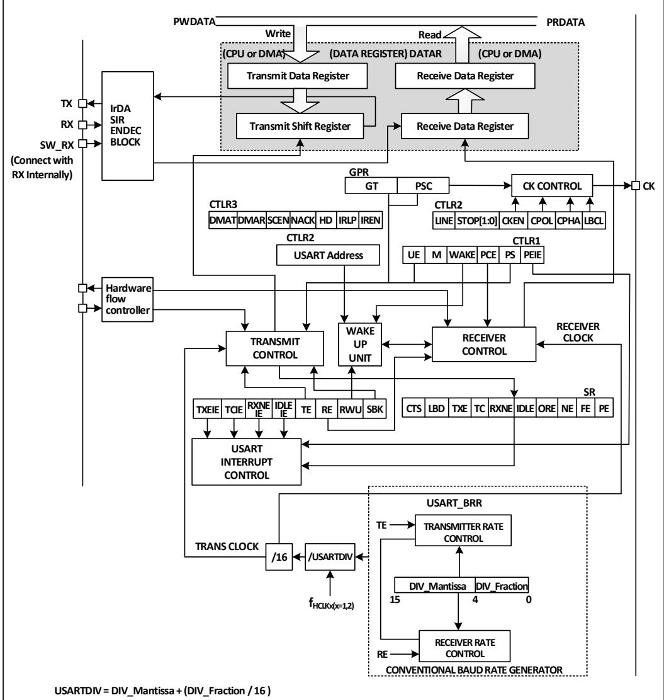  
图12-1 通用同步/异步收发器的结构框图

当TE（发送使能位）置位时，发送移位寄存器里的数据在TX引脚上输出，时钟在CK引脚上输出。在发送时，最先移出的是最低有效位，每个数据帧都由一个低电平的起始位开始，然后发送器

根据 M（字长）位上的设置发送八位或九位的数据字，最后是数目可配置的停止位。如果配有奇偶检验位，数据字的最后一位为校验位。在TE置位后会发送一个空闲帧，空闲帧是10位或11位高电平，包含停止位。断开帧是10位或11位低电平，后跟着停止位。

# 12.3 波特率发生器

收发器的波特率 $\underline { { \underline { { \mathbf { \delta \pi } } } } }$ HCLK/(16\*USARTDIV)，HCLK 是 AHB 的时钟。USARTDIV 的值是根据 USART_BRR中的DIV_M和DIV_F两个域决定的，具体计算的公式为：

$$
\mathsf { U S A R T D } | \mathsf { V } = \mathsf { D } | \mathsf { V } \_ { \mathsf { M } } + ( \mathsf { D } | \mathsf { V } \_ { \mathsf { F } } / 1 6 )
$$

需要注意的是，波特率产生器产生的比特率不一定能刚好生成用户所需要的波特率，这其中可能是存在偏差。除了尽量取接近的值，减小偏差的方法还可以是增大AHB的时钟。比如设定波特率为 115200bps 的时，USARTDIV 的值设为 39.0625，在最高频率时可以得到刚好 115200bps 的波特率，但是如果你需要 921600bps 的波特率时，计算的 USARTDIV 是 4.88，但是实际上在 USART_BRR 里填入的值最接近只能是4.875，实际产生的波特率是923076bps，误差达到 $0 . 1 6 \%$ 。

发送方发出的串口波形传到接收端时，接收方和发送方的波特率是有一定误差的。误差主要来自三个方面：接收方和发送方实际的波特率不一致；接收方和发送方的时钟有误差；波形在线路中产生的变化。外设模块的接收器是有一定接收容差能力的，当以上三个方面产生的总偏差之和小于模块的容差能力极限时，这个总偏差不影响收发。模块的容差能力极限受是否采用分数波特率和 M位（数据域字长）影响，采用分数波特率和使用9位数据域长度会使容差能力极限降低，但不低于$3 \%$ 。

# 12.4 同步模式

同步模式使得系统在使用USART模块时可以输出时钟信号。在开启同步模式对外发送数据时，CK 引脚会同时对外输出时钟。

开启同步模式的方式是对控制寄存器 2（R16_USARTx_CTLR2）的 CLKEN 位置位，但同时需要关闭 LIN 模式、智能卡模式、红外模式和半双工模式，即保证 SCEN、HDSEL 和 IREN 位处于复位状态，这三位在控制寄存器 3（R16_USARTx_CTLR3）中。

同步模式使用的要点在于时钟的输出控制。有以下几点需要注意：

USART 模块同步模式只工作在主模式，即 CK 引脚只输出时钟，不接收输入；

只在TX引脚输出数据时输出时钟信号；

LBCL 位决定在发送最后一位数据位时是否输出时钟，CPOL 位决定时钟的极性，CPHA 决定时钟的相位，这三个位在控制寄存器 2（R16_USARTx_CTLR2）中，这三个位需要在 TE 和 RE 未被使能的情况下设置，具体区别见图12-2。

接收器在同步模式下只会在输出时钟时采样，需要从设备保持一定的信号建立时间和保持时间，具体见图 12-3。

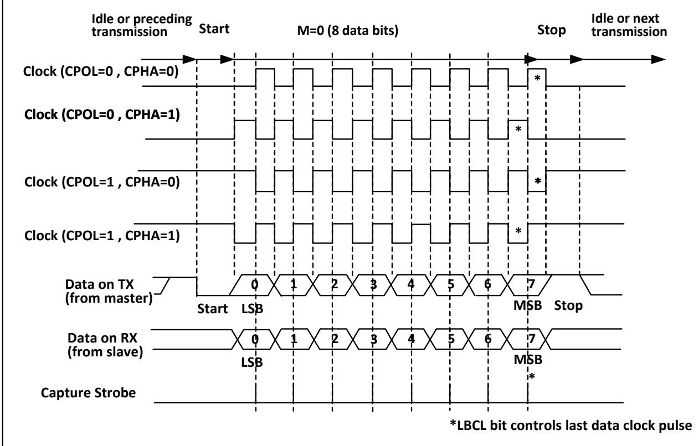  
图 12-2 USART 时钟时序示例 $( M = 0 )$

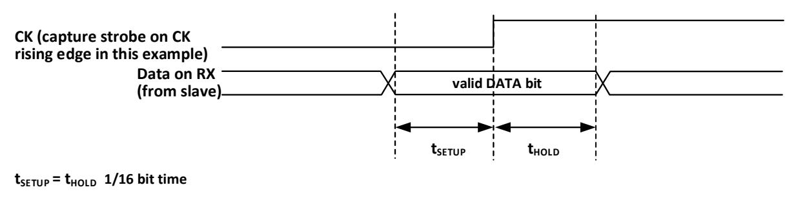  
图12-3 数据采样保持时间

# 12.5 单线半双工模式

半双工模式支持使用单个引脚（只使用TX引脚）来接收和发送，TX引脚和RX引脚在芯片内部连接。

开启半双工模式的方式是对控制寄存器 3（R16_USARTx_CTLR3）的 HDSEL 位置位，但同时需要关闭 LIN 模式、智能卡模式、红外模式和同步模式，即保证 SCEN、CLKEN 和 IREN 位处于复位状态，这三位在控制寄存器 2 和 3（R16_USARTx_CTLR2 和 R16_USARTx_CTLR3）中。

设置成半双工模式之后，需要把 TX 的 IO 口设置成开漏输出高模式。在 TE 置位的情况下，只要将数据写到数据寄存器上，就会发送出去。特别要注意的是，半双工模式可能会出现多设备使用单总线收发时的总线冲突，这需要用户用软件自行避免。

# 12.6 智能卡

智能卡模式支持ISO7816-3协议访问智能卡控制器。开启智能卡模式的方式是对控制寄存器 3（R16_USARTx_CTLR3）的 SCEN 位置位，但同时需要关闭LIN模式、半双工模式和红外模式，即保证LINEN、HDSEL和IREN位处于复位状态，但是可以开启 CLKEN 来输出时钟，这些位在控制寄存器 2 和 3（R16_USARTx_CTLR2 和 R16_USARTx_CTLR3）中。

为了支持智能卡模式，USART 应当被置为 8 位数据位外加 1 位校验位，它的停止位建议配置成发送和接收都为1.5位，智能卡模式是一种单线半双工的协议，它使用TX线作为数据通讯，应当被配置为开漏输出加上拉。当接收方接收一帧数据检测到奇偶校验错误时，会在停止位时，发出一个NACK信号，即在停止位期间主动把TX拉低一个周期，发送方检测到NACK信号后，会产生帧错误，应用程序据此可以重发。图 17-4 展示了正确情况下和发生奇偶校验错误情况下的 TX 引脚上的波形图。USART的TC标志（发送完成标志）可以延迟GT（保护时间）个时钟产生，接收方也不会将自己置的NACK信号认成起始位。

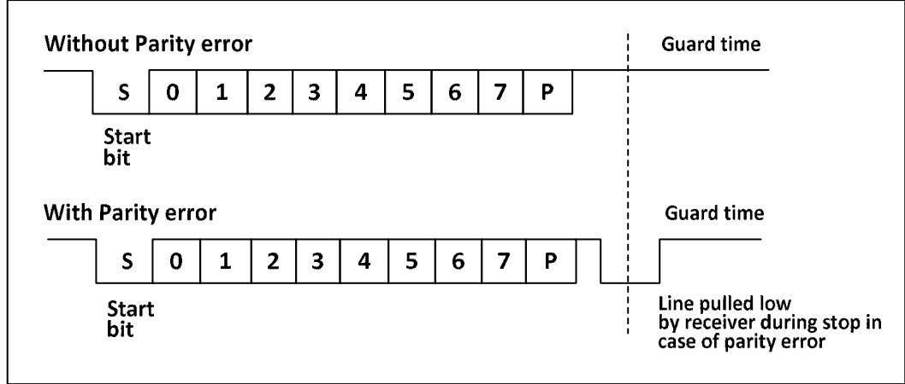  
图12-4 (未)发生奇偶校验错误示意图

在智能卡模式下，CK引脚使能后输出的波形和通讯无关，它仅仅是给智能卡提供时钟的，它的值是AHB时钟再经过五位可设置的时钟分频（分频值为PSC的两倍，最高62分频）。

# 12.7 IrDA

USART模块支持控制IrDA红外收发器进行物理层通信。使用IrDA必须清除LINEN、STOP、CLKEN、SCEN 和 HDSEL 位。USART 模块和 SIR 物理层（红外收发器）之间使用 NRZ（不归零）编码，最高支持到 115200bps 速率。

IrDA 是一个半双工的协议，如果 UASRT 正在给 SIR 物理层发数据，那么 IrDA 解码器将会忽视新发来的红外信号，如果USART正在接受从SIR发来的数据，那么SIR不会接受来自USART的信号。USART发给SIR和SIR发给USART的电平逻辑是不一样的，SIR接收逻辑中，高电平为1，低电平为0，但是在SIR发送逻辑中，高电平为0，低电平为1。

# 12.8 DMA

USART模块支持DMA功能，可以利用DMA实现快速连续收发。当启用DMA时，TXE被置位时，DMA就会从设定的内存空间向发送缓冲区写数据。当使用 DMA 接收时，每次 RXNE 置位后，DMA 就会将接收缓冲区里的数据转移到特定的内存空间。

# 12.9 中断

USART 模块支持多种中断源，包括发送数据寄存器空（TXE）、CTS、发送完成（TC）、接收数据就绪（RXNE）、数据溢出（ORE）、线路空闲（IDLE）、奇偶校验出错（PE）、断开标志（LBD）、噪声（NE）、多缓冲通信的溢出（ORE）和帧错误（FE）等等。

表12-1 中断和对应的使能位的关系  

<table><tr><td></td><td>1AE1</td></tr><tr><td># (TXE)</td><td>TXEIE</td></tr><tr><td>fti#&amp;i (CTS)</td><td>CTSIE</td></tr><tr><td>i (TC)</td><td>TCIE</td></tr><tr><td>t#4X##i (RXNE)</td><td rowspan="2">RXNEIE</td></tr><tr><td>##M (ORE)</td></tr><tr><td>2##i (1DLE)</td><td>IDLEIE</td></tr><tr><td>1#(PE)</td><td>PEIE</td></tr><tr><td>FJFt (LBD)</td><td>LBDIE</td></tr><tr><td>A (NE)</td><td rowspan="3">EIE</td></tr><tr><td>3+jA#(ORE)</td></tr><tr><td>3#j1A$#i (FE)</td></tr></table>

# 12.10 寄存器描述

表 12-2 USART 相关寄存器列表  

<table><tr><td></td><td>i@tttt</td><td>#it</td><td></td></tr><tr><td>R32_USART_STATR</td><td>0x40013800</td><td>UASRT</td><td>0x000000CO</td></tr><tr><td>R32_USART_DATAR</td><td>0x40013804</td><td>UASRT ##T</td><td>0x000000XX</td></tr><tr><td>R32_USART_BRR</td><td>0x40013808</td><td>UASRT #*</td><td>0x00000000</td></tr><tr><td>R32_USART_CTLR1</td><td>0x4001380C</td><td>UASRT $J7 1</td><td>0x00000000</td></tr><tr><td>R32_USART_CTLR2</td><td>0x40013810</td><td>UASRT $J$T 2</td><td>0x00000000</td></tr><tr><td>R32_USART_CTLR3</td><td>0x40013814</td><td>UASRT $JT 3</td><td>0x00000000</td></tr><tr><td>R32_USART_GPR</td><td>0x40013818</td><td>UASRT 1RtPfje]FF&gt;$$17</td><td>0x00000000</td></tr></table>

# 12.10.1 USART 状态寄存器（USART_STATR）

偏移地址： $0 \times 0 0$

<table><tr><td>31</td><td>30</td><td>29</td><td>28</td><td>27</td><td>26</td><td>25</td><td>24</td><td>23</td><td>22</td><td>21</td><td>20</td><td></td><td>19</td><td>18</td><td>17</td><td>16</td></tr><tr><td></td><td colspan="14">Reserved</td></tr><tr><td>15</td><td>14</td><td>13</td><td>12</td><td>11</td><td>10</td><td></td><td>9</td><td>8</td><td>7</td><td>6</td><td>5</td><td>4</td><td>3</td><td>2</td><td>1</td><td></td></tr><tr><td></td><td colspan="6">Reserved</td><td>CTS</td><td>LBD TXE</td><td>TC</td><td>RXNE</td><td>IDLE</td><td></td><td>ORE</td><td>NE</td><td>FE</td><td>PE</td></tr></table>

<table><tr><td>1i</td><td></td><td></td><td>##it</td><td></td></tr><tr><td>[31 : 10]</td><td>Reser ved</td><td>RO</td><td>1r.</td><td>0</td></tr><tr><td>9</td><td>CTS</td><td>RWO</td><td>CTS y2+*. tARi7 CTSE 1, nCTS2j, i# #1#;#. tnR CTSIE EZ1, * +*. 1: nCTSE1;</td><td>0</td></tr><tr><td>8</td><td>LBD</td><td>RWO</td><td>0: nCTSEi1L. L1N Break ;J. ;JJ L1N Break Aj, i1*#1. $##. tnR LBD1E E</td><td>0</td></tr></table>

<table><tr><td>7 TXE</td><td></td><td>RO</td><td>i, J*+. 1:;JJ L1N Break; 0: i;JL1N Break. i##+.  TDR$1+AA A1#1. tnR TXE1E Et1A], jt* +*h, x##$##i#S*1F, t . 1: ##$331$; 0: ##$33$.</td></tr><tr><td>6 TC</td><td></td><td>RWO</td><td>i+*.### R, #TXE, Q##, tnR TC1E i1, i*x+h, ## i#7S###1##. t aJ W5 0 *;#t. 1: ix; o: Hiitkt. i#$#*, 3$+#</td></tr><tr><td>5</td><td>RXNE</td><td>RWO</td><td>J$+ i1# 1. tAR RXNE1E EZi1, JJiT*xf A+x##$Ai$t#1Fa#i #. ta5 0*#i. 1: ##4xJ, AE3i#W; 0: ##i4X3J. +*. , it</td></tr><tr><td>4</td><td>IDLE</td><td>RO ##1F$t1. 1: E;</td><td>#{. tnR 1DLEIE E{, NJ* X+ i1i# 0 0: . i: tTiFJ RXNE 1.</td></tr><tr><td>3</td><td>ORE</td><td>RO</td><td>ti##KiWAf, ut1i1. tnR RXNE1E , i*x. 1: ##R 0 O: #i. : ##i, ##$###T *, 1i#. tRi RJ E1E 1i, #3#;#[i#iAstT, 0RE 1*+. *#i. *i, # i$, #i##$ AtR1F11t1.</td></tr></table>

<table><tr><td></td><td></td><td></td><td>ii: i1T##*f. tnRi7 E1E1, #3#j#ittT, FEti*</td><td></td></tr><tr><td>1</td><td>FE</td><td>RO</td><td>##i #i, i3* otT i|#i1#. i i##1A*1F1t1. 1: ;i; 0: i&amp;#i. ii: iT##f, tARi7E1E1, #3#j#it#tT, FE#1i#</td><td>0</td></tr><tr><td>0</td><td>PE</td><td>RO</td><td>1#it. t4tT, tnR#* t##i, t. ii## RXNE 11. 3nR PE1E Ze . 1: i 0i.</td><td>0</td></tr></table>

# 12.10.2 USART 数据寄存器 （USART_DATAR）

偏移地址： $0 \times 0 4$

<table><tr><td>31</td><td>30</td><td>29</td><td>28</td><td>27</td><td>26</td><td>25</td><td>24</td><td>23</td><td>22</td><td>21</td><td>20</td><td>19</td><td>18</td><td>17</td><td>16</td></tr><tr><td>Reserved</td><td colspan="13"></td></tr><tr><td>15</td><td>14</td><td>13</td><td>12</td><td>11</td><td>10</td><td>9</td><td>8</td><td>7</td><td>6</td><td>5</td><td>4</td><td>3</td><td>2</td><td>1</td><td>0</td></tr><tr><td></td><td></td><td>Reserved</td><td></td><td></td><td></td><td></td><td></td><td></td><td></td><td>DR[8: 0]</td><td></td><td></td><td></td><td></td><td></td></tr></table>

<table><tr><td>1</td><td></td><td>ii</td><td>##it</td><td></td></tr><tr><td>[31: 9]</td><td>Reserved</td><td>RO</td><td>RE.</td><td>0</td></tr><tr><td>[8: 0]</td><td>DR [8: 0]</td><td>RW</td><td>17* (RDR) FAiX$17(TDR) #$17 28ht, DR aJiSt#1F#2tA&gt;3Ji$4x$1z (RDR) FSiX$T7(TDR) .</td><td>X</td></tr></table>

# 12.10.3 USART 波特率寄存器 （USART_BRR）

偏移地址： $0 \times 0 8$

<table><tr><td>31</td><td>30</td><td>29</td><td>28</td><td>27</td><td>26</td><td>25</td><td></td><td>24</td><td>23</td><td>22</td><td>21</td><td>20</td><td>19</td><td>18</td><td>17</td><td>16</td></tr><tr><td></td><td colspan="14">Reserved</td></tr><tr><td>15</td><td>14</td><td>13</td><td>12</td><td>11</td><td>10</td><td></td><td>9</td><td>8</td><td>7</td><td>6</td><td>5</td><td>4</td><td>3</td><td>2</td><td>1</td><td>0</td></tr><tr><td>DIV_Mant issa[11: 0]</td><td colspan="14"></td></tr><tr><td></td><td colspan="14"></td></tr><tr><td></td><td colspan="14"></td></tr></table>

<table><tr><td>1</td><td></td><td></td><td>#it</td><td></td></tr><tr><td>[31 : 16]</td><td>Reserved</td><td>RO</td><td>RE.</td><td></td></tr></table>

<table><tr><td rowspan="2">[15:4] [3:0]</td><td rowspan="2">D1V_Mant i ssa[11:0] D1V_Fraction[3:0]</td><td rowspan="2">RW RW</td><td>ix 12 {X77##.</td><td>0</td></tr><tr><td>ix 4 [X7 $7#]#B.</td><td>0</td></tr></table>

# 12.10.4 USART 控制寄存器 1（USART_CTLR1）

偏移地址： $0 \times 0 0$

<table><tr><td>31</td><td>30</td><td>29</td><td>28</td><td>27</td><td>26</td><td>25</td><td>24</td><td>23</td><td>22</td><td>21</td><td>20</td><td>19</td><td>18</td><td>17</td><td>16</td></tr><tr><td colspan="14">Reserved</td></tr><tr><td>15</td><td>14 13</td><td></td><td>12</td><td>11</td><td>10</td><td>9</td><td>8</td><td>7</td><td>6</td><td>5</td><td>4</td><td>3</td><td>2</td><td>1</td><td>0</td></tr><tr><td>Reserved</td><td>UE</td><td></td><td>M</td><td>WAKE</td><td>PCE</td><td>PS</td><td>PEIE TXEIE TCIE</td><td></td><td></td><td>RXNE1E| IDLEIE</td><td></td><td>TE</td><td>RE</td><td>RWU</td><td>SBK</td></tr></table>

<table><tr><td>1</td><td>F</td><td>iji]</td><td>##it</td><td></td></tr><tr><td>[31:14]</td><td>Reserved</td><td>RO</td><td>r.</td><td>0</td></tr><tr><td>13</td><td>UE</td><td>RW</td><td>USART A. , ## 1$#5h USART $Fn$W#B1 I1F.</td><td>0</td></tr><tr><td>12</td><td>M</td><td>RW</td><td>FK{. 1: 9; 0: 8#1.</td><td>0</td></tr><tr><td>11</td><td>WAKE</td><td>RW</td><td>A1. 1t1RE 7t USART AA3;. 1: #t#i2; 0: </td><td>0</td></tr><tr><td>10</td><td>PCE</td><td>RW</td><td>t1AE. xfT4x i#1x## #t; xTi, tt(i. i7t, R###*, </td><td>0</td></tr><tr><td>9</td><td>PS</td><td>RW</td><td>#1i. 0, 1. i&amp;7iR, R#\7#R, t</td><td>0</td></tr><tr><td>8</td><td>PEIE</td><td>RW</td><td>#+h xti* i+.</td><td>0</td></tr><tr><td>7</td><td>TXEIE</td><td>RW</td><td>#i+.</td><td>0</td></tr><tr><td>6</td><td>TCIE</td><td>RW</td><td>iX+*h xt1*ti#* i++.</td><td>0</td></tr><tr><td>5</td><td>RXNEIE</td><td>RW</td><td>i##t4X#+f.</td><td>0</td></tr><tr><td>4</td><td>IDLEIE</td><td>RW</td><td>$+#h. xt*i#* +.</td><td>0</td></tr><tr><td>3</td><td>TE</td><td>RW</td><td>ixAe. tAix</td><td>0</td></tr><tr><td>2</td><td>RE</td><td>RW</td><td>;QJ RX 31AtP_EA5$2tA1.</td><td>0</td></tr><tr><td>1</td><td>RWU</td><td>RW</td><td>t4X i1Rt USART T## t. 1: 4# 0: t4TE#I1F. i 1:  RWU1iZJ, USART #t#4x</td><td>0</td></tr></table>

<table><tr><td></td><td></td><td></td><td>###, ##T, TAt A; j2Cti2 #RXNE 1iZAf, TAEM$112X RWU|iz.</td><td></td></tr><tr><td>0</td><td>SBK</td><td>RW</td><td>iX$T7#J1. ut1*ix# T #. 1: ix; 0: Tit.</td><td>0</td></tr></table>

# 12.10.5 USART 控制寄存器 2（USART_CTLR2）

偏移地址： $0 \times 1 0$

<table><tr><td>31</td><td>30</td><td>29</td><td>28</td><td>27</td><td>26</td><td>25</td><td>24</td><td>23</td><td>22</td><td>21</td><td>20</td><td>19</td><td>18</td><td>17</td><td></td><td>16</td></tr><tr><td colspan="15">Reserved</td></tr><tr><td>15</td><td>14 13</td><td>12</td><td>11</td><td>10</td><td></td><td>9</td><td>8</td><td>7</td><td>6</td><td>5</td><td>4</td><td>3</td><td>2</td><td>1</td><td>0</td></tr><tr><td>ved</td><td>ReserLINEN</td><td>STOP [1:0]</td><td></td><td>CLKEN</td><td>CPOL</td><td>CPHA</td><td>LBCL</td><td>Reser ved</td><td>LBDIELBDL</td><td></td><td>Reser ved</td><td colspan="5">ADD[3: 0]</td></tr></table>

<table><tr><td>1</td><td></td><td>iji]</td><td>#it</td><td></td></tr><tr><td>[31 : 15]</td><td>Reser ved</td><td>RO</td><td>1R.</td><td>0</td></tr><tr><td>14</td><td>LINEN</td><td>RW</td><td>LIN t1A1, J1 L1N tC.  L1N 1T, aJl1] SBK[iX L1N ]FJF] 3, liR L1N BT.</td><td>0</td></tr><tr><td>[13:12]STOP[1:0]</td><td></td><td>RW</td><td>1#it. ixM*i&amp;{. 00: 1{; 01: 0.5; 10: 2;</td><td>0</td></tr><tr><td>11</td><td>CLKEN</td><td>RW</td><td>11: 1.5M. Af$1AE, 1AE CK 31AtP. 1: 1E; 0: #E.</td><td>0</td></tr><tr><td>10</td><td>CPOL</td><td>RW</td><td>A$i. #T, ai i SLCK 31AP_EAf$*$AtX1,FA CPHA 22*##$/#. 1: A CK 31AR#; 0: iAf CK 31APE1R1T. ii: 1AE%iFut1TaJi$12.</td><td>0</td></tr><tr><td>9</td><td>CPHA</td><td>RW</td><td>A#i1. #tT, ai1 i SLCK 31Ap_EA9Af$*$WA5t1z, FA CPOL 12**/## F. 1: A$ii####3; 0 ii####3. ii: 1AE%iXFut1zTaJi$12Xo</td><td>0</td></tr><tr><td>8</td><td>LBCL</td><td>RW</td><td>xRA$+Ak$f$$J1. #ttT, 1Mi1*t*$J CK 3l</td><td>0</td></tr></table>

<table><tr><td></td><td></td><td></td><td>Atp _EW iXA #x  AA $Ak; 1: #F1##A$AkT CK$W; 0: #$Ak CK.</td><td></td></tr><tr><td>7</td><td>Reser ved</td><td>RW</td><td>i:1AEixFut1TaJ12X. 1R.</td><td>0</td></tr><tr><td>6</td><td>LBDIE</td><td>RW</td><td>L1N Break ;]+f1, i11 LBD 312+;</td><td>0</td></tr><tr><td>5</td><td>LBDL</td><td>RW</td><td>L1N Break;JK, i*i111iT 10 (F]. 1: 11 ;J;</td><td>0</td></tr><tr><td>4</td><td>Reser ved</td><td>RW</td><td>0: 10 [T;]. 1RE.</td><td>0</td></tr><tr><td>[3:0]</td><td>ADD [3: 0]</td><td>RW</td><td>tbttgi *iiAJ USART#tt. 3iiTA#+1 1 tbtL$i2*AUSART i&amp;.</td><td>0</td></tr></table>

# 12.10.6 USART 控制寄存器 3（USART_CTLR3）

偏移地址： $0 \times 1 4$

<table><tr><td>31</td><td>30</td><td>29</td><td>28</td><td>27</td><td>26</td><td>25</td><td>24</td><td>23</td><td>22</td><td>21</td><td>20</td><td>19</td><td>18</td><td>17</td><td>16</td></tr><tr><td colspan="14">Reserved</td></tr><tr><td>15</td><td colspan="2">14 13</td><td>12</td><td>11</td><td>10</td><td>9</td><td>8</td><td>7</td><td>6</td><td>5</td><td>4</td><td></td><td>3</td><td>2 1</td><td></td></tr><tr><td colspan="5">Reserved</td><td>CTSIE</td><td>CTSE</td><td>RTSE</td><td>DMAT</td><td>DMAR</td><td>SCEN</td><td></td><td>NACK HDSEL</td><td>1RLP</td><td>IREN</td><td>EIE</td></tr></table>

<table><tr><td>1</td><td></td><td></td><td>##it</td><td></td></tr><tr><td></td><td></td><td>RO</td><td></td><td>0</td></tr><tr><td>[31 : 11]</td><td>Reser ved</td><td></td><td>CTS1E +F1AE1, t1Af CTS i1A</td><td></td></tr><tr><td>10 9</td><td>CTSIE</td><td>RW</td><td>*+.</td><td>0</td></tr><tr><td>8</td><td>CTSE RTSE</td><td>RW RW</td><td>CTS 1A, t CTS it. RTS 1AE, 11AE RTS it.</td><td>0 0</td></tr><tr><td>7</td><td>DMAT</td><td>RW</td><td>DMA i1A. 1t11#i DMA.</td><td>0</td></tr><tr><td>6</td><td>DMAR</td><td>RW</td><td>DMA f4X1AE1. 111 t4XA1 DMA.</td><td>0</td></tr><tr><td>5</td><td>SCEN</td><td>RW</td><td>AEF1, 11AF.</td><td>0</td></tr><tr><td>4</td><td>NACK</td><td>RW</td><td>AE NACK 1 #i</td><td>0</td></tr><tr><td>3</td><td>HDSEL</td><td>RW</td><td>Af, i NACK. XI#, XIt.</td><td>0</td></tr><tr><td>2</td><td>1 RLP</td><td>RW</td><td>eI5MI#Eit#1i, ut1#i2I5#],</td><td></td></tr><tr><td>1</td><td>IREN</td><td>RW</td><td>I$.</td><td>0</td></tr><tr><td></td><td></td><td></td><td>t#i1F   DMAR i</td><td>0</td></tr><tr><td>0</td><td>EIE</td><td>RW</td><td>AJAT, tnR FE, ORE g NE t1, jt #++.</td><td>0</td></tr></table>

# 12.10.7 USART 保护时间和预分频寄存器（USART_GPR）

偏移地址： $0 \times 1 8$

<table><tr><td>31</td><td>30</td><td>29</td><td>28</td><td>27</td><td>26</td><td>25</td><td>24</td><td>23</td><td>22</td><td>21</td><td>20</td><td>19</td><td>18</td><td>17</td><td>16</td></tr><tr><td></td><td colspan="13">Reserved</td></tr><tr><td>15</td><td>14</td><td>13</td><td>12</td><td>11</td><td>10</td><td>9</td><td>8</td><td>7</td><td>6</td><td>5</td><td>4</td><td>3</td><td>2</td><td>1</td><td>0</td></tr><tr><td colspan="10">GT[7:0]</td></tr><tr><td></td><td colspan="5"></td><td></td><td></td><td></td><td></td><td>PSC[7:0]</td><td></td><td></td><td></td></tr></table>

<table><tr><td>1i</td><td></td><td></td><td>##it</td><td></td></tr><tr><td>[31:16]</td><td>Reserved</td><td>RO</td><td>1*.</td><td>0</td></tr><tr><td>[15:8]</td><td>GT [7 : 0]</td><td>RW</td><td>1Rtt it$7l#*A# i, tiit.</td><td>0</td></tr><tr><td>[7:0]</td><td>PSC[7 : 0]</td><td>RW</td><td>Ftt. f4I9Ih$ET, i#*i1 B 8 1) t,  0A(R; tI9E#stT, ItRAi1; FT, ii( 5 1) H1t, *A$Ft1#$, 10 TR.</td><td>0</td></tr></table>

# 第 13 章 两线通信总线（I2C）

内部集成电路总线（I2C）广泛用在微控制器和传感器及其他片外模块的通讯上，它本身支持多主多从模式，仅仅使用两根线（SDA和SCL）就能以 $1 0 0 \mathsf { K H z }$ （标准）和 $4 0 0 \mathsf { K H z }$ （快速）两种速度通讯。I2C总线还兼容SMBus协议，不仅支持I2C的时序，还支持仲裁、定时和DMA，拥有CRC校验功能。

# 13.1 主要特征

$\bullet$ 支持主模式和从模式  
$\bullet$ 支持7位或10位地址  
$\bullet$ 从设备支持双7位地址  
$\bullet$ 支持两种速度模式：100KHz 和 400KHz  
$\bullet$ 多种状态模式，多种错误标志  
$\bullet$ 支持加长的时钟功能  
$\bullet$ 2个中断向量  
$\bullet$ 支持 DMA  
$\bullet$ 支持 PEC  
$\bullet$ 兼容 SMBus

# 13.2 概述

I2C 是半双工的总线，它同时只能运行在下列四种模式中之一：主设备发送模式、主设备接收模式、从设备发送模式和从设备接收模式。I2C 模块默认工作在从模式，在产生起始条件后，会自动地切换到主模式，当仲裁丢失或产生停止信号后，会切换到从模式。I2C 模块支持多主机功能。工作在主模式时，I2C 模块会主动发出数据和地址。数据和地址都以 8 位为单位进行传输，高位在前，低位在后，在起始事件后的是一个字节（7 位地址模式下）或两个字节（10 位地址模式下）地址，主机每发送 8 位数据或地址，从机需要回复一个应答 ACK，即把 SDA 总线拉低，如图 13-1 所示。

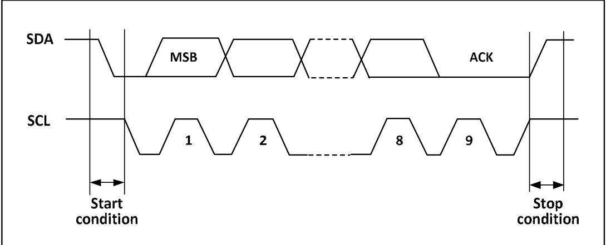  
图 13-1 I2C 时序图

为了正常使用必须给 I2C 输入正确的时钟，其中标准模式下，输入时钟最低为 2MHz,在快速模式下，输入时钟最低为4MHz。

图13-2是I2C模块功能框图。

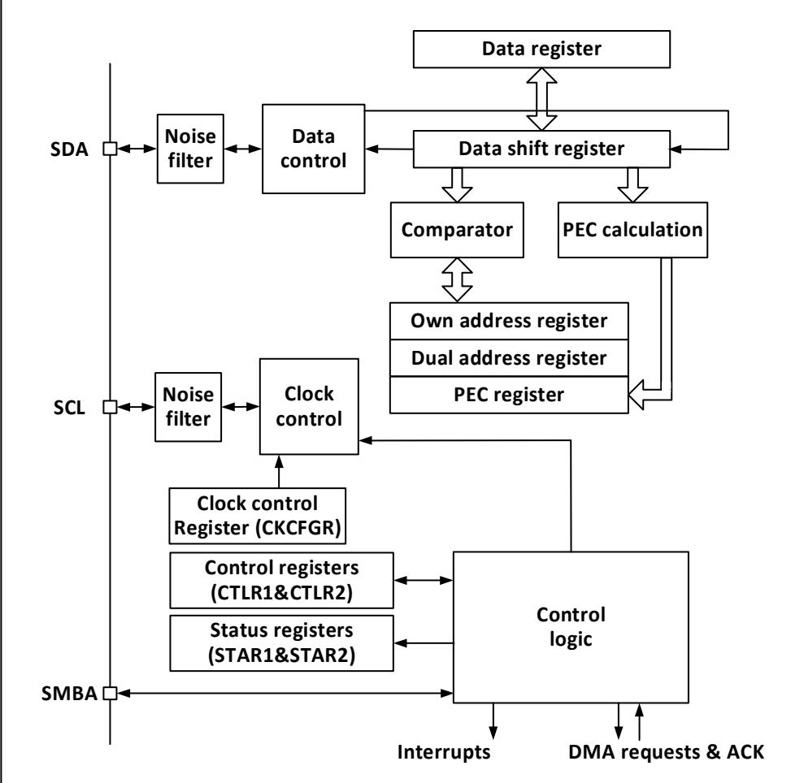  
图 13-2 I2C 功能框图

# 13.3 主模式

主模式时，I2C 模块主导数据传输并输出时钟信号，数据传输以开始事件开始，以结束事件结束。使用主模式通讯的步骤为：

在控制寄存器 2（R16_I2Cx_CTLR2）和时钟控制寄存器（R16_I2Cx_CKCFGR）中设置正确的时钟；   
在上升沿寄存器（R16_I2Cx_RTR）设置合适的上升沿；   
在控制寄存器（R16_I2Cx_CTLR1）中置 PE 位启动外设；   
在控制寄存器（R16_I2Cx_CTLR1）中置 START 位，产生起始事件。

在置START位后，I2C模块会自动切换到主模式，MSL位会置位，产生起始事件，在产生起始事件后，SB位会置位，如果ITEVTEN位（在R16_I2Cx_CTLR2）被置位，则会产生中断。此时应该读取状态寄存器 1（R16_I2Cx_STAR1），写从地址到数据寄存器后，SB 位会自动清除；5）如果是使用10位地址模式，那么写数据寄存器发送头序列（头序列为 $1 1 1 1 0 \times \times 0 6$ ，其中的 $\mathsf { x x }$ 位是 10 位地址的最高两位）。

在发送完头序列之后，状态寄存器的ADD10位会被置位，如果ITEVTEN位已经置位，则会产生中断，此时应读取R16_I2Cx_STAR1寄存器后，写第二个地址字节到数据寄存器后，清除ADD10位。

然后写数据寄存器发送第二个地址字节，在发送完第二个地址字节后，状态寄存器的 ADDR 位会被置位，如果ITEVTEN位已经置位，则会产生中断，此时应读取R16_I2Cx_STAR1寄存器后再读一次R16_I2Cx_STAR2 寄存器以清除 ADDR 位；

如果使用的是7位地址模式，那么写数据寄存器发送地址字节，在发送完地址字节后，状态寄存器的 ADDR 位会被置位，如果 ITEVTEN 位已经置位，则会产生中断，此时应读取 R16_I2Cx_STAR1寄存器后再读一次 R16_I2Cx_STAR2 寄存器以清除 ADDR 位；

在7位地址模式下，发送的第一个字节为地址字节，头7位代表的是目标从设备地址，第8位决定了后续报文的方向，0代表是主设备写入数据到从设备，1代表是主设备向从设备读取信息。

在 10 位地址模式下，如图 18-3 所示，在发送地址阶段，第一个字节为 $1 1 1 1 0 \times \times 0$ ， $\tt { x x }$ 为 10 位地址的最高 2 位，第二个字节为 10 位地址的低 8 位。若后续进入主设备发送模式，则继续发送数据；若后续准备进入主设备接收模式，则需要重新发送一个起始条件，跟随发送一个字节为 $1 1 1 1 0 \times \times 1$ ，然后进入主设备接收模式。

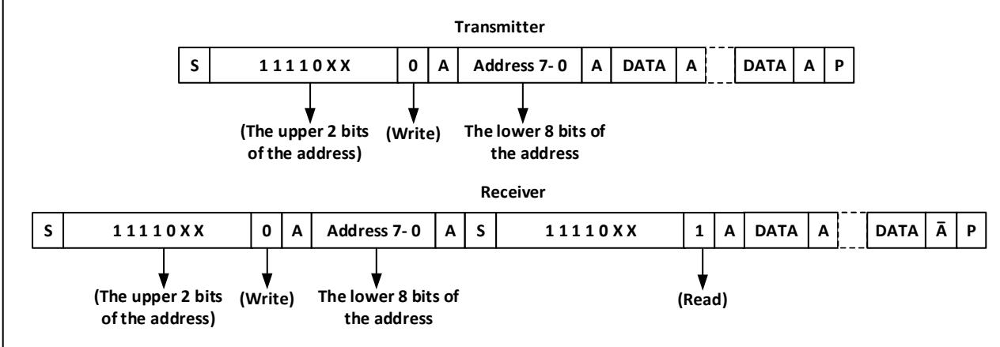  
图13-3 10位地址时主机收发数据示意图

# 主发送模式：

主设备内部的移位寄存器将数据从数据寄存器发送到SDA线上，当主设备接收到ACK时，状态寄存器 1（R16_I2Cx_STAR1）的 TxE 被置位，如果 ITEVTEN 和 ITBUFEN 被置位，还会产生中断。向数据寄存器写入数据将会清除TxE位。

如果TxE位被置位且上次发送数据之前没有新的数据被写入数据寄存器，那么BTF位会被置位,在其被清除之前，SCL将保持低电平，读R16_I2Cx_STAR1后，向数据寄存器写入数据将会清除BTF位。

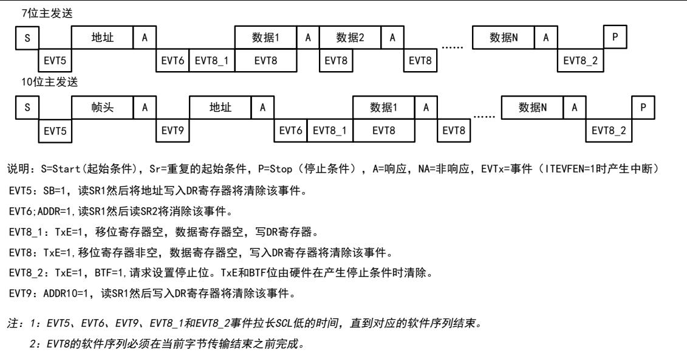  
图13-4 主发送器传送序列图

# 主接收模式：

I2C 模块会从 SDA 线接收数据，通过移位寄存器写进数据寄存器。在每个字节之后，如果 ACK位被置位，那么I2C模块将会发出一个应答低电平，同时RxNE位会被置位，如果ITEVTEN和ITBUFEN被置位，还会产生中断。如果RxNE被置位且在新的数据被接收前，原有的数据没有被读出，则BTF位将被置位，在清除BTF之前，SCL将保持低电平，读取R16_I2Cx_STAR1后，再读取数据寄存器将会清除BTF位。

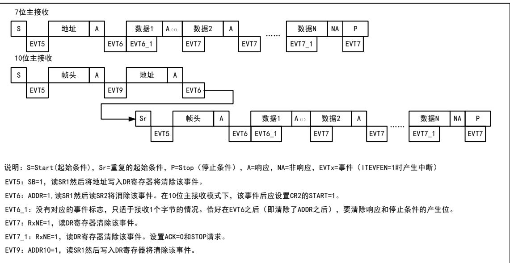  
图13-5 接收器传送序列图

主设备在结束发送数据时，会主动发一个结束事件，即置 STOP 位，I2C 将切换至从模式。在接收模式时，主设备需要在最后一个数据位的应答位置NAK，接收到NACK后，从设备释放对SCL和SDA线的控制；主设备就可以发送一个停止/重起始条件。注意，产生停止条件后，I2C模块将会自动切换至从模式。

# 13.4 从模式

从模式时，I2C模块能识别它自己的地址和广播呼叫地址。软件能控制开启或禁止广播呼叫地址的识别。一旦检测到起始事件，I2C模块将SDA的数据通过移位寄存器与自己的地址（位数取决于 ENDUAL 和 ADDMODE）或广播地址（ENGC 置位时）相比较，如果不匹配将会忽略，直到产生新的起始事件；如果与头序列相匹配，则会产生一个 ACK 信号并等待第二个字节的地址；如果第二字节的地址也匹配或者 7 位地址情况下全段地址匹配，那么：

首先产生一个ACK应答；

ADDR 位被置位，如果 ITEVTEN 位已经置位，那么还会产生相应的中断；

如果使用的是双地址模式（ENDUAL位被置位），还需要读取DUALF位来判断主机唤起的是哪一个地址。

从模式默认是接收模式，在接收的头序列的最后一位为 1，或者 7 位地址最后一位为 1 后（取决于第一次接收到头序列还是普通的7位地址），当接收到重复的起始条件时，I2C模块将进入到发送器模式，TRA位将指示当前是接收器还是发送器模式。

# 从发送模式：

在清除 ADDR 位后，I2C 模块将字节从数据寄存器通过移位寄存器发送到 SDA 线上。从设备保持SCL为低电平，直到ADDR位被清除且待发送数据已写入数据寄存器。（见下图中的EVT1和EVT3）。在收到一个应答 ACK 后，TxE 位将被置位，如果设置了 ITEVTEN 和 ITBUFEN，还会产生一个中断。如果TxE被置位但在下一个数据发送结束前没有新的数据被写入数据寄存器时，BTF位将被置位。在清除BTF前，SCL将保持低电平，读取状态寄存器1（R16_I2Cx_STAR1）后，再向数据寄存器写入数据将会清除BTF位。

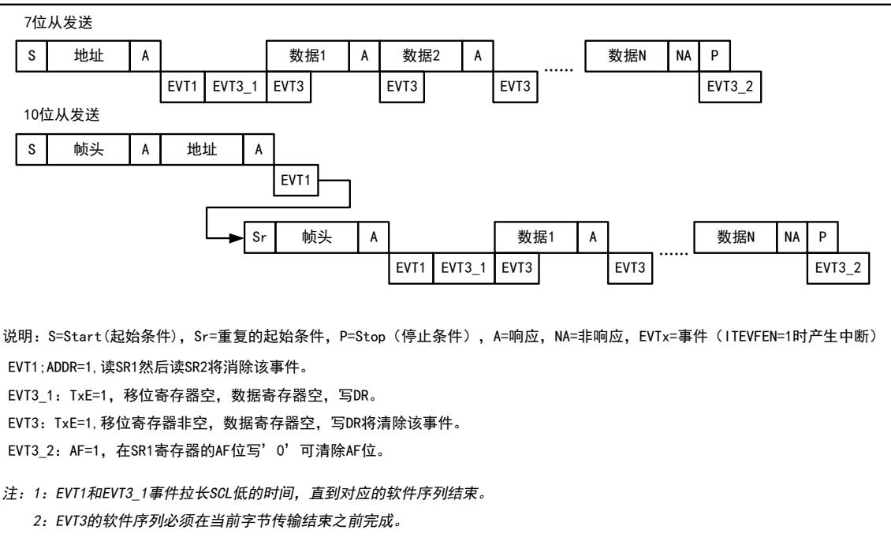  
图13-6 从发送器的传送序列图

# 从接收模式：

在ADDR被清除后，I2C模块将SDA上的数据通过移位寄存器存进数据寄存器，在每接收到一个字节后，I2C模块都会置一个ACK位，并置RxNE位。如果设置了ITEVTEN和ITBUFEN，还会产生一个中断。如果RxNE被置位，且在接收到新的数据前旧的数据没有被读出，那么BTF会被置位。在清除BTF位之前SCL会保持低电平。读取状态寄存器1（R16_I2Cx_STAR1）并读取数据寄存器里的数据会清除 BTF 位。

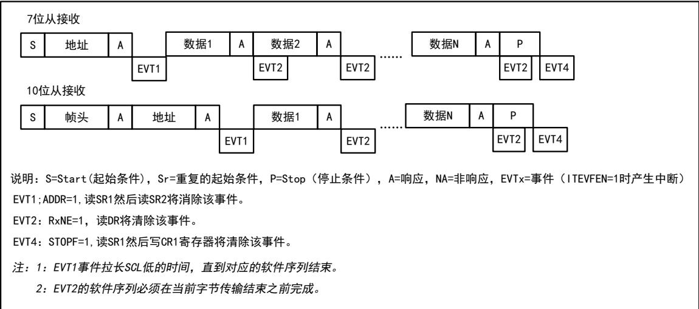  
图13-7 从接收器的传送序列图

主设备在传输完最后一个数据字节后，将产生一个停止条件，当I2C模块检测到停止事件时，将置STOPF位，如果设置了ITEVFEN位，还会产生一个中断。用户需要读取状态寄存器（R16_I2Cx_STAR1）再写控制寄存器（比如复位控制字SWRST）来清除。（见上图中的EVT4）。

# 13.5 错误

# 13.5.1 总线错误 BERR

在传输地址或数据期间，I2C 模块检测到外部的起始或停止事件时，将产生一个总线错误。产生总线错误时，BERR 位被置位，如果设置了 ITERREN 还会产生一个中断。在从模式下，数据被丢弃，硬件释放总线。如果是起始信号，硬件会认为是重启信号，开始等待地址或停止信号；如果是停止信号，则提前按正常的停止条件操作。在主模式下，硬件不会释放总线，同时不影响当前传输，由用户代码决定是否中止传输。

# 13.5.2 应答错误 AF

当I2C模块检测到一个字节后没有应答时，会产生应答错误。产生应答错误时：AF会被置位，如果设置了ITERREN还会产生一个中断；遇到AF错误，如果I2C模块工作在从模式，硬件必须释放总线，如果处于主模式，软件必须生成一个停止事件。

# 13.5.3 仲裁丢失 ARLO

当I2C模块检测到仲裁丢失时，产生仲裁丢失错误。产生仲裁丢失错误时：ARLO位被置位，如果设置了 ITERREN 还会产生一个中断；I2C 模块切换到从模式，并不再响应针对它的从地址发起的传输，除非有主机发起新的起始事件；硬件会释放总线。

# 13.5.4 过载/欠载错误 OVR

$\bullet$ 过载错误：

在从机模式下，如果禁止时钟延长，I2C模块正在接收数据，如果已经接受到一个字节的数据，但是上一次接收到数据还没有被读出，则会产生过载错误。发生过载错误时，最后收到的字节将被丢弃，发送方应当重发最后一次发送的字节。

$\bullet$ 欠载错误：

在从模式下，如果禁止时钟延长，I2C 模块正在发送数据，如果在下一个字节的时钟到来之前新的数据还没有被写入到数据寄存器，那么将产生欠载错误。在发生欠载错误时，前一次数据寄存器里的数据将被发送两次，如果发生欠载错误，那么接收方应该丢弃重复收到的数据。为了不产生欠载错误，I2C模块应当在下一个字节的第一个上升沿之前将数据写入数据寄存器。

# 13.6 时钟延长

如果禁止时钟延长，那么就存在发生过载/欠载错误的可能。但如果使能了时钟延长：

$\bullet$ 在发送模式下，如果TxE置位且BTF置位，SCL将一直为低，一直等待用户读取状态寄存器，并向数据寄存器写入待发送的数据；

$\bullet$ 在接收模式下，如果 RxNE 置位且 BTF 置位，那么 SCL 在接收到数据后将保持低，直到用户读取状态寄存器，并读取数据寄存器。

由此可见，使能时钟延长可以避免出现过载/欠载错误。

# 13.7 SMBus

SMBus 也是一种双线接口，它一般应用在系统和电源管理之间。SMBus 和 I2C 有很多相似的地方，例如SMBus使用和I2C一样的7位地址模式，以下是SMBus和I2C的共同点：

1） 主从通信模式，主机提供时钟，支持多主多从；  
2） 两线通讯结构，其中SMBus可选一个警示线；

3） 都支持7位地址格式。同时SMBus和I2C也存在区别：

1） I2C 支持的速度最高 400KHz，而 SMBus 支持的最高是 100KHz，且 SMBus 有最小 10KHz 的速度限  
制；  
2） SMBus的时钟为低超过35mS时，会报超时，但I2C无此限制；  
3） SMBus 有固定的逻辑电平，而 I2C 没有，取决于 VDD；  
4） SMBus有总线协议，而I2C没有。

SMBus还包括设备识别、地址解析协议、唯一的设备标识符、SMBus提醒和各种总线协议，具体请参考SMBus规范2.0版本。当使用SMBus时，只需要置控制寄存器的SMBus位，按需配置SMBTYPE位和 ENAARP 位。

# 13.8 中断

每个I2C模块都有两种中断向量，分别是事件中断和错误中断。两种中断支持图13-4的中断源。

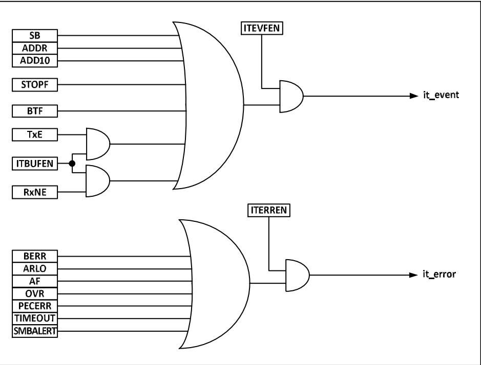  
图 13-8 I2C 中断请求

# 13.9 DMA

可以使用DMA来进行批量数据的收发。使用DMA时不能对控制寄存器的ITBUFEN位进行置位。

$\bullet$ 利用DMA发送

通过将 CTLR2 寄存器的 DMAEN 位置位可以激活 DMA 模式。只要 TxE 位被置位，数据将由 DMA 从设定的内存装载进I2C的数据寄存器。需要进行以下设定来为I2C分配通道。

1） 向 DMA_PADDRx 寄存器设置 $1 2 \mathsf { C } \mathsf { x } \_ { \mathsf { D A T A R } }$ 寄存器地址，DMA_MADDRx寄存器中设置存储器地址，这样在每个TxE事件后，数据将从存储器送至I2Cx_DATAR寄存器。  
2） 在 DMA_CNTRx 寄存器中设置所需的传输字节数。在每个 TxE 事件后，此值将被递减。  
3） 利用 DMA_ $\mathsf { C F G R x }$ 寄存器中的PL[0:1]位配置通道优先级。  
4） 设置DMA_CFGRx寄存器中的DIR位，并根据应用要求可以配置在整个传输完成一半或全部完成时发出中断请求。  
5） 通过设置 DMA_CFGRx 寄存器上的 EN 位激活通道。当 DMA 控制器中设置的数据传输字节数目已经完成时，DMA 控制器给 I2C 接口发送一个传输结

束的 EOT/ EOT_1信号。在中断允许的情况下，将产生一个DMA中断。

# $\bullet$ 利用DMA接收

置位CTLR2寄存器的DMAEN后即可进行DMA接收模式。使用DMA接收时，DMA将数据寄存器里的数据传送到预设的内存区域。需要以下步骤来为I2C分配通道。

1） 向 DMA_PADDRx 寄存器设置 $1 2 \mathsf { C } \mathsf { x } \_ { \mathsf { D A T A R } }$ 寄存器地址，DMA_MADDRx寄存器中设置存储器地址，这样在每个 $\mathsf { R x N E }$ 事件后，数据将从 $1 2 0 \times$ _DATAR 寄存器写入存储器。  
2） 在 DMA_CNTRx 寄存器中设置所需的传输字节数。在每个 RxNE 事件后，此值将被递减。  
3） 用 DMA_CFGRx 寄存器中的 PL[0:1]配置通道优先级。  
4） 清除 DMA_CFGRx 寄存器中的 DIR 位，根据应用要求可以设置在数据传输完成一半或全部完成时发出中断请求。  
5） 设置DMA_CFGRx寄存器中的EN位激活该通道。当DMA控制器中设置的数据传输字节数目已经完成时，DMA控制器给I2C接口发送一个传输结  
束的EOT/EOT_1信号。在中断允许的情况下，将产生一个DMA中断。

# 13.10 包校验错误

包错误校验(PEC)是为了提供传输的可靠性而增加一项CRC8校验的步骤，使用以下多项式对每一位串行数据进行计算：

$$
C = x ^ { 8 } + x ^ { 2 } + x + 1
$$

PEC计算是由控制寄存器的ENPEC位激活，对所有信息字节进行计算，包括地址和读写位在内。在发送时，启用 PEC 会在最后一字节数据之后加上一个字节的 CRC8 计算结果；而在接收模式，在最后一字节被认为是CRC8校验结果，如果和内部的计算结果不符合，就会回复一个NAK，如果是主接收器，无论校验结果正确与否，都会回复一个NAK。

# 13.11 寄存器描述

表 13-1 I2C 相关寄存器列表  

<table><tr><td></td><td>ihi@tttt</td><td>#it</td><td></td></tr><tr><td>R16_12C_CTLR1</td><td>0x40005400</td><td>12C f$ 1</td><td>0x0000</td></tr><tr><td>R16_12C_CTLR2</td><td>0x40005404</td><td>12C $ 2</td><td>0x0000</td></tr><tr><td>R16_12C_OADDR1</td><td>0x40005408</td><td>12C t$1</td><td>0x0000</td></tr><tr><td>R16_12C_OADDR2</td><td>0x4000540C</td><td>12C t2</td><td>0x0000</td></tr><tr><td>R16_12C_DATAR</td><td>0x40005410</td><td>12C #</td><td>0x0000</td></tr><tr><td>R16_12C_STAR1</td><td>0x40005414</td><td>1201</td><td>0x0000</td></tr><tr><td>R16_12C_STAR2</td><td>0x40005418</td><td>1202</td><td>0x0000</td></tr><tr><td>R16_I2C_CKCFGR</td><td>0x4000541C</td><td>12C A$$1</td><td>0x0000</td></tr></table>

# 13.11.1 I2C 控制寄存器（I2C_CTLR1）

偏移地址： $0 \times 0 0$

<table><tr><td>15</td><td>14</td><td>13</td><td>12</td><td>11</td><td>10</td><td>9</td><td>8</td><td>7</td><td>6</td><td>5</td><td></td><td>4</td><td>3</td><td>2</td><td>1</td><td></td></tr><tr><td>SWRST</td><td></td><td>Reserved</td><td>PEC</td><td>POS</td><td>ACK</td><td>STOP</td><td></td><td>START</td><td>NOSTR ETCH</td><td>ENGC</td><td>ENPEC</td><td></td><td></td><td>Reserved</td><td></td><td>PE</td></tr></table>

<table><tr><td>1y</td><td></td><td>1j1e]</td><td></td><td>&amp;11E</td></tr><tr><td>15 [14:13]Reserved</td><td>SWRST</td><td>RW RO 1R.</td><td>##, 1 12Cyi 1# 12C31A, T. ia;J1 busy 11f, 12Ct#t. PEC1, #F*13,  PE{</td><td>0 0</td></tr><tr><td>12</td><td>PEC</td><td>RW</td><td>O, i. 1: # PEC; O: T#PEC. i:1$Af, PEC ACK Fn PEC 1i&amp;{i, iaM1t] ,  PE  a . 1: ACK $]3{$14T t5AJ ACK g NAK. PEC T31$77#t#4XAT #pEC;</td><td>0</td></tr><tr><td>11</td><td>POS</td><td>RW</td><td>0: ACK $37E #5A] ACK  NAK. PEC {A1AT3{#1 Ag PEC. : POS 1 2 F###4+#nT: i#t#4Zi2tF 7 NACK # 2 13 #5, ;# ADDR 1FJ;# ACK 1; 7;J#=## PEC, s ADDR#1# ,  POs i PEc |i.</td><td>0</td></tr><tr><td>10</td><td>ACK</td><td>RW</td><td>, ia PE{, i1# 1: #t#4xJ-#Fi O Tit. 1$##, iai$1</td><td>0</td></tr><tr><td>9</td><td>STOP</td><td>RW</td><td>#, NJ1$#, ## g;A##i . ttT: 1: $2* 0: F$#*. MttT: 1: #1$x SCL F SDA ;</td><td>0</td></tr><tr><td>8</td><td>START</td><td>RW</td><td>0: F$#*. 2t$#*1, ia1t9t # W PE i + . tT:</td><td>0</td></tr></table>

<table><tr><td></td><td></td><td></td><td>1: 2; 0: Ft$#*. MttT: 1: , *2t$# 0: F2#*.</td><td></td></tr><tr><td>7</td><td>NOSTRETCHE</td><td>RW</td><td>#1EAf$3EK{i, l1F# ADDB g BTF t hT #EtTA$3 K, *$. 1: #A$3EK; O: fti$3EK.</td><td>0</td></tr><tr><td>6</td><td>ENGC</td><td>RW</td><td>#Any1A1, t1AAy, thtl O0h.</td><td>0</td></tr><tr><td>5</td><td>ENPEC</td><td>RW</td><td>PEC 1AE, tFT PECi+.</td><td>0</td></tr><tr><td>[4:1]</td><td>Reserved</td><td>RO</td><td>1R.</td><td>0</td></tr><tr><td>0</td><td>PE</td><td>RW</td><td>12C 5li1E1. 1:  2C; 0:  12C.</td><td>0</td></tr></table>

# 13.11.2 I2C 控制寄存器 2（I2C_CTLR2）

偏移地址： $0 \times 0 4$

<table><tr><td>15</td><td>14</td><td>13</td><td>12</td><td>11</td><td>10</td><td>9</td><td>8</td><td>7</td><td>6</td><td>5</td><td>4</td><td>3</td><td>2</td><td>1</td><td></td></tr><tr><td></td><td>Reserved</td><td></td><td>LAST</td><td>DMAEN</td><td>I TBUF EN</td><td>TEVT EN</td><td>I TERR EN</td><td>Reserved</td><td></td><td></td><td></td><td>FREQ[5:0]</td><td></td><td></td><td></td></tr></table>

<table><tr><td>1i</td><td></td><td></td><td>#it</td><td></td></tr><tr><td>[15:13]</td><td>Reserved</td><td>RO</td><td>1R.</td><td>0</td></tr><tr><td>12</td><td>LAST</td><td>RW</td><td>DMA i. 1: TDMA  EOT F1$; 0: T DMA A EOTTFA1 i it#4 a f#4##Af#NAK.</td><td>0</td></tr><tr><td>11</td><td>DMAEN</td><td>RW</td><td>DMA iK1AE1, t1 TxE g RxEN i1 Af3tiF DMA i#K.</td><td>0</td></tr><tr><td>10</td><td>I TBUFEN</td><td>RW</td><td>++ h11. 1: TxE RxENf, *$#; 0: TxEgRxENt$1, T#f.</td><td>0</td></tr><tr><td>9</td><td>ITEVTEN</td><td>RW</td><td>Afj+1A1, t1A$1+F. #T5J#T, y##t+: SB=1(t#t); ADDR=1(Jtt); ADDR10=1 (t) ; STOPF=1 (Jtt) ; BTF=1, 1i TxE  RxEN $1; tnR ITBUFEN=1, TxE$1#J 1; tAR 1TBUFEN=1, RxNE $1#J1o</td><td>0</td></tr></table>

<table><tr><td>8</td><td>ITERREN</td><td>RW</td><td>W$#+*1, *iF#+. #F5J#T, ##i+*F: BERR=1; ARLO=1; AF=1; OVR=1; PECERR=1; TIMEOUT=1; SMBAlert=1.</td><td>0</td></tr><tr><td>[7: 6]</td><td>Reserved</td><td>RO</td><td>1R. 12C tt$*t,E#$</td><td>0</td></tr><tr><td>[5: 0]</td><td>FREQ[5: 0]</td><td>RW</td><td>*#E#fF, fti#* 8-48MHz Zi. i 001000b J 110000b Zi], $|Y MHz.</td><td>0</td></tr></table>

# 13.11.3 I2C 地址寄存器 1（I2C_OADDR1）

偏移地址： $0 \times 0 8$

<table><tr><td>15</td><td>14</td><td>13</td><td>12</td><td>11</td><td>10</td><td>9</td><td>8</td><td>7</td><td>6</td><td>5</td><td>4</td><td>3</td><td>2</td><td>1</td><td>0</td></tr><tr><td>ADD</td><td></td><td></td><td>Reserved</td><td></td><td></td><td>ADD [9 : 8]</td><td></td><td></td><td></td><td></td><td>ADD[7 : 1]</td><td></td><td></td><td></td><td>ADDO</td></tr></table>

<table><tr><td>1</td><td></td><td></td><td>##it</td><td></td></tr><tr><td>15</td><td>ADDMODE</td><td>RW</td><td>#tltt. 1: 10(ttttt (Ta@71tttt) ; 0: 71A$ttl (7a10(ttt) .</td><td>0</td></tr><tr><td>[14:10]</td><td>Reser ved</td><td>RO</td><td>1R.</td><td>0</td></tr><tr><td>[9 : 8]</td><td>ADD [9 : 8]</td><td>RW</td><td>ttt, #1101tt 9-81, 1 7 1tbtAmo</td><td>0</td></tr><tr><td>[7:1]</td><td>ADD [7 : 1]</td><td>RW</td><td>tttl, $7-1.</td><td>0</td></tr><tr><td>0</td><td>ADDO</td><td>RW</td><td>ttttt, 110ttt0 1 H 7 1tttA.</td><td>0</td></tr></table>

# 13.11.4 I2C 地址寄存器 2（I2C_OADDR2）

偏移地址： $0 \times 0 0$

<table><tr><td>15</td><td>14</td><td>13</td><td>12</td><td>11</td><td>10</td><td>9</td><td>8</td><td>7</td><td></td><td>5</td><td>4</td><td>3</td><td>2</td><td>1</td><td></td></tr><tr><td></td><td></td><td></td><td></td><td>Reserved</td><td></td><td></td><td></td><td></td><td></td><td></td><td></td><td>ADD2 [7: 1]</td><td></td><td></td><td>ENDUAL</td></tr></table>

<table><tr><td>1i</td><td></td><td></td><td>##it</td><td></td></tr><tr><td>[15:8]</td><td>Reser ved</td><td>RO</td><td>1R.</td><td>0</td></tr><tr><td>[7:1]</td><td>ADD2 [7 : 1]</td><td>RW</td><td>ftttt, XXbttstFttbtl 7-1 1i.</td><td>0</td></tr><tr><td>0</td><td>ENDUAL</td><td>RW</td><td>Xt#tA ti ADD2 te</td><td>0</td></tr></table>

# 13.11.5 I2C 数据寄存器（I2C_DATAR）

偏移地址： $0 \times 1 0$

<table><tr><td>15</td><td>14</td><td>13</td><td>12</td><td>11</td><td>10</td><td>9</td><td>8</td><td>7</td><td>6</td><td>5</td><td>4</td><td></td><td>3</td><td>2</td><td>1</td><td></td></tr><tr><td colspan="3"></td><td colspan="4">Reserved</td><td colspan="9">DR[7: 0]</td></tr></table>

<table><tr><td>1</td><td></td><td>i</td><td>#it</td><td></td></tr><tr><td>15:8</td><td>Reser ved</td><td>RO</td><td>1R.</td><td>0</td></tr><tr><td>7: 0</td><td>DR[7 : 0]</td><td>RW</td><td>##$1it*1x4x##17 hx FiXJ##</td><td>0</td></tr></table>

# 13.11.6 I2C 状态寄存器 1（I2C_STAR1）

偏移地址： $0 \times 1 4$

<table><tr><td>15</td><td>14</td><td>13</td><td>12</td><td>11</td><td>10</td><td>9</td><td>8</td><td>7</td><td>6</td><td>5</td><td>4</td><td>3</td><td>2</td><td>1</td><td></td><td></td></tr><tr><td></td><td>Reserved</td><td></td><td>PECER</td><td>OVR</td><td>AF</td><td>ARLO</td><td>BERR</td><td>TxE</td><td>RxNE</td><td>Reser ved</td><td></td><td>STOPF[ADD10</td><td></td><td>BTF</td><td>ADDR</td><td>SB</td></tr></table>

<table><tr><td>1</td><td></td><td>iji]</td><td>#it</td><td></td></tr><tr><td>[15:13]</td><td>Reserved</td><td>RO</td><td>1R.</td><td>0</td></tr><tr><td>12</td><td>PECERR</td><td>RWO</td><td>t#4 PEC#it1i, i1a FS0,  PE A. 1: PEC#i, t#4J PEC, jE NAK; 0: FE PEC ##i.</td><td>0</td></tr><tr><td>11</td><td>OVR</td><td>RWO</td><td>i# X#+. 1: ###$#: NOSTRETCH=1 A, #t*4Xtst+4x3J-#h7#xj, #t$17 #AP*i$W, #4x7## *; #i, #*#S##* 0: Fi# K#$#.</td><td>0</td></tr><tr><td>10</td><td>AF</td><td>RWO</td><td>$$i iS0, gT PE 1A1#1. 1: 0: e.</td><td>0</td></tr><tr><td>9</td><td>ARLO</td><td>RWO</td><td>1##*, iaS0, gE PE A11. 1: ;J*, ttx#J; 0: 1*.</td><td>0</td></tr><tr><td>8</td><td>BERR</td><td>RWO</td><td>, iaS0, gTE PE 1EA1i. 1: 2W 0: E.</td><td>0</td></tr><tr><td>7</td><td>TxE</td><td>RO</td><td>aJ, *-, PE 0, . 1: i##, i##$; O: ##.</td><td>0</td></tr><tr><td>6</td><td>RxNE</td><td>RO</td><td>tR1F#1,  PE  O, t.</td><td>0</td></tr></table>

<table><tr><td>5</td><td>Reserved</td><td>RO 1*.</td><td>1: t#4##, ##T; 0: E.</td><td></td></tr><tr><td>4</td><td>STOPF</td><td>RO</td><td>1$,i$1ZR, Xf$J$1z1 St1F$i1, t PE j0, t. 1: #Z Mi</td><td>0 0</td></tr><tr><td>3</td><td>ADD10</td><td>RO</td><td>$ 0: $#. 10 1tttl5iX$, #Fi##X* #1Z, xt$J$1 a5t#1F# i1, PEO, . 1: #10ttstT, iE# #ttt#i;</td><td>0</td></tr><tr><td>2</td><td>BTF</td><td>RO</td><td>O: F. F#iX*$ i$1 R, X#t17iS#$1 #1 +, #2tA1$#,  PE y 0, #. 1: #i*.  NOSTRETCH=0 f: i Aj, #####$#*i S#h## t#4, 4x-#+# ##$1i*i$;</td><td>0</td></tr><tr><td></td><td>ADDR</td><td>RWO</td><td>O: F. tbti/#t2t1, MiX $11 , Xf$1 2 i$*1F# ut, PEOj, t. t: 1: tli*: #10ttstT, 4x @J#t$# ACK 2; 7 1tbtstF, 4x@l#tt ACK F1; 0: #ttlix*. Mtt: 1: 4x@Jttbt@C;</td><td>0</td></tr><tr><td>0</td><td>SB</td><td>RO</td><td>0: bttT@2si$4xJ#tit. 2ti$ i11S# #7A1F#i, s PE  0A, 1: E; o: *i.</td><td>0</td></tr></table>

# 13.11.7 I2C 状态寄存器 2（I2C_STAR2）

偏移地址： $0 \times 1 8$

<table><tr><td>15</td><td>14</td><td>13</td><td>12</td><td>11</td><td>10</td><td>9</td><td>8</td><td>7</td><td></td><td>5</td><td>4</td><td>3</td><td>2</td><td>1</td><td></td></tr><tr><td></td><td></td><td></td><td>PEC[7:0]</td><td></td><td></td><td></td><td></td><td>DUALF</td><td>Reserved</td><td></td><td>GENCA LL</td><td>Reser ved</td><td>TRA</td><td>BUSY</td><td>MSL</td></tr></table>

<table><tr><td></td><td></td><td></td><td>#it</td><td></td></tr><tr><td>1 [15: 8]</td><td>PEC[7: 0]</td><td>RO</td><td>#ig, PEC1A(ENPEC1),</td><td>0</td></tr><tr><td>7</td><td>DUALF</td><td>RO</td><td>utg77JX PEC AJ1. p2; ##11g21, gt PE=0 ], h1Y#i1;. 1: t4xJ#tS 0AR2 +At;</td><td>0</td></tr><tr><td>[6:5]</td><td>Reserved</td><td>RO</td><td>0: t#4xJAtttlS 0AR1 +At. 1R.</td><td>0</td></tr><tr><td>4</td><td>GENCALL</td><td>RO</td><td>t#Aytt$, ##1{g$2t1 Aj, sPE=0f, H1#Yi;#. 1: ENGC=1Aj, 4Jt#AA4A5ttt;</td><td>0</td></tr><tr><td>3</td><td>Reser ved</td><td>RO</td><td>0: *4xJt#AAytbtL. 1R.</td><td>0</td></tr><tr><td>2</td><td>TRA</td><td>RO</td><td>i/t4iN J 1 $1# (STOPF=1)2A1#1* (ARLO=1) gtPE=0j, A1Y#H;. 1: ##Ei; 0: t4</td><td>0</td></tr><tr><td>1</td><td>BUSY</td><td>RO</td><td>i1tR#tbttF#] R/W {*;RE. , i;]N t#PE=0),i{J} 1: : SDA  SCL; 0: ii.</td><td>0</td></tr><tr><td>0</td><td>MSL</td><td>RO</td><td>(SB=1)#i;] 1#1, 1$Af, s PE=0 Aj, A1# i.</td><td>0</td></tr></table>

# 13.11.8 I2C 时钟寄存器（I2C_CKCFGR）

偏移地址： ${ 0 } { \times 1 } { 0 }$

<table><tr><td>15</td><td>14</td><td>13</td><td>12</td><td>11</td><td>10</td><td>9</td><td>8</td><td>7</td><td>6</td><td>5</td><td>4</td><td>3</td><td>2</td><td>1</td><td></td></tr><tr><td>F/S</td><td>DUTY</td><td>Reser ved</td><td></td><td></td><td colspan="9">CCR[11: 0]</td><td></td><td></td><td></td></tr></table>

<table><tr><td>1</td><td></td><td></td><td>#it</td><td></td></tr><tr><td>15</td><td>F/S</td><td>RW</td><td>i. 1: it; O: #.</td><td>0</td></tr></table>

<table><tr><td>14</td><td>DUTY</td><td>RW</td><td>tt. 1: 36%; 0: 33. 3%</td><td>0</td></tr><tr><td>[13:12]</td><td>Reserved</td><td>RO</td><td>r.</td><td>0</td></tr><tr><td>[11:0]</td><td>CCR[11: 0]</td><td>RW</td><td>A$#$#t, R SCL $#*.</td><td>0</td></tr></table>

# 第 14 章 串行外设接口（SPI）

SPI 支持以三线同步串行模式进行数据交互，加上片选线支持硬件切换主从模式，支持以单根数据线通讯。

# 14.1 主要特征

14.1.1 SPI 特征$\bullet$ 支持全双工同步串行模式$\bullet$ 支持单线半双工模式$\bullet$ 支持主模式和从模式，多从模式$\bullet$ 支持8位或16位数据结构$\bullet$ 最高时钟频率支持到 $\mathsf { F } _ { \mathsf { H C L K } }$ 的一半$\bullet$ 数据顺序支持MSB或LSB在前$\bullet$ 支持硬件或软件控制NSS引脚$\bullet$ 收发支持硬件CRC校验$\bullet$ 收发缓冲器支持DMA传输$\bullet$ 支持修改时钟相位和极性

# 14.2 SPI 功能描述

# 14.2.1 概述

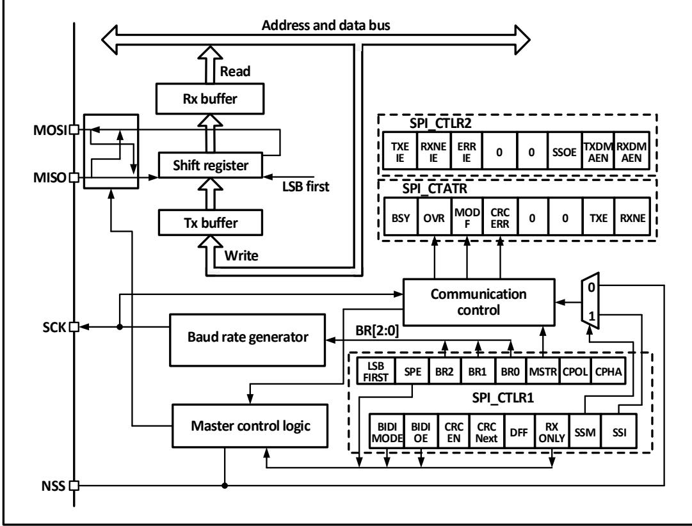  
图 14-1 SPI 结构框图

由图14-1可以看出，与SPI相关的主要是MISO、M0SI、SCK和NSS四个引脚。其中MISO引脚在SPI模块工作在主模式下时，是数据输入引脚；工作在从模式下时，是数据输出引脚。MOSI引脚工作在主模式下时，是数据输出引脚；工作在从模式时，是数据输入引脚。SCK 是时钟引脚，时钟

信号一直由主机输出，从机接收时钟信号并同步数据收发。NSS引脚是片选引脚，有以下用法：  
1） NSS 由软件控制：此时 SSM 被置位，内部 NSS 信号由 SSI 决定输出高还是低，这种情况一般用于 SPI 主模式；  
2） NSS由硬件控制：在NSS输出使能时，即SSOE置位时，在SPI主机向外发送输出时会主动拉低NSS 引脚，如果没有成功拉低 NSS 脚，说明主线上有其他主设备正在通信，则会产生一个硬件错误；SSOE不置位，则可以用于多主机模式，如果它被拉低则会强行进入从机模式，MSTR位会被自动清除。可以通过CPHA和CPOL配置SPI的工作模式。CPHA置位表示模块在时钟的第二个边沿进行数据  
采样，数据被锁存，CPHA 不置位表示 SPI 模块在时钟的第一个边沿进行采样，数据被锁存。CPOL  
则表示无数据时时钟保持高电平还是低电平。具体见下图14-2。

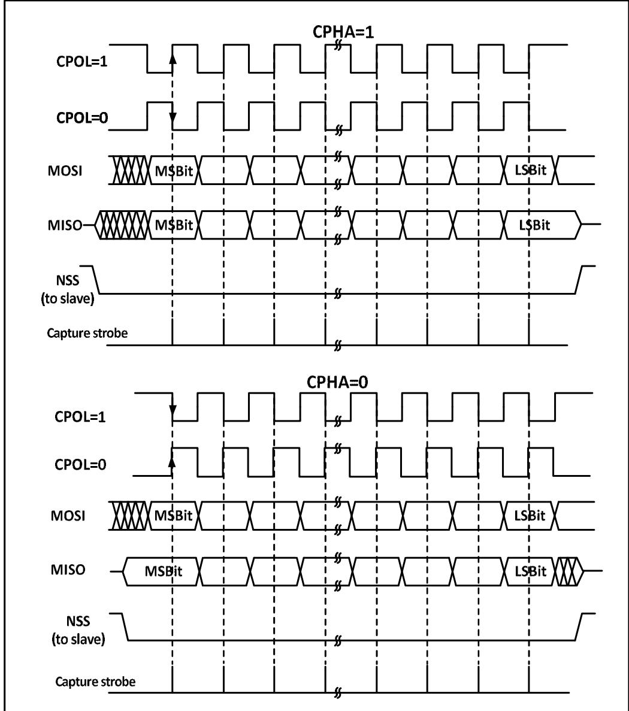  
图 14-2 SPI 模式

主机和设备需要设置为相同的 SPI 模式，在配置 SPI 模式前，需要清除 SPE 位。DEF 位可以决定SP的单个数据长度是8位还是16位。LSBFIRST可以控制单个数据字是高位在前还是低位在前。

# 14.2.2 主模式

在SPI模块工作在主模式时，由SCK产生串行时钟。配置成主模式进行以下步骤：配置控制寄存器的BR[2:0]域来确定时钟；  
配置 CPOL 和 CPHA 位来确定 SPI 模式；

配置DEF确定数据字长；

配置 LSBFIRST 确定帧格式；

配置 NSS 引脚，比如置 SSOE 位让硬件去置 NSS。也可以置 SSM 位并把 SSI 位置高；

置MSTR位和SPE位，需要保证NSS此时已经是高。

需要发送数据时只需要向数据寄存器写要发送的数据就行了。SPI 会从发送缓冲区并行地把数据送到移位寄存器，然后按照LSBFIRST的设置将数据从移位寄存器发出去，当数据已经到了移位寄存器时，TXE 标志会被置位，如果已经置位了 TXEIE，那么会产生中断。如果 TXE 标志位置位需要向数据寄存器里填数据，维持完整的数据流。

当接收器接收数据时，当数据字的最后一个采样时钟沿到来时，数据从移位寄存器并行地转移到接收缓冲区，RXNE 位被置位，如果之前置位了 RXNEIE 位，还会产生中断。此时应该尽快读取数据寄存器取走数据。

# 14.2.3 从模式

当 SPI 模块工作在从模式时，SCK 用于接收主机发来的时钟，自身的波特率设置无效。配置成从模式的步骤如下：

配置DEF位设置数据位长度；

配置CPOL和CPHA位匹配主机模式；

配置LSBFIRST匹配主机数据帧格式；

硬件管理模式下，NSS管脚需要保持为低电平，如果设置NSS为软件管理（SSM置位），那么请保持 SSI 不被置位；

清除MSTR位，置SPE位，开启SPI模式。

在发送时，当 SCK 出现第一个从机接收采样沿时，从机开始发送。发送的过程就是发送缓冲区的数据移到发送移位寄存器，当发送缓冲区的数据移到了移位寄存器之后，会置位TXE标志，如果之前置位了TXEIE位，那么会产生中断。

在接收时，最后一个时钟采样沿之后，RXNE 位被置位，移位寄存器接收到的字节被转移到接收缓冲区，读数据寄存器的读操作可以获得接收缓冲区里的数据。如果在RXNE置位之前RXNEIE已经被置位，那么会产生中断。

# 14.2.4 单工模式

SPI 接口可以工作在半双工模式，即主设备使用 MOSI 引脚，从设备使用 MISO 引脚进行通讯。使用半双工通讯时需要把BIDIMODE置位，使用BIDIOE控制传输方向。

在正常全双工模式下将 RXONLY 位置位可以将 SPI 模块设置为仅仅接收的单工模式，在 RXONLY置位之后会释放一个数据脚，主模式和从模式释放的引脚并不相同。也可以不理会接收的数据将 SPI置成只发送的模式。

# 14.2.5 CRC

SPI 模块使用 CRC 校验保证全双工通信的可靠性，数据收发分别使用单独的 CRC 计算器。CRC计算的多项式由多项式寄存器决定，对于8位数据宽度和16位数据宽度，会分别使用不同的计算方法。

设置CRCEN位会启用CRC校验，同时会使CRC计算器复位。在发送完最后一个数据字节后，置CRCNEXT位会在当前字节发送结束后发送TXCRCR计算器的计算结果，同时最后接收到的接收移位寄存器的值如果与本地算出来的 RXCRCR 的计算值不相符，那么 CRCERR 位会被置位。使用 CRC 校验需要在配置SPI工作模式时设置多项式计算器并置CRCEN位，并在最后一个字或半字置CRCNEXT位发送 CRC 并进行接收 CRC 的校验。注意，收发双方的 CRC 计算多项式应该统一。

# 14.2.6 DMA

SPI 模块支持使用 DMA 加快数据通讯速度，可以使用 DMA 向发送缓冲区填写数据，或使用 DMA从接收缓冲区及时取走数据。DMA会以RXNE和TXE为信号及时取走或发来数据。DMA也可以工作在单工或加CRC校验的模式。

# 14.2.7 错误

$\bullet$ 主模式失效错误

当SPI工作在NSS引脚硬件管理模式下，发生了外部拉低NSS引脚的操作；或在NSS引脚软件管理模式下，SSI位被清零；或SPE位被清零，导致SPI被关闭；或MSTR位被清零，SPI进入从模式。如果 ERRIE 位已经被置位，还会产生中断。清除 MODF 位步骤：首先执行一次对 R16_SPI1_STATR的读或写操作，然后写 R16_SPI1_CTLR1。

# $\bullet$ 溢出错误

如果主机发送了数据，而从设备的接收缓冲区中还有未读取的数据，就会发生溢出错误，OVR位被置位，如果ERRIE被置位还会产生中断。发送溢出错误应该重新开始当前传输。读取数据寄存器再读取状态寄存器会消除此位。

CRC 错误当接收到的CRC校验字和RXCRCR的值不匹配时，会产生CRC校验错误，CRCERR位会被置位。

# 14.2.8 中断

SPI 模块的中断支持五个中断源，其中发送缓冲区空、接收缓冲区非空这两个事件分别会置位TXE 和 RXNE，在分别置位了 TXEIE 和 RXNEIE 位的情况下会产生中断。除此之外上面提到的三种错误也会产生中断，分别是MODF、OVR和CRCERR，在使能了ERRIE位之后，这三种错误也会产生错误中断。

# 14.3 寄存器描述

表 14-1 SPI 相关寄存器列表  

<table><tr><td></td><td>iji@tbtt</td><td>#it</td><td></td></tr><tr><td>R16_SP1_CTLR1</td><td>0x40013000</td><td>SP1 $J$ 1</td><td>0x0000</td></tr><tr><td>R16_SP1_CTLR2</td><td>0x40013004</td><td>SP1 j$J$ 2</td><td>0x0000</td></tr><tr><td>R16_SP1_STATR</td><td>0x40013008</td><td>SP1 *$*</td><td>0x0002</td></tr><tr><td>R16_SP1_DATAR</td><td>0x4001300C</td><td>SP1 ##$7</td><td>0x0000</td></tr><tr><td>R16_SP1_CRCR</td><td>0x40013010</td><td>SP1 31</td><td>0x0007</td></tr><tr><td>R16_SP1_RCRCR</td><td>0x40013014</td><td>SP1 f#4 CRC #17</td><td>0x0000</td></tr><tr><td>R16_SP1_TCRCR</td><td>0x40013018</td><td>SP1 iX CRC #17</td><td>0x0000</td></tr><tr><td>R16_SP1_HSCR</td><td>0x40013024</td><td>SP1 $$</td><td>0x0000</td></tr></table>

# 14.3.1 SPI 控制寄存器 1（SPI_CTLR1）

偏移地址： $0 \times 0 0$

<table><tr><td>15</td><td>14</td><td>13</td><td>12</td><td>11</td><td>10</td><td>9</td><td>8</td><td>7</td><td>6</td><td>5</td><td>4</td><td>3</td><td>2</td><td>1</td><td>0</td></tr><tr><td>RUDE</td><td>BOE!</td><td>CRCEN</td><td>NET</td><td>DFF</td><td>ORLY</td><td>SSM</td><td>sS1</td><td>FIRST</td><td>SPE</td><td></td><td>BR[2: 0]</td><td></td><td>MSTR</td><td>CPOL</td><td>CPHA</td></tr></table>

<table><tr><td>1</td><td></td><td>i</td><td>#it</td><td></td></tr><tr><td>15</td><td>BID IMODE</td><td>RW</td><td>. 1: jXt; 0: jtXXt.</td><td>0</td></tr><tr><td>14</td><td>BIDIOE</td><td>RW</td><td>21A1, F BIDImODE 21. 1: , 1i; : #, 14.</td><td>0</td></tr><tr><td>13</td><td>CRCEN</td><td>RW</td><td>1# CRC tg1AE1, i1AE SPE j 0 A Sa, iR##XIt#tT. 1: z CRC i+#; O: #1 CRC i+#.</td><td>0</td></tr><tr><td>12</td><td>CRCNEXT</td><td>RW</td><td>#t#T*A9iR##1$#F, iX cRC $7 #. ixi##$##5# #. 1: i CRCR; o: </td><td>0</td></tr><tr><td>11</td><td>DFF</td><td>RW</td><td>###K1, tA# SPE  0 AjSa. 1: 16#Ki#14x 0: 1 81##Ki#14x. 3X2#tstFRt#4X1z, i1zF B1DIMODE C</td><td>0</td></tr><tr><td>10</td><td>RXONLY</td><td>RW</td><td>1M. ta]liiRt#4xT%i. 1: R#4, $Itt; O: it. Hi31AI@1, 11* NSS 31APAT</td><td>0</td></tr><tr><td>9 SSM</td><td></td><td>RW</td><td>H 1i#1+$J. 1: $1$ NSS 31Ap; O: 1t$J NSS 31Ap. Hi3lAI$J1, # SSM1Al#T, tt1</td><td>0</td></tr><tr><td>8 ss1</td><td></td><td>RW</td><td>NSS 3lADAg. 1: NSS ; O: NSS 1?.</td><td>0</td></tr><tr><td>7</td><td>LSBF IRST</td><td>RW o: i MSB.</td><td>1: LSB; i: LSB1 SP1 1##l SPI AE.</td><td>0</td></tr><tr><td>6 [5:3] BR[2: 0]</td><td>SPE</td><td>RW 1:  SPI; O: # SPI. 000: FHOLk/2; RW 010: FHOL/8;</td><td>#*i&amp;tt, #i#iAfTa12xttti. 001: FHCLk/4; 011: FHcLL/16; 100: FHCLK/32; 101: FHCLk/64;</td><td>0 0</td></tr><tr><td>2</td><td>MSTR</td><td>RW</td><td>110: FHCLk/128; 111: FHoLk/256. i&amp;{, #iiATa12ut{. 1: % o: i.</td><td>0b</td></tr></table>

<table><tr><td>1</td><td>CPOL</td><td>RW</td><td>A]$#t|i1, i#iAfTal12xt1. 1: j, SCKR#; 0: , SCK1RT.</td><td>0</td></tr><tr><td>0</td><td>CPHA</td><td>RW</td><td>A$#t1i&amp;1, #j#iTaJl12xut. 1: ##$iTA; 0: ##R$Af$iT.</td><td>0</td></tr></table>

# 14.3.2 SPI 控制寄存器 2（SPI_CTLR2）

偏移地址： $0 \times 0 4$

<table><tr><td>15</td><td>14</td><td>13</td><td>12</td><td>11</td><td>10</td><td>9</td><td>8</td><td>7</td><td>6</td><td>5</td><td>4</td><td>3</td><td>2</td><td>1</td><td></td></tr><tr><td></td><td></td><td></td><td>Reserved</td><td></td><td></td><td></td><td></td><td>TXEIE</td><td>RXNE IE</td><td>ERRTE</td><td>Reserved</td><td></td><td>SSOE</td><td>TXDMA|RXDMA EN</td><td>EN</td></tr></table>

控制寄存器2  

<table><tr><td>1i</td><td></td><td></td><td>##it</td><td></td></tr><tr><td>[15:8]</td><td>Reserved</td><td>RO</td><td>1R.</td><td>0</td></tr><tr><td>7</td><td>TXEIE</td><td>RW</td><td>iX+*f1#1. ttiF TXE i A*+.</td><td>0</td></tr><tr><td>6</td><td>RXNEIE</td><td>RW</td><td>t4X+#F+*F1AE1. t13ti RXNE +.</td><td>0</td></tr><tr><td>5</td><td>ERRIE</td><td>RW</td><td>##i+*f1A.  t ti# #i (CRCERR, OVR, MODF) Af#Fo</td><td>0</td></tr><tr><td>[4:3]</td><td>Reserved</td><td>RO</td><td>1R.</td><td>0</td></tr><tr><td>2</td><td>SSOE</td><td>RW</td><td>Ss #1. # Ss a1F3 ItF. 1:  SS 0: #tTA SS.</td><td>0</td></tr><tr><td>1</td><td>TXDMAEN</td><td>RW</td><td>iX;# DMA 1E1. 1: i DMA; 0: #i DMA.</td><td>0</td></tr><tr><td>0</td><td>RXDMAEN</td><td>RW</td><td>f4X;+ DMA 1AE1. 1: 4 DMA; 0: 4 DMA.</td><td>0</td></tr></table>

# 14.3.3 SPI 状态寄存器（SPI_STATR）

偏移地址： $0 \times 0 8$

<table><tr><td>15</td><td>14</td><td>13</td><td>12</td><td>11</td><td>10</td><td>9</td><td>8</td><td>7</td><td>6</td><td>5</td><td>4</td><td>3</td><td>2</td><td>1</td><td></td></tr><tr><td></td><td></td><td></td><td>Reserved</td><td></td><td></td><td></td><td></td><td>BSY</td><td>OVR</td><td>MODF</td><td>CRC ERR</td><td>UDR</td><td>CHSID</td><td>TXE</td><td>RXNE</td></tr></table>

<table><tr><td>1</td><td></td><td>i</td><td>#it</td><td></td></tr><tr><td>[15:8]</td><td>Reser ved</td><td>RO</td><td>1R.</td><td>0</td></tr><tr><td>7</td><td>BSY</td><td>RO</td><td>T+, i#. 1: SP1 Eii, i#;</td><td>0</td></tr></table>

<table><tr><td></td><td></td><td></td><td>O: SPI T#il.</td><td></td></tr><tr><td>6</td><td>OVR</td><td>RWO</td><td>, i#, #. 1: Wi;</td><td>0</td></tr><tr><td>5</td><td>MODFE</td><td>RO</td><td>0: i. ti++, i#, ##1. 1: W#i;</td><td>0</td></tr><tr><td>4</td><td>CRCERR</td><td>RWO</td><td>0: i#i. CRC t#it, i#, #. 1: 4J CRC ( RCRCR A1T;</td><td>0</td></tr><tr><td>3</td><td>UDR</td><td>RO</td><td>0: 4J CRC  RCRCR A. Fi#+, i#, ##. 1: Tm;</td><td>0</td></tr><tr><td>2</td><td>CHSID</td><td>RO</td><td>0: *T. #i, i, #. 1: 0: 4.</td><td>0</td></tr><tr><td>1</td><td>TXE</td><td>RO</td><td>i++. 1: i; 0: i#.</td><td>1</td></tr><tr><td>0</td><td>RXNE</td><td>RO</td><td>1: t4; 0: t4. i: iDATAR, .</td><td>0</td></tr></table>

# 14.3.4 SPI 数据寄存器（SPI_DATAR）

偏移地址： $0 \times 0 0$

<table><tr><td>15</td><td>14</td><td>13</td><td>12</td><td>11</td><td>10</td><td>9</td><td>8</td><td>7</td><td>6</td><td>5</td><td>4</td><td>3</td><td>2</td><td>1</td><td></td></tr><tr><td></td><td colspan="13">DR[15:0]</td></tr></table>

<table><tr><td>1</td><td></td><td>i</td><td>##it</td><td></td></tr><tr><td>[15:0]DR[15:0]</td><td></td><td>RW</td><td>Ji AiSEx1FTt i$x y+, Sx%i+ # #4i8 1g 161 1$Z13#1 8 1i#1#1#, R#11 8 1480.116 #1 16 1#$1.</td><td>0</td></tr></table>

# 14.3.5 SPI 多项式寄存器（SPI_CRCR）

偏移地址： $0 \times 1 0$

<table><tr><td>15</td><td>14</td><td>13</td><td>12</td><td>11</td><td>10</td><td>9</td><td>8</td><td>7</td><td>6</td><td>5</td><td>4</td><td>3</td><td>2</td><td>1</td><td></td></tr><tr><td></td><td>CRCPOLY [15: 0]</td></tr> colspan="14"></td></tr></table>

<table><tr><td>1</td><td></td><td>i</td><td>#it</td><td></td></tr><tr><td>[15: 0]</td><td>CRCP0LY [15: 0]</td><td>RW</td><td>CRC 3It. ttX CRC i+J3t.</td><td>7</td></tr></table>

# 14.3.6 SPI 接收 CRC 寄存器（SPI_RCRCR）

偏移地址： $0 \times 1 4$

<table><tr><td>15</td><td>14</td><td>13</td><td>12</td><td>11</td><td>10</td><td>9</td><td>8</td><td>7</td><td>6</td><td>5</td><td>4</td><td>3</td><td>2</td><td>1</td><td>0</td></tr><tr><td></td><td>RXCRC[15: 0]</td></tr> colspan="14"></td></tr></table>

<table><tr><td>1</td><td></td><td>i1</td><td>##it</td><td></td></tr><tr><td>[15:0]RXCRC[15:0]</td><td></td><td>RO</td><td>f4 CRC 1 11i#i*At4J# HJ CRCtJAR. Xf CRCEN 11Zi* 17 i71 CRCPOLY #JHJ3t. 8 1T8S, 16T 161Si # BSY 0 A i$HXiT.</td><td>0</td></tr></table>

# 14.3.7 发送 CRC 寄存器（SPI_TCRCR）

偏移地址： $0 \times 1 8$

<table><tr><td>15</td><td>14 13</td><td></td><td>12</td><td>11</td><td>10</td><td>9</td><td>8</td><td>7</td><td>6</td><td>5</td><td>4</td><td>3</td><td>2</td><td>1</td><td></td></tr><tr><td></td><td>TXCRC[15: 0]</td></tr> colspan="14"></td></tr></table>

<table><tr><td>1</td><td></td><td>i1</td><td>##it</td><td></td></tr><tr><td>[15:0]TXCRC[15:0]</td><td></td><td>RO</td><td>Hi CRc. 71##i*Ei HJ#] CRCtJAJR. X CRCEN 1i$1 i#1 CRCPOLY MJJ3 It. 8T#8Si#, 16| tT 16 1#Si  BSY f 0 Afi$HXix$1.</td><td>0</td></tr></table>

# 14.3.8 SPI 高速控制寄存器（SPI_HSCR）

偏移地址： ${ 0 } { \times 2 4 }$

<table><tr><td>15</td><td>14</td><td>13</td><td>12</td><td>11</td><td>10</td><td>9</td><td>8</td><td>7</td><td>6</td><td>5</td><td>4</td><td>3</td><td>2</td><td></td><td></td></tr><tr><td></td><td></td><td></td><td></td></tr><tr><td></td><td></td></tr></table>

<table><tr><td>1</td><td></td><td>ii]</td><td>#it</td><td></td></tr><tr><td>[15:1]</td><td>Reserved</td><td>RO</td><td>1R.</td><td>0</td></tr><tr><td>0</td><td>HSRXEN</td><td>WO</td><td>SP1 i*ttF (CLKXF#F36MHz) i1 AE. it{XAf$ 2 t Q] CTLR1 T7 AJ BR = 00O) Aj. i(TaJi. 1: 1it; 0: ii$.</td><td>0</td></tr></table>

# 第 15 章 电子签名 （ESIG）

电子签名包含了芯片识别信息：闪存区容量和唯一身份标识。它由厂家在出厂时烧录到存储器模块的系统存储区域，可以通过SWD（SDI）或者应用代码读取。

# 15.1 功能描述

闪存区容量：指示当前芯片用户应用程序可以使用大小。

唯一身份标识：96位二进制码，对任意一个微控制器都是唯一的，用户只能读访问不能修改。此唯一标识信息可以用作微控制器（产品）的安全密码、加解密钥、产品序列号等，用来提高系统安全机制或表明身份信息。

以上内容用户都可以按8/16/32位进行读访问。

# 15.2 寄存器描述

表 15-1 ESIG 相关寄存器列表  

<table><tr><td></td><td>iji@tttt</td><td>#it</td><td></td></tr><tr><td>R16_ESIG_FLACAP</td><td>0x1FFFF7E0</td><td></td><td>0xXXXX</td></tr><tr><td>R32_ESIG_UNI ID1</td><td>0x1FFFF7E8</td><td>UId $1</td><td>0xXXXXXXXX</td></tr><tr><td>R32_ESIG_UNI ID2</td><td>0x1FFFF7EC</td><td>UID $7 2</td><td>0xXXXXXXXX</td></tr><tr><td>R32_ESIG_UNI ID3</td><td>0x1FFFF7F0</td><td>UID $3</td><td>0xXXXXXXXX</td></tr></table>

# 15.2.1 闪存容量寄存器 （ESIG_FLACAP）

<table><tr><td>15</td><td>14</td><td>13</td><td>12</td><td>11</td><td>10</td><td>9</td><td>8</td><td>7</td><td>6</td><td>5</td><td>4</td><td>3</td><td>2</td><td>1</td><td></td></tr><tr><td></td><td></td><td></td><td>F_SIZE [15:0]</td><td></td><td></td><td></td><td></td><td></td><td></td><td></td><td></td><td></td><td></td><td></td><td></td></tr></table>

<table><tr><td>1</td><td></td><td>ii</td><td>#it</td><td></td></tr><tr><td>[15: 0]</td><td>F_SIZE[15:0]</td><td>RO</td><td>Kbyte i. 1J: 0x0080 = 128 K#.</td><td>X</td></tr></table>

# 15.2.2 UID 寄存器（ESIG_UNIID1）

<table><tr><td>31</td><td>30</td><td>29</td><td>28</td><td>27</td><td>26</td><td>25</td><td>24</td><td></td><td>23</td><td>22</td><td>21</td><td>20</td><td>19</td><td>18</td><td>17</td><td>16</td></tr><tr><td></td><td colspan="14">U_ID[31:16]</td></tr><tr><td>15</td><td>14</td><td>13</td><td>12</td><td>11</td><td>10</td><td>9</td><td>8</td><td></td><td>7</td><td>6</td><td>5</td><td>4</td><td>3</td><td>2</td><td>1</td><td>0</td></tr><tr><td></td><td colspan="14">U_ID[15:0]</td></tr></table>

<table><tr><td>1</td><td></td><td>i</td><td>#it</td><td></td></tr><tr><td>[31: 0]</td><td>U_ID[31:0]</td><td>RO</td><td>UID AJ 0-31 1.</td><td>x</td></tr></table>

# 15.2.3 UID 寄存器（ESIG_UNIID2）

<table><tr><td>31</td><td>30</td><td>29</td><td>28</td><td>27</td><td>26</td><td>25</td><td>24</td><td>23</td><td>22</td><td></td><td>21</td><td>20</td><td>19</td><td>18</td><td>17</td><td>16</td></tr><tr><td></td><td colspan="16">U_ID[63: 48]</td></tr></table>

<table><tr><td>15</td><td>14</td><td>13</td><td>12</td><td>11</td><td>10</td><td>9</td><td>8</td><td>7</td><td>6</td><td>5</td><td>4</td><td>3</td><td>2</td><td></td><td>1 0</td></tr><tr><td colspan="16">U_ID[47: 32]</td></tr></table>

<table><tr><td></td><td></td><td></td><td>#it</td><td></td></tr><tr><td>[31 : 0]</td><td>U_ID[63: 32]</td><td>RO</td><td>UID AJ 32-63 1.</td><td>x</td></tr></table>

# 15.2.4 UID 寄存器（ESIG_UNIID3）

<table><tr><td>31</td><td>30</td><td>29</td><td>28</td><td>27</td><td>26</td><td>25</td><td>24</td><td>23</td><td></td><td>22</td><td>21</td><td>20</td><td>19</td><td>18</td><td>17</td><td>16</td></tr><tr><td></td><td colspan="14">U_ID[95:80]</td></tr><tr><td>15</td><td>14</td><td>13</td><td>12</td><td>11</td><td>10</td><td>9</td><td>8</td><td></td><td>7</td><td>6</td><td>5</td><td>4</td><td>3</td><td>2</td><td>1</td><td>0</td></tr><tr><td></td><td colspan="14">U_ID[79: 64]</td></tr></table>

<table><tr><td>1</td><td></td><td></td><td>#it</td><td></td></tr><tr><td>[31: 0]</td><td>U_1D[95: 64]</td><td>RO</td><td>UID A] 64-95 1.</td><td>x</td></tr></table>

# 第 16 章 闪存及用户选择字 （FLASH）

# 16.1 闪存组织

芯片内部闪存组织结构如下：

表16-1 闪存组织结构  

<table><tr><td>t#</td><td></td><td></td><td>tJ(#)</td></tr><tr><td rowspan="6">1</td><td></td><td>0x0800 0000 - Ox0800 003F</td><td>64</td></tr><tr><td>1</td><td>0x0800 0040 - 0x0800 007F</td><td>64</td></tr><tr><td> 2</td><td>0x0800 0080 - Ox0800 00BF</td><td>64</td></tr><tr><td> 3</td><td>Ox0800 00C0 - Ox0800 00FF</td><td>64</td></tr><tr><td>...</td><td>...</td><td>...</td></tr><tr><td> 256</td><td>OxO800 3FCO - OxO800 3FFF</td><td>64</td></tr><tr><td rowspan="2">1</td><td></td><td>Ox1FFF FOOO - Ox1FFF F77F</td><td>2K-128</td></tr><tr><td></td><td>Ox1FFF F800 - Ox1FFF F83F</td><td>64</td></tr></table>

i:

1) i1i#F1i#l $1 \kappa$ F# (16 ) \$1i#{5{Rt#J;   
7 "" XtW#, TaJiji], #-1TPa1F.

# 16.2 闪存编程及安全性

# 16.2.1 两种编程/擦除方式

$\bullet$ 标准编程：此方式是默认编程方式（兼容方式）。这种模式下CPU以单次2字节方式执行编程，单次1K字节执行擦除及整片擦除操作。

$\bullet$ 快速编程：此方式采用页操作方式（推荐）。经过特定序列解锁后，执行单次64字节的编程及64 字节擦除、1K 字节擦除（标准 1K 整片擦除同样适用于快速编程）。

# 16.2.2 安全性-防止非法访问（读、写、擦）

$\bullet$ 页写入保护$\bullet$ 读保护

芯片处于读保护状态下时：

1） 主存储器0-32页（2K字节）自动写保护状态，不受FLASH_WPR寄存器控制；解除读保护状态，所有主存储页都由FLASH_WPR寄存器控制。  
2） 系统引导代码区、SDI 模式、RAM 区域都不可对主存储器进行擦除或编程，整片擦除除外。可擦除或编程用户选择字区域。如果试图解除读保护（编程用户字），芯片将自动擦除整片用户区。i: i#1iJ/ftR1F, TJTBRCt;(HS1) o

# 16.3 寄存器描述

表 16-2 FLASH 相关寄存器列表  

<table><tr><td></td><td>ijitbtt</td><td>#it</td><td></td></tr><tr><td>R32_FLASH_ACTLR</td><td>0x40022000</td><td>$$7</td><td>0x00000000</td></tr><tr><td>R32_FLASH_KEYR</td><td>0x40022004</td><td>FPEC $$8</td><td>x</td></tr><tr><td>R32_FLASH_OBKEYR</td><td>0x40022008</td><td>OBKEY $1</td><td>x</td></tr></table>

<table><tr><td>R32_FLASH_STATR</td><td>0x4002200C</td><td></td><td>0x00008000</td></tr><tr><td>R32_FLASH_CTLR</td><td>0x40022010</td><td></td><td>0x00008080</td></tr><tr><td>R32_FLASH_ADDR</td><td>0x40022014</td><td>tbt$1</td><td>x</td></tr><tr><td>R32_FLASH_0BR</td><td>0x4002201C</td><td></td><td>0x03FFFFFE</td></tr><tr><td>R32_FLASH_WPR</td><td>0x40022020</td><td></td><td>0xFFFFFFF</td></tr><tr><td>R32_FLASH_MODEKEYR</td><td>0x40022024</td><td>#R$$</td><td>x</td></tr><tr><td>R32_FLASH_BOOT_MODEKEYR</td><td>0x40022028</td><td>#$ BOOT $1</td><td>X</td></tr></table>

# 16.3.1 控制寄存器（FLASH_ACTLR）

偏移地址： $0 \times 0 0$

<table><tr><td>31</td><td>30</td><td>29</td><td>28</td><td>27</td><td>26</td><td>25</td><td>24</td><td>23</td><td>22</td><td>21</td><td>20</td><td></td><td>19</td><td>18</td><td>17 16</td></tr><tr><td></td><td colspan="13">Reserved</td></tr><tr><td>15</td><td>14</td><td>13</td><td>12</td><td>11</td><td>10</td><td>9</td><td>8</td><td>7</td><td>6</td><td>5</td><td>4</td><td>3</td><td>2</td><td>1</td><td>0</td></tr><tr><td></td><td></td><td></td><td></td><td></td><td></td><td>Reserved</td><td></td><td></td><td></td><td></td><td></td><td></td><td></td><td>LATENCY</td><td></td></tr></table>

<table><tr><td>1</td><td></td><td>iji</td><td>##it</td><td></td></tr><tr><td>[31:2]</td><td>Reserved</td><td>RO</td><td></td><td>0</td></tr><tr><td>[1: 0]</td><td>LATENCY [1 : 0]</td><td>RW</td><td>FLASH+#. 00: 0#(3iX 0=&lt;SYSCLK=&lt;24MHz) ; 01: 1#(3iX 24&lt;SYSCLK=&lt;48MHz) ; #+t: F.</td><td>0</td></tr></table>

# 16.3.2 FPEC 键寄存器 （FLASH_KEYR）

偏移地址： $0 \times 0 4$

<table><tr><td>31</td><td>30</td><td>29</td><td>28</td><td>27</td><td>26</td><td>25</td><td>24</td><td>23</td><td></td><td>22</td><td>21</td><td>20</td><td>19</td><td>18</td><td>17</td><td>16</td></tr><tr><td></td><td></td><td></td><td></td><td></td><td></td><td></td><td></td><td>KEYR[31: 16]</td><td></td><td></td><td></td><td></td><td></td><td></td><td></td><td></td></tr><tr><td>15</td><td>14</td><td>13</td><td>12</td><td>11</td><td>10</td><td>9</td><td>8</td><td></td><td>7</td><td>6</td><td>5</td><td>4</td><td>3</td><td>2</td><td>1</td><td>0</td></tr><tr><td></td><td></td><td></td><td></td><td></td><td></td><td></td><td></td><td>KEYR[15: 0]</td><td></td><td></td><td></td><td></td><td></td><td></td><td></td><td></td></tr></table>

<table><tr><td>1</td><td></td><td>i</td><td>#it</td><td></td></tr><tr><td rowspan="2">[31 : 0]</td><td rowspan="2">KEYR[31 : 0]</td><td rowspan="2">WO</td><td>FPEC   FPEC $</td><td rowspan="2">X</td></tr><tr><td>RDPRT  = Ox000000A5; KEY1 = 0x45670123;</td></tr></table>

# 16.3.3 OBKEY 寄存器（FLASH_OBKEYR）

偏移地址： $0 \times 0 8$

<table><tr><td>31</td><td>30</td><td>29</td><td>28</td><td>27</td><td>26</td><td>25</td><td>24</td><td>23</td><td></td><td>22</td><td>21</td><td>20</td><td>19</td><td>18</td><td>17</td><td>16</td></tr><tr><td></td><td colspan="14">OBKEYR[31 : 16]</td></tr><tr><td>15</td><td>14</td><td>13</td><td>12</td><td>11</td><td>10</td><td>9</td><td></td><td>8</td><td>7</td><td>6</td><td>5</td><td>4</td><td>3</td><td>2</td><td>1</td><td>0</td></tr><tr><td></td><td></td><td></td><td></td><td></td><td></td><td></td><td></td><td>OBKEYR[15: 0]</td><td></td><td></td><td></td><td></td><td></td><td></td><td></td><td></td></tr></table>

<table><tr><td>1</td><td></td><td>i1</td><td>#it</td><td></td></tr><tr><td>[31 : 0]</td><td>OBKEYR[31 : 0]</td><td>Wo</td><td>j+, #F+i+$# OPTWRE.</td><td>X</td></tr></table>

# 16.3.4 状态寄存器（FLASH_STATR）

偏移地址： $0 \times 0 0$

<table><tr><td>31</td><td>30</td><td>29</td><td>28</td><td>27</td><td>26</td><td>25</td><td>24</td><td>23</td><td>22</td><td>21</td><td>20</td><td>19</td><td>18</td><td>17</td><td>16</td></tr><tr><td colspan="14"></td></tr><tr><td>15</td><td>14</td><td>13</td><td>12 11</td><td>10</td><td></td><td>9</td><td>Reserved 8</td><td>7</td><td>6</td><td>5</td><td>4</td><td>3</td><td>2</td><td>1</td><td>0</td></tr><tr><td>LOCK</td><td>MODE</td><td></td><td></td><td></td><td>Reserved</td><td></td><td></td><td></td><td></td><td>EOP</td><td>WRPRT ERR</td><td></td><td>Reserved</td><td></td><td>BSY</td></tr></table>

<table><tr><td>1</td><td></td><td>i</td><td>#it</td><td></td></tr><tr><td>[31: 16]</td><td>Reserved</td><td>RO</td><td>1*.</td><td>0</td></tr><tr><td>15</td><td>LOCK</td><td>RW</td><td>BOOT $i 1: $1, FE;X FLASH_STATA[14]7F&amp;#1] St*1F. O: ##$i, aJlXf FLASH_STATR[14]F#1T St*I&#x27;f.</td><td>1</td></tr><tr><td>14</td><td>MODE</td><td>RW</td><td>51, S0. aJ lt$][XFA B00T Zie]t] 1: #1#1Zat3] B00T ;</td><td>0</td></tr><tr><td>[13:6]</td><td>Reserved</td><td>RO</td><td>0: $#1iZFa]t#]F. 1*.</td><td>0</td></tr><tr><td>5</td><td>EOP</td><td>RW1</td><td>*, 1. 1.</td><td>0</td></tr><tr><td>4</td><td>WRPRTERR</td><td>RW1</td><td>t5R#i, 51.</td><td>0</td></tr><tr><td>[3:1]</td><td>Reserved</td><td>RO</td><td>tARxS1RtAtbt, 1#1. 1*.</td><td>0</td></tr><tr><td>0</td><td>BUSY</td><td>RO</td><td>1: *t1FE#i#1T; 0: tR1F*.</td><td>0</td></tr></table>

j i###, FLASH CTLR STRT $0 _ { \circ }$

# 16.3.5 配置寄存器 （FLASH_CTLR）

偏移地址： $0 \times 1 0$

<table><tr><td>31</td><td>30</td><td>29</td><td>28</td><td>27</td><td>26</td><td>25</td><td>24</td><td>23</td><td>22</td><td>21</td><td>20</td><td>19</td><td>18</td><td>17</td><td>16</td></tr><tr><td colspan="10">Reserved</td><td></td><td></td><td></td><td>BUFR BUFLO ST</td><td>AD</td><td>FTER</td><td>FTPG</td></tr><tr><td colspan="12">15 14 13 12 11 10 9 8 7 6 5 4 3</td><td>2</td><td></td><td>1</td><td></td><td>0</td></tr><tr><td>FLOCK</td><td>Reserved</td><td></td><td>EOPIE</td><td>Reser ved</td><td>ERRIEOBWRE</td><td></td><td>ved Reser</td><td>LOCK STRT</td><td></td><td>OBER</td><td>OBPG</td><td>Rese</td><td>MER</td><td>PER</td><td>PG</td></tr><tr><td></td><td></td><td></td><td></td><td></td><td></td><td></td><td></td><td></td><td></td><td></td><td></td><td>rved</td><td></td><td></td><td></td></tr></table>

<table><tr><td>1ii</td><td></td><td>ijie]</td><td>#it</td><td></td></tr><tr><td>[31: 20]</td><td>Reserved</td><td>RO</td><td></td><td>0</td></tr><tr><td>19</td><td>BUFRST</td><td>RW</td><td>BUF 1##1F.</td><td>0</td></tr><tr><td>18</td><td>BUFLOAD</td><td>RW</td><td>y###773J BUF .</td><td>0</td></tr><tr><td>17</td><td>FTER</td><td>RW</td><td>#1T|i (64Byte) t#t#1F.</td><td>0</td></tr><tr><td>16</td><td>FTPG</td><td>RW</td><td>#1i+1F. i*#t. RA5 1&#x27; .i &#x27;1&#x27; Ai*#/t#$tTaJ#;NJJ</td><td>0</td></tr><tr><td>15 [14:13]</td><td>FLOCK</td><td>RW1 RO</td><td>E##$FJ, # 0&#x27; . ##1, #. 1R.</td><td>1</td></tr><tr><td></td><td>Reserved</td><td></td><td>tR1&#x27;F5h+Ft$J (FLASH_STATR $1+ EOP () .</td><td>0</td></tr><tr><td>12</td><td>EOPIE</td><td>RW</td><td>1: tiF*+; 0: #*+. 1R.</td><td>0</td></tr><tr><td>11</td><td>Reserved</td><td>RO</td><td>$#i|X#h#$J(FLASH_STATR 1 PGERR/WRPRTERR 1iZ) .</td><td>0</td></tr><tr><td>10</td><td>ERRIE</td><td>RW</td><td>1: i+; 0: #*+. Mi, ##0.</td><td>0</td></tr><tr><td>9</td><td>OBWRE</td><td>RWO</td><td>1: *xji#1#1F FLASH_0BKEYR $17#+SE#$5IJ 0: ###F#t$7</td><td>0</td></tr><tr><td>8</td><td>Reserved</td><td>RO</td><td>1R. tH. RA5 1&#x27;.i &#x27;1&#x27; Aj$FPEC</td><td>0</td></tr><tr><td>7</td><td>LOCK</td><td>RW1</td><td>FA FLASH_CTLR i$i1TaJS.7;WJ3J1E HJ#$F5J, A##1Y &#x27;0&#x27; . #&gt;RTh#$t1F, 3Tt 1A, i1T2</td><td>1</td></tr><tr><td>6</td><td>STRT</td><td>RW1</td><td>JtA1JiX$1F 1J; 0 (BSY &#x27;0&#x27;).</td><td>0</td></tr><tr><td>5</td><td>OBER</td><td>RW</td><td>#1Ti+#</td><td>0</td></tr><tr><td>4</td><td> OBPG</td><td>RW</td><td>#1j</td><td>0</td></tr><tr><td>3</td><td>Reserved</td><td>RO</td><td>1R.</td><td>0</td></tr><tr><td>2</td><td>MER</td><td>RW</td><td>#Att*1F () .</td><td>0</td></tr><tr><td>1</td><td>PER</td><td>RW</td><td>#1[t# (1K) .</td><td>0</td></tr><tr><td>0</td><td>PG</td><td>RW</td><td>#A1+E2#Tt*1F.</td><td>0</td></tr></table>

# 16.3.6 地址寄存器（FLASH_ ADDR）

偏移地址： $0 \times 1 4$

<table><tr><td>31</td><td>30</td><td>29</td><td>28</td><td>27</td><td>26</td><td>25</td><td>24</td><td>23</td><td>22</td><td>21</td><td>20</td><td>19</td><td>18</td><td>17</td><td>16</td></tr><tr><td></td><td>FAR[31: 16]</td></tr> colspan="14"></td></tr></table>

<table><tr><td>15 14 13 12 11 10 9 8 7 6 5 4 3 2 1</td></tr><tr><td>FAR[15: 0]</td></tr><tr><td></td></tr><tr><td></td></tr></table>

<table><tr><td>1</td><td></td><td>i</td><td>t#it</td><td></td></tr><tr><td>[31 : 0]</td><td>FAR[31 : 0]</td><td>WO</td><td>itttt, i#1##tttt, i#1T A2. FLASH_SR$1+ BSY 1 1&#x27; Af, Taesit$t.</td><td>0</td></tr></table>

# 16.3.7 选择字寄存器 （FLASH_OBR）

偏移地址： ${ 0 } { \times 1 } { 0 }$

<table><tr><td>31</td><td>30</td><td>29</td><td>28</td><td>27</td><td>26</td><td>25</td><td>24</td><td>23</td><td>22</td><td>21</td><td>20</td><td>19</td><td>18</td><td>17</td><td>16</td></tr><tr><td></td><td colspan="3">Reserved</td><td></td><td colspan="2"></td><td colspan="3">DATA1</td><td colspan="3"></td><td colspan="2">DATAO</td></tr><tr><td>15</td><td colspan="2">14 13</td><td>12</td><td>11</td><td>10</td><td>9</td><td>8</td><td>7</td><td>6</td><td>5</td><td>4</td><td>3</td><td>2</td><td>1</td><td></td></tr><tr><td></td><td colspan="2">DATAO</td><td></td><td></td><td></td><td>2&#x27; b11</td><td></td><td>STATR MODE</td><td>RST_MODE</td><td></td><td>STANDY RST</td><td>Rese rved</td><td>IWD G SW</td><td>RDPRTOBERR</td><td></td></tr></table>

<table><tr><td>1</td><td colspan="2"></td><td></td><td>#it</td><td></td></tr><tr><td>[31 : 26]</td><td colspan="2">Reserved</td><td>RO</td><td>1R.</td><td>0</td></tr><tr><td>[25:18]</td><td colspan="2">DATA1 [7: 0]</td><td>RO</td><td>#51.</td><td>x</td></tr><tr><td>[17:10]</td><td colspan="2">DATAO [7 : 0]</td><td>RO</td><td>## 0.</td><td>x</td></tr><tr><td>[9:8]</td><td colspan="2">FIX_11</td><td>RO</td><td>2&#x27; b11.</td><td>11b</td></tr><tr><td>7</td><td rowspan="6">USER RDPRT</td><td>STATR_MODEE</td><td>RO</td><td>Et 1: M BOOT [] 0: MAF] ii: iIhATiE#F#t3@J#$ 5 1 0 #J</td><td>1</td></tr><tr><td>[6:5]</td><td>RST_MODEE</td><td>RO</td><td>#a. 2[3 iRAf|8].</td><td>x</td></tr><tr><td>4</td><td>STANDY_RSTE</td><td>RO</td><td></td><td>x</td></tr><tr><td>3</td><td>Reserved</td><td>RO</td><td>1.</td><td>x</td></tr><tr><td>2</td><td>1WDG_SW</td><td>RO</td><td>jZi7J (1WDG) A1#1AE1.</td><td>1</td></tr><tr><td colspan="3">1</td><td>i#1R#|. RO 1: *i.</td><td>1</td></tr><tr><td>0</td><td colspan="2">OBERR</td><td>RO</td><td>jF##i. 1: $iFFE9T2.</td><td>0</td></tr></table>

ji USERF RDPRT#31MjtgA\$i

# 16.3.8 写保护寄存器（FLASH_WPR）

偏移地址： $_ { 0 \times 2 0 }$

<table><tr><td>31</td><td>30</td><td>29</td><td>28</td><td>27</td><td>26</td><td>25</td><td>24</td><td>23</td><td>22</td><td>21</td><td>20</td><td>19</td><td>18</td><td>17</td><td>16</td></tr><tr><td></td><td>1R</td></tr> colspan="14"></td></tr></table>

<table><tr><td>15 14 13 12 11 10 9 8 7 6 5 4 3 2 1</td></tr><tr><td>WPR[15: 0]</td></tr></table>

<table><tr><td>1</td><td></td><td>iid]</td><td>##it</td><td></td></tr><tr><td>[31:16]</td><td>Reserved</td><td>RO</td><td>1</td><td>x</td></tr><tr><td>[15:0]</td><td>WPR[15: 0]</td><td>RO</td><td>i51R#P|. 1: SR#**; 0: 5. t#(1t* 1K 7# (16 ) 1#51R #++</td><td>x</td></tr></table>

j: wPR#3Yitg\$.

# 16.3.9 扩展键寄存器 （FLASH_MODEKEYR）

偏移地址： ${ 0 } { \times 2 4 }$

<table><tr><td>31</td><td>30</td><td>29</td><td>28</td><td>27</td><td>26</td><td>25</td><td>24</td><td>23</td><td>22</td><td>21</td><td>20</td><td>19</td><td>18</td><td>17</td><td>16</td></tr><tr><td></td><td colspan="13">MODEKEYR[31 : 16]</td></tr><tr><td>15</td><td>14</td><td>13</td><td>12</td><td>11</td><td>10</td><td>9</td><td>8</td><td>7</td><td>6</td><td>5</td><td>4</td><td>3</td><td>2</td><td>1</td><td></td></tr><tr><td></td><td></td><td></td><td></td><td></td><td></td><td></td><td></td><td></td><td></td><td></td><td></td><td></td><td></td><td></td><td>0</td></tr><tr><td></td><td></td></tr><tr><td></td><td></td><td></td><td></td><td></td><td></td><td>MODEKEYR[15: 0]</td><td></td><td></td><td></td><td></td><td></td><td></td><td></td><td></td></tr></table>

<table><tr><td>1</td><td></td><td>i</td><td>#it</td><td></td></tr><tr><td rowspan="2">[31 : 0]</td><td rowspan="2">MODEKEYR [31 : 0]</td><td rowspan="2">WO</td><td># T+5#$i#/t$.</td><td rowspan="2">X</td></tr><tr><td>KEY1 = 0x45670123; KEY2 = 0xCDEF89AB.</td></tr></table>

16.3.10 BOOT 键寄存器（FLASH_BOOT_MODEKEYP）  

<table><tr><td>31</td><td>30</td><td>29</td><td>28</td><td>27</td><td>26</td><td>25</td><td>24</td><td>23</td><td>22</td><td>21</td><td>20</td><td>19</td><td>18</td><td>17</td><td>16</td></tr><tr><td></td><td colspan="13">MODEKEYR[31 : 16]</td></tr><tr><td>15</td><td>14</td><td>13</td><td>12</td><td>11</td><td>10</td><td>9</td><td>8</td><td>7</td><td>6</td><td>5</td><td>4</td><td>3</td><td>2</td><td>1</td><td></td></tr><tr><td></td><td></td><td></td><td></td><td></td><td></td><td></td><td>MODEKEYR[15: 0]</td><td></td><td></td><td></td><td></td><td></td><td></td><td></td><td>0</td></tr><tr><td></td><td></td></tr> colspan="14"<td></td><td></td></tr></table>

<table><tr><td>1</td><td></td><td>ii</td><td>#it</td><td></td></tr><tr><td>[31 : 0]</td><td>MODEKEYR[31 : 0]</td><td>WO</td><td>aT#$ BoOt . KEY1 = 0x45670123; KEY2 = 0xCDEF89AB.</td><td>X</td></tr></table>

# 16.4 闪存操作流程

# 16.4.1 读操作

在通用地址空间内进行直接寻址，任何 8/16/32 位数据的读操作都能访问闪存模块的内容并得到相应的数据。

# 16.4.2 解除闪存锁

系统复位后，闪存控制器（FPEC）和 FLASH_CTLR 寄存器是被锁定的，不可访问。通过写入序列到FLASH_KEYR寄存器可解锁闪存控制器模块。

解锁序列：

1） 向 FLASH_KEYR 寄存器写入 $\mathsf { K E Y 1 } \ = \ 0 \times 4 5 6 7 0 1 2 3$ （第1步必须是KEY1）；  
2） 向 FLASH_KEYR 寄存器写入 ${ \sf K E Y 2 } = 0 { \sf { x C D E F 8 9 A B } }$ （第2步必须是KEY2）。

上述操作必须按序并连续执行，否则属于错误操作，会锁死FPEC模块和FLASH_CTLR寄存器并产生总线错误，直到下次系统复位。

闪存控制器（FPEC）和 FLASH_CTLR 寄存器可以通过将 FLASH_CTLR 寄存器的“LOCK”位，置 1来再次锁定。

# 16.4.3 主存储器标准编程

标准编程每次可以写入2字节。当FLASH_CTLR寄存器的PG位为‘1’时，每次向闪存地址写入半字（2字节）将启动一次编程，写入任何非半字数据，FPEC都会产生总线错误。编程过程中，BSY位为‘1’，编程结束，BSY位为‘0’，EOP位为‘1’。i: BSY 1' , #X11\$##t1t1F.

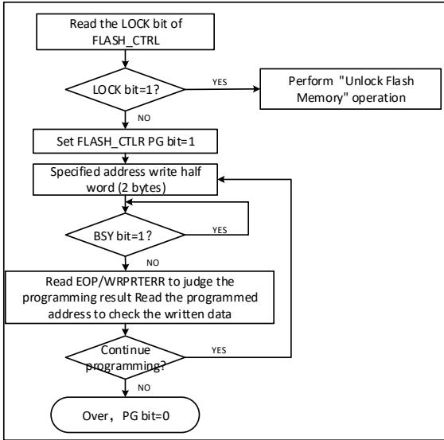  
图 16-1 FLASH 编程

1）检查FLASH_CTLR寄存器LOCK，如果为1，需要执行“解除闪存锁”操作。  
2）设置FLASH_CTLR寄存器的PG位为‘1’，开启标准编程模式。  
3）向指定闪存地址（偶地址）写入要编程的半字。  
4）等待BSY位变为‘ $" 0 "$ ’或FLASH_STATR寄存器的EOP位为‘1’表示编程结束，将EOP位清0。  
5）查询FLASH_STATR寄存器看是否有错误，或者读编程地址数据校验。  
6）继续编程可以重复3-5步骤，结束编程将PG位清0。

# 16.4.4 主存储器标准擦除

闪存可以按标准页（1K字节）擦除，也可以整片擦除。

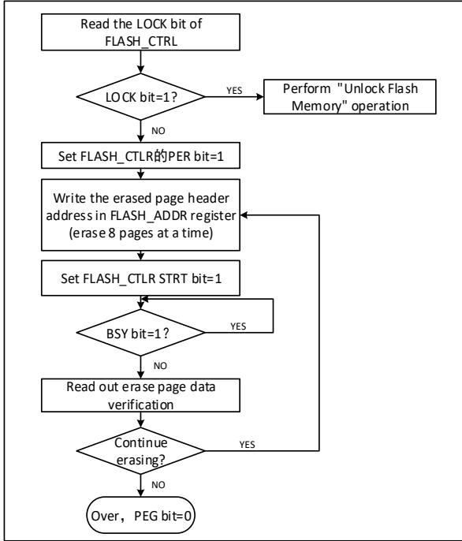  
图 16-2 FLASH 页擦除

1）检查FLASH_CTLR寄存器LOCK位，如果为1，需要执行“解除闪存锁”操作。  
2）设置 FLASH_CTLR 寄存器的 PER 位为‘1’，开启标准页擦除模式。  
3）向FLASH_ADDR寄存器写入选择擦除的页首地址。  
4）设置FLASH_CTLR寄存器的STRT位为‘1’，启动一次擦除动作。  
5）等待BSY位变为 $" 0 "$ ’或FLASH_STATR寄存器的EOP位为‘1’表示擦除结束，将EOP位清0。  
6）读擦除页的数据进行校验。  
7）继续标准页擦除可以重复3-5步骤，结束擦除将PEG位清0。  
1）检查FLASH_CTLR寄存器LOCK位，如果为1，需要执行“解除闪存锁”操作。  
2）设置FLASH_CTLR寄存器的MER位为‘1’，开启整片擦除模式。  
3）设置FLASH_CTLR寄存器的STRT位为‘1’，启动擦除动作。  
4）等待 BSY 位变为‘0’或 FLASH_STATR 寄存器的 EOP 位为‘1’表示擦除结束，将 EOP 位清 0。  
5）读擦除页的数据进行校验。  
6）将 MER 位清 0。

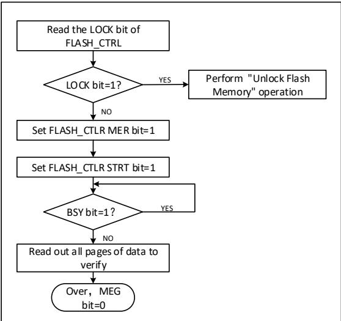  
图 16-3 FLASH 整片擦除

# 16.4.5 快速编程模式解锁

通过写入序列到 FLASH_MODEKEYR 寄存器可解锁快速编程模式操作。解锁后，FLASH_CTLR 寄存器的 FLOCK 位将清 0，表示可以进行快速擦除和编程操作。通过将 FLASH_CTLR 寄存器的“FLOCK”位软件置1来再次锁定。

解锁序列：

1）向 FLASH_MODEKEYR 寄存器写入 $\mathsf { K E Y 1 } \ = \ 0 \times 4 5 6 7 0 1 2 3$ ；  
2）向 FLASH_MODEKEYR 寄存器写入 $\mathsf { K E Y 2 } \mathrm { ~ = ~ } 0 \times \mathsf { C D E F 8 9 A B } \mathrm { ~ . ~ }$ 。上述操作必须按序并连续执行，否则属于错误操作会锁定，直到下次系统复位才能重新解锁。  
i: 1i\*#1tR1F### "LOCK" F "FLOCK" ##E.

# 16.4.6 主存储器快速编程

快速编程按页（64字节）进行编程。

1）检查FLASH_CTLR寄存器LOCK位，如果为1，需要执行“解除闪存锁”操作。  
2）检查FLASH_STATR寄存器的BSY位，以确认没有其他正在进行的编程操作。  
3）检查FLASH_CTLR寄存器FLOCK位，如果为1，需要执行“快速编程模式解锁”操作。  
4）设置FLASH_CTLR寄存器的FTPG位，开启快速编程模式功能。  
5）设置FLASH_CTLR寄存器的BUFRST位，执行清除内部64字节缓存区操作。  
6）等待BSY位变为‘0’或FLASH_STATR寄存器的EOP位为‘1’表示清除结束，将EOP位清0。  
7）向指定地址开始写入4字节数据（4字节/次操作），然后设置FLASH_CTLR寄存器的BUFLOAD位，  
执行加载到缓存区。  
8）等待BSY位变为‘0’或FLASH_STATR寄存器的EOP位为‘1’表示加载结束，将EOP位清0。  
9）重复步骤7-8共16次，将64字节数据都加载到缓存区（主要16轮操作地址要连续）。  
10）向 FLASH_ADDR 寄存器写入快速编程页的首地址。  
11）设置FLASH_CTLR寄存器的STRT位为‘1’，启动一次快速页编程动作。  
12）等待BSY位变为‘0’或FLASH_STATR寄存器的EOP位为‘1’表示编程结束，将EOP位清0。  
13）查询FLASH_STATR寄存器看是否有错误，或者读编程地址数据校验。  
14）继续快速页编程可以重复 5-13 步骤，结束编程将 FTPG 位清 0。

# 16.4.7 主存储器快速擦除

快速擦除按页（64字节）进行擦除。

1）检查FLASH_CTLR寄存器LOCK位，如果为1，需要执行“解除闪存锁”操作。  
2）检查FLASH_CTLR寄存器FLOCK位，如果为1，需要执行“快速编程模式解锁”操作。  
3）检查FLASH_STATR寄存器的BSY位，以确认没有其他正在进行的编程操作。  
4）设置FLASH_CTLR寄存器的FTER位为‘1’，开启快速页擦除（64字节）模式功能。  
5）向FLASH_ADDR寄存器写入快速擦除页的首地址。  
6）设置FLASH_CTLR寄存器的STRT位为‘1’，启动一次快速页擦除（64字节）动作。  
7）等待BSY位变为‘0’或FLASH_STATR寄存器的EOP位为‘1’表示擦除结束，将EOP位清0。  
8）查询FLASH_STATR寄存器看是否有错误，或者读擦除页地址数据校验。  
9）继续快速页擦除可以重复5-8步骤，结束擦除将FTER位清0。

# 16.5 用户选择字

用户选择字固化在FLASH中，在系统复位后会被重新装载到相应寄存器，用户可以任意的进行擦除和编程。用户选择字信息块总共有8个字节（4个字节为写保护，1个字节为读保护，1个字节为配置选项，2 个字节存储用户数据），每个位都有其反码位用于装载过程中的校验。下面描述了选择字信息结构和意义。

表16-3 32位选择字格式划分  

<table><tr><td>[31 : 24]</td><td>[23: 16]</td><td>[15:8]</td><td>[7:0]</td></tr><tr><td>j#1 XR9</td><td>j#5 1</td><td>j++# 0 X H9</td><td>j++# 0</td></tr></table>

表16-4 用户选择字信息结构  

<table><tr><td>tttt 1</td><td>[31 : 24]</td><td>[23: 16]</td><td>[15:8]</td><td>[7:0]</td></tr><tr><td>0x1FFFF800</td><td>nUSER</td><td>USER</td><td>nRDPR</td><td>RDPR</td></tr><tr><td>0x1FFFF804</td><td>nData1</td><td>Data1</td><td>nData0</td><td>Data0</td></tr><tr><td>0x1FFFF808</td><td>nWRPR1</td><td>WRPR1</td><td>nWRPRO</td><td>WRPRO</td></tr><tr><td>0x1FFFF80C</td><td>Reserved</td><td>Reserved</td><td>Reserved</td><td>Reserved</td></tr></table>

<table><tr><td colspan="3"></td><td>##it</td><td></td></tr><tr><td colspan="3">+R/# RDPR</td><td>i${R#t$J, 2ai$Wi+A1t9. 0xA5:#ut7#5yj 0xA5 (nRDP s 0x5A),* 19T#Fi$1RtP, aJi$W;</td><td>0x01</td></tr><tr><td colspan="3"></td><td>#1t(: *1iR, TaJi, 0-31 (4K) y#zJjS{Rt, T WRPR0 t#J. 1R (s1)</td><td>11b</td></tr><tr><td rowspan="6">USER</td><td>[7:6] 5</td><td>Reserved START_MODE</td><td>EAt 1: M BOOT [] 0: MM]</td><td>1</td></tr><tr><td>[4:3]</td><td>RST_MODE</td><td>i: iIATiEF#l31@#$ 51 0 #*. PD7 5IB3|A1. 00: T128us 3|A; 01: JTIA 1ms l31A;</td><td>10b</td></tr><tr><td></td><td>STANDYRSTE</td><td>10: FFIA 12ms l3|A; 11: A, PD7 10 IAE. 1#tttF31t$J: 1: TM, i##t3T1;</td><td>1</td></tr><tr><td>2</td><td>Reserved</td><td>0: , i##t*3. 1R.</td><td>1</td></tr><tr><td>1</td><td>1WDG_SW</td><td>jZiJ (1WDG) AE1#1AE2. 1: 1WDG$T, #1T; O: 1WDG T1#1F F 1WDG AA$ LS1</td><td>1</td></tr><tr><td colspan="2">0</td><td>t(#, ttLS1F) . i: iitt#stTt1, i7j1+1AE#. 11i## 2 #5.</td><td>FFFFh</td></tr><tr><td colspan="3">Data0 - Data1</td><td>S1Rt$J1. t#1Ft$J1# 1 1 (1K#/) 5R.</td><td></td></tr><tr><td colspan="3">WRPRO - WRPR3</td><td>1: iSRt; O: sRt. 2 #T1Rt#16K #1i WRPO: $ 0-7 71S1RtPt$];</td><td>FFFFh</td></tr></table>

<table><tr><td></td><td>WRP1: # 8-15 151Rt$]; WRP2: 1R; WRP3: 1RE.</td><td></td></tr></table>

# 16.5.1 用户选择字解锁

通过写入序列到 FLASH_OBKEYR 寄存器可解锁用户选择字操作。解锁后，FLASH_CTLR 寄存器的OBWRE位将置1，表示可以进行用户选择字的擦除和编程。通过将FLASH_CTLR寄存器的“OBWRE”位，软件清0来再次锁定。

解锁序列：

1）向 FLASH_OBKEYR 寄存器写入 $\mathsf { K E Y 1 } = 0 \times 4 5 6 7 0 1 2 3 \mathrm { ; }$ ；   
2）向 FLASH_OBKEYR 寄存器写入 $\mathsf { K E Y 2 } \mathrm { ~ = ~ } 0 \times \mathsf { C D E F 8 9 A B } \mathrm { ~ . ~ }$ 。   
i:FjFj#1F## "LOCK" F "OBWRE" E.

# 16.5.2 用户选择字编程

只支持标准编程方式，一次写入半字（2字节）。实际过程中，对用户选择字进行编程时，FPEC只使用半字中的低字节，并自动计算出高字节（高字节为低字节的反码），然后开始编程操作，这将保证用户选择字中的字节和它的反码始终是正确的。

1）检查FLASH_CTLR寄存器LOCK位，如果为1，需要执行“解除闪存锁”操作。  
2）检查FLASH_STATR寄存器的BSY位，以确认没有其他正在进行的编程操作。  
3）检查FLASH_CTLR寄存器OBWRE位，如果为0，需要执行“用户选择字解锁”操作。  
4）设置 FLASH_CTLR 寄存器的 OBPG 位为‘1’。  
5）写入要编程的半字（2字节）到指定地址。  
6）等待BSY位变为‘0’或FLASH_STATR寄存器的EOP位为‘1’表示编程结束，将EOP位清0。  
7）读编程地址数据校验。  
8）继续编程可以重复5-7步骤，结束编程将OBPG位清0。  
+ "" #, #HF  
tAR12x "i\$1Rfp" Z9l#Jj, JJTW\*Ht#BAR1F.

# 16.5.3 用户选择字擦除

直接擦除整个64字节用户选择字区域。

1）检查FLASH_CTLR寄存器LOCK位，如果为1，需要执行“解除闪存锁”操作。  
2）检查 FLASH_STATR 寄存器的 BSY 位，以确认没有正在进行的编程操作。  
3）检查FLASH_CTLR寄存器OBWRE位，如果为0，需要执行“用户选择字解锁”操作。  
4）设置 FLASH_CTLR 寄存器的 OBER 位为‘1’，之后设置 FLASH_CTLR 寄存器的 STAT 位为‘1’，开  
启用户选择字擦除。  
5）等待BSY位变为‘0’或FLASH_STATR寄存器的EOP位为‘1’表示擦除结束，将EOP位清0。  
6）读擦除地址数据校验。  
7）结束将 OBER 位清 0。

# 16.5.4 解除读保护

闪存是否读保护，由用户选择字决定。读取 FLASH_OBR 寄存器，当 RDPRT 位为‘1’表示当前闪存处于读保护状态，闪存操作上受到读保护状态的一系列安全防护。解除读保护过程如下：

1）擦除整个用户选择字区域，此时读保护字段RDPR，此时读保护仍然有效。2）用户选择字编程，写入正确的RDPR代码 $0 \times \mathsf { A } 5$ 以解除闪存的读保护。（此步骤首先将导致系统自动对闪存执行整片擦除操作）3）进行上电复位以重新加载选择字节（包括新的RDPR码），此时读保护被解除。

# 16.5.5 解除写保护

闪存是否写保护，由用户选择字决定。读取FLASH_WPR寄存器，每个比特位代表4K字节闪存空间，当比特位为‘1’表示非写保护状态，为‘0’表示写保护。解除写保护过程如下：

1）擦除整个用户选择字区域。  
2）写入正确的 RDPR 码 $0 \times \mathsf { A } 5$ ，允许读访问。  
3）进行系统复位，重新加载选择字节（包括新的 WRPR[3:0]字节），写保护被解除。

# 第 17章 扩展配置 （EXTEN）

# 17.1 扩展配置

系统提供了 EXTEN 扩展配置单元（EXTEN_CTR 寄存器）。该单元使用 AHB 时钟，只在系统复位执行复位动作。主要包括以下几个扩展控制位功能：

1) 调节内置电压：LDOTRIM 字段选择默认值，在调节性能和功耗时可以修改其值。  
2) Lock-up 功能监控：LKUPEN 字段启用，将打开系统的 Lock-up 情况监控，一旦发生 Lock-up 情况，系统将进行软件复位，并将LKUPRST字段置1，读取后可以写1清除此标志。  
3) 配置运算放大器：置位OPAEN，即可使能OPA，配置OPAPSEL，可选择OPA的正向输入引脚，配置OPANSEL，可选择OPA的负向输入引脚。

# 17.2 寄存器描述

表 17-1 EXTEN 相关寄存器列表  

<table><tr><td></td><td>iji@]tttt</td><td>#t</td><td></td></tr><tr><td>R32_EXTEN_CTR</td><td>0x40023800</td><td></td><td>Ox00000A00</td></tr></table>

# 17.2.1 配置扩展控制寄存器 （EXTEN_CTR）

偏移地址： $0 \times 0 0$

<table><tr><td>31</td><td>30</td><td>29</td><td>28</td><td>27</td><td>26 25</td><td>24</td><td>23</td><td>22</td><td>21</td><td>20</td><td>19</td><td>18</td><td>17</td><td>16</td></tr><tr><td></td><td></td><td></td><td></td><td></td><td colspan="2">Reserved</td><td></td><td></td><td></td><td></td><td></td><td>OPA PSE L</td><td>OPA NSE L</td><td>OPA EN</td></tr><tr><td>15</td><td>14 13</td><td colspan="2">12</td><td>11 10</td><td>9</td><td>8</td><td>7</td><td>6</td><td>5</td><td>4</td><td>3</td><td>2</td><td>1</td><td>0</td></tr><tr><td colspan="4">Reserved</td><td>LD0_1 RIM</td><td>Reserved</td><td>LKUP RST</td><td>LKUP EN</td><td></td><td colspan="2"></td><td>Reserved</td><td></td><td></td></tr></table>

<table><tr><td>1</td><td></td><td></td><td>#it</td><td></td></tr><tr><td>[31: 19]</td><td>Reserved</td><td>RO</td><td>1R.</td><td>0</td></tr><tr><td>18</td><td>OPAPSEL</td><td>RW</td><td>OPA E#i. 0: E0; 1: E#i1.</td><td>0</td></tr><tr><td>17</td><td>OPANSEL</td><td>RW</td><td>OPA Hi#i#i. 0: 0 1: 1.</td><td>0</td></tr><tr><td>16</td><td>OPAEN</td><td>RW</td><td>OPA 1AE. 1: #TTAE; O: i OPA.</td><td>0</td></tr><tr><td>[15:11]</td><td>Reserved</td><td>RO</td><td>1*.</td><td>0</td></tr><tr><td>10</td><td>LDOTRIME</td><td>RW</td><td>A+. 0: I#;</td><td>0</td></tr><tr><td>[9:8]</td><td>Reserved</td><td>RO</td><td>1: #. 1R.</td><td>0</td></tr></table>

<table><tr><td>7</td><td>LKUPRST</td><td>RW1</td><td>LOCKUP $. 1:  LOCKUP, 51; 0: I.</td><td>0</td></tr><tr><td>6</td><td>LKUPEN</td><td>RW</td><td>LOCKUP ;JIJAE. 1: , 3 1ock-up #1 LOCKUP_RST 1Z; O: TA.</td><td>0</td></tr><tr><td>[5:0]</td><td>Reserved</td><td>RO</td><td>1R.</td><td>0</td></tr></table>

# 第 18章 调试支持 （DBG）

# 18.1 主要特征

此寄存器允许在调试状态下配置MCU。包括：

$\bullet$ 支持独立看门狗（IWDG）的计数器$\bullet$ 支持窗口看门狗（WWDG）的计数器$\bullet$ 支持定时器1的计数器  
$\bullet$ 支持定时器2的计数器

# 18.2 寄存器描述

18.2.1 调试 MCU 配置寄存器（DBGMCU_CR）地址： $0 \times 7 0 0$ (CSR)

<table><tr><td>31</td><td>30</td><td>29</td><td>28</td><td>27</td><td>26 25</td><td>24</td><td>23</td><td></td><td>22</td><td>21</td><td>20</td><td>19</td><td>18</td><td>17</td><td>16</td></tr><tr><td colspan="14"></td></tr><tr><td>15</td><td>14</td><td>13</td><td>12</td><td>11</td><td>10</td><td>9</td><td>8</td><td>Reserved 7</td><td>6</td><td>5</td><td>4</td><td>3</td><td>2</td><td>1</td><td></td></tr><tr><td>Reserved</td><td></td><td>T IM2 STOP</td><td>T IM1 STOP</td><td>Reserved</td><td></td><td>WWDG STOP</td><td>1WDG STOP</td><td></td><td></td><td>Reserved</td><td></td><td>BY</td><td>STANDReser ved</td><td>SLEEP</td><td></td></tr></table>

<table><tr><td>1</td><td></td><td></td><td>#it</td><td></td></tr><tr><td>[31:14]</td><td>Reserved</td><td>RW</td><td>1R</td><td>0</td></tr><tr><td>13</td><td>T IM2_STOP</td><td>RW</td><td>A 2 iit{. i#Xi#iti# $tI1F. 1: 2 #I1F; 0: 2iEI1F.</td><td>0</td></tr><tr><td>12</td><td>T1M1_STOP</td><td>RW</td><td>Af1 iit. ti#AiitAi# tI1F. 1: 1I1F;</td><td>0</td></tr><tr><td>[10:11]Reserved</td><td></td><td>RW</td><td>0: 1iEI1F. 1R</td><td>0</td></tr><tr><td>9</td><td>WWDG_STOP</td><td>RW</td><td>iiit. i#Xi#iti itiI1F. 1: ii#IF; 0 iEI1F.</td><td>0</td></tr><tr><td>8</td><td>1WDG_STOP</td><td>RW</td><td>Jiiit. ^i#Xi#itA ij1EI1F. 1: i#I1F;</td><td>0</td></tr><tr><td>[7:3]</td><td>Reserved</td><td>RW</td><td>0: ii#E#IF. 1R iit+ltt1.</td><td>0</td></tr><tr><td>2</td><td>STANDBY</td><td>RW</td><td>1: (FCLKJF, HCLKJF)#$TT, FCLK FA HCLKA$RL%1#A$ 3 t$Ji#31*i STANDBY ttF</td><td>0</td></tr></table>

<table><tr><td></td><td></td><td></td><td>1tAJ; 0: (FCLK, HCLK)*#B. M#1#A3l i STANDBYttS1# A7#y7$JJ STANDBY</td><td></td></tr><tr><td>1</td><td>Reser ved</td><td>RW</td><td>i). 1R.</td><td>0</td></tr><tr><td>0</td><td>SLEEP</td><td>RW</td><td>iit#Rtt1. 1: (FCLK FF, HCLK FF)A#ARttAj, FCLK FA HCLK A$F$#; O: (FCLKF, HCLK)A@AR, FCLK eC$# HCLK ] FA#R tstT1E2tFAJAf$#3t#Rt sij, #T##2A$3</td><td>0</td></tr></table>
