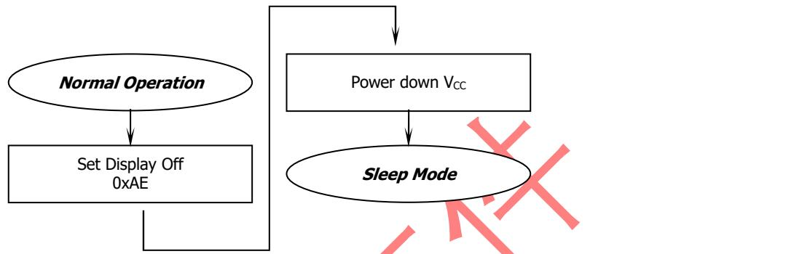

# Product Specification

Part Name: OEL Display Module  Customer Part ID: Newvision Part ID: N042- 7240TSWEG01- H16  Ver: A

Newvision technology Co.,Ltd.

Notes:

1. Please contact Newvision technology Co.,Ltd. before assigning your product based on this module specification  
2. The information contained herein is presented merely to indicate the characteristics and performance of our products. No responsibility is assumed by Newvision technology Co.,Ltd. for any intellectual property claims or other problems that may result from application based on the module described herein.

# Revised History

<table><tr><td>Part Number</td><td>Revision</td><td>Revision Content</td><td>Revised on</td></tr><tr><td>N042-7240TSWEG01-H16</td><td>A</td><td>New</td><td>20190515</td></tr><tr><td></td><td></td><td></td><td></td></tr><tr><td></td><td></td><td></td><td></td></tr><tr><td></td><td></td><td>交控文件</td><td></td></tr></table>

# Contents

# Revision History

# Contents

# 1. Basic Specifications

1.1 Display Specifications  1.2 Mechanical Specifications  1.3 Active Area / Memory Mapping & Pixel Construction  1.4 Mechanical Drawing  1.5 Pin Definition

# 2. Absolute Maximum Ratings

# 3. Optics & Electrical Characteristics

3.1 Optics Characteristics  3.2 DC Characteristics  3.3 AC Characteristics

3.3.1.1 I2C Interface Characteristics  3.3.1.2 I2C Interface with Internal Charge Pump  3.3.2.1 Serial Interface Timing Characteristics: (4- wire SPI)  3.3.2.2 4- wire Serial Interface with Internal Charge Pump

# 4. Functional Specification

4.1 Commands

4.2 Power down and Power up Sequence  4.2.1 Power up Sequence  4.2.2 Power down Sequence

4.3 Reset Circuit

4.4 Actual Application Example  4.4.1 VCC Supplied Externally  4.4.2 VCC Generated by Internal DC/DC Circuit

# 5. Reliability

5.1 Contents of Reliability Tests  5.2 Failure Check Standard

# 6. Outgoing Quality Control Specifications

6.1 Environment Required  6.2 Sampling Plan  6.3 Criteria & Acceptable Quality Level  6.3.1 Cosmetic Check (Display Off) in Non- Active Area  6.3.2 Cosmetic Check (Display Off) in Active Area  6.3.3 Pattern Check (Display On) in Active Area

# 7. Package Specifications

# 8. Precautions When Using These OEL Display Modules

8.1 Handling Precautions  8.2 Storage Precautions  8.3 Designing Precautions  8.4 Precautions when disposing of the OEL display modules  8.5 Other Precautions

# Warranty Notice

# 1. Basic Specifications

# 1.1 Display Specifications

1.1 Display Specifications1) Display Mode: Passive Matrix2) Display Color: Monochrome (White)3) Drive Duty: 1/40 Duty

# 1.2 Mechanical Specifications

1.2 Mechanical Specifications1) Outline Drawing: According to the annexed outline drawing2) Number of Pixels:  $72 \times 40$ 3) Panel Size:  $12 \times 11 \times 1.2$  (mm)4) Active Area:  $9.196 \times 5.18$  (mm)5) Pixel Pitch:  $0.128 \times 0.13$  (mm)6) Pixel Size:  $0.108 \times 0.11$  (mm)7) Weight: TBD

# 1.3 Active Area / Memory Mapping & Pixel Construction

# 1.5 Pin Definition

<table><tr><td>Pin Number</td><td>Symbol</td><td>I/O</td><td>Function</td></tr><tr><td colspan="4">Power Supply</td></tr><tr><td>7</td><td>VDD</td><td>P</td><td>Power Supply for Logic
This is a voltage supply pin. It must be connected to external source.</td></tr><tr><td>6</td><td>VSS</td><td>P</td><td>Ground of Logic Circuit
This is a ground pin. It acts as a reference for the logic pins. It must be connected to external ground.</td></tr><tr><td>16</td><td>VCC</td><td>P</td><td>Power Supply for OEL Panel
This is the most positive voltage supply pin of the chip. A stabilization capacitor should be connected between this pin and VSS when the converter is used. It must be connected to external source when the converter is not used.</td></tr><tr><td colspan="4">Driver</td></tr><tr><td>15</td><td>VCOMH</td><td>O</td><td>Voltage Output High Level for COM Signal
This pin is the input pin for the voltage output high level for COM signals. A capacitor should be connected between this pin and VSS.</td></tr><tr><td colspan="4">DC/DC Converter</td></tr><tr><td>5</td><td>VBAT</td><td>P</td><td>Power Supply for DC/DC Converter Circuit
This is the power supply pin for the internal buffer of the DC/DC voltage converter. It must be connected to VDD when the converter is not used. It should be connected to VDD when the converter is not used.</td></tr><tr><td>3/4
1/2</td><td>C1P / C1N
C2P / C2N</td><td>I</td><td>Positive Terminal of the Flying Inverting Capacitor
Negative Terminal of the Flying Boost Capacitor
The charge-pump capacitors are required between the terminals. They must be floated when the converter is not used.</td></tr><tr><td colspan="4">Interface</td></tr><tr><td>10</td><td>RES#</td><td>I</td><td>Power Reset for Controller and Driver
This pin is reset signal input. When the pin is low, initialization of the chip is executed. Keep this pin pull high during normal operation.</td></tr><tr><td rowspan="5">8</td><td rowspan="5">BS1</td><td rowspan="5">I</td><td>Communicating Protocol Select
These pins are MCU interface selection input. See the following table:</td></tr><tr><td>BS1</td></tr><tr><td>1</td></tr><tr><td>4-wire SPI</td></tr><tr><td>0</td></tr><tr><td>9</td><td>CS</td><td>I</td><td>Chip Select
This pin is the chip select input. The chip is enabled for MCU communication only when CS# is pulled low.</td></tr><tr><td>11</td><td>DC</td><td>I</td><td>Data/Command Control
This pin is Data/Command control pin. When the pin is pulled high, the input at D7~D0 is treated as display data. When the pin is pulled low, the input at D7~D0 will be transferred to the command register. When the pin is pulled high and serial interface mode is selected, the data at SDIN will be interpreted as data. When it is pulled low, the data at SDIN will be transferred to the command register. In I2C mode, this pin acts as SA0 for slave address selection. For detail relationship to MCU interface signals, please refer to the Timing Characteristics Diagrams.</td></tr><tr><td>12~14</td><td>D0,D1,D2</td><td>I</td><td>Host Data Input/Output Bus
When serial mode is selected, D1 will be the serial data input SDIN and D0 will be the serial clock input SCLK. When I2C mode is selected, D2 &amp;amp; D1 should be tired together and serve as SDAout &amp;amp; SDAin in application and D0 is the serial clock input SCL.</td></tr></table>

# 2. Absolute Maximum Ratings

<table><tr><td>Parameter</td><td>Symbol</td><td>Min</td><td>Max</td><td>Unit</td><td>Notes</td></tr><tr><td>Supply Voltage for Logic</td><td>VDD</td><td>-0.3</td><td>4</td><td>V</td><td>1, 2</td></tr><tr><td>Supply Voltage for Display</td><td>VCC</td><td>0</td><td>16</td><td>V</td><td>1, 2</td></tr><tr><td>Supply Voltage for DC/DC
(Internal DC/DC Enable)</td><td>Vbat</td><td>-0.3</td><td>4.3</td><td>V</td><td>1, 2</td></tr><tr><td>Operating Temperature</td><td>TOP</td><td>-40</td><td>85</td><td>℃</td><td></td></tr><tr><td>Storage Temperature</td><td>TSTG</td><td>-40</td><td>85</td><td>℃</td><td>3</td></tr><tr><td>Life Time (120 cd/m2)</td><td></td><td>10,000</td><td>-</td><td>hour</td><td>4</td></tr><tr><td>Life Time (80 cd/m2)</td><td></td><td>30,000</td><td>-</td><td>hour</td><td>4</td></tr><tr><td>Life Time (60 cd/m2)</td><td></td><td>50,000</td><td>-</td><td>hour</td><td>4</td></tr></table>

Note 1: All the above voltages are on the basis of  $\mathrm{V}_{\mathrm{SS}} = 0\mathrm{V}$ . Note 2: When this module is used beyond the above absolute maximum ratings, permanent breakage of the module may occur. Also, for normal operations, it is desirable to use this module under the conditions according to Section 3. "Optics & Electrical Characteristics". If this module is used beyond these conditions, malfunctioning of the module can occur and the reliability of the module may deteriorate. Note 3: The defined temperature ranges do not include the polarizer. The maximum withstood temperature of the polarizer should be  $80^{\circ}\mathrm{C}$ . Note 4:  $V_{\mathrm{CC}} = 7.25\mathrm{V}$ ,  $T_{\mathrm{a}} = 25^{\circ}\mathrm{C}$ , 50% Checkerboard. Software configuration follows Section 4.4 Initialization. End of lifetime is specified as 50% of initial brightness reached. The average operating lifetime at room temperature is estimated by the accelerated operation at high temperature conditions.

# 3. Optics & Electrical Characteristics

# 3.1 Optics Characteristics

<table><tr><td>Characteristics</td><td>Symbol</td><td>Conditions</td><td>Min</td><td>Typ</td><td>Max</td><td>Unit</td></tr><tr><td>Brightness
(Vcc Supplied Externally)</td><td>Lbr</td><td>Note 5</td><td>360</td><td>-</td><td>-</td><td>cd/m²</td></tr><tr><td>Brightness
(Vcc Generated by Internal DC/DC)</td><td>Lbr</td><td>Note 6</td><td>360</td><td>430</td><td>-</td><td>cd/m²</td></tr><tr><td rowspan="2">C.I.E. (White)</td><td>(x)</td><td rowspan="2">C.I.E. 1931</td><td>0.28</td><td>0.32</td><td>0.36</td><td></td></tr><tr><td>(y)</td><td>0.31</td><td>0.35</td><td>0.39</td><td></td></tr><tr><td>Dark Room Contrast</td><td>CR</td><td></td><td>-</td><td>2000:1</td><td>-</td><td></td></tr><tr><td>Viewing Angle</td><td></td><td></td><td>-</td><td>Free</td><td>-</td><td>degree</td></tr></table>

\*Optical measurement taken at  $\mathsf{V}_{\mathsf{DD}} = 2.8\mathsf{V},$ $\mathsf{V}_{\mathsf{CC}} = 9\mathsf{V}.$  Software configuration follows Section 4.4 Initialization.

# 3.2 DC Characteristics

<table><tr><td>Characteristics</td><td>Symbol</td><td>Conditions</td><td>Min</td><td>Typ</td><td>Max</td><td>Unit</td></tr><tr><td>Supply Voltage for Logic</td><td>VDD</td><td></td><td>1.65</td><td>2.8</td><td>3.3</td><td>V</td></tr><tr><td>Supply Voltage for Display (Supplied Externally)</td><td>VCC</td><td>Note 5 (Internal DC/DC Disable)</td><td>8.5</td><td>9</td><td>9.5</td><td>V</td></tr><tr><td>Supply Voltage for DC/DC</td><td>VBAT</td><td>Internal DC/DC Enable</td><td>3.5</td><td>-</td><td>4.2</td><td>V</td></tr><tr><td>Supply Voltage for Display (Generated by Internal DC/DC)</td><td>VCC</td><td>Note 6 (Internal DC/DC Enable)</td><td>-</td><td>9</td><td>-</td><td>V</td></tr><tr><td>High Level Input</td><td>VTH</td><td>IOUT = 100μA, 3.3MHz</td><td>0.8×VDD</td><td>-</td><td>VDD</td><td>V</td></tr><tr><td>Low Level Input</td><td>VL</td><td>IOUT = 100μA, 3.3MHz</td><td>0</td><td>-</td><td>0.2×VDD</td><td>V</td></tr><tr><td>High Level Output</td><td>VOH</td><td>IOUT = 100μA, 3.3MHz</td><td>0.9×VDD</td><td>-</td><td>VDD</td><td>V</td></tr><tr><td>Low Level Output</td><td>VOL</td><td>IOUT = 100μA, 3.3MHz</td><td>0</td><td>-</td><td>0.1×VDD</td><td>V</td></tr><tr><td>Operating Current for VDD</td><td>IDD</td><td></td><td>-</td><td>180</td><td>300</td><td>μA</td></tr><tr><td>Operating Current for VCC (VCC Supplied Externally)</td><td>ICC</td><td>Note 7</td><td>-</td><td>5</td><td>10</td><td>mA</td></tr><tr><td>Operating Current for VBAT (VCC Generated by Internal DC/DC)</td><td>IBAT</td><td>Note 8</td><td>-</td><td>22</td><td>25</td><td>mA</td></tr><tr><td>Sleep Mode Current for VDD</td><td>IDD, SLEEP</td><td></td><td>-</td><td>1</td><td>5</td><td>μA</td></tr><tr><td>Sleep Mode Current for VCC</td><td>ICC, SLEEP</td><td></td><td>-</td><td>2</td><td>10</td><td>μA</td></tr></table>

Note 5 & 6: Brightness  $(\mathsf{L}_{\mathsf{Br}})$  and Supply Voltage for Display  $(V_{CC})$  are subject to the change of the panel characteristics and the customer's request. Note 7:  $\mathsf{V}_{\mathsf{DD}} = 2.8\mathsf{V},$ $V_{CC} = 9V,$ $100\%$  Display Area Turn on. Note 8:  $V_{DD} = 2.8V,V_{CC} = 9V,$ $100\%$  Display Area Turn on. \* Software configuration follows Section 4.4 Initialization.

# 3.3 AC Characteristics

# 3.3.1.1 I2C Interface Timing Characteristics

<table><tr><td>Symbol</td><td>Description</td><td>Min</td><td>Max</td><td>Unit</td></tr><tr><td>tcycle</td><td>Clock Cycle Time</td><td>2.5</td><td>-</td><td>μs</td></tr><tr><td>tSTART</td><td>Start Condition Hold Time</td><td>0.6</td><td>-</td><td>μs</td></tr><tr><td rowspan="2">tHD</td><td>Data Hold Time (for &quot;SDAOUT&quot; Pin)</td><td>0</td><td rowspan="2">-</td><td rowspan="2">ns</td></tr><tr><td>Data Hold Time (for &quot;SDAIN&quot; Pin)</td><td>300</td></tr><tr><td>tSD</td><td>Data Setup Time</td><td>100</td><td>-</td><td>ns</td></tr><tr><td>tSTART</td><td>Start Condition Setup Time
(Only relevant for a repeated Start condition)</td><td>0.6</td><td>-</td><td>μs</td></tr><tr><td>tSTOP</td><td>Stop Condition Setup Time</td><td>0.6</td><td>-</td><td>μs</td></tr><tr><td>tR</td><td>Rise Time for Data and Clock Pin</td><td></td><td>300</td><td>ns</td></tr><tr><td>tF</td><td>Fall Time for Data and Clock Pin</td><td></td><td>300</td><td>ns</td></tr><tr><td>tIDLE</td><td>Idle Time before a New Transmission can Start</td><td>1.3</td><td>-</td><td>μs</td></tr></table>

\*  $(\mathsf{V}_{\mathsf{DD}}\textrm{-}\mathsf{V}_{\mathsf{SS}} = 1.65\mathsf{V}$  to3.3V  $T_{a} = 25^{\circ}C$

# 3.3.1.2 I2C Interface with Internal Charge Pump

特别提醒(Special Tips): 主板设计务必加电子开关, 否则, 可能引起漏电流现象(When design main board, Please add Electronic Switch circuit, otherwise, will be caused leak current)

# Recommended Components

Recommended Components:C1,: 0.1μF / 6.3V X5R  C2: 4.7μF / 6.3V X5R  C3: 2.2μF / 16V, X7R  C4: 4.7μF / 16V, X7R  C5: 0.1μF / 16V, X7R  C6, C7: 1μF / 16V, X7R  R2, R1: 47kΩ  R4, R3: 4.7kΩ  Q1: FDN338P  Q2: FDN335N  Notes:  VDD: 1.65~3.3V, it should be equal to MPU I/O voltage.  VBAT_in: 3.5~4.2V

* VBAT will be connected to VDD when VCC be connected to external source (9V).

# 3.3.2.1 Serial Interface Timing Characteristics: (4-wire SPI)

<table><tr><td>Symbol</td><td>Description</td><td>Min</td><td>Max</td><td>Unit</td></tr><tr><td>tcycle</td><td>Clock Cycle Time</td><td>100</td><td>-</td><td>ns</td></tr><tr><td>tAS</td><td>Address Setup Time</td><td>15</td><td>-</td><td>ns</td></tr><tr><td>tAH</td><td>Address Hold Time</td><td>15</td><td>-</td><td>ns</td></tr><tr><td>tCSS</td><td>Chip Select Setup Time</td><td>20</td><td>-</td><td>ns</td></tr><tr><td>tCSH</td><td>Chip Select Hold Time</td><td>10</td><td>-</td><td>ns</td></tr><tr><td>tDSW</td><td>Write Data Setup Time</td><td>15</td><td>-</td><td>ns</td></tr><tr><td>tDHW</td><td>Write Data Hold Time</td><td>15</td><td>-</td><td>ns</td></tr><tr><td>tCLKL</td><td>Clock Low Time</td><td>20</td><td>-</td><td>ns</td></tr><tr><td>tCLKH</td><td>Clock High Time</td><td>20</td><td>-</td><td>ns</td></tr><tr><td>tR</td><td>Rise Time</td><td>-</td><td>40</td><td>ns</td></tr><tr><td>tF</td><td>Fall Time</td><td>-</td><td>40</td><td>ns</td></tr></table>

\*  $(\mathsf{V}_{\mathsf{DD}}\textrm{- }\mathsf{V}_{\mathsf{SS}} = 1.65\mathsf{V}$  to  $3.3V_{r}$ $\mathsf{T}_{\mathsf{a}} = 25^{\circ}\mathsf{C})$

# 3.3.2.2 4-wire Serial Interface with Internal Charge Pump

特别提醒(Special Tips):主板设计务必加电子开关，否则，可能引起漏电流现象

(When design main board, Please add Electronic Switch circuit, otherwise, will be caused leak current)

* VBAT will be connected to VDD when VCC be connected to external source (9V).

# 4.Functional Specification

# 4.1 Commands

Refer to the Technical Manual for the SSD1306

# 4.2 Power down and Power up Sequence

To protect OEL panel and extend the panel life time, the driver IC power up/down routine should include a delay period between high voltage and low voltage power sources during turn on/off. It gives the OEL panel enough time to complete the action of charge and discharge before/after the operation.

# 4.2.1 Power up Sequence

1. Power up VDD
2. Send Display off command
3. Initialization
4. Clear Screen
5. Power up Vcc/VBAT
6. Delay 100ms (When Vcc is stable)
7. Send Display on command

# 4.2.2 Power down Sequence

1. Send Display off command
2. Power down Vcc /VBAT
3. Delay 100ms (When Vcc /VBAT is reach 0 and panel is completely discharges)
4. Power down VDD

Note 13:

1) Since an ESD protection circuit is connected between  $V_{DD}$  and  $V_{CC}$  inside the driver IC,  $V_{CC}$  becomes lower than  $V_{DD}$  whenever  $V_{DD}$  is ON and  $V_{CC}$  is OFF.
2) $V_{CC} / V_{BAT}$  should be kept float (disable) when it is OFF.
3) Power Pins  $(V_{DD},V_{CC},V_{BAT})$  can never be pulled to ground under any circumstance.
4) $V_{DD}$  should not be power down before  $V_{CC} / V_{BAT}$  power down.

# 4.3 Reset Circuit

When RES# input is low, the chip is initialized with the following status:

1. Display is OFF
2. $128\times 64$  Display Mode
3. Normal segment and display data column and row address mapping (SEG0 mapped to column address 00h and COM0 mapped to row address 00h)
4. Shift register data clear in serial interface
5. Display start line is set at display RAM address 0
6. Column address counter is set at 0
7. Normal scan direction of the COM outputs
8. Contrast control register is set at 7Fh
9. Normal display mode (Equivalent to A4h command)

# 4.4 Actual Application Example

Command usage and explanation of an actual example

4.4.1 Vcc Supplied Externally

If the noise is accidentally occurred at the displaying window during the operation, please reset the display in order to recover the display function.

# <Power down Sequence>

# <Exiting Sleep Mode>

# <Exiting Sleep Mode>

External setting void SSD1306(){

write_i(0xAF); /*display off*/write_i(0xD5); /*set osc division*/write_i(0xF0);write_i(0xA8); /*multiplex ratio*/write_i(0x27); /*duty = 1/40*/write_i(0xD3); /*set display offset*/

write_i(0x00); write_i(0x40); /*Set Display Start Line*/ write_i(0x8d); /*Set charge pump enable*/ write_i(0x10); write_i(0x20); /*Set page address mode*/ write_i(0x02); write_i(0xA1); /*Set segment remap*/ write_i(0xC8); /*Set scan direction*/ write_i(0xDA); /*Set COM pins*/ write_i(0x12); write_i(0xAD); /*Internal IREF Setting*/ write_i(0x30); write_i(0x81); /*Contract control*/ write_i(0xFF); /*128*/ write_i(0xD9); /*Set pre- charge period*/ write_i(0x22); write_i(0xdb); /*Set vcomh*/ write_i(0x20); write_i(0xA4); /*Set Entire Display On/Off*/ write_i(0xA6); /*Normal / reverse*/ write_i(0x0C); /*Set lower column address*/ write_i(0x11); /*Set higher column address*/ write_i(0xAF); /*Display ON*/

# I2C Mode

void write_w(unsigned char dat) { unsigned char m,da; unsigned char j; da  $\equiv$  dat; for  $\mathrm{(j = 0;j< 8;j + + )}$  {  $\mathsf{m} = \mathsf{da};$ $\mathsf{SCL} = 0$ $\mathsf{m} = \mathsf{m}\& 0\times 80;$  if  $(m = =0\times 80)$  {  $\mathsf{SDA} = 1$  } else {  $\mathsf{SDA} = 0;$  }  $\mathsf{da} = \mathsf{da} < < 1;$ $\mathsf{SCL} = 1$  }  $\mathsf{SCL} = 0$ $\mathsf{SCL} = 1$  } void write_i(unsigned char ins) { start(); write_w(0x78); write_w(0x00); write_w(ins); stop(); } void write_d(unsigned char dat) { start(); write_w(0x78); write_w(0x40); write_w(dat); stop(); } void start() {  $\mathsf{SCL} = 1$ $\mathsf{SDA} = 1$ $\mathsf{SDA} = 0$ $\mathsf{SCL} = 0$

}

void stop() { SCL  $= 0$ $\mathsf{SDA} = 0$ $\mathsf{SDA} = 1$ $\mathsf{SCL} = 1$  }

# 4-wire SPI Mode

void write_i(unsigned char ins)

{ unsigned char m,da; unsigned int j;  $\mathsf{DC} = 0;$ $\mathsf{CS} = 0;$ $\mathrm{da} = \mathrm{ins};$  for  $\mathrm{(j = 0;j< 8;j + + )}$  {  $\mathsf{m} = \mathsf{da};$ $\mathsf{SCL} = 0;$ $\mathsf{m} = \mathsf{m}\& 0\times 80;$  if  $(m = =0\times 80)$  {  $\mathsf{SDA} = 1$  } else {  $\mathsf{SDA} = 0;$  }  $\mathsf{da} = \mathsf{da}< < 1;$ $\mathsf{SCL} = 1$  }  $\mathsf{CS} = 1$  } void write_d(unsigned char dat) { unsigned char m,da; unsigned int j;  $\mathsf{DC} = 1$ $\mathsf{CS} = 0;$ $\mathrm{da} = \mathrm{dat};$  for  $\mathrm{(j = 0;j< 8;j + + )}$  {

$\mathsf{m} = \mathsf{da};$ $\mathsf{SCL} = 0$ $\mathsf{m} = \mathsf{m}\& 0\mathsf{x}80;$  if  $(m = =0\times 80)$  {  $\mathsf{SDA} = 1$  } else {  $\mathsf{SDA} = 0;$  }  $\mathsf{da} = \mathsf{da}< < 1;$ $\mathsf{SCL} = 1$  }  $\mathsf{CS} = 1$  } void delay(unsigned int t) { while  $(t > 0)$  { t- - ; } }

# 4.4.2 Vcc Generated by Internal DC/DC Circuit

If the noise is accidentally occurred at the displaying window during the operation, please reset the display in order to recover the display function.

# <Power down Sequence>

Internal setting (Charge pump)  void SSD1306()  {      RES=0;      delay(1000);      RES=1;      delay(1000);      write_i(OxAE); /*display off*/      write_i(OxD5); /*set osc division*/      write_i(OxF0);  }

write_i(0xA8); /*multiplex ratio*/  write_i(0x27); /*duty = 1/40*/  write_i(0xD3); /*set display offset*/  write_i(0x00);  write_i(0x40); /*Set Display Start Line*/  write_i(0x8d); /*set charge pump enable*/  write_i(0x95);  write_i(0x20); /*Set page address mode*/  write_i(0x02);  write_i(0xA1); /*set segment remap*/  write_i(0xC8); /*Com scan direction*/  write_i(0xDA); /*set COM pins*/  write_i(0x12);  write_i(0xAD); /*Internal IREF Setting*/  write_i(0x30);  write_i(0x81); /*contract control*/  write_i(0xFF); /*128*/  write_i(0xD9); /*set pre- charge period*/  write_i(0x22);  write_i(0xdb); /*set vcomh*/  write_i(0x20);  write_i(0xA4); /*Set Entire Display On/Off*/  write_i(0xA6); /*normal / reverse*/  write_i(0x0C); /*set lower column address*/  write_i(0x11); /*set higher column address*/  write_i(0xAF); /*display ON*/  }

# I2C Mode

void write_w(unsigned char dat) { unsigned char m,da; unsigned char j; da  $\equiv$  dat; for  $\mathrm{(j = 0;j< 8;j + + )}$  {  $\mathsf{m} = \mathsf{da};$ $\mathsf{SCL} = 0$ $\mathsf{m} = \mathsf{m}\& 0\times 80;$  if  $(m = =0\times 80)$  {  $\mathsf{SDA} = 1$  } else {  $\mathsf{SDA} = 0;$ $\}$ $\mathsf{da} = \mathsf{da} < < 1;$ $\mathsf{SCL} = 1$  }  $\mathsf{SCL} = 0$ $\mathsf{SCL} = 1$  } void write_i(unsigned char ins) { start(); write_w(0x78); write_w(0x00); write_w(ins); stop(); } void write_d(unsigned char dat) { start(); write_w(0x78); write_w(0x40); write_w(dat); stop(); } void start() {  $\mathsf{SCL} = 1$ $\mathsf{SDA} = 1$

SDA=0;  SCL=0;  }  void stop()  {      SCL=0;      SDA=0;      SDA=1;      SCL=1;  }

# 4- wire SPI Mode

void write_i(unsigned char ins)

{ unsigned char m,da; unsigned int j;  $\mathbb{DC} = 0$ $\cos = 0$ $\mathtt{da} = \mathtt{ins};$  for  $\mathrm{(j = 0;j< 8;j + + )}$  {  $\mathsf{m} = \mathsf{da};$ $\mathsf{SCL} = 0$ $\mathsf{m} = \mathsf{m}\& 0\times 80;$  if  $(m = =0\times 80)$  {  $\mathsf{SDA} = 1$  } else {  $\mathsf{SDA} = 0;$  }  $\mathtt{da} = \mathtt{da}< < 1;$ $\mathsf{SCL} = 1$  }  $\mathsf{CS} = 1$  } void write_d(unsigned char dat) { unsigned char m,da; unsigned int j;  $\mathbb{DC} = 1$ $\cos = 0$ $\mathtt{da} = \mathtt{dat};$

for  $\mathrm{(j = 0;j< 8;j + + )}$  {  $\mathsf{m} = \mathsf{da}$ $\mathsf{SCL} = 0$  .  $\mathsf{m} = \mathsf{m}\& 0\times 80;$  if  $(m = =0\times 80)$  {  $\mathsf{SDA} = 1$  } else {  $\mathsf{SDA} = 0;$  }  $\mathsf{da} = \mathsf{da} < < 1;$ $\mathsf{SCL} = 1$  }  $\mathsf{CS} = 1$  } void delay(unsigned int t) { while  $(t > 0)$  { t- ; } }

# 5. Reliability

# 5.1 Contents of Reliability Tests

<table><tr><td>Item</td><td>Conditions</td><td>Criteria</td></tr><tr><td>High Temperature Operation</td><td>70℃, 240 hrs</td><td rowspan="6">The operational functions work.</td></tr><tr><td>Low Temperature Operation</td><td>-40℃, 240 hrs</td></tr><tr><td>High Temperature Storage</td><td>85℃, 240 hrs</td></tr><tr><td>Low Temperature Storage</td><td>-40℃, 240 hrs</td></tr><tr><td>High Temperature/Humidity Operation</td><td>60℃, 90% RH, 120 hrs</td></tr><tr><td>Thermal Shock</td><td>-40℃ ↔ 85℃, 24 cycles
60 mins dwell</td></tr></table>

\* The samples used for the above tests do not include polarizer. \* No moisture condensation is observed during tests.

# 5.2 Failure Check Standard

After the completion of the described reliability test, the samples were left at room temperature for 2 hrs prior to conducting the failure test at  $23 \pm 5^{\circ} \mathrm{C}$ ;  $55 \pm 15\%$  RH.

# 6. Outgoing Quality Control Specifications

# 6.1 Environment Required

Customer's test & measurement are required to be conducted under the following conditions:

Temperature:  $23\pm 5^{\circ}C$  Humidity:  $55\pm 15\%$  RH Fluorescent Lamp: 30W Distance between the Panel & Lamp:  $\geq 50cm$  Distance between the Panel & Eyes of the Inspector:  $\geq 30cm$  Finger glove (or finger cover) must be worn by the inspector. Inspection table or jig must be anti- electrostatic.

# 6.2 Sampling Plan

Level II, Normal Inspection, Single Sampling, MIL- STD- 105E

# 6.3 Criteria & Acceptable Quality Level

<table><tr><td>Partition</td><td>AQL</td><td>Definition</td></tr><tr><td>Major</td><td>0.65</td><td>Defects in Pattern Check (Display On)</td></tr><tr><td>Minor</td><td>1.0</td><td>Defects in Cosmetic Check (Display Off)</td></tr></table>

# 6.3.1 Cosmetic Check (Display Off) in Non-Active Area

<table><tr><td>Check Item</td><td>Classification</td><td>Criteria</td></tr><tr><td rowspan="5">Panel General Chipping</td><td rowspan="5">Minor</td><td>X &amp;gt; 6 mm (Along with Edge)
Y &amp;gt; 1 mm (Perpendicular to edge)</td></tr><tr><td>X</td></tr><tr><td>Y</td></tr><tr><td>X</td></tr><tr><td>Y</td></tr></table>

6.3.1 Cosmetic Check (Display Off) in Non-Active Area (Continued)  

<table><tr><td>Check Item</td><td>Classification</td><td>Criteria</td></tr><tr><td>Panel Crack</td><td>Minor</td><td>Any crack is not allowable.</td></tr><tr><td>Copper Exposed
(Even Pin or Film)</td><td>Minor</td><td>Not Allowable by Naked Eye Inspection</td></tr><tr><td>Film or Trace Damage</td><td>Minor</td><td>Not Allowable by Alkaline Acids</td></tr><tr><td>Terminal Lead Prober Mark</td><td>Acceptable</td><td>Not Allowable by Acids</td></tr><tr><td>Glue or Contamination on Pin
(Couldn&#x27;t Be Removed by Alcohol)</td><td>Minor</td><td>Not Allowable by Acids</td></tr><tr><td>Ink Marking on Back Side of panel
(Exclude on Film)</td><td>Acceptable</td><td>Ignore for Any</td></tr></table>

# 6.3.2 Cosmetic Check (Display Off) in Active Area

It is recommended to execute in clear room environment (class 10k) if actual in necessary.

<table><tr><td>Check Item</td><td>Classification</td><td>Criteria</td><td></td></tr><tr><td>Any Dirt &amp;amp; Scratch on Polarizer&#x27;s Protective Film</td><td>Acceptable</td><td>Ignore for not Affect the Polarizer</td><td></td></tr><tr><td>Scratches, Fiber, Line-Shape Defect (On Polarizer)</td><td>Minor</td><td>W ≤ 0.1
W &amp;gt; 0.1
L ≤ 2
L &amp;gt; 2</td><td>Ignore
n ≤ 1
n = 0</td></tr><tr><td>Dirt, Black Spot, Foreign Material, (On Polarizer)</td><td>Minor</td><td>Φ ≤ 0.1
0.1 &amp;lt; Φ ≤ 0.25
0.25 &amp;lt; Φ</td><td>Ignore
n ≤ 1
n = 0</td></tr><tr><td>Dent, Bubbles, White spot (Any Transparent Spot on Polarizer)</td><td>Minor</td><td>Φ ≤ 0.5
→ Ignore if no Influence on Display
0.5 &amp;lt; Φ
n = 0</td><td></td></tr><tr><td>Fingerprint, Flow Mark (On Polarizer)</td><td>Minor</td><td>Not Allowable</td><td></td></tr></table>

\*Protective film should not be tear off when cosmetic check. \*\* Definition of W & L &  $\Phi$  (Unit: mm):  $\Phi = (\mathsf{a} + \mathsf{b}) / 2$

6.3.3 Pattern Check (Display On) in Active Area  

<table><tr><td>Check Item</td><td>Classification</td><td>Criteria</td></tr><tr><td>No Display</td><td>Major</td><td></td></tr><tr><td>Missing Line</td><td>Major</td><td></td></tr><tr><td>Pixel Short</td><td>Major</td><td></td></tr><tr><td>Darker Pixel</td><td>Major</td><td></td></tr><tr><td>Wrong Display</td><td>Major</td><td></td></tr><tr><td>Un-uniform</td><td>Major</td><td></td></tr></table>

# 7. Package Specifications

<table><tr><td>Item</td><td colspan="2">Quantity</td><td></td></tr><tr><td>Module</td><td>1350</td><td>per Primary Box</td><td></td></tr><tr><td>Holding Trays</td><td>(A)</td><td>15</td><td>per Primary Box</td></tr><tr><td>Total Trays</td><td>(B)</td><td>16</td><td>per Primary Box (Including 1 Empty Tray)</td></tr><tr><td>Primary Box</td><td>(C)</td><td>1~4</td><td>per Carton (4 as Major / Maximum)</td></tr></table>

# 8. Precautions When Using These OEL Display Modules

# 8.1 Handling Precautions

1) Since the display panel is being made of glass, do not apply mechanical impacts such us dropping from a high position.
2) If the display panel is broken by some accident and the internal organic substance leaks out, be careful not to inhale nor tick the organic substance.
3) If pressure is applied to the display surface or its neighborhood of the OEL display module, the cell structure may be damaged and be careful not to apply pressure to these sections.
4) The polarizer covering the surface of the OEL display module is soft and easily scratched. Please be careful when handling the OEL display module.
5) When the surface of the polarizer of the OEL display module has soil, clean the surface. It takes advantage of by using following adhesion tape. \* Scotch Mending Tape No. 810 or an equivalent Never try to breathe upon the soiled surface nor wipe the surface using cloth containing solvent such as ethyl alcohol, since the surface of the polarizer will become cloudy. Also, pay attention that the following liquid and solvent may spoil the polarizer: \* Water \* Ketone \* Aromatic Solvents

6) Hold OEL display module very carefully when placing OEL display module into the system housing. Do not apply excessive stress or pressure to OEL display module. And, do not over bend the film with electrode pattern layouts. These stresses will influence the display performance. Also, secure sufficient rigidity for the outer cases.

7) Do not apply stress to the driver IC and the surrounding molded sections.

8) Do not disassemble nor modify the OEL display module.

9) Do not apply input signals while the logic power is off.

10) Pay sufficient attention to the working environments when handing OEL display modules to prevent occurrence of element breakage accidents by static electricity.

\* Be sure to make human body grounding when handling OEL display modules.

\* Be sure to ground tools to use or assembly such as soldering inions.

\* To suppress generation of static electricity, avoid carrying out assembly work under dry environments.

\* Protective film is being applied to the surface of the display panel of the OEL display module. Be careful since static electricity may be generated when exfoliating the protective film.

11) Protection film is being applied to the surface of the display panel and removes the protection film before assembling it. At this time, if the OEL display module has been stored for a long period of time, residue adhesive material of the protection film may remain on the surface of the display panel after removed of the film. In such case, remove the residue material by the method introduced in the above Section 5).

12) If electric current is applied when the OEL display module is being dewed or when it is placed under high humidity environments, the electrodes may be corroded and be careful to avoid the above.

# 8.2 Storage Precautions

8.2 Storage Precautions1) When storing OEL display modules, put them in static electricity preventive bags avoiding exposure to direct sun light nor to lights of fluorescent lamps. and, also, avoiding high temperature and high humidity environment or low temperature (less than  $0^\circ \mathrm{C}$ ) environments. (We recommend you to store these modules in the packaged state when they were shipped from Newvision technology Co.,Ltd.) At that time, be careful not to let water drops adhere to the packages or bags nor let dewing occur with them.2) If electric current is applied when water drops are adhering to the surface of the OEL display module, when the OEL display module is being dewed or when it is placed under high humidity environments, the electrodes may be corroded and be careful about the above.

# 8.3 Designing Precautions

8.3 Designing Precautions1) The absolute maximum ratings are the ratings which cannot be exceeded for OEL display module, and if these values are exceeded, panel damage may be happen.2) To prevent occurrence of malfunctioning by noise, pay attention to satisfy the  $\mathsf{V}_{\mathrm{IL}}$  and  $\mathsf{V}_{\mathrm{IH}}$  specifications and, at the same time, to make the signal line cable as short as possible.3) We recommend you to install excess current preventive unit (fuses, etc.) to the power circuit  $(\mathsf{V}_{\mathrm{DD}})$ . (Recommend value: 0.5A)4) Pay sufficient attention to avoid occurrence of mutual noise interference with the neighboring devices.5) As for EMI, take necessary measures on the equipment side basically.6) When fastening the OEL display module, fasten the external plastic housing section.7) If power supply to the OEL display module is forcibly shut down by such errors as taking out the main battery while the OEL display panel is in operation, we cannot guarantee the quality of this OEL display module.8) The electric potential to be connected to the rear face of the IC chip should be as follows: SH1106 * Connection (contact) to any other potential than the above may lead to rupture of the IC.

# 8.4 Precautions when disposing of the OEL display modules

1) Request the qualified companies to handle industrial wastes when disposing of the OEL display modules. Or, when burning them, be sure to observe the environmental and hygienic laws and regulations.

# 8.5 Other Precautions

8.5 Other Precautions1) When an OEL display module is operated for a long of time with fixed pattern may remain as an after image or slight contrast deviation may occur. Nonetheless, if the operation is interrupted and left unused for a while, normal state can be restored. Also, there will be no problem in the reliability of the module.2) To protect OEL display modules from performance drops by static electricity rapture, etc., do not touch the following sections whenever possible while handling the OEL display modules. *Pins and electrodes* Pattern layouts such as the FPC3) With this OEL display module, the OEL driver is being exposed. Generally speaking, semiconductor elements change their characteristics when light is radiated according to the principle of the solar battery. Consequently, if this OEL driver is exposed to light, malfunctioning may occur. *Design the product and installation method so that the OEL driver may be shielded from light in actual usage.* Design the product and installation method so that the OEL driver may be shielded from light during the inspection processes.4) Although this OEL display module stores the operation state data by the commands and the

indication data, when excessive external noise, etc. enters into the module, the internal status may be changed. It therefore is necessary to take appropriate measures to suppress noise generation or to protect from influences of noise on the system design.

5) We recommend you to construct its software to make periodical refreshment of the operation statuses (re-setting of the commands and re-transference of the display data) to cope with catastrophic noise.

# Warranty

The warranty period shall last twelve (12) months from the date of delivery. Buyer shall be completed to assemble all the processes within the effective twelve (12) months. Newvision technology Co.,Ltd. shall be liable for replacing any products which contain defective material or process which do not conform to the product specification, applicable drawings and specifications during the warranty period. All products must be preserved, handled and appearance to permit efficient handling during warranty period. The warranty coverage would be exclusive while the returned goods are out of the terms above.

# Notice

No part of this material may be reproduces or duplicated in any form or by any means without the written permission of Newvision technology Co.,Ltd. Newvision technology Co.,Ltd. reserves the right to make changes to this material without notice. Newvision technology Co.,Ltd. does not assume any liability of any kind arising out of any inaccuracies contained in this material or due to its application or use in any product or circuit and, further, there is no representation that this material is applicable to products requiring high level reliability, such as, medical products. Moreover, no license to any intellectual property rights is granted by implication or otherwise, and there is no representation or warranty that anything made in accordance with this material will be free from any patent or copyright infringement of a third party. This material or portions thereof may contain technology or the subject relating to strategic products under the control of Foreign Exchange and Foreign Trade Law of Taiwan and may require an export license from the Ministry of International Trade and Industry or other approval from another government agency.
